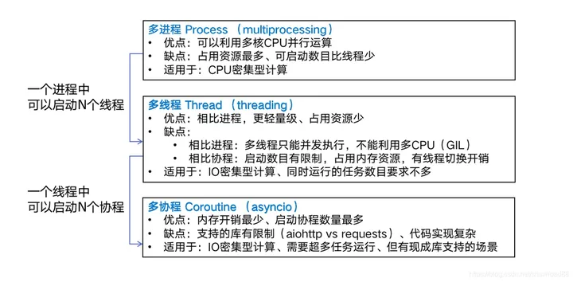

# Python并发编程

Python并发编程有三种方式:

- 多线程`Thread`
- 多进程`Process`
- 多协程`Coroutine`




## 多进程

- 可以利用多核CPU并行计算

使用`multiprocessing`实现多进程：

```python
import multiprocessing

def process_task(task_number):
    print(f"Process {task_number} is running")
    # 这里可以添加任务的具体逻辑

if __name__ == '__main__':
    process1 = multiprocessing.Process(target=process_task, args=(1,))
    process2 = multiprocessing.Process(target=process_task, args=(2,))

    process1.start()
    process2.start()

    process1.join()
    process2.join()
```


### 进程池

在python真正实用的还是使用进程池，进程池能够自动帮你管理进程。

Python的`Pool`不方便传入多个参数，提供两个解决思路：

思路1：函数 func2 需要传入多个参数，现在把它改成一个参数，无论你直接让args作为一个元组tuple、词典dict、类class都可以。（推荐）

```python
import multiprocessing
import time

def func2(args):  # multiple parameters (arguments)
    # x, y = args
    x = args[0]  # write in this way, easier to locate errors
    y = args[1]  # write in this way, easier to locate errors
    time.sleep(1)  # pretend it is a time-consuming operation
    return x - y


def run__pool():  # main process
    from multiprocessing import Pool

    cpu_worker_num = 3
    process_args = [(1, 1), (9, 9), (4, 4), (3, 3), ]

    print(f'| inputs:  {process_args}')
    start_time = time.time()
    with Pool(cpu_worker_num) as p:
        outputs = p.map(func2, process_args)
    print(f'| outputs: {outputs}    TimeUsed: {time.time() - start_time:.1f}    \n')

    '''Another way (I don't recommend)
    Using 'functions.partial'. See https://stackoverflow.com/a/25553970/9293137
    from functools import partial
    # from functools import partial
    # pool.map(partial(f, a, b), iterable)
    '''

if __name__ =='__main__':
    run__pool()
```

思路2：使用 function.partial [Passing multiple parameters to pool.map() function in Python](https://link.zhihu.com/?target=https%3A//stackoverflow.com/a/25553970/9293137)。这个不灵活的方法固定了其他参数，且需要导入Python的内置库。


## 多线程

- I/O密集型

```python
from concurrent.futures import ThreadPoolExecutor

def task_function(x):
    print(f"Processing {x}")
    return x * x

if __name__ == "__main__":
    with ThreadPoolExecutor(max_workers=5) as executor:
        futures = [executor.submit(task_function, i) for i in range(10)]
    
    for future in futures:
        print(future.result())
```

