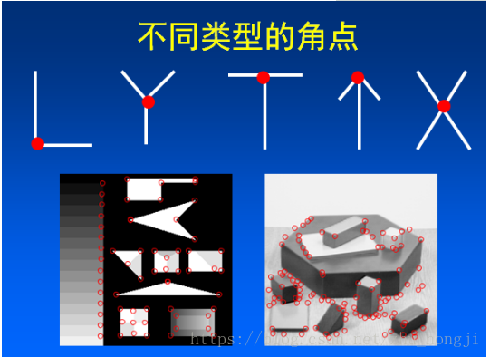
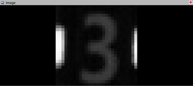
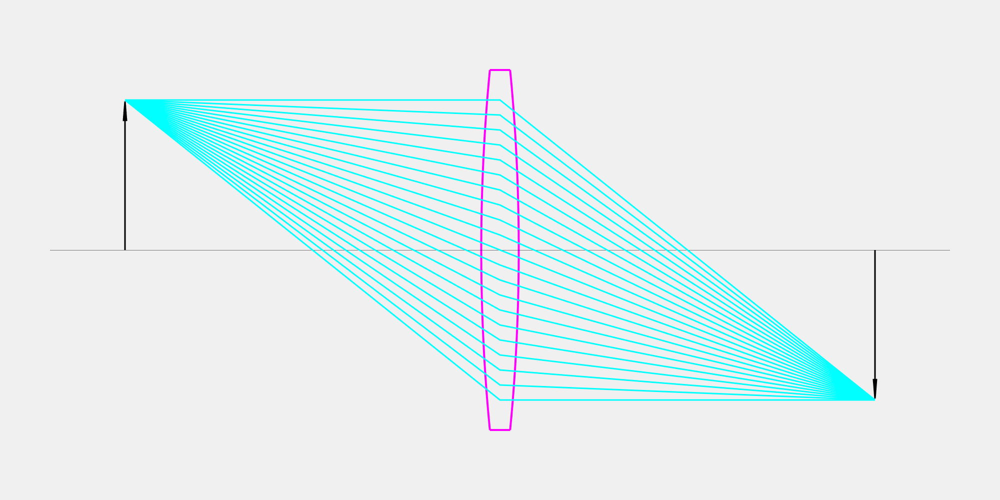
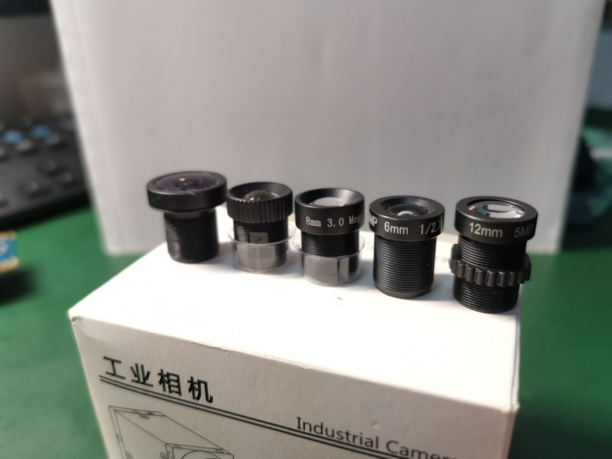
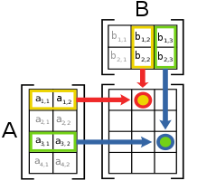
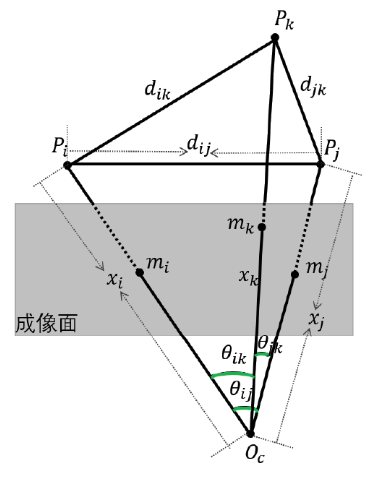

# 计算机视觉

## 一、简介

> 计算机视觉是当今计算机领域最庞大且最火热的研究方向，计算机视觉想要完成的任务就是让电脑拥有人一样识别和分辨物体的能力。如果想要完整的学习计算机视觉的知识需要**大量的知识储备**，不过很幸运的是，在Robomaster领域，我们只需要使用其中少量的知识，所以这个方向的培训以介绍重要概念为主，尽量不涉及太多的数学推导过程，也不涉及和RM无关太多的知识
>

参考：

1. [了解CV和RoboMaster视觉组](https://github.com/HNUYueLuRM/vision_tutorial/blob/main/了解CV和RoboMaster视觉组.md#了解cv和robomaster视觉组)
2. 中南大学计算机学院 梁毅雄 计算机视觉ppt
3. 中南大学计算机学院 赵荣昌 数字图像处理ppt

下面这张荒诞图片或许人一看到就能看懂：一辆火车从一个房屋中冲出来

但对于一个电脑来说，它看到的数据是右边这样的

我们想要做的、或者说计算机视觉想要实现的，就是让机器从右边的二维数组中理解这张图

### 传统计算机视觉和深度学习的区别

传统计算机视觉：根据物体容易区分的特征来提取图像中的信息

**传统 CV 方法的缺陷**是：从每张图像中选择重要特征是必要步骤。而随着类别数量的增加，特征提取变得越来越麻烦。要确定哪些特征最能描述不同的目标类别，取决于 CV 工程师的判断和长期试错。此外，每个特征定义还需要处理大量参数，所有参数必须由 CV 工程师进行调整。

深度学习：使用一个非常复杂的函数来拟合我们需要完成的任务(简单理解)

**深度学习的优势**：由于深度学习所用的神经网络是训练得到而非编程得到，因此使用该方法的应用所需的专家分析和微调较少，且能够处理目前系统中的海量可用视频数据。深度学习还具备绝佳的灵活性，因为对于任意用例，CNN 模型和框架均可使用自定义数据集重新训练，这与 CV 算法不同，后者具备更强的领域特定性。

以**移动机器人的目标检测问题**为例，对比这两类计算机视觉算法：

传统计算机视觉方法使用成熟的 CV 技术处理目标检测问题，如特征描述子（SIFT、SUR、BRIEF 等）。在深度学习兴起前，图像分类等任务需要用到特征提取步骤，特征即图像中「有趣」、描述性或信息性的小图像块。这一步可能涉及多种 CV 算法，如边缘检测、角点检测或阈值分割算法。从图像中提取出足够多的特征后，这些特征可形成每个目标类别的定义（即「词袋」）。部署阶段中，在其他图像中搜索这些定义。如果在一张图像中找到了另一张图像词袋中的绝大多数特征，则该图像也包含同样的目标（如椅子、马等）。

深度学习引入了**端到端学习的**概念，即向机器提供的图像数据集中的每张图像均已标注目标类别。因而深度学习模型基于给定数据「训练」得到，其中神经网络发现图像类别中的底层模式，并自动提取出对于目标类别最具描述性和最显著的特征。

### 计算机视觉在生活中能做什么

- **图像识别：**给定一张图片，通过算法确定这张图像的分类，又叫图像分类。图像识别的输出是**整张图片的标记**。

- **目标检测：**目标检测不仅要判断图片中是否有对应的物体，还要输出关于这些物体”在哪儿“的信息。和目标检测相似的“目标定位”的任务则是对图像中的**一个特定物体**进行定位，而目标检测算法中，图像内含有的对象种类和数量都是**未知的**。*目标检测的输出是目标物体的位置和类别。*

- **图像分割：**根据图像的特征把图片分为几个有确定性质的区域，并寻找我们感兴趣的区域。图像分割算法可以目标检测的基础上进一步解析图像，*其输出可以是对每个像素的像素级别的描述*。

- **三维重建**

- 角点检测

- 边缘检测

  

### 在RM中做什么

- 识别敌方装甲板
  
  
  
  
  
- 能量机关算法，击打大小符能量机关

- 识别敌方车辆

## 二、认识相机

相机有两部分组成：

- 镜头
- 机身

### 成像方式

假设我们现在只有一个光学传感器：

因为光线会反射到传感器的每个地方，那我们的得到的图像会是这样的：

#### 小孔成像

最基本的成像原理，根据光沿直线传播，物体上的一个点只会对于图像上的一个点

小孔相机的缺点：没有 **焦距 焦点 物距 相距**

#### 透镜相机

最常见的透镜相机：人眼

加入一个透镜

从透镜到小孔的近似过程，截取自知乎-龚健男的回答-凸透镜和小孔成像的原理与联系

现代的镜头：

多组镜片共同组成的复杂光学系统；多组镜头保证了我们能够对焦、改变光圈改变焦段等。

### 相机参数

#### 光学传感器

> 作用：接收光的信号

相机中常见的光学传感器：CCD和CMOS

- CMOS(complementary metal-oxide semiconductor)传感器是由金属氧化物半导体排成的阵列，和发光半导体相反，其上的pn结受光照时会产生电荷存储在电容中，通过和内存一样的结构采用行选和列选开关，为每一行/每个像素点配备**放大器和AD**（Analog-to-Digital converter,模拟-数字信号转换器），选中位置的信号会通过OP和AD，从而将电荷转换为数字信号，最后生成图像。优点是**成本低，图像帧率高**，但是固有不可消除的采集噪声（每个采集单元的参数不可能完全一致）会影响成像的质量。

- CCD(charged couple device)传感器是由最简单的MOS电容器阵列构成的，与CMOS不同，CCD的**每一行像素只配有一个信号处理器**，利用时钟脉冲驱动产生的差压，这一行电容器采集到的电荷会以串行的方式依次通过每一行末端的信号处理器从而产生图像。因此CCD能达到**更高的像素密度**（CMOS上的op和ad都要占用空间），其优点是**成像的一致性好，噪声很小**，由于不能同时处理所有信号，其帧率一般不高。

想要了解更多信息可以参阅[cmos和ccd](https://zhuanlan.zhihu.com/p/139394687)

但是现代相机中基本只使用CMOS传感器了，因为CCD**成本高**，良品率低，而且速度慢高感差，不能适应高速拍摄需要。

我们所使用的工业相机的CMOS大小大概就是最小的那几个

#### 焦段

比赛中常见的焦段：6mm 8mm 12mm

生活中相机常见的焦段：35mm 50mm 85mm 200mm

比赛中有时候需要的视野范围也很小，比如吊射前哨站的时候，需要尽可能的放大装甲板，便于识别，这时候就要提出视野的概念。

**焦段 不等于 视野**，焦段和传感器大小共同决定

#### FoV(Field of View)

视野范围取决于**焦距和感光元件（CMOS）的大小**，在上面我们已经了解到我们的工业相机的传感器是远小于摄影相机的传感器的，所以在相同视野情况下，我们的焦距也要小很多

- 在比赛中，我们一般给步兵机器人配置广角镜头（适用**近战**，可视角广）或是6mm的镜头。打击能量机关的步兵机器人会选择8mm、12mm的**长焦镜头**来获得更好的远距离成像效果。

- 由于凸透镜**本身的性质**和镜头制造的**工艺**问题，使得光线在通过镜头时无法保持物体在空间中原本的位置关系而发生**畸变**，好在这些畸变都能够通过数学建模并由反向解算而得到还原。这需要我们通过**相机标定**来去除这种畸变以便还原图像中物体的真实位置。畸变主要分为切向畸变和桶型畸变，我们可以利用标定板和畸变的数学关系来进行**相机标定**。后续会更加详细的介绍标定的过程。

#### 快门速度

> **快门就是相机中用来控制光线照射感光元件时间的装置**
>
> 快门速度描述的就是相机一次曝光的时长

摄影相机上常见的单位是秒(s)

我们的工业相机使用的单位是微秒(us)，通常使用范围是500us-3000us

快门速度越慢，曝光时长越长，画面也就越亮

但是快门速度过慢，会带来很明显的运动模糊，这样就会导致灯条的形变

#### 光圈

**光圈**就是镜头前面可以开闭的小扇叶。不同光圈大小代表不同的镜头开度，其影响的是镜头的进光量。一般用**f值**刻画光圈的开合程度：

光圈还和成像的景深有关系，越大的光圈得到的景深越小，即成清晰像的范围越小：

因此，在调大光圈提高进光量的同时，能够成清晰像的距离范围就缩小了，我们需要在两者之间进行权衡。

#### 增益（ISO）

调节感光单元在**进行电荷信号放大时的增益**（gain,一般是用dB表示的,这需要你注意数量级），对于图像的亮度和各颜色信息的保存都有影响。**在低曝光的时候可以有效提高成像质量，但同时也可能提高噪声（不规则噪声信号也会被放大）。**

#### 分辨率

一张图像的像素数，常见的有1920x1080，1280x720，640x480，一般来说，分辨率越高则图像保留的细节就越多，但同时相机处理的数据量变大，**会降低采集帧率和每秒传输的图像数量**。在之后的图像处理中，同样意味着更大的开销和处理速度下降。

> 在**相同的传感器大小**下，在**其他控制曝光的参数**相同时，高分辨率的相机会更暗。
>
> 分辨率提高，单个像素的面积减小，相同时间收到的光照也少了，所以曝光整体下降
>
> “底大一级压死人”：在相同曝光条件下，底越大接收的光更多

#### 帧率

相机每秒钟能够获取的图像数。一般来说，如果你的图像处理算法的速度够快，那么帧率越高越好，这能够保证你处理结果的**实时性**。一些相机提供了***硬件触发*** 功能，这样能够让相机以固定的时间间隔触发采样，保证两帧之间的时间相同，以便于和机器人的控制进行时间线同步。视觉算法处理、数据传输、电控算法处理、再到控制执行机构动作，最后子弹在空中飞行——这几个过程中都有时间延迟，累加之后算是非常可观。***高速的算法和确定的延迟时间是打造预测算法的基础。***

相机的读取帧率也受到相机快门速度的影响，比如当相机的快门速度为5000us时，我们的帧率肯定会低于200帧

#### 白平衡

设定白色是怎么样的“白”，本意是不管在任何光源下都让原本呈现白色的物体通过增加偏置而还原为白色。涉及到色温和颜色空间的概念，调节此参数即调整RGB三原色的混合比例。

### 特殊相机类型

- 双目相机

  双目相机应该是最早出现的也是最成熟的立体视觉方案。利用两个相机的**视差**和他们固定的**相对位置**信息，通过3d数学的几何解算方法计算对应点之间的位置偏差，得到物体的深度信息。关于双目相机的测距原理，请参考《机器人视觉测量与控制》这本书。这篇[教程](https://cloud.tencent.com/developer/article/1824593)较为详细地讲述了双目相机测距的基本原理和用法。

- 深度相机

  生产深度相机的规模化厂家目前主要有4个：ZED、intel Realsense、奥比中光、Kinect。大部分厂商采用的解决方案都是**双目➕TOF/结构光**的方案，相机内部的DSP芯片会融合多个信息来源的图像进而结算得到深度图。使用深度相机的时候，厂家一般都是对其进行了彻底的封装，我们对于其原理只需要有大致的了解即可。

  

## 三、认识图像

**图像的构成**

- **像素**

  - 像素是构成图像的基本单元
  - 像素通过行列组合成矩阵就形成了图像
  - 在计算机中一般都以矩阵的形式存储图像。
  - 我们常把图像视作一个二维数组（灰度图）或多个二维数组（彩色图的三个通道RGB）。

  

- **像素深度**

  - 自然界中的颜色固然是连续的，但是在计算机中存储的数据是离散的。
  - 存储一个像素所使用的**位(bit)**数叫做**像素深度**，可以看作图像在某一点取值的值域
  - 常听说的8位宽颜色就是用8位数据表示一种颜色，存储一个像素使用的位数越多，其能保存的信息就越丰富，主要表现在能显示的色彩的数量和对比度上。
  - 8位宽颜色 指的是使用 8位二进制 存储一个像素，$2^8=256$ 所以像素的值通常是 0~255 

  

  

- **通道数：**当一个图像只有一个通道时，这是一张灰度图像，这个图的每一个像素是 0-255 的一个元素，在亮度（灰度）通道中保存

  

  如果需要表示一个彩色图片，我们至少需要三个通道，即Red Green Blue（RGB），每个通道都是一个矩阵，矩阵中的每一个元素保存着0～255的值，对应不同的颜色分量。仔细观察下图就会发现，原图中呈现蓝色的部分在蓝色通道中比其他通道要更亮，比如机器人后轮下方的一片蓝光，在红色通道中就几乎没有分量存在。

  

- 色彩空间

  除了RGB空间，还有其他不同的颜色空间如HSV、YUV、LAB等，他们都是把图片投影到不同的空间中，图片在这些空间中的每一个坐标轴的投影，就是它在这个方向上的分量。

  

  

## 四、线性代数基础

虽然想尽量不涉及数学推导，但还是必须要有一些简单的数学知识才能够继续后面的学习

### 矩阵定义

数学上，一个$$m\times n$$的**矩阵**是一个有m行（row）n列（column）元素的矩形阵列。矩阵里的元素可以是数字或符号甚至是函数。

**大小相同（行数列数都相同）的矩阵之间可以相互加减，**具体是对每个位置上的元素做加减法。矩阵的乘法则较为复杂。两个矩阵可以相乘，当且仅当第一个矩阵的列数等于第二个矩阵的行数。矩阵的乘法满足结合律和分配律，但不满足交换律。

### 基本运算

### 矩阵乘法

两个矩阵的乘法仅当第一个矩阵$$\mathbf{A}$$的列数(column)和另一个矩阵$$\mathbf {B} $$的行数(row)相等时才能定义。如$$\mathbf{A}$$是$$m\times n$$矩阵和$$\mathbf {B}$$是$$n \times p$$矩阵，它们的**乘积**$$\mathbf{AB}$$是一个$$\displaystyle m\times p$$矩阵

### 分块矩阵

分块矩阵是指一个大矩阵分割成“矩阵的矩阵”。举例，以下的矩阵
$$
P = \begin{bmatrix} 1 & 2 & 3 & 2\\ 1 & 2 & 7 & 5\\ 4 & 9 & 2 & 6\\ 6 & 1 & 5 & 8\end{bmatrix}
$$
可分割成4个2×2的矩阵
$$
P_{11} = \begin{bmatrix} 1 & 2 \\ 1 & 2 \end{bmatrix} ,  P_{12} = \begin{bmatrix} 3 & 2\\ 7 & 5\end{bmatrix} , P_{21} = \begin{bmatrix} 4 & 9 \\ 6 & 1 \end{bmatrix} ,  P_{22} = \begin{bmatrix} 2 & 6\\ 5 & 8\end{bmatrix}
$$
$$P = \begin{bmatrix} P_{11} & P_{12}\\ P_{21} & P_{22}\end{bmatrix}$$

或者我们换一种表示形式：
$$
P_{11}=\begin{bmatrix} 1 & 2 & 3 \\ 1 & 2 & 7 \\ 4&9&2\end{bmatrix} ,  P_{12} = \begin{bmatrix} 2 \\ 5 \\ 6\end{bmatrix} , P_{21} = \begin{bmatrix}  6 \\ 1 \\ 5\end{bmatrix} ,  P_{22} = \begin{bmatrix} 8 \end{bmatrix}
$$
$$P = \begin{bmatrix} P_{11} & P_{12}\\ P_{21}^T & P_{22}\end{bmatrix}$$

分块矩阵满足矩阵乘法！

## 五、三维视觉基础

现实世界在空间上有三个维度，而照片却是二维的，图片在成像过程中损失了一个维度：**深度**。

- 从仿生和类比的角度来说，人眼也能观察到三维信息，这是因为它是一个**双目视觉**系统。再加上**人在基因中、成长过程中习得的大量先验信息**，对大部分场景有一个直观的**距离感**，所以在大部分时候我们都可以轻松辨别物体的远近。
- 为了更好地为下游任务服务，我们就要想方设法让计算机也能理解图像中的深度信息。

### 齐次坐标

**投影变换：**

- 线性变换
- 将三维空间中的对象投影到二维平面上
- 正方体的一个面在图片上看起来不是正方形，球体看起来可能会像椭圆

**欧氏空间（几何学）中平行线不可能相交，但是投影几何中，平行直线会在无穷远点相交**

所以欧式空间的描述方式难以描述投影几何

为了解决无穷远点的表示问题，前人提出**齐次方程**

要制作二维齐次坐标，我们只需在现有坐标中增加一个额外的变量w。因此，笛卡尔坐标中的一点，$$(X，Y)$$在齐次坐标中就变成了$$(x，y，w)$$。而笛卡儿坐标中的X和Y在齐次坐标中的x、y和w则重新表达为
$$
X=x/w \\
Y=y/w
$$

#### 为什么叫齐次

任何乘以a的数（1a，2a，3a）与欧氏空间中的（1/3，2/3）是同一个点，换句话说，齐次坐标是与乘数a不相关的。

#### 数学证明：两条平行线可以相交

考虑以下欧氏空间的线性系统：
$$
\begin{cases} AX+BY+C=0\\AX+BY+D=0 \end{cases}
$$
而我们知道，由于C≠D，所以上述方程没有解。 如果C=D，那么两条线是相同的（重叠的）。

让我们重写投影空间的方程，将x和y分别替换为x/w，y/w。
$$
\begin{cases} A\frac x w+B\frac y w +C=0\\A\frac x w +B\frac y w+D=0 \end{cases} \to \begin{cases} Ax+B y +Cw=0\\A x  +By +Dw=0 \end{cases}
$$
当我们重写投影空间的方程，当w=0时，方程有解，则可以相交

$w=0$的时候表示的是**无穷远点**

注意：

使用齐次坐标还是不使用齐次坐标取决于具体的应用和需求。在复杂的三维图形处理中，齐次坐标通常更方便和高效，但在一些简单的情况下，可以不使用它们来减少复杂性

### 二维坐标变换

#### 线性变换

- 描述了**一个向量空间中的元素**如何通过线性运算被映射到**另一个向量空间中的元素**
- 包括旋转、缩放、平移、投影以及许多其他线性操作
- 在图像处理中经常用于将对象从一个坐标系变换到另一个坐标系

线性变换从几何直观有三个要点：

- 变换前是直线的，变换后依然是直线
- 直线比例保持不变
- 变换前是原点的，变换后依然是原点

**旋转变换：**可以自己尝试用极坐标推一下这个**旋转矩阵**，这里不解释**他为什么是这个形式**

- $$\theta$$ 指的是逆时针旋转的度数
- 应用旋转矩阵的方法是使用 $旋转矩阵 \times 坐标矩阵$
- 这里因为情况简单，没有使用齐次坐标 

#### 仿射变换

仿射变换 = 线性变换+平移

仿射变换的特点：

1. **原点不一定映射到原点**
2. 变换前是直线的，变换后依然是直线
3. 平行线映射到平行线
4. 比例保持不变
5. 仿射变换的组合也是仿射变换

位置变换：

旋转+位置变换：

旋转+尺度+位置变换：

- 这里的$$\theta$$是逆时针的旋转角度

- 根据分块矩阵来进行相乘，可以发现就是先旋转缩放再加上平移坐标

- 所以左上角就是线性变换矩阵，右边是平移

  

#### 透视变换

透视变换彻底改变目标的形状

无穷远点经过仿射变换还是无穷远点，经过透视变换不一定是无穷远点

### 三维坐标变换

刚体变换：刚体变换是一种几何变换，它保持了物体的形状和大小不变，只对物体的位置和方向进行了变换。在刚体变换中，长度、角度和形状等几何属性都保持不变，只有平移和旋转操作

这里我们简要介绍一下三维空间中的两种**刚体变换**和它们的组合：平移+旋转=位姿变换。三维空间内任意两个刚体系都可以通过如下两步变换实现。首先是平移，令初始坐标原点的笛卡尔坐标为：

$$
C_0=\begin{bmatrix}
 x_0\\
 y_0\\
z_0
\end{bmatrix}
$$
平移之后得到$C_1$:
$$
C_1=\begin{bmatrix}
 x_1\\
 y_1\\
z_1
\end{bmatrix}
+\begin{bmatrix}
 x_0\\
 y_0\\
z_0
\end{bmatrix}
$$
把旋转矩阵拆成绕三个轴的旋转（这里分别为绕x，y，z轴旋转，和上面线性变换的旋转相同）：
$$
\begin{array}{l}
R_{x}(\beta)=\left[\begin{array}{ccc}
1 & 0 & 0 \\
0 & \cos \beta & -\sin \beta \\
0 & \sin \beta & \cos \beta
\end{array}\right] 
\quad
R_{y}(\theta)=\left[\begin{array}{ccc}
\cos \theta & 0 & \sin \theta \\
0 & 1 & 0 \\
-\sin \theta & 0 & \cos \theta
\end{array}\right]
\end{array}\quad
R_{z}(\alpha)=\left[\begin{array}{ccc}
\cos \alpha & -\sin \alpha & 0 \\
\sin \alpha & \cos \alpha & 0 \\
0 & 0 & 1
\end{array}\right]
$$
将旋转施加到平移后的坐标系，得到变换结果$C_2$：
$$
C_2=R_x(\beta)R_y(\theta)R_z(\alpha)C_1
$$
由于平移变换不是三维向量空间中的**线性变换**，为了方便起见我们增加一个额外的维度形成**齐次坐标系**，用四维矩阵$T$描述三维空间中的任意刚体变换：
$$
\left[\begin{array}{c}
x' \\
y'\\
z'\\
1
\end{array}\right]=\left[\begin{array}{cc}
R & t \\
0^{T} & 1
\end{array}\right]\left[\begin{array}{l}
x \\
y\\
z\\
1
\end{array}\right]=T\left[\begin{array}{l}
x \\
y\\
z\\
1
\end{array}\right]
$$
$t$是一个3x1的向量，$R$则是3x3的旋转矩阵，自己动手写一下，按照矩阵乘法进行展开，能够加深理解。

### 相机成像模型

#### 理想成像模型

物体投影到相机的光线传感器的过程，仅仅是在刚体变换的基础上增加了一些缩放。
之前已经介绍了相机的小孔成像模型和透镜模型，真实相机镜头中是由多组凸透镜和凹透镜组成的，但总体的结果是一个凸透镜，因为只有凸透镜才有成像的效果。所以我们可以将**镜头简化为一个凸透镜模型**，在单凸透镜模型中：

**主光轴（主轴）**：通过凸透镜光心的直线，有无数条。

**f为焦距**：指的是当**平行于主光轴**的一组光线（这样的光线有无数组）穿过透镜时， 汇聚到一点上， 这个点叫做**焦点**， 焦点到透镜中心的**水平距离**叫做**焦距**。焦距决定FoV，焦距越短，视野越大。

u叫做物距，指的是物体离透镜的距离

v叫做像距，指的是图像离透镜的距离

> 物距为u，像距为v，焦距为f，三者的关系为：1/v +1/u=1/f。
>
> 根据该关系，不同的物距、像距、焦距的关系使得成像特点不同：
>
> **1、当物距大于2倍焦距时，则像距在1倍焦距和2倍焦距之间，成倒立、缩小的实像。此时像距小于物距，像比物小，物像异侧。应用：照相机、摄像机。**
>
> 2、当物距等于2倍焦距时，则像距也在2倍焦距， 成倒立、等大的实像。此时物距等于像距，像与物大小相等，物像异侧。应用：测焦距。
>
> 3、当物距小于2倍焦距、大于1倍焦距时，则像距大于2倍焦距， 成倒立、放大的实像。此时像距大于物距，像比物大，物像异侧。应用：投影仪、幻灯机、电影放映机。
>
> 4、当物距等于1倍焦距时，则不成像，成平行光射出。
>
> 5、当物距小于1倍焦距时，则成正立、放大的虚像。此时像距大于物距，像比物大，物像同侧。应用：放大镜。

#### 四种坐标系变换

主要存在四种坐标系

- 世界坐标系
- 相机坐标系
- 图像坐标系
- 像素坐标系

根据初中物理我们知道，**通过凸透镜光心的光线按照原有的方向传播**，所以我们可以再一次简化模型：

这个模型已经与**小孔成像**的模型极其相似，所以我们可以假设 $焦距f=像距s$，则我们可以得到小孔成像的模型：

像平面（相机的感光单元平面）上成倒像，将其竖直镜像后放置在光心前方一个焦距的位置方便计算

现在用数学化的语言描述物体上每一个点在像平面上的对应关系： 

相机主点即相机光心/镜头的光学中心（光心）

利用中学的几何知识就可以知道，这里有两个相似三角形$\Delta Opc$和$\Delta OPZ_c$，显然实际物体上的每一点和像平面上的物体都符合这个关系，用等式描述，即：
$$
\left\{\begin{array} { l } 
{ \frac { X } { Z } = \frac { x } { f } } \\
{ \frac { y } { Z } = \frac { y } { f } }
\end{array} \Rightarrow \left\{\begin{array}{l}
x=f \frac{X}{Z} \\
y=f \frac{Y}{Z}
\end{array}\right.\right.
$$
在这里，我们假定两个方向(x和y方向)的焦距**相同**，用矩阵来描述这种关系，也就是：
$$
Z_{c} *\left[\begin{array}{c}
x \\
y \\
1
\end{array}\right]=\left[\begin{array}{lll}
f & 0 & 0 \\
0 & f & 0 \\
0 & 0 & 1
\end{array}\right]\left[\begin{array}{c}
X_{c} \\
Y_{c} \\
Z_{c}
\end{array}\right]
$$
这时的**坐标原点是相机的光心**，$x,y$ 是像平面上点的坐标，$X_c,Y_c,Z_c$是物体在**相机坐标系**下的坐标，$Z_c$在投影后将被压扁而丢弃。由于使用惯例和方便起见，图像在计算机中保存时原点为左上角，而刚刚图像坐标系的原点则是在CMOS的正中心。另外，CMOS上的感光单元都是离散的，因此这一步转换涉及坐标系的平移和数值的离散化：

O'就是CMOS中心的位置

$u_0,v_0$ 一般都为CMOS长宽的一半，令$dx,dy$为一个像素在水平位置和竖直位置上占据的物理长度（就是一个感光单元的尺寸），写成矩阵乘法形式：
$$
\left[\begin{array}{l}
u \\
v \\
1
\end{array}\right]=\left[\begin{array}{ccc}
\frac{1}{d x} & 0 & u_{0} \\
0 & \frac{1}{d y} & v_{0} \\
0 & 0 & 1
\end{array}\right]\left[\begin{array}{c}
x \\
y \\
1
\end{array}\right]
$$
得到的$u,v$就是最终在图像坐标系下的位置了，以OpenCV为例，访问该图像`Mat`的(u,v)位置，得到的就是上述变换后的像素。

最后，因为相机常常不是固定的，而是在空间中旋转、移动，我们希望将所有信息的处理都转换到绝对参考系（世界坐标系）下，因此还需要一个相机本体到绝对系的位姿变换矩阵：
$$
\left[\begin{array}{c}
X_{c} \\
Y_{c} \\
Z_{c} \\
1
\end{array}\right]=\left[\begin{array}{cc}
R & t \\
0^{T} & 1
\end{array}\right]\left[\begin{array}{c}
X_{w} \\
Y_{w} \\
Z_{w} \\
1
\end{array}\right]=T_{w}\left[\begin{array}{c}
X_{w} \\
Y_{w} \\
Z_{w} \\
1
\end{array}\right]
$$
所有的变换都已经介绍完毕，串在一起，看看一个物体从世界坐标系（绝对系）到像素坐标系的转换过程：
$$
\left[\begin{array}{c}
u \\
v \\
1
\end{array}\right]=
\color{purple}
\frac{1}{Z_{c}}
\color{green}
\left[\begin{array}{ccc}
\frac{1}{d x} & 0 & u_{0} \\
0 & \frac{1}{d y} & v_{0} \\
0 & 0 & 1
\end{array}\right]
\color{blue}
\left[\begin{array}{cccc}
f & 0 & 0 & 0 \\
0 & f & 0 & 0 \\
0 & 0 & 1 & 0

\end{array}\right]
\color{red}
\left[\begin{array}{cc}
R & t \\
0^{T} & 1
\end{array}\right]
\color{black}
\left[\begin{array}{c}
X_{w} \\
Y_{w} \\
Z_{w} \\
1
\end{array}\right]
$$
红色是物体从世界坐标系变换到相机坐标系的位姿变换矩阵；蓝色是根据小孔成像模型将物体从三维”压扁“成二维的伸缩变换矩阵（没有旋转，没有平移，但在x和y上都乘上了缩放系数f，即焦距），即相机坐标系到图像坐标系；绿色是图像坐标系转到像素坐标系的平移（图像原点在左上角）+缩放矩阵（离散化）；紫色是在投影过程中丢失的维度，也是比例缩放系数（离得越远的物体越小，越近越大）。

红色矩阵内的参数也称作**相机外参**，蓝色和绿色矩阵则是相机内部的变换信息，称作**内参**，一般通过标定得到。标准化的相机（啥也不能动，固定好的）则由厂家提供内参（当然自己要再标定也可以，一般没有厂家给的准）。

实际上在成像的过程中，镜头由于种种原因会产生畸变，不能得到蓝色矩阵这般简单的变换，因此需要通过标定来确定畸变的类型和畸变参数以最大程度消除其影响。

### 相机标定

相机标定一方面是为了确定相机内参（主要是焦距和像素大小），另一方面就是为了最大程度减小成像畸变带来的影响。另外，由于镜头安装的时候无法保证机械位置完全对齐，这都是标定需要考虑的问题。

#### 径向畸变

由于透镜制作工艺不能保证边缘的光线平行进光轴进入后仍然射向焦点，因此产生桶形畸变；

径向畸变以某一个中心往外延伸，距离此位置越远，畸变越大。两者呈一复杂的非线性关系，一般对其进行泰勒展开并取前数项进行近似。使用最多的是下面这种近似：
$$
\begin{array}{l}
x_{d}=x\left(1+k_{1} r^{2}+k_{2} r^{4}+k_{3} r^{6}\right) \\
y_{d}=y\left(1+k_{1} r^{2}+k_{2} r^{4}+k_{3} r^{6}\right)
\end{array}
$$
与之对应的是凹透镜成像的时候出现的枕形畸变，三种图像拍摄棋盘格得到的图像如下：

完美透镜、桶形畸变、枕形畸变；图源Wikipedia

> 患有近视的同学在验光或选购眼镜时常会听到销售人员向你推销一种”非球面镜“，这种技术就是通过改变镜片边缘材料的折射率或通过特殊的光学造型避免离光心较远的位置的畸变，对于凹透镜就是上图中的枕形畸变。

#### 切向畸变

切向畸变则指的是下面这种情况：

由于贴装工艺问题，感光芯片在封装时可能无法和镜头平行放置，导致成像畸变的发生；来源未知

这种畸变就导致图像上的不同处与真实物体无法满足 *5.6.2* 中介绍那种简单的投影关系，而将与CMOS贴装的倾斜程度有关，一般用下式描述这种畸变关系：
$$
\begin{array}{l}
x_{\text {corrected }}=x+\left[2 p_{1} x y+p_{2}\left(r^{2}+2 x^{2}\right)\right] \\
y_{\text {corrected }}=y+\left[p_{1}\left(r^{2}+2 y^{2}\right)+2 p_{2} x y\right]
\end{array}
$$
需要通过标定确定$p_1,p_2$两个参数。

#### 光心误差

由于安装误差或者生产镜片时的误差，**可能导致镜头的光心和CMOS的中心点没有对齐**，因此还需要确定两者偏移的距离。相机安装时的歪斜统一计入前述的切向畸变中。

这是最重要的参数，光心的误差决定了在机器人射击时是否能够打准，光心与图像中心点的距离有时会高达30个像素！！！

#### 标定操作

至于标定的具体操作，这里提供一个OpenCV的例程讲解，参见：[OpenCV相机标定完全指南(有手就行)](https://blog.csdn.net/NeoZng/article/details/122736567)。Matlab中也提供了视觉工具箱，通过GUI界面可以更方便地设置要标定的畸变类型，操作起来很容易。

如果要生成标定板可以参考：[标定板生成器](https://calib.io/pages/camera-calibration-pattern-generator)

使用ROS2标定，可以参考[鱼香肉丝博客](https://calib.io/pages/camera-calibration-pattern-generator)

> 关于相机成像过程中可能产生畸变的详细推导和该领域的发展，有兴趣的同学可以参考这篇综述：[Camera Calibration - an overview](https://www.sciencedirect.com/topics/computer-science/camera-calibration)。

### 重投影和反向投影

重投影是用于检测成像模型和相机位姿估计是否准确的工具，在相机标定中常用于衡量得到的结果内参是否准确，而SLAM中常用于机器人本体当前位姿的估计和解算，重投影还可以用于可视化三维解算的结果；反向投影则是进行单目视觉解算的关键之一，经典的单目PnP算法就是基于反向投影实现的。

#### 重投影：re-projection

以标定相机为例，我们通过下面的流程验证标定结果的准确性：对于一真实物体中的某个点$P$，我们已知其相对相机的位置如何，而相机内参已知，即我们用中叙述的成像模型加以修正之后对该点进行变换，得到结果点$\hat{p_2}$；而实际在拍摄的时候由于小孔成像的近似和畸变的不完全矫正，$p_2$的位置肯定无法和$\hat{p_2}$重合，两者在像平面上的距离误差就是**重投影误差**。

OpenCV的例程在每次完成标定的时候，都会输出标定结果在用于标定的图像上的重投影误差的MSE（以mm计）：
$$
\text { error }=\sqrt{\frac{\left\|\mathrm{x}^{\prime}-\mathrm{x}\right\|_2^{2}}{\text { number of points }}}=\frac{\left\|\mathrm{x}^{\prime}-\mathrm{x}\right\|_{2}}{\sqrt{\text { number of points  }}}
$$
一般认为此值小于0.1为可以接受，若要进一步提高精度，应该使用更多标定图片并从不同角度拍摄标定板，还可以尝试提高对畸变拟合的阶数等。

> 真实世界中的值是怎么知道的？在进行标定的时候，你需要设置标定板的参数，如棋盘格尺寸、大小、每个格点之间的距离等。因此实际距离已经给定。

可视化就很简单了，假设你通过某些算法得到了三维坐标系下一些点的位置（比如3维目标检测、3维测量等），想要在图像上找出相应点，或者画出具有立体感的轮廓，就可以利用标定得到的内参对这些点进行投影，从而其获取在当前图像上的位置。

---

#### 反向投影：back-projection

反向投影是视觉测量的基础。顾名思义，反向投影即相机成像的逆过程，**将一幅图像还原成世界坐标系下的物体点**。显然，由于在正投影的过程中丢失了深度信息，我们在反向投影时应该添加**约束条件**以得到唯一解。

**远小近大**——这是最符合人类认知的一种测量。假设我们能够保证某个物体始终在像平面上形成正向投影（中心线和光轴对齐或平行），并且其真实尺寸已知，那么根据其上某可以被定位的两点间在像平面上的距离和真实距离之间的比值，由小孔成像时两者以焦距$f$的比例就可以得知当前物体距离相机的远近。这时候选用的约束条件是**物体始终正对**相机不发生out-plane的变换。

另一种方法是添加**等式约束**，即用多个已知真实相对位置的点在像平面上的投影关系（一个真实点和一个像平面上的投影点形成一对约束，一个等式）确定相机和这若干个点之间的距离，这就是经典的**PnP**法（Perspective-n-Point）。

> PNP问题的描述以及定义是相对简单的，他的目的就是求解3D-2D点对运动的方法。简单来说，就是在已知n个三维空间点坐标（相对于某个指定的坐标系A）及其二维投影位置的情况下，如何估计相机的位姿（即相机在坐标系A下的姿态）。举个例子，我们在一幅图像中，知道其中至少四个图像中确定的点在3D空间下的相对坐标位置，我们就可以估计出相机相对于这些点的姿态，或者说估计出这些3D点在相机坐标系下姿态。（上述说的姿态或者位姿，包括位置以及方向，即一个6自由度的状态）

PnP有多种算法：其主要为DLT，P3P，EPNP等

**直接线性变换（DLT，Direct Linear Transform）**

旋转矩阵9个参数，平移矩阵3个参数，一个12个参数，一个点可以提供两个约束，至少要6个点的三维坐标，这种情况是不知道相机的内参和外参时候使用的

**直观理解P3P的求解**

我们这里就先从**添加约束**而不是代数分析的角度，分析P3P方法。P3P要求已知**共面**三点之间的位置关系（不能有点共线），从而得出物体到相机的位姿变换（即旋转矩阵$R$和平移向量$t$）。

当只有一对投影关系约束的时候，**反向投影**的结果可以处在以像素点为起点、和真实点连线构成的**射线**上的**任意位置**：

加入第二对投影点，反向投影的结果会被限制在一个范围内，但仍然有无数组解。约束即真实点之间的距离（图中绿色圆的半径），确定下方紫色点为第一个解后，绿色圆与上方射线的交点都是第二个点可能解的位置，因为只要保证两点的距离为半径R：

加入第三个投影，反向投影的结果被继续约束，这时候**最多**只有四组可能的解。首先在一条射线上确定一个点$p_1$，然后作半径为该点到第二个点真实点的距离$d_1$的**球**$s_1$，并在该球与第二条射线的交点$p_2$（1个或2个，取决于圆的半径和$p_1$的位置）上建立**第二个球**$s_2$（半径为第二个点到第三个点的真实距离$d_2$），$s_2$会与点第三条射线产生交点$p3$，最后以$p_3$为中间建立一个半径为第三个点到第一个点真实距离的球$s_3$，$s_3$将和第一条射线产生交点$p_4$。不断移动$p1$在第一条射线上的位置，直到$p_1$和$p_4$重合，这样$p_1,p_2,p_3$就形成了一个面，并找到一组可能的解。

abc是像素点；ABC是真实点，其边长就代表真实距离

>  实际上也可以把这个问题看作如何将三角形ABC**不留缝隙**地放入以$Oa,Ob,Oc$三条射线构成的无限四面体柱子内。将这个柱子的顶点朝下放置，直观看来应该有4中情况满足上述条件：1. A处于稍下的位置，BC靠上；2. B处于稍下的位置，AC靠上；3.C 处于靠下的位置，AB靠上；4. ABC处于同一高度。

- **代数方法求解P3P**

有了直观的理解之后，现在用代数的方式构建约束方程组进行求解。还是上方的那张图，我们给每条边分别标注参数：

真实点和投影点的关系；图源https://jishuin.proginn.com/p/763bfbd69afc

根据余弦定理，我们可以得到如下关系：
$$
\begin{array}{l}
x_{i}^{2}+x_{j}^{2}-2 x_{i} x_{j} \cos \theta_{i j}-d_{i j}^{2}=0 \\
x_{i}^{2}+x_{k}^{2}-2 x_{i} x_{k} \cos \theta_{i k}-d_{i k}^{2}=0 \\
x_{k}^{2}+x_{j}^{2}-2 x_{k} x_{j} \cos \theta_{j k}-d_{j k}^{2}=0
\end{array}
$$
在这里，我们有3个二次方程3个未知数，为了方便求解，这里采用替换的技巧。我们假设$x_i=C,x_j=xC,x_k=yC$，再定义$d_{i j}=\sqrt{b v} C,d_{i k}=\sqrt{a v} C,d_{j k}=\sqrt{v} C$，方程转变为如下形式：
$$
\begin{array}{c}
C^{2}+C^{2} x^{2}-2 C^{2} x \cos \theta_{i j}-b v C^{2}=0 \\
C^{2}+C^{2} y^{2}-2 C^{2} y \cos \theta_{i k}-a v C^{2}=0 \\
C^{2} x^{2}+C^{2} y^{2}-2 C^{2} x y \cos \theta_{j k}-v C^{2}=0
\end{array}
$$
这样就可以消去$C$，再用三个真实点之间的关系消除$a,b,v$：
$$
\left\{\begin{array}{l}
(1-b) x^{2}-b y^{2}-2 x \cos \theta_{i j}+2 b x y \cos \theta_{j k}+1=0 \\
(1-a) y^{2}-a x^{2}-2 y \cos \theta_{i k}+2 a x y \cos \theta_{j k}+1=0
\end{array}\right.
$$
求解这两个二次方程，就可以得到P3P的解了。两个二元二次方程最多有四组解（排除无解的情况）。有兴趣的同学可以自行学习二元二次方程组的求解方法。得到四组解之后，一般再加入一组对应点用于检测。

- **编程接口**

OpenCV中提供了`SolveP3P()`和`SolvePnP()`方法，前者会返回四个结果（四个变换矩阵）让你自己进行后处理，后者则支持一系列的不同求解方法并返回**一个单独的结果**，必须要传入四个以上的点。至于如何通过传入不同的参数选择求解方法，参见：[OpenCV: Perspective-n-Point (PnP) pose computation](https://docs.opencv.org/3.4/d5/d1f/calib3d_solvePnP.html)

> 而其他的PnP方法包括P4P、EPnP等，以及对点和点之间关系的不同如共线共面等都会产生不同的解法。它们通过近似、迭代、试错等方法利用前述的点之间的相对关系行求解。更多PnP的信息，可以参考这篇综述：[A Review of Solutions for Perspective-n-Point Problem in Camera Pose Estimation](https://www.researchgate.net/publication/328036802_A_Review_of_Solutions_for_Perspective-n-Point_Problem_in_Camera_Pose_Estimation)
>
> 对于三维空间中的位姿解算问题，这里有一篇综述详尽介绍了包括单目、双目等在内的各种方法：[Pose Estimation for Augmented Reality: A Hands-On Survey](

- PNP缺陷

在0度时有一个明显的跳变，且距离较远时，由于像素数量已经很小了，对于rvec的估计时非常不准的！！所以这个数据其实是不能直接用来作为目标装甲板的倾斜值的

### 旋转矩阵与四元数

在之前介绍的旋转描述是**旋转矩阵**。实际上常用的旋转变换描述方法还有**欧拉角**和**四元数**。

使用欧拉角描述旋转非常方便，不像旋转矩阵那样需要这么多的参数，但是其存在一个严重的问题——万向节死锁**（gimbal lock）。关于此问题的解释，笔者认为Ele实验室的这个视频：[无伤理解欧拉角中的“万向死锁”现象](https://www.bilibili.com/video/BV1Nr4y1j7kn)，应该是初学者比较容易接受的一种，没有复杂的公式推导，直观且严谨。之所以会出现这种情况，本质上是其**定义**导致的，我们要求**按照一定的顺序**对原始坐标系进行变换（众所周知变换不是**可交换的**），这就添加了某种**约束，最终体现为死锁的出现。

而四元数从定义上避免了死锁，从名字也可以看出它有四个维度（虽然仍然按照一定的顺序进行旋转，也有约束，但是增加了一个额外的维度，就像齐次坐标变换为平移增加了一个自由度使它变成其下的线性变换）。一种自然的理解方式是通过**绕任意轴旋转的变换**，即罗德里格旋转公式（Rodrigues' rotation formula）。四元数利用一些定义使得其运算规则满足前者，并且避免了三角函数的计算，这也是四元数描述旋转的另一个优点：运算量小，非线性函数在程序中的开销是比较大的。这篇教程：[A brief introduction to the quaternions and its applications in 3D geometry](https://github.com/Krasjet/quaternion)是笔者认为写得最好的，强烈推荐学习。

有时间再讲：卡尔曼滤波  传统视觉  深度学习

第一次作业：安装相机驱动

第二次作业：标定装甲板
