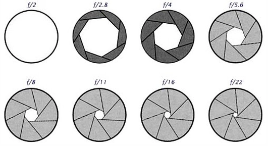

# 计算机视觉

基本知识：

科学上网

## 一、简介

> 计算机视觉是当今计算机领域最庞大且最火热的研究方向，计算机视觉想要完成的任务就是让电脑拥有人一样识别和分辨物体的能力。如果想要完整的学习计算机视觉的知识需要大量的知识储备，不过很幸运的是，在Robomaster领域，我们只需要使用其中少量的知识，所以这个方向的培训以介绍概念为主，不涉及太多的数学推导过程。
>

### 计算机视觉在生活中能做什么

- **图像识别：**给定一张图片，通过算法确定这张图像的分类，又叫图像分类。图像识别的输出是**整张图片的标记**。

- **目标检测：**目标检测不仅要判断图片中是否有对应的物体，还要输出关于这些物体”在哪儿“的信息。和目标检测相似的“目标定位”的任务则是对图像中的**一个特定物体**进行定位，而目标检测算法中，图像内含有的对象种类和数量都是**未知的**。*目标检测的输出是目标物体的位置和类别。*

- **图像分割：**根据图像的特征把图片分为几个有确定性质的区域，并寻找我们感兴趣的区域。图像分割算法可以目标检测的基础上进一步解析图像，*其输出可以是对每个像素的像素级别的描述*。

- **三维重建**

### 在RM中做什么

- 识别敌方装甲板
  
  
- 能量机关算法，击打大小符能量机关

- 识别敌方车辆

- 视觉里程计

## 二、相机

相机有两部分组成：

- 镜头
- 机身

### 成像原理

假设我们现在只有一个光学传感器：

那我们的得到的图像会是：

#### 小孔成像

最基本的成像原理

#### 透镜相机

最常见的透镜相机：人眼

加入一个透镜

现代的镜头：

多组镜片共同组成的复杂光学系统

### 相机参数

#### 光学传感器

> 接收光的信号

相机中常见的光学传感器：CCD和CMOS

- CMOS(complementary metal-oxide semiconductor)传感器是由金属氧化物半导体排成的阵列，和发光半导体相反，其上的pn结受光照时会产生电荷存储在电容中，通过和内存一样的结构采用行选和列选开关，为每一行/每个像素点配备**放大器和AD**（Analog-to-Digital converter,模拟-数字信号转换器），选中位置的信号会通过OP和AD，从而将电荷转换为数字信号，最后生成图像。优点是**成本低，图像帧率高**，但是固有不可消除的采集噪声（每个采集单元的参数不可能完全一致）会影响成像的质量。

- CCD(charged couple device)传感器是由最简单的MOS电容器阵列构成的，与CMOS不同，CCD的**每一行像素只配有一个信号处理器**，利用时钟脉冲驱动产生的差压，这一行电容器采集到的电荷会以串行的方式依次通过每一行末端的信号处理器从而产生图像。因此CCD能达到**更高的像素密度**（CMOS上的op和ad都要占用空间），其优点是**成像的一致性好，噪声很小**，由于不能同时处理所有信号，其帧率一般不高。

想要了解更多信息可以参阅[cmos和ccd](https://zhuanlan.zhihu.com/p/139394687)。

但是现代相机中基本只使用CMOS传感器了，因为CCD成本高，良品率低，而且速度慢高感差，不能适应高速拍摄需要。

#### 焦段

比赛中常见的焦段：6mm 8mm 12mm

生活中相机常见的焦段：35mm 50mm 85mm 200mm

比赛中有时候需要的视野范围也很小，比如吊射前哨站的时候，需要尽可能的放大装甲板，便于识别，但是我们依然使用的是8mm的镜头，这时候就要提出视野的概念。

#### FoV(Field of View)

视野范围取决于焦距和感光元件的大小，在上面我们已经了解到我们的工业相机的传感器是远小于摄影相机的传感器的，所以在相同视野情况下，我们的焦距也要小很多

- 在比赛中，我们一般给步兵机器人配置广角镜头（适用**近战**，可视角广）或是6mm的镜头（中庸的选择，**兼顾长短**）。打击能量机关的步兵机器人会选择8mm、12mm的**长焦镜头**来获得更好的远距离成像效果。哨兵机器人可能会配置两个相机，分别搭载广角镜头和中短焦镜头，广角用于“广撒网”，对敌方目标进行大致的定位，之后交由另外一个相机进行精确的定位。

- 由于凸透镜**本身的性质**和镜头制造的**工艺**问题，使得光线在通过镜头时无法保持物体在空间中原本的位置关系而发生**畸变**，好在这些畸变都能够通过数学建模并由反向解算而得到还原。这需要我们通过**相机标定**来去除这种畸变以便还原图像中物体的真实位置。畸变主要分为切向畸变和桶型畸变，我们可以利用标定板和畸变的数学关系来进行相机标定。后续会更加详细的介绍标定的过程。

#### 快门速度

> **快门就是相机中用来控制光线照射感光元件时间的装置**
>
> 快门速度描述的就是相机一次曝光的时长

摄影相机上常见的单位是秒(s)

我们的工业相机使用的单位是微秒(us)，通常使用范围是500us-3000us

快门速度越慢，曝光时长越长，画面也就越亮

但是快门速度过慢，会带来很明显的运动模糊，这样就会导致灯条的形变

#### 光圈

**光圈**就是镜头前面可以开闭的小扇叶。不同光圈大小代表不同的镜头开度，其影响的是镜头的进光量。一般用**f值**刻画光圈的开合程度：

光圈还和成像的景深有关系，越大的光圈得到的景深越小，即成清晰像的范围越小：

因此，在调大光圈提高进光量的同时，能够成清晰像的距离范围就缩小了，我们需要在两者之间进行权衡。

#### 增益（ISO）

调节感光单元在**进行电荷信号放大时的增益**（gain,一般是用dB表示的,这需要你注意数量级），对于图像的亮度和各颜色信息的保存都有影响。**在低曝光的时候可以有效提高成像质量，但同时也可能提高噪声（不规则噪声信号也会被放大）。**

#### 分辨率

一张图像的像素数，常见的有1920x1080，1280x720，640x480，一般来说，分辨率越高则图像保留的细节就越多，但同时相机处理的数据量变大，会降低采集帧率和每秒传输的图像数量。在之后的图像处理中，同样意味着更大的开销和处理速度下降。

在相同的传感器大小下，在其他控制曝光的参数相同时，高分辨率的相机会更暗。

#### 帧率

相机每秒钟能够获取的图像数。一般来说，如果你的图像处理算法的速度够快，那么帧率越高越好，这能够保证你处理结果的**实时性**。一些相机提供了***硬件触发*** 功能，这样能够让相机以固定的时间间隔触发采样，保证两帧之间的时间相同，以便于和机器人的控制进行时间线同步。视觉算法处理、数据传输、电控算法处理、再到控制执行机构动作，最后子弹在空中飞行——这几个过程中都有时间延迟，累加之后算是非常可观。***高速的算法和确定的延迟时间是打造预测算法的基础。***

相机的读取帧率也受到相机快门速度的影响，比如当相机的快门速度为5000us时，我们的帧率肯定会低于200

#### 白平衡

设定白色是怎么样的“白”，本意是不管在任何光源下都让原本呈现白色的物体通过增加偏置而还原为白色。涉及到色温和颜色空间的概念，调节此参数即调整RGB三原色的混合比例。

### 特殊相机类型

- 双目相机

  双目相机应该是最早出现的也是最成熟的立体视觉方案。利用两个相机的**视差**和他们固定的**相对位置**信息，通过3d数学的几何解算方法计算对应点之间的位置偏差，得到物体的深度信息。关于双目相机的测距原理，请参考《机器人视觉测量与控制》这本书。这篇[教程](https://cloud.tencent.com/developer/article/1824593)较为详细地讲述了双目相机测距的基本原理和用法。

- 深度相机

  生产深度相机的规模化厂家目前主要有4个：ZED、intel Realsense、奥比中光、Kinect。大部分厂商采用的解决方案都是**双目➕TOF/结构光**的方案，相机内部的DSP芯片会融合多个信息来源的图像进而结算得到深度图。使用深度相机的时候，厂家一般都是对其进行了彻底的封装，我们对于其原理只需要有大致的了解即可。

  

## 三、图像

**图像的构成**

- **像素**：像素是构成图像的基本单元，像素通过行列组合成矩阵就形成了图像。在计算机中一般都以矩阵的形式存储图像。若仔细观察你的手机或电脑屏幕，应该能看到微小的由红绿蓝三色组成的发光单元。当像素密度足够高，人眼就会认为一张图片是连续的了。在图像处理的过程中，我们常把图像视作一个二元函数（如果是灰度图的话），在两个坐标轴上，亮度随坐标而变化。当图片是彩图时，下面会介绍颜色空间的概念。

  

- **像素深度**：自然界中的颜色固然是连续的，但是在计算机中存储的数据是离散的。存储一个像素所使用的位(bit)数叫做像素深度，可以看作图像在某一点取值的值域。常听说的8位宽颜色就是用8位数据表示一种颜色，存储一个像素使用的位数越多，其能保存的信息就越丰富，主要表现在能显示的色彩的数量和对比度上。

  

  

- **通道数：**当一个图像只有一个通道时，这是一张灰度图像，这个图的每一个像素是0-255的一个元素，在亮度（灰度）通道中保存

  

  如果需要表示一个彩色图片，我们至少需要三个通道，即Red Green Blue（RGB），每个通道都是一个矩阵，矩阵中的每一个元素保存着0～255的值，对应不同的颜色分量。仔细观察下图就会发现，原图中呈现蓝色的部分在蓝色通道中比其他通道要更亮，比如机器人后轮下方的一片蓝光，在红色通道中就几乎没有分量存在。

  

- 色彩空间

  除了RGB空间，还有其他不同的颜色空间如HSV、YUV、LAB等，他们都是把图片投影到不同的空间中，图片在这些空间中的每一个坐标轴的投影，就是它在这个方向上的分量（和线性代数中概念的具象）。

  

  

## 四、三维视觉基础

齐次坐标

坐标系变换

PnP

## 七、标定

