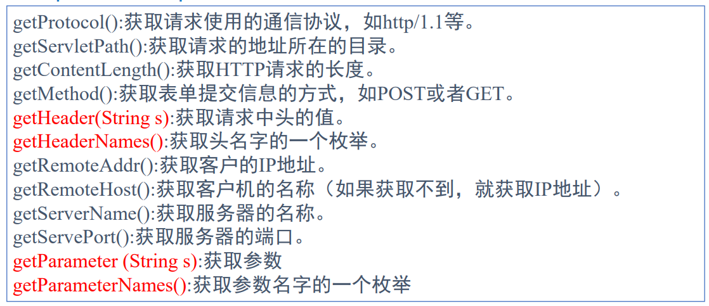

# Servlet

客户端和服务器的数据库或应用程序中的中间层


## Servlet 生命周期

Servlet 生命周期可被定义为从创建直到毁灭的整个过程。以下是 Servlet 遵循的过程：

- Servlet 初始化后调用 **init ()** 方法。
- Servlet 调用 **service()** 方法来处理客户端的请求。
- Servlet 销毁前调用 **destroy()** 方法。
- 最后，Servlet 是由 JVM 的垃圾回收器进行垃圾回收的。


### init()

在第一次创建Servlet时被调用，Servlet创建于用户第一次调用对应该Servlet的URL时候，也可以指定在服务器第一次启动时被调用


### service() 

service() 方法是执行实际任务的主要方法。Servlet 容器（即 Web 服务器）调用 service() 方法来处理来自客户端（浏览器）的请求，并把格式化的响应写回给客户端。

service() 方法由容器调用，service 方法在适当的时候调用 `doGet`、`doPost`、`doPut`、`doDelete` 等方法。所以，您不用对 service() 方法做任何动作，您只需要根据来自客户端的请求类型来重写 `doGet()` 或 `doPost()` 即可。

`doGet()` 和 `doPost()` 方法是每次服务请求中最常用的方法。下面是这两种方法的特征。


Servlet 是服务 HTTP 请求并实现 `javax.servlet.Servlet` 接口的 Java 类。Web 应用程序开发人员通常编写 Servlet 来扩展`javax.servlet.http.HttpServlet`，并实现 Servlet 接口的抽象类专门用来处理 HTTP 请求。


## Servlet 实例

### Servlet 部署

默认情况下，Servlet 应用程序位于路径 `<Tomcat-installation-directory>/webapps/ROOT` 下，且类文件放在 `<Tomcat-installation-directory>/webapps/ROOT/WEB-INF/classes` 中。

如果您有一个完全合格的类名称 **com.myorg.MyServlet**，那么这个 Servlet 类必须位于 WEB-INF/classes/com/myorg/MyServlet.class 中。

现在，让我们把 HelloWorld.class 复制到 `<Tomcat-installation-directory>/webapps/ROOT/WEB-INF/classes` 中，并在位于 `<Tomcat-installation-directory>/webapps/ROOT/WEB-INF/` 的 **web.xml** 文件中创建以下条目：

```xml
<web-app>      
    <servlet>
        <servlet-name>HelloWorld</servlet-name>
        <servlet-class>HelloWorld</servlet-class>
    </servlet>

    <servlet-mapping>
        <servlet-name>HelloWorld</servlet-name>
        <url-pattern>/HelloWorld</url-pattern>
    </servlet-mapping>
</web-app>  

```


## Servlet 表单数据

### GET 方法

向页面请求发送已编码的用户信息。页面和已编码的信息中间用 ? 字符分隔：

```
http://www.test.com/hello?key1=value1&key2=value2
```

会产生一个很长的字符串，请不要使用get方法传输密码


### POST 方法

把这些信息作为一个单独的消息。消息以标准输出的形式传到后台程序，您可以解析和使用这些标准输出。Servlet 使用 `doPost()` 方法处理这种类型的请求。


### 使用 Servlet 读取表单数据

Servlet 处理表单数据，这些数据会根据不同的情况使用不同的方法自动解析：

- `getParameter()`：您可以调用 `request.getParameter()` 方法来获取表单参数的值。
- `getParameterValues()`：如果参数出现一次以上，则调用该方法，并返回多个值，例如复选框。
- `getParameterNames()`：如果您想要得到当前请求中的所有参数的完整列表，则调用该方法。


### Servlet处理请求/响应

`HttpServlet` 在 Web 服务器调用 service() 方法之前，都会创建 `HttpServletRequest` 和 `HttpServletResponse` 对象，用于封装HTTP 请求消息和响应消息

`HttpServletRequest` 类方法：




### 网页重定向与转发

转发：

```java
request.getRequestDispatcher(url).forward(request, response);
```


◼转发和重定向区别 

​	◼转发：容器将使用一个内部的方法来调用目标地址，新的地址继 续处理同一个请求，而浏览器将不会知道这个过程。所以它的URL 会保持不变，它会保留原来的request和response。 

​	◼重定向：第一个地址通知浏览器发送一个新的地址请求。因此， 当你使用重定向时，浏览器中所显示的URL会变成新页面的URL, 除了能在url上挂参数外,由于是两次独立请求，request和response 也是独立的。

重定向请求到另一个网页的最简单的方式是使用 response 对象的 sendRedirect() 方法。下面是该方法的定义：

```java
public void HttpServletResponse.sendRedirect(String location)
throws IOException 
```


## Servlet 过滤器

动态拦截请求，以变换或使用包含在请求或响应中的信息

可以将一个或多个 Servlet 过滤器附加到一个 Servlet 或一组 Servlet。Servlet 过滤器也可以附加到 JavaServer Pages (JSP) 文件和 HTML 页面。调用 Servlet 前调用所有附加的 Servlet 过滤器。


目的：

- 在客户端的请求访问后端资源之前，拦截这些请求。
- 在服务器的响应发送回客户端之前，处理这些响应。


### 过滤器方法

过滤器是一个实现了 javax.servlet.Filter 接口的 Java 类

| 序号 | 方法 & 描述                                                  |
| :--- | :----------------------------------------------------------- |
| 1    | **`public void doFilter (ServletRequest, ServletResponse, FilterChain)`** 该方法完成实际的过滤操作，当客户端请求方法与过滤器设置匹配的URL时，Servlet容器将先调用过滤器的doFilter方法。FilterChain用户访问后续过滤器。 |
| 2    | **`public void init(FilterConfig filterConfig)`** web 应用程序启动时，web 服务器将创建Filter 的实例对象，并调用其init方法，读取web.xml配置，完成对象的初始化功能，从而为后续的用户请求作好拦截的准备工作（filter对象只会创建一次，init方法也只会执行一次）。开发人员通过init方法的参数，可获得代表当前filter配置信息的FilterConfig对象。 |
| 3    | **`public void destroy()`** Servlet容器在销毁过滤器实例前调用该方法，在该方法中释放Servlet过滤器占用的资源。 |

#### FilterConfig 使用

Filter 的 init 方法中提供了一个 FilterConfig 对象。

如 web.xml 文件配置如下：

```xml
<filter>
    <filter-name>LogFilter</filter-name>
    <filter-class>com.runoob.test.LogFilter</filter-class>
    <init-param>
        <param-name>Site</param-name>
        <param-value>菜鸟教程</param-value>
    </init-param>
</filter>

```

在 init 方法使用 FilterConfig 对象获取参数：

```java
public void  init(FilterConfig config) throws ServletException {
    // 获取初始化参数
    String site = config.getInitParameter("Site"); 
    // 输出初始化参数
    System.out.println("网站名称: " + site); 
}
```


### 实例

过滤器类代码：

```java
package com.runoob.test;

//导入必需的 java 库
import javax.servlet.*;
import java.util.*;

//实现 Filter 类
public class LogFilter implements Filter  {
    public void  init(FilterConfig config) throws ServletException {
        // 获取初始化参数
        String site = config.getInitParameter("Site"); 

        // 输出初始化参数
        System.out.println("网站名称: " + site); 
    }
    public void  doFilter(ServletRequest request, ServletResponse response, FilterChain chain) throws java.io.IOException, ServletException {

        // 输出站点名称
        System.out.println("站点网址：http://www.runoob.com");

        // 把请求传回过滤链
        chain.doFilter(request,response);
    }
    public void destroy( ){
        /* 在 Filter 实例被 Web 容器从服务移除之前调用 */
    }
}
```

web.xml: 

```xml
<?xml version="1.0" encoding="UTF-8"?>  
<web-app>  
<filter>
  <filter-name>LogFilter</filter-name>
  <filter-class>com.runoob.test.LogFilter</filter-class>
  <init-param>
    <param-name>Site</param-name>
    <param-value>菜鸟教程</param-value>
  </init-param>
</filter>
<filter-mapping>
  <filter-name>LogFilter</filter-name>
  <url-pattern>/*</url-pattern>
</filter-mapping>
<servlet>  
  <!-- 类名 -->  
  <servlet-name>DisplayHeader</servlet-name>  
  <!-- 所在的包 -->  
  <servlet-class>com.runoob.test.DisplayHeader</servlet-class>  
</servlet>  
<servlet-mapping>  
  <servlet-name>DisplayHeader</servlet-name>  
  <!-- 访问的网址 -->  
  <url-pattern>/TomcatTest/DisplayHeader</url-pattern>  
</servlet-mapping>  
</web-app>  
```

上述过滤器适用于所有的 Servlet，因为我们在配置中指定 **/\*** 。如果您只想在少数的 Servlet 上应用过滤器，可以指定一个特定的 Servlet 路径。


### 过滤器的应用顺序

web.xml 中的 filter-mapping 元素的顺序决定了 Web 容器应用过滤器到 Servlet 的顺序。若要反转过滤器的顺序，您只需要在 web.xml 文件中反转 filter-mapping 元素即可。

如果要使用多个过滤器，只需要依次定义过滤器和映射
