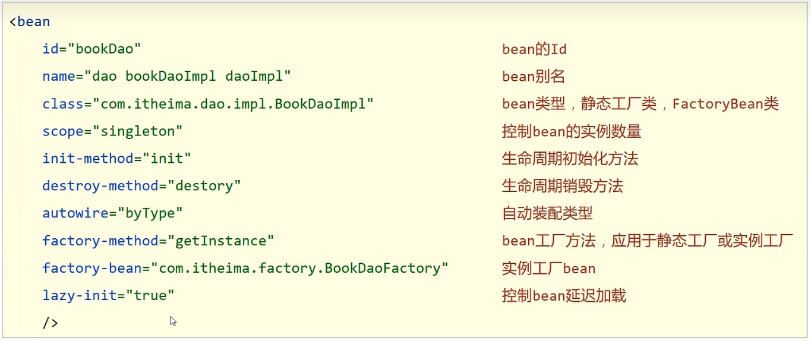

# Spring

### IoC控制反转

使用对象时，由主动new产生的对象转换为外部提供对象，在此过程中对象创建权交给外部


### 容器

#### 加载配置文件

1. 加载类路径下配置文件
2. 从文件系统下加载配置文件

```java
ApplicationContext ctx = new ClassPathXmlApplicationContext("applicationContext.xml");
```


### 实例化bean

#### bean的基础配置 

```java
//配置文件关系
<bean id="bookService" name="service book" scope="prototype"class = "com.itheima.di.service.impl.BookServiceImpl">
	<property name="bookDao" ref="bookDao"/>
</bean>
    //name起别名
    //ref后面指的是bean的名字
    //scope创建时的范围，默认为单例
    //spring造的bean是为了可复用的对象
```

构造方法来实现bean，使用无参的构造方法

如果不提供无参的构造方法，会报错


#### 使用静态工厂创建对象

```java
//静态工厂
public class OrderDaoFactory{
    public static OrderDao getOrderDao(){
		return new OrderDaoImpl();
    }
}
//配置
<bean
    id="orderDao"
    factory-method="getOrderDao"
    class="com.itheima.factory.OrderDaoFactory"
  	/>
```

####  使用实例工厂创建：

**先创建一个`DaoFactoryBean`实现`FactoryBean`接口**

### bean的生命周期

- 配置
- 接口

```java
<bean
	id="bookService" class="com.itheima.dao.BookDaoImpl" init-method="init" 
	destory-method="destory"/>
</bean>
```


### 依赖注入方式

- setter注入
  - 引用类型 `ref`
  - 基本类型 `value`
- 构造器注入
  - 自己开发对象建议setter注入


### 依赖自动装配

- 根据类型，保证类型bean唯一
- 根据名称，不推荐，高耦合
- 优先级低

```java
<bean id="bookService" class="com.itheima.dao.BookDaoImpl" autowire="byType"/>
```





###  注解开发

#### 1.定义bean

- @Component
  - @Controller
  - @Service
  - @Repository
- `<context:component-scan/>`

2.纯注解开发

- `@Configuration`
- `@ComponentScan`
- `AnnotationConfigApplicationContext`


# Spring Boot

### 注解:

#### @Date

> 要使用 @Data 注解要先引入lombok，lombok 是什么，它是一个工具类库，可以用简单的注解形式来简化代码，提高开发效率。

```java
<dependency>
    <groupId>org.projectlombok</groupId>
    <artifactId>lombok</artifactId>
    <version>1.18.4</version>
    <scope>provided</scope>
</dependency>
```

能通过注解的形式自动生成构造器、getter/setter、equals、hashcode、toString等方法，提高了一定的开发效率


# Mybaits Plus

### 分页插件

```java
@Configuration
public class MybatisConfig {

	@Bean
	public MybatisPlusInterceptor mybatisPlusInterceptor() {
    	MybatisPlusInterceptor interceptor = new MybatisPlusInterceptor();
    	interceptor.addInnerInterceptor(new PaginationInnerInterceptor(DbType.H2));
    	return interceptor;}
}
```

##### InnerInterceptor接口

我们提供的插件都将基于此接口来实现功能 目前已有的功能: 

自动分页: `PaginationInnerInterceptor `

多租户:`TenantLineInnerInterceptor `

动态表名: `DynamicTableNameInnerInterceptor `

乐观锁:`OptimisticLockerInnerInterceptor `

SQL性能规范:` IllegalSQLInnerInterceptor`
防止全表更新与删除:` BlockAttackInnerInterceptor `

注意: 使用多个功能需要注意顺序关系,建议使用如下顺序：

- 多租户
- 动态表名
- 分页,乐观锁
- sql性能规范,防止全表更新与删除

总结: 对sql进行单次改造的优先放入，不对sql进行改造的最后放入

### MetaObjectHandler接口

需要重写两个函数`insertFill`和`updateFill`

实现自动填充，还需要在实现类的对应参数上加上`@TableField(fill=Field.Fill.INSERT_UPDATE)`

上面是在插入和更新时填充对应字段


