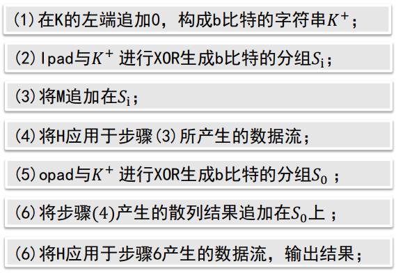
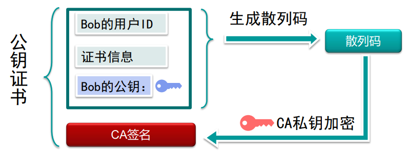

# 信息与网络安全概述

**五类安全服务：**

- 认证——密码技术
- 访问控制服务
- 数据保密性服务——加密
- 数据完整性服务——数字摘要
- 抗否认性服务——数字签名

 八类安全机制：

## 数据加密技术概述

密码系统的组成：

**加密：**通信双方按照某种约定将消息的原型隐藏

**密码系统：**明文、密文、加解密算法、密钥空间

**为什么是维护密钥，而不是维护密钥算法？**

答：算法需要很长时间设计，而且如果保密算法的话，就没有办法验证算法的有效性

### 对称密钥加密

#### 流密码加密

- 密钥相对比较短
- 密钥被延展到长二进制码流中
- 类似**一次性密码本**

用n位长度的密钥K，并将其**延展**成长长的**密钥流**。然后该密钥流与明文P进行**异或**运算，生成密文C。接收方再用同样的方法解密。

##### A5/1算法

该算法用于 **GSM 系统**的序列密码算法，最初是保密的，但通过泄漏和逆向工程公开。

A5/1算法的**密钥**K共**64位**，用于三个线性反馈移位寄存器的初始填充，充当三个寄存器的**初始值**。

1、三个**线性反馈移位寄存器**（X:19位，Y:22位， Z:23位）

滚动生成密钥流可以分为三个步骤：

- 反馈多项式

  - 择多原则：三个寄存器中各选择一个钟控信号，
  - 19位寄存器中为第8位，22位、23位寄存器中皆为第10位（这些位置是固定的）
  - 根据这三个钟控信号的取值，必定有0或1数量居多，**居多**的寄存器需要进行**位移**操作。

- 位移

  - 进行右移操作，第一位需要填充t，t由下列公式决定

  

- 取KEY

  - 取每个寄存器最后一位，也就是19位、22位、23位，进行**异或**操作，得到的结果为这一轮**密钥流的一位**

### 公开密钥加密

加密使用公钥，解密使用私钥，只有配对才能完成解密过程

- 公钥：可为任何人知道，用来**加密消息或者验证签名**
- 私钥：只有接收者本人知道，用来**解密消息**和**信息**
- 不对称性：用来加密的密钥不能用来解密

## 消息认证及数字签名

### 消息认证方法

消息认证：

- 内容是否被篡改
- 来源是否被

#### 散列函数

散列函数：将变长消息M转换为定长摘要H，不需要密钥

三种方式：

- 传统加密

  

- 公钥加密

  

- 密钥值

  

散列函数需要满足：

- 对于任意长度得输入，都能产生固定长度输出
- 高效：计算快速
- 没有有效的逆运算
- 具有抗碰撞性，不能找到任何两个输 入，使得他们经过哈希后产生相同的输出值

##### MD5算法

MD5算法以一个任意长度的消息（M）作为输入，生成 128位（16字节）的消息摘要作为输出，输入消息是按 512位的分组处理的

#### 消息认证码

利用**私钥**产生一小块数据，**附到消息上，用来进行消息验证**

区别：散列函数不需要加密，而消息认证码是需要加密的

**基于散列函数消息认证码-HMAC**

步骤描述如下：

基于密文的消息认证码（CMAC）

### 数字签名技术

数字签名：只有信息的发送者才能产生的别人无法伪造的一段数字串

目的：保证双方自身不能互相欺骗

两类数字签名函数：

- 直接数字签名
  - 仅涉及通信双方
  - 有效性以来发送方密钥安全
- 仲裁数字签名
  - 使用第三方认证

## 四、密钥管理技术

密钥分发技术是指：**传递密钥**给希望交换数据的双 方，**不允许其他人看见密钥的方法**

任何密码系统的强度取决于**密钥分发技术**

### 对称密钥管理

#### 密钥分发技术

1. 物理方式直接传递
2. 间接物理方式传递
3. 加密旧密钥传递
4. 在加密链路上传递

会话密钥：所有数据都使用一个一次性的会话密钥加密。在该会话或连接结束时， 会话密钥被销毁

永久密钥：用于在实体之间**分发会话密钥**

密钥分发中心 KDC(Key Distribution Center)：

- 充当可信任的第三方
- 保存与用户之间的唯一密钥，以便进行分配
- 生成会话密钥

### 公开密钥分配中心

公钥证书：CA证书，由可信赖的人或机构（CA）签发

CA (Certification Authorit) 是负责签发 证书、认证证书、管理已颁发证书的机关

## 用户认证

用户认证功能：

1. 用户通过**一个凭证**来向系统证明自身
2. 核实**用户身份**，并**授予相应权限**

### 口令认证

第一代：明文用户名密码，如果数据库泄露就失效

第二代：采用散列函数加密，简单密码仍可以被破解

第三代：加入盐值，将**密码+盐值使用散列加密**后存储在数据库中

盐值优点：

- 即使是选择相同口令，也会因为不同盐值而生成不同的散列口令
- 大大增加攻击难度
- 几乎不能发现一个用户是否在两个或者多个系统中使用了相同的口令

### 令牌认证

静态协议：将自己与令牌绑定，再将令牌与系统用户绑定，即可通过令牌完成身份认证

动态口令生成器：系统与令牌首先进行初始化并保持同步，每过一段 时间令牌就会生成一段口令

挑战-应答协议：系统产生挑战信号，智能令牌基于信号生成应答信号

生物特征：静态生物特征

#### 缺点

- 离线字典攻击：
  - 将常用口令进行散列后结果与口令文件中的散列值对比，匹配时可以登录
  - 对策：禁止访问口令文件，
- 特点账户攻击：
  - 攻击某个账户，疯狂尝试密码
- 常用口令：
  - 对大量用户ID尝试

