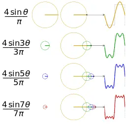
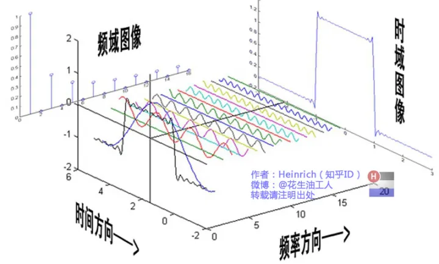
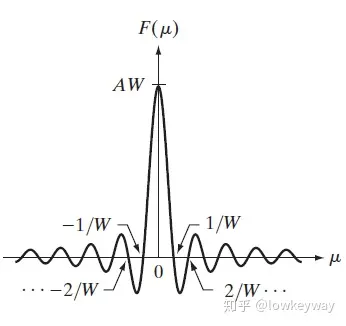
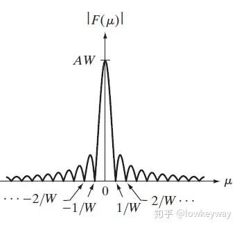

# 数字图像处理

## 基础

图像处理的三个层次：

- 图像处理：图像->图像
- 图像分析：图像->描述
- 图像识别：图像->语义

处理的是数字信号，在数学上是离散的

何凯明 去雾算法

期刊：CVPR ICCV ECCV

### 人眼视觉感知

人眼辨别亮度差别的能力，与环境亮度和本身亮度有关（马赫带效应）

人眼和照相机

- 眼帘=镜头盖
- 瞳孔=光圈
- 晶状体=透镜
- 视网膜=底片
- 视觉神经细胞（视感细胞，视锥细胞） vs 感光药膜

视杆细胞：只对光的振幅感兴趣，而对波长不敏感

视锥细胞：对波长敏感，分布在中央凹的位置，色盲的视锥细胞有不完善的地方

小孔成像

照射强度和反射强度

### 图像采样与量化

连续 ``（空间坐标连续+幅值连续）``->数字形式

采样：空间坐标的离散化。决定图像的 ``空间分辨率 ``

量化：图形幅值的数字化，决定图像的 ``幅度（灰度级）分辨率 ``

#### 空间与灰度分辨率

**空间分辨率：**离开空间单位谈图像大小没意义，所以我们尝试使用dpi描述图像分辨率

**灰度分辨率**：量化灰度的比特数

图像内插：调整图像大小、旋转、几何校正

- 下采样/收缩：行列删除
- 上采样/放大：创建新的像素位置

#### 图像放大

创建新的像素位置，对新位置上的像素赋值

- 最近邻插值：把原图中最邻近的灰度赋给每个新像素
- 优点：简单易行 速度快
- 缺点：容易产生马赛克效应

##### 单线性插值

已知中P1点和P2点，坐标分别为(x1, y1)、(x2, y2)，要计算 [x1, x2] 区间内某一位置 x 在直线上的y值

简单整理公式为以下格式，可以理解为分子距离x1和x2的距离

##### 双线性插值

用四个邻近位置上的灰度值估计给定位置的灰度值

##### 双三次插值

和双线性插值的映射方法差不多，需要16个点完成

### 像素间的一些基本关系

像素之间的关系：邻接、连接、连通、通路

像素集合之间的关系：邻接、连接、连通

#### 像素间的距离

欧式距离$$D_e$$：范数为2的距离。设像素p和q的坐标分别为(x,y)和(s,t)，他们之间的欧氏距离定义为：
$$
D_{\mathrm{E}}(p, q)=\sqrt{(x-s)^2+(y-t)^2}
$$
城区距离$D_4$ ：也叫曼哈顿距离，是范数为1的距离
$$
D_4(p, q)=|x-s|+|y-t|
$$
棋盘格距离$D_8$：也叫切比雪夫距离
$$
D_8(p, q)=\max \{|x-s|,|y-t|\}
$$

## 空间域图像增强

**灰度变换与空间滤波**

- 图像增强：对图像数据处理

  - 图像增强不改变图像内容，只是改变灰度分布

- 空间域图像增强：图像平面本身，直接对**像素**操作

  - $g(x,y)=T[f(x,y)]$

  - T变换的处理对象是某个邻域

    

- 变换域图像增强：通过数学变换将图像转换到变换域后进行处理，再转换回空间域

### 灰度变换函数

**图像反转变换**

$s=(l-1)-r$，s为新图像的灰度值，r为当前图像的灰度值

灰度图像：黑白颠倒  彩色图像：补色

 各种灰度变换函数 

**对数变换**

$s=c\log(1+r)$，c为常数，r非负

- 增强低灰度，抑制高灰度
- 应用：压缩图像的动态范围

暗区压缩，暗部变少

亮区压缩，亮部增加

**反对数变换**

$s=c/\log(1+r)$，c为常数，r为非负

**伽马（幂次）变化**

$s=cr^\gamma$，c,r为非负

- $\gamma<1$: 扩展暗像素值，压缩亮像素值
- $\gamma>1$: 压缩暗像素值，扩展亮像素值

**伽马校正**

某些设备 (ex: CRT) 的**电压-亮度**曲线近似为幂函数

经过伽马校正后的图像作为输入，更加接近真实显示值

**分段线性变换**

将灰度级划分为不同范围，每个范围采用不同的线性变换

主要形式：

- 对比度拉伸：提高图像灰度级的动态范围

  

- 灰度级分层（灰度切割）: 提高图像中特点灰度范围的亮度

- 比特平面分层（位图切割）：分析图像每个比特的相对重要性

  - 信息多存在于高层比特上

### 直方图处理

定义：描述每个灰度值的像素个数

**基于直方图的图像增强技术：**

- 直方图均衡
- 直方图规定化

#### 直方图均衡

定义：将原图像的直方图通过**灰度变换函数**$s=T(r)$对灰度修正，使得灰度概率密度函数(PDF)为均匀分布

目的：增加像素灰度值的动态范围，从而达到增强图像整体对比度的效果；把任意的直方图均衡化均匀的直方图

变换函数要求：

- 均匀分布且连续可微
- 单调递增

公式结论：

- 变换的连续形式：
  $$
  s=T(r)=(L-1)\int^r_0p_r(w)dw
  $$

- 公式的离散形式：

$$
s_k=T(r_k)=(L-1)\sum^k_{j=0}p_r(r_j)=\frac{L-1}{MN}\sum^k_{j=0}n_j \quad k=0,1,2,...,K-1
$$

小结：直方图均衡化

- **非线性拉伸**
- 增强对比度，不改变图像内容
- 有些灰度被拉断了，造成细节损失

#### 直方图规定化

定义：修改一幅图片直方图，使其与另一幅图像的直方图匹配或者具有一种预先规定的函数形状

目标：突出感兴趣的部分
$$
z=\boldsymbol{G}^{-1}(s)=\boldsymbol{G}^{-1}(T(r))
$$

### 空间滤波基础

空间域模板进行图像处理。模板本身被称为空域滤波器
$$
g(x, y)=\sum_{s=-a}^a \sum_{t=-b}^b w(s, t) f(x+s, y+t)
$$

#### 空间滤波与卷积

相关操作：
$$
w(x, y)\star f(x, y)=\sum_{s=-a}^a \sum_{t=-b}^b w(s, t) f(x+s, y+t)
$$
卷积操作：
$$
w(x, y) \star f(x, y)=\sum_{s=-a}^a \sum_{t=-b}^b w(s, t) f({x-s, y-t})
$$
向量表示：
$$
R=w_1 z_1+w_2 z_2+\ldots+w_{m n} z_{m n}=\sum_{k=1}^{m n} w_k z_k=\boldsymbol{w}^T \boldsymbol{Z}
$$

### 平滑空间滤波器

作用：

- 模糊处理：去除图像中一些不重要的细节
- 减少噪声

平滑空间滤波器分类：

- 平滑线性滤波器：均值滤波器
- 统计排序滤波器（非线性）：最大值滤波器，中值滤波器，最小值滤波器

加权均值滤波：
$$
g(x, y)=\frac{\sum_{s=-a t=-b}^a \sum^b w(s, t) f(x+s, y+t)}{\sum_{s=-a t=-b}^a \sum^b w(s, t)}
$$

### 锐化（高通）滤波器

用途：突出细节

一阶微分产生较粗的边缘，二阶微分产生双边缘

二级微分比一阶微分对细节有更为强烈的响应，易于实现

非锐化掩膜：

1. 模糊原图像
2. 从原图像中减去模糊后的图像
3. 模板与原图相加

Sobel算子：

1. 定义算子

2. 与图像卷积以达到求导：

$$
\frac{\delta f}{\delta x}S_x \otimes f \qquad \frac{\delta f}{\delta y}S_y \otimes f
$$

3. 计算梯度：

4. 边缘检测：根据梯度强度和方向来判断像素是否为边缘点。通常，可以根据梯度强度设置一个阈值，将梯度强度大于阈值的像素标记为边缘点，否则标记为非边缘点。

对噪声敏感：

为什么均值化会拉断？自适应均衡化

## 四、频率域滤波

问题的提出：偏微分方程(PDE)

法国数学家D`Almbert
$$
u(x, t)=f(x+c t)+g(x-c t)
$$
瑞士数学家 D.Bernoulli 
$$
u(x, t)=\sum_{n=0}^{\infty}\left[a_n \cos n x+b_n \sin n x\right]
$$

### 信号正交

定义在$(t_1,t_2)$区间的$\varphi_1(t)$和$\varphi_2(t)$满足
$$
\int_{t_1}^{t_2}\phi_{1}( t) \phi{2}( t)  d_t= 0 \quad  (两函数的内积为0)
$$
则称$\varphi_{1}(t)$和$\varphi_2(t)$ 在区间($t_1,t_2$)内正交。

**正交函数集：**

函数集内任意两个不同的函数都满足正交，则称为**正交函数集**

**信号的正交分解：**

设有$n$个函数$\varphi_1(t)$,$\varphi_2(t),\cdots,\quad\varphi_n(t)$在区间$(t_1,t_2)$构成一个正交函数空间将任一函数$f(x)$用这$n$个正交函数的线性组合来近似, 可表示为

$$
f(t)\approx C_1\varphi_1+C_2\varphi_2+\cdots+C_n\varphi_n
$$

如何选择各系数$C_j$使$f(t)$与近似函数之间的误差在区间$(t_1,\quad t_2)$内为最小。通常使误差的方差均值(称为均方误差)最小。均方误差为

$$
{\overline{\varepsilon^2}=\frac1{t_2-t_1}\int_{t_1}^{t_2}[f(t)-\sum_{j=1}^nC_j\varphi_j(t)]^2\operatorname{d}t}
$$

为使上式最小（系数Cj变化时，即Cj为变量），有**Leibnitz准则（求偏导等于0处取最小值）**，有：
$$
\frac{\partial\overline{\varepsilon^2}}{\partial C_i}=\frac{1}{t_2-t_1}\frac\partial{\partial C_i}\int_{t_1}^{t_2}\left[f(t)-\sum_{j=1}^nC_j\varphi_j(t)\right]^2\operatorname{d}t=0
$$

展开被积函数，由于**正交性** ，以及前面的系数，只有两项不为0：
$$
\frac{\partial}{\partial C_i} \int_{t_1}^{t_2}\left[-2 C_i f(t) \varphi_i(t)+C_i^2 \varphi_i^2(t)\right] \mathrm{d} t=0
$$

$$
即：-2 \int_{t_1}^{t_2} f(t) \varphi_i(t) \mathrm{d} t+2 C_i \int_{t_1}^{t_2} \varphi_i^2(t) \mathrm{d} t=0
$$

$$
C_i=\frac{\int_{t_1}^{t_2} f(t) \varphi_i(t) \mathrm{d} t}{ \int_{t_1}^{t_2} \varphi_i^2(t) \mathrm{d} t}=\frac{1}{K_i} \int_{t_1}^{t_2} f(t) \varphi_i(t) \mathrm{d} t
$$

### 傅里叶分析

傅里叶分析可分为傅里叶级数（Fourier Serie）和傅里叶变换(Fourier Transformation)

傅里叶分析的作用：

在时域看似不可能做到的数学操作，在频域相反很容易。这就是需要傅里叶变换的地方。尤其是从某条曲线中去除一些特定的频率成分，也就是称为滤波

不同频率的正弦波我们成为频率分量，如果第一个频率最低的频率分量为 1 ，我们就有了构造频域的最基本单位

那么频域的“0”是什么呢？cos（0t）就是一个周期无限长的正弦波，也就是一条直线！所以在频域，0频率也被称为直流分量，在傅里叶级数的叠加中，它仅仅影响全部波形相对于数轴整体向上或是向下而不改变波的形状。

一个矩形波在频域里面的样子：

清楚一点：

#### 傅里叶级数

#### 傅里叶变换（Fourier Transformation）

傅里叶级数，在时域是一个周期且连续的函数，而在频域是一个非周期离散的函数。这句话比较绕嘴，实在看着费事可以干脆回忆第一章的图片。

而傅里叶变换，则是将一个时域非周期的连续信号，转换为一个在频域非周期的连续信号。

原来离散谱的叠加，变成了连续谱的累积。所以在计算上也从求和符号变成了积分符号。

**连续单变量函数的傅里叶变换**
$$
\begin{aligned}
& f(t)=\mathfrak{F}^{-1}\{F(u)\}=\int_{-\infty}^{\infty} F(u) \mathrm{e}^{j 2 \pi u t} \mathrm{~d} u & 傅里叶逆变换\\
& F(u)=\mathfrak{F}\{f(t)\}=\int_{-\infty}^{\infty} f(t) \mathrm{e}^{-j 2 \pi u t} \mathrm{~d} t  & 傅里叶变换
\end{aligned}
$$

时域是复频域投影到频域中的各成分的累积

> 举个例子

对如下函数做傅里叶变换：

由图可以知：

$$f(x)= \begin{cases}A & x>-W / 2 \& x<W / 2 \\ 0 & x<-W / 2 \mid x>W / 2\end{cases}$$

代入傅里叶变换公式：
$$
\begin{aligned}
F(\mu) & =\int_{-\infty}^{\infty} f(t) e^{-j 2 \pi \mu t} d t=\int_{-W / 2}^{W / 2} A e^{-j 2 \pi \mu t} d t \\
& =\frac{-A}{j 2 \pi \mu}\left[e^{-j 2 \pi \mu t}\right]_{-w / 2}^{W / 2}=\frac{-A}{j 2 \pi \mu}\left[e^{-j \pi \mu W}-e^{j \pi \mu W}\right] \\
& =\frac{A}{j 2 \pi \mu}\left[e^{j \pi \mu W}-e^{-j \pi \mu W}\right] \\
& =A W \frac{\sin (\pi \mu W)}{(\pi \mu W)}
\end{aligned}
$$
最终得到 sinc 函数的曲线：

通常，傅里叶变换包含了复数项，且为了显示目的，通常处理该变换的幅值（一个实量），该幅值称为傅里叶谱或频谱：
$$
|F(\mu)|=AW\left|\frac{\sin(\pi\mu W)}{(\pi\mu W)}\right|
$$

### 取样与采样函数的傅里叶变换

> 狄拉克函数：幅度无限，持续时间为0，具有单位面积和尖峰信号

#### 冲击函数

连续变量t在t=0处的单位冲击被定义为：
$$
\begin{array}{ll}
\delta(t)=  \begin{cases}\infty, & t=0 \\
0, & t \neq 0\end{cases} \\
\text { s.t. } \quad \int_{-\infty}^{\infty} \delta(t) \mathrm{d} t=1
\end{array}
$$
其傅里叶变换为：
$$
F(\mu)=\int_{-\infty}^\infty\delta(t)\mathrm{e}^{-\mathrm{j}2\pi\mu t}\mathrm{d}t=\int_{-\infty}^\infty\mathrm{e}^{-\mathrm{j}2\pi\mu t}\delta(t)\mathrm{d}t=\mathrm{e}^{-\mathrm{j}2\pi\mu0}=\mathrm{e}^0=1
$$
**这个变换表示，位于原点的单位冲激函数在频率域是一个常数**。

离散变量在$x=x_0$处的冲击函数：
$$
\sum_{x=-\infty}^\infty f(x)\delta(x-x_0)\mathrm{d}x=f(x_0)
$$
其傅里叶变换为：
$$
F(\mu)=\int_{-\infty}^\infty\delta\left(t-t_0\right)\mathrm{e}^{-\mathrm{j}2\pi\mu t}\mathrm{d}t=\int_{-\infty}^\infty\mathrm{e}^{-\mathrm{j}2\pi\mu t}\delta\left(t-t_0\right)\mathrm{d}t=\mathrm{e}^{-\mathrm{j}2\pi\mu t_0}=\cos(2\pi\mu t_0)-\mathrm{j}\sin(2\pi\mu t_0)
$$
**它表示了以复平面原点为中心的单位圆**

**冲击串**的傅里叶级数：$$s_{\Delta T}(t)=\sum_{n=-\infty}^{\infty}\delta(\boldsymbol{x}-n\Delta T)$$
$$
\begin{aligned}
&s_{\Delta T}(t) =\sum_{n=-\infty}^{\infty}c_{n}\mathrm{e}^{\mathrm{j}\frac{2\pi n}{\Delta T}t}  \\
&{\text{其中 }c_{n}} =\frac{1}{\Delta T}\int_{-\Delta T/2}^{\Delta T/2}s_{\Delta T}(t)\mathrm{e}^{-j\frac{2\pi n}{\Delta T}t}\mathrm{d}t 
\end{aligned}
$$

**周期为 $\Delta T$ 的冲激串的傅里叶变换还是冲激串，其周期是 $1/\Delta T$ , $s_{\Delta T}(t)$ 和 $S(\mu)$ 之间呈现周期反比关系。**

#### 卷积

时域内两个函数卷积 = 频域内两个函数相乘

时域内两个函数相乘 = 频域内两个函数卷积

#### 取样函数的傅里叶变换

取样后函数：$$\tilde{f}(t)=f(t)s_{\Delta T}(t)=\sum_{n=-\infty}^{\infty}f(t)\delta(t-n\Delta T)$$

傅里叶变换：$$\tilde{F}(u)=\mathfrak{F}\{\tilde{f}(t)\}=\mathfrak{F}\{f(t)s_{\Delta T}(t)\}=F(u)\star\boxed{S(u)}$$

取样函数和傅里叶变换后函数均为周期函数，取样函数的周期为${\Delta T}$，傅里叶变换后周期为$\frac{1}{\Delta T}$

**带限函数：**对于函数$f(t)$，如果傅里叶变换后函数是以原点为中心，具有有限区域，区域之外的频率值为0，则称函数$f(t)$为带限函数

带限函数恢复条件：$\frac{1}{\Delta T}\ge 2u_{\max}$

问题：如何根据$\tilde F(u)$恢复$f(t)$

1. 将$\tilde F(u)$恢复成带限函数，必须要带限函数才能恢复
2. 利用傅里叶反变换复原

如果用低于最高频率的两倍取样率对带限函数进行取样，会产生混淆：

如最后一个图，频率受到邻近周期的破坏

### 单变量的离散傅里叶变换（DFT）

取样是为了把时域的连续函数变为计算机中可以处理的离散点

一个在时域上的离散函数，傅里叶变换后它的频域上的变换可以是连续的，并且是周期的。

时域上连续函数取样后的函数是变成离散的计算机可以处理的数据了，但是傅里叶变换后的频域上还是连续的啊。怎么让计算机连频域上的数据都可以处理呢？对！老方法再用一次，对频域信号进行采样呗~

取样函数：$\tilde{f}(t)=f(t)s_{\Delta T}(t)=\sum_{n=-\infty}^{\infty}f(t)\delta(t-n\Delta T)$

傅里叶变换：
$$
\begin{aligned}
\tilde{F}(u)& =\mathfrak{F}\{\tilde{f}(t)\}=\int_{-\infty}^{\infty}\sum_{n=-\infty}^{\infty}f(t)\delta(t-n\Delta T)\mathrm{e}^{-j2\pi ut}\mathrm{d}t  \\
&=\sum_{n=-\infty}^{\infty}\int_{-\infty}^{\infty}f(t)\delta(t-n\Delta T)\mathrm{e}^{-j2\pi ut}\mathrm{d}t=\sum_{n=-\infty}^{\infty}f_{n}\mathrm{e}^{-j2\pi u\Delta T} \\
&f_n=\int_{-\infty}^{\infty}f(t)\delta(t-n\Delta T)=f(n\Delta T)\quad\text{离散}
\end{aligned}
$$

时域离散函数的傅里叶变换是周期为$\frac 1{ \Delta T}$的无限周期连续函数

假设我们想要在周期 $\mu=0$ 到 $\mu=1/\Delta T$ 之间得到的 $\tilde{F}(\mu)$ 的 $M$ 个等间距样本，可以通过加如下频率处取样得到：

$$
\mu=\frac m{M\Delta T},\quad m=0,1,2,\cdots,M-1
$$
>  注：
>  这里已经开始对频率域的 $\tilde{F}(\mu)$ 进行一个周期采样啦。

把 $\mu$ 代入上式，我们用 $F_m$ 表示得到的结果：

$$
F_m=\sum_{n=0}^{M-1}f_n\mathrm{e}^{-\mathrm{j}2\pi mn/M},\quad m=0,1,2,\cdots,M-1
$$
这已经是我们定义的DFT啦！

$u,v$表示频率$x,y$ 表示坐标
$$
离散傅里叶变换：& F_{m}=\sum_{n=0}^{M-1}f_{n}\mathrm{e}^{-j2\pi mn/M}\:,& m=0,1,2,\cdots\:,M-1\\

离散傅里叶反变换：& f_{n}=\frac{1}{M}\sum_{n=0}^{M-1}F_{m}\mathrm{e}^{j2\pi mn/M}\:,& n=0,1,2,\cdots\:,M-1
$$

$$
离散傅里叶变换： & F(u)=\sum^{M-1}_{x=0}f(x)e^{−j2πux/M} &u=0,1,2,\cdots,M-1 \\
离散傅里叶反变换:& f(x)=\frac{1}{M}\sum_{n=0}^{M−1}F(u)e^{j2\pi ux/M}&  x=0,1,2,⋯,M−1
$$

### 双变量函数的傅里叶变换

双连续变量的冲激函数及其取样特性：
$$
\left.\delta(t,z)=\left\{\begin{array}{ll}\infty,&t=z=0\\0,&x\neq0\end{array}\right.\right.\\\text{s.t.}\quad\int_{-\infty}^{\infty}\int_{-\infty}^{\infty}\delta(t,z)\mathrm{d}t\mathrm{d}z=1
$$
取样特性：
$$
\begin{aligned}\int_{-\infty}^\infty\int_{-\infty}^\infty f(t,z)\delta(t,z)\mathrm{d}t\mathrm{d}z&=f(0,0)\\\\\int_{-\infty}^\infty\int_{-\infty}^\infty f(t,z)\delta(t-t_0,z-z_0)\mathrm{d}t\mathrm{d}z&=f(t_0,z_0)\end{aligned}
$$
2D DFT 及 IDFT
$$
\begin{aligned}F(u,v)&=\sum_{x=0}^{M-1}\sum_{y=0}^{N-1}f(x,y)\mathrm{e}^{-j2\pi(ux/M+vy/N)}\\\\f(x,y)&=\frac{1}{{MN}}\sum_{u=0}^{M-1}\sum_{v=0}^{N-1}F(u,v)\mathrm{e}^{j2\pi(ux/M+vy/N)}\end{aligned}
$$

### 二维离散傅里叶变换的一些性质

**空间与频率间隔的关系：**
$$
\begin{aligned}\Delta u&=\frac{1}{M\Delta T}\\\\\Delta v&=\frac{1}{N\Delta Z}\end{aligned}
$$
**平移：**
$$
f(x,y)\mathrm{e}^{j2\pi(u_0x/M+v_0y/N)} \Leftrightarrow F(u-u_0,v-v_0)\\ f(x-x_0,y-y_0)\Leftrightarrow F(u,v)\mathrm{e}^{-j2\pi(u_0x/M+v_0y/N)}
$$

### 频率域滤波基础

图像的频率域表示：$F(u,v)=\sum_{x=0}^{M-1}\sum_{y=0}^{N-1}f(x,y)\mathrm{e}^{-j2\pi(ux/M+vy/N)}$

- 图像的频率：表征图像中灰度变化剧烈程度
- $u=v=0$ 变化最慢，直流
- 低频：图像中变换缓慢的灰度分量
- 高频：图像中灰度急剧变化的分量
- 频率域滤波：通常修改图像的傅里叶频谱；

直流分量：图像的平均灰度
$$
F(0,0)=\sum_{x=0}^{M-1}\sum_{y=0}^{N-1}f(x,y)=MN\bar{f}(x,y)
$$

n要变得无穷小

无限多的三角函数的线性积分

时间意义上周期的，频谱意义上离散的

无限周期，频谱没办法离散

信号在时域上窄，频域上宽

正变换：把时域转换为频域

alt ctrl 截图 reisub

