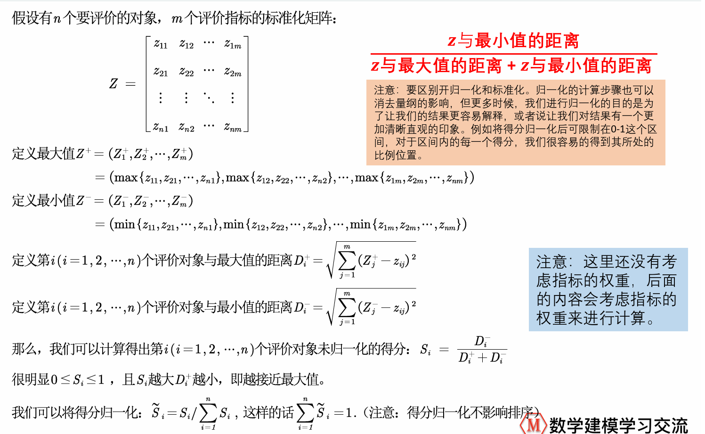
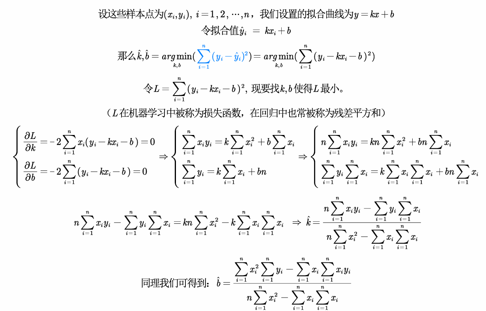
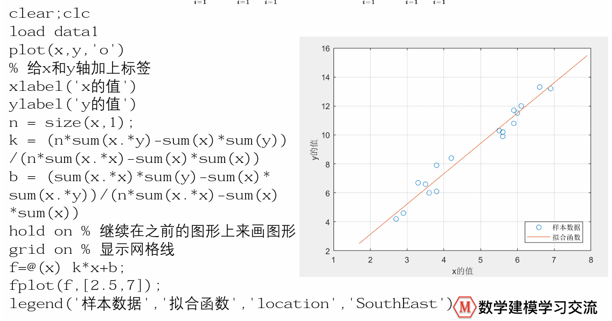
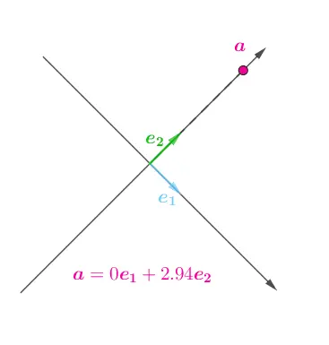
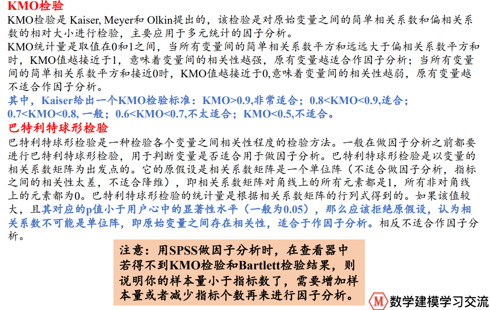

# 建模方法

## 描述性统计

研究统计规律时候可以在最大值、最小值、均值之外还引入其他几种值：

- 变异系数：标准化度量概率分布的离散程度
  $$
  CV=\frac{\sigma_r}{m_r}\times100\%
  $$


- 偏度系数：偏度$$\beta_s$$常用于衡量样本数据分布偏离对称性的程度
- 峰度系数：反映峰部的尖度程度

## 评价类问题

- 我们评价的目标是什么
- 为了达到目标有几种方案
- 评价的准则或者说指标是什么（如何评价好坏

使用打分法解决评价问题：


## 层次分析法

通过**判断矩阵**来得出权重，判断矩阵是由“专家”得出的

正互反矩阵满足：
$$
a_{ij}*a_{ji}=1
$$
一致矩阵满足：
$$
a_{ik}=\frac{i的重要程度}{k的重要程度}=a_{ij}*a_{jk}
$$
求权重前要判断是否是一致矩阵（判断是否满足上面公式）

一致矩阵有一个特征值为n，其余特征值都为0


### 一致性检验步骤

1. 计算<span style='color:Moccasin'>一致性指标CI</span>
   $$
   CI=\dfrac{\lambda_{max}-n}{n-1}
   $$

4. 查找<span style='color:PaleGreen'>平均随机一致性指标RI</span>

   

5. 计算<span style='color: OrangeRed'>一致性比例CR</span>
   $$
   CR=\dfrac {CI}{RI}
   $$

**如果CR<0.1，则认为一致性可以接受**，否则需要修正


RI的值如何得到：

用随机的方法构造500个样本矩阵，随机从1-9及其倒数抽取数字构造正互反矩阵，求最大特征根的平均值$$\lambda_{max}$$并定义
$$
RI=\dfrac{\lambda^{'}_{max}-n}{n-1}
$$
### 一致矩阵计算权重

方法1：算术平均求权重

1. 按列归一化
2. 将归一化的各列相加求平均

F4锁定单元格

方法2：几何平均法求权重

方法3：特征值法求权重


### 层次分析法步骤

1. 分析系统中各因素之间的关系，建立系统的递阶层次结构


2. 构造两两比较矩阵'

3. 由判断矩阵计算被比较元素对于该准则的相对权重， 并进行一致性检验（检验通过权重才能用）


### 局限性

1. 评价的决策层不能太多，不然差异可能会很大
2. 如何使得已知数据的评价更加准确


## TOPSIS法

> 优劣解距离法
>

### 正向化处理

1.极小型->极大型指标
$$
max-x或\dfrac{1}{x}
$$

2.中间型指标
$$
M=max\{|x_i-x_{best}\}, \tilde{x_i}=1-\dfrac{|x_i-x_{best}|}{M}
$$


将原始矩阵统一转换为极大型指标

 

### 标准化处理

避免不同数据的量纲不同，假设n个评价对象，m个评价指标，构成正向化矩阵如下


对于其标准化矩阵记为Z，Z中的每一个元素$$z_{ij}=x{ij}/\sqrt{\sum_{i=1}^{n}x_{ij}^2}$$

### 构造计算评分的公式

只有一个指标时：
$$
\dfrac{x-min}{max-min}\\ 可以看作：\frac{x与最小值的距离}{x与最大值的距离+x与最小值的距离}
$$




### 局限性

主观性太强，更推荐熵权法来进行客观赋值


## 基于熵权法对Topsis模型修正

> 熵权法是一种客观赋权方法
>
> 原理：指标的变异程度越小，所反映的信息量越少，其对应的权值也应该越低

越有可能发生的事情，信息量越少

越不可能发生的事情，信息量越多

对于熵权法而言，熵越大信息量越小


### 计算步骤

1. 判断输入矩阵中是否有负数，如果有就要重新标准化到非负区间
2. 
3. 


## 灰色关联分析

一般抽象系统中，多种因素共同作用结果决定该系统的发展态势，人们希望知道因素的主次、促进还是抑制

数理分析中的回归分析、方差分析、主成分分析等都是用来系统分析的方法，但是这些方法有以下不足：

1. 要求大量数据
2. 要求数据服从典型的概率分布
3. 计算量大

> 灰色关联分析的思想：根据序列曲线几何形状的相似程度来判断其联系是否紧密。曲线越接近，相应序列之间的关联程度就越大，反之越小。

优点

灰色关联分析法弥补了采用数理统计方法作系统分析所导致的遗憾。它**对样本量的多少和样本有无规律都同样适用**，而且计算量小，十分方便，更不会出现量化结果与定性分析结果不符的情况。

缺点

要求需要对各项指标的最优值进行现行确定，主观性过强，同时部分指标最优值难以确定

### 一般步骤

1. 画统计图

2. 确定分析序列

   1. 母序列（又称为参考数列、母指标）：
   2. 子序列（又称为比较数列、子指标）：

3. 对变量进行预处理（去量纲、缩小变量范围简化计算）

   对每个指标进行预处理：求出每个指标的均值，再用该指标中的每个元素除以其均值

4. 计算子序列中各个指标与母序列的关联系数

   定义灰色系数，即各指标的关联系数为：
   $$
   y(x_0​
    (k),x_i
   ​
    (k))=\frac{a+ρb}{∣x_0
   ​
    (k)−x_i
   ​
    (k)∣+ρb} \quad
    (i=1,2,⋯,m,k=1,2,⋯,n)
   $$
   其中a 为两极最小差，b 为两极最大差，ρ 为分辨系数（一般取值0.5）
   $$
   a= 
   \min\limits_{i}
   \min\limits_k
    ∣x_0 (k)−x_i(k)∣
   b= \max\limits_i\max\limits_k
   ​
    ∣x_0
    (k)−x_i
   ​
    (k)∣
   $$

5. 计算灰色关联度，并得出结论

   定义$$ y(x_0, x_i)$$为灰色关联度，即将关联系数矩阵每列求均值。
   $$
   y(x_0 ,x_i)=\frac  1 n  \sum_{k=1}^n
   ​
    y(x_0(k),x_i
    (k))
   $$

6. 比较三个子序列和母序列的关联程度


## 模糊分析法

**模糊集合是用来描述模糊性概念的集合，它与经典集合的区别之一是，模糊集合不具备确定性。**

**我们使用“隶属度”来表示元素与模糊集合之间的关系，也就是元素隶属于模糊集合的程度。**

**`隶属度`的范围是[0,1]，其值越大，就代表越属于这个集合。**

`隶属函数`，将数值映射到区间里面


### 模糊集合的分类

**模糊集合主要有三类，分别为偏小型，中间型和偏大型**


### 模糊集合的三种表示方法

Zadeh表示法
$$
A=\dfrac{A(x_1)}{x_1}+\dfrac{A(x_2)}{x_2}+...+\dfrac{A(x_n)}{x_n}
$$

序偶表示法
$$
A=\{(x_1,A(x_1)),...,(x_n,A(x_n))\}
$$
向量表示法
$$
A=\{A(x_1),A(x_2),...,A(x_n)\}
$$


### 隶属函数的确定方法

问卷

借助已有的尺度

 ex：恩格尔系数，记得归一化

指派法（主观性比较强）


## 插值算法

利用已知点建立合适的插值函数，未知点可以由插值函数求出

### 一般多项式插值原理

- 只要n+1个节点互异，满足上述多项式插值条件的多项式是唯一存在的
- 如果不限制多项式的次数，插值多项式并不唯一

#### 拉格朗日插值

在若干个不同的地方得到相应的观测值，拉格朗日插值法可以找到一个多项式，其恰好在各个观测的点取到观测到的值。
$$
两个点：(x_0,y_0),(x_1,y_1)\\f(x)=\dfrac{x-x_1}{x_0-x_1}y_0+\dfrac{x-x_0}{x_1-x_0}y_1
$$

拉格朗日插值多项式：


#### 龙格现象

高次插值时会出现龙格现象，即两端波动**极大**，产生明显的震荡。在不熟悉曲线运动趋势的情况下，不要轻易使用高次插值


### 分段线性插值

**问题**

1. 高次插值多项式精度未必提高
2. 插值多项式次数越高摄入误差可能显著增加

**分段线性插值可以优化**


对于一个多项式的点，我们先找距离这个横坐标最近的两个点，然后这两个点连成一个线。然后根据横坐标的点，找到线上纵坐标的点。一般我们常用分段二次插值或者分段三次插值。

#### 分段二次插值

选取跟节点$$x$$最近的三个节点$$x_i-1,x_i,x_i+1$$进行二次插值。即在每一个区间$$[x_i-1,x_i+1]$$上，取：
$$
f(x) \approx L_2(x)=\sum^{i+1}_{k=i-1}[y_k\prod^{i+1}_{\substack{j=i-1\\j\neq k}}\frac{(x-x_j)}{(x_k-x_j)}]
$$
在几何上，这种方法就是使用分段抛物线代替$$y=f(x)$$


#### 牛顿插值法

利用差值来构造函数


> 差商定义：$$f[x_0,x_k]=\frac{f(x_k)-f(x_0)}{x_k-x_0}$$为函数$$f(x)$$关于点$$x_0,x_k$$的一阶差商

k阶差商
$$
f[x_1,x_2,\dots,x_k]=\dfrac{f[x_1,...x_{k-1},x_k]-f[x_0,x_1,...x_{k-1}]}{x_k-x_0}
$$
**优点**：计算过程具有继承性  **缺点**：也存在龙格现象


以上两种插值法都不能全面反映被插函数的性态，只拥有局部性


### Hermite插值原理


### 分段三次埃尔米特插值

实际应用中往往使用这种方式，我们只需要会用matlab调用就可以了

```matlab
p=pchip(x,y,new_x)
```


### 三次样条插值


Matlab内置函数spline


实际建模中，我们不知道数据的生成过程，上面两种方法都可以用


## 拟合算法

> 和插值算法的区别：
>
> 不要求经过所有给定的样本点，保证误差足够小就可以
>

**如何判断最接近：**最小二乘法
$$
\hat{k},\hat{b}=\mathop{arg\min}\limits_{k,b}(\sum^n_{i=1}({y-\hat{y_i}})^2)
$$
**为什么不选择其他方式：**

1. 绝对值不好求导，不容易优化
2. 奇数次方无法解决正负问题
3. 四次方时，极端数据产生误差较大


### 求解最小二乘法



matlab代码：


### 如何评价拟合的好坏

拟合优度（可决系数）$$R^2$$


这里的线性指的是，对参数线性：

在函数中，参数仅以一次方的形式出现，且不能乘以或除以其他任何参数，并不能出现参数的复合函数形式


## 相关系数

经常使用抽样的统计量估计总体统计量

协方差可以反应两个变量的相关性；但是协方差不能直接比较，因为他们有量纲，皮尔逊相关系数就是为了消除量纲影响

### 皮尔逊相关系数

目的：消除变量量纲的影响，也即X和Y标准化后的协方差

总体均值： $$E(X)=\dfrac{\sum\limits_{i=1}^{n}X_1}{n} \quad E(Y)=\dfrac{\sum\limits_{i=1}^{n}Y_1}{n}$$

总体协方差：$$Cov(X,Y)=\dfrac{\sum_{i=1}^{n}(X_i-E(X))(Y_i-E(Y))}{n}$$

总体*Person*相关系数：$$\rho_{xy}=\dfrac{Cov(X,Y)}{\sigma_x\sigma_y}=\dfrac{\sum_{i=1}^n{\dfrac{(X_i-E(X))}{\sigma_x}}{\dfrac{(Y_i-E(Y))}{\sigma_y}}}{n}$$

$$\sigma_x(sigma X)是X的标准差$$，$$\sigma_x=\sqrt{\dfrac{\sum_{i=1}^1(X_i-E(X))^2}{n}}$$，$$\sigma_y=\sqrt{\dfrac{\sum_{i=1}^1(y_i-E(Y))^2}{n}}$$


**特殊情况下：**$$|\rho_{xy}|\le1且Y=aX+b时，\rho_{xy}= \left\{  \begin{aligned}  1 ,a>0 \\ -1,a<0 \end{aligned}\right.$$

- 皮尔逊相关系数只用来衡量两个变量线性相关的指标
- 只有**确认线性相关**才可以使用皮尔逊相关系数，在不确定变量关系的时候，不能使用皮尔逊相关系数，必须要画出散点图来看才行


**比起相关系数的大小，我们更关注显著性检验（假设检验）**

可以通过图表的方式展示是否具有线性关系，很直观	


#### 步骤

- 先做一个统计性描述

- spss画出散点图

- matlab计算皮尔逊相关系数

  ```matlab
  R=corrcoef(A) #返回每两个变量的相关系数
  ```

- 输出的矩阵


### 皮尔逊相关系数的假设检验

当相关系数为0.3时，我们希望知道这个值和0有没有显著差异

步骤：

1. 提出假设
2. 构造某一分布量，在这里可以构造自由度为n-2的t分布
3. 进行检验

```matlab
[R,P]=corrcoef(test) %P返回的就是假设检验的概率值
```


### 对数据进行正态分布检验

对相关系数进行假设检验前必须要进行正态分布检验

#### 正太分布JB检验(大样本，30)

对于一个随机变量，假设其偏度为S，峰度为K，那么我们可以构造JB统计量：
$$
JB=\frac{n}{6}[S^2+\frac{(K-3)^2}4]
$$
如果$${X_i}$$符合正太分布，那么大样本情况下$$JB\sim  \chi^2(2)$$

之后进行假设检验

原假设：符合正态分布

```matlab
[h,p] = jbtest(x,alpha) %x为向量，alpha为显著性水平，一般为5%
```


#### Shapiro-wilk夏皮洛-威尔克检验(小样本)

spss 探索 完成

3-50

假设：$$H_0: 数据符合正态分布$$


#### QQ图

可以大致显示是否为正态分布，依然需要大样本


### 斯皮尔曼spearman相关系数

假设X和Y为两组数据
$$
r_s=1-\frac{6\sum_{i-1}^{n}d_i^2}{n(n^2-1)}
$$
$$d_i定义为X_i与Y_i的等级差$$


### 如何选择相关系数

1. 连续，线性，正太，用person
2. 上述任意不满足，用spearman
3. 有定序数据的情况下只能用spearman


## 卡方检验

广泛应用于**分类变量**（categorical data）的**独立性检验**中，也可用于**分类变量的比较检验**中。这两种检验都需要用到R×C列联表（R×C contingency table），其中R表示行（Row），C表示列（Column）。

### 前提假设

1. 每个观测值属于且只属于一个类别

2. 观测值之间相互独立，一个被试一般来说只被归为一类

   比如对于三个动作电影打分，如果一个人不喜欢动作电影，他可能给出三个低分

3. 观测次数不能太少

4. 样本来自简单随机抽样。

5. 样本量应尽可能大。总观察数应不小于40，且每个类别的理论频数应大于等于5或者理论频数低于 10 且只有一个自由度时（否则使用Fisher's）。

6. 依据样本数据计算出的理论频数应不小于5。

### 单因素卡方检验/卡方拟合度检验

一个分类变量的预期频率与观测到的频率相比较是否存在显著差异

 步骤：

1. 提出假设

   零假设：**期望值**和**观测值**之间没有显著差异

   证明假设成立可能性非常低，就能说明这个假设是不合理的，因此拒绝这个假设

   $$\alpha(显著性水平)=0.05 \to p值小于0.05时，则拒绝我们的假设$$

2. 卡方公式
   $$
   \chi^2=\sum \frac{(f_o-f_e)^2}{f_e} \\ f_e：期望频率 \quad f_o：观测频率
   $$

3. 卡方临界值
   $$
   显著性水平：\alpha=0.05 \\
   自由度df=k-1
   $$
   只能说不能拒绝零假设

### 二因素卡方检验/卡方独立性检验

检验两个类别是否存在关系

此时对于每个求期望时，公式如下：$$f_e=\frac{f_rf_c}{n}$$


$$自由度：df=(R-1)(C-1)$$
$$
\chi^2=\sum_{i=1}^r\sum^c_{j=1}\frac{(n_{ij}-n\hat p_{ij})^2}{n\hat p_{ij}}
$$

## Fisher's精确检验

费舍尔精确检验是用于列联表分析的统计显著性检验。虽然在**实践中当样本量较小**时采用它，但它对所有样本量都有效。它以其发明者罗纳德·费舍尔（Ronald Fisher）的名字命名，是一类精确检验之一，之所以这样称呼，是因为可以精确计算与零假设（例如p值）的偏差的显著性，而不是像许多统计检验那样，依赖于随着样本量增长到无穷大而在极限中变得精确的近似值。

据说费舍尔是在穆里尔·布里斯托尔（Muriel Bristol）发表评论后设计的，布里斯托尔声称能够检测茶或牛奶是否首先添加到她的杯子中。他在“女士品茶”实验中验证了她的说法。

在给定假设（如零假设：事件间无显著相关性）的前提下，对假设事件的出现可能性做统计学检验，p-value越小，越能拒绝原假设

p-value是一种概率：在原假设为真的前提下，出现该样本或比该样本更极端的结果的概率之和

### 计算方法

fisher手动计算的时候常用的是$$2\times2$$的级联表，但是检验的原理可以扩展到$$m\times n$$的一般情况，在进行费舍尔检验之前，我们首先介绍一些符号。我们用字母 a、b、c 和 d 表示单元格，将行和列之间的总计称为边际总计，并用 n 表示总计。所以表格现在看起来像这样：


Fisher 证明，在表格边缘的条件下，a 分布为超几何分布，其中 a+c 从 a+b 成功和 c+d 失败的总体中抽取。获得这组值的概率由下式给出：

$$
{\displaystyle p={\frac {\displaystyle {{a+b} \choose {a}}\displaystyle {{c+d} \choose {c}}}{\displaystyle {{n} \choose {a+c}}}}={\frac {\displaystyle {{a+b} \choose {b}}\displaystyle {{c+d} \choose {d}}}{\displaystyle {{n} \choose {b+d}}}}={\frac {(a+b)!~(c+d)!~(a+c)!~(b+d)!}{a!~~b!~~c!~~d!~~n!}}}
$$
该公式表示分布只取决于a，给定边界总计，a决定了其他三个单元格计数

## 多元回归分析

通过研究X和Y的相关关系，尝试去解释Y的形成机制，进而达到通过X去预测Y的目的。

数据的类型：

- 连续数值
- 0-1变量
- 定序变量（ex：打等级）
- 计数变量（ex：客户到访的次数）
- 生存变量


### 回归分析使命

1. 区分什么是真相关关系
2. 回答是正相关还是负相关
3. 确定了重要的x变量的前提下，我们**想赋予X不同权值，也就是不同的回归系数，进而我们可以知道不同变量之间的相对重要性**


### 数据分类

横截面数据：某一时间收集的不同对象数据

时间序列数据：同一个对象不同时间

面板数据：以上两种综合


数据收集网站

**到时候看课件！**


### 线性回归理解

拟合过程中，目的是使残差最小

$$
y_i=\beta_0+\beta_ix_i+\mu_i
$$
线性关系在这里不是严格线性的，自变量和因变量通过变量变换而转换为线性模型


#### 内生性

如果满足误差项u与所有自变量x均不相关，则称该回归模型具有**外生性**

遗漏变量对参数影响很大，而且要保证误差项u和所有的自变量x均不相关

误差项$$u_i$$包含了所有与y相关但是未添加到回归模型中的变量，如果这些变量和我们已经添加的自变量相关，则存在内生性


在实际应用中，我们只需要保证扰动项和核心解释变量不相关


### 四种模型

- 我们一般不关注偏置项，因为不会所有自变量都为0
- 注意解释核心控制变量


#### 什么时候取对数

当增加不是数值变化时，而是比例变化时，比如每次增加10%的工资。

EX：

1. 与市场价值有关的，例如，价格、销售额、工资等都可以
2. 以年为度量的变量，如教育年限、工作经历等往往不取对数
3. 比例变量，如失业率，参与率等
4. 变量取值必须是非负数，如果为0，则取$$ln(1+x)$$


##### 取对数的好处

1. 减少异方差性性
2. 使变量符合或者渐进正态分布
3. 模型需要


#### 四种模型

1. 一元线性回归：$$y=ax+b+u$$，x每增加一个单位，y平均变化a
2. 双对数模型：$$lny=a+blnx+u，x每增加1%，y平均变化b%$$
3. 半对数模型：


#### 虚拟变量

将定性变量转换为数据变量


### 实操

State软件：到时候具体再看清风的教程叭

- 导入数据：文件，导入，EXCEL

- 描述性统计：

  - 数值变量：Summarize 变量1，变量2

  - 分类变量：tabulate 变量名1, gen(AA)
    - AA为虚拟变量

- 回归：regress y x1 x2 x3...xk
  - 默认OLS，普通最小二乘估计法

- 检验的要求：原假设，p值
  - 在这个问题中，原假设是系数都为0，查看prob值是否小于0.05，这样就可以拒绝原假设
  - coef就是回归系数，P>|t|是显著性检验

- 对每一个变量都要进行显著性检验，如果变量不显著，则不讨论该变量


**Excel的数据透视表**


如何处理拟合优度的问题


- 研究影响评价量的重要因素
  - 标准化回归系数
  - 标准化回归系数越大，说明对因变量的影响越大


一些需要避免的问题：

- 不要归一化，不好解释
- 解释性回归尽量不要加入高次项，不好解释


中国地图数据图！！！这个在它的论文讲解当中


### 异方差

之前的回归分析中，我们默认了扰动项是球形扰动项（满足同方差和无自相关性）


### 检验

线性回归，还要求其残差要满足正态性


## 蒙特卡洛模拟算法

> 工作原理就是两件事：不断抽样、逐渐逼近。

引例：布丰投针实验
$$
若一根长度为l的短针，抛在横线间间距为d \ge l 的均匀横纹纸上，则针落在一个与某条横线相交的位置的概率恰为p=\frac {2l}{ \pi d} 
 .
$$


证明：找到中点与边之间的距离与针的夹角的关系


### 三门问题

换了获奖概率是2/3，不换是1/3

```matlab
% randi([a,b],m,n)函数可在指定区间[a,b]内随机取出大小为m*n的整数矩阵
randi([1,5],5,8) %在区间[1,5]内随机取出大小为5*8的整数矩阵
```


## 分类模型

二分类 多分类

### 线性概率模型（LPM）

直接用原来的线性模型进行回归，可能会出现内生性问题，回归系数估计不一致且有偏

也会出现$$y_i只能取0，1，但是预测值出现\hat {y_i}>1 或者 \hat{y_i}<0$$

### Logistic逻辑回归

> 多重线性回归模型要求因变量是连续型的正态分布变量，且自变量与因变量呈线性关系。当因**变量是分类变量，且自变量与因变量不呈线性关系时**，就不能确足多重线性回归模型的适用条件
>
> Logistic回归分析属于非线性回归，它是研究**因变量为二项分类或多项分类结果与某些影响因素之间关系的一种多重回归分析方法。**

生成虚拟变量

需要找一个值域在[0,1]的函数：

- 标准正态函数的累计密度函数
- sigmoid函数

**注：这个模型是与sigmiod函数关系密切，之所以选择这个函数一个非常重要的原因是因为概率值是在0-1之间的。**

Logistic回归模型可表示为：
$$
p=\frac{\exp(\beta_0+\beta_1x_1+\dots +\beta_mx_m)}{1+\exp(\beta_0+\beta_1x_1+\dots +\beta_mx_m)}
$$
对式子进行logit变换，即$$logit(p)=ln\frac{p}{1-p}$$，即logistic回归模型可以表示成如下的线性形式：
$$
ln\frac{p}{1-p}=\beta_0+\beta_1x_1+\dots +\beta_mx_m
$$


通过极大似然估计计算出$$\beta$$，可以使用数值方法求解这个非线性优化问题

极大似然估计是一个迭代的算法，需要设置迭代次数

如何提高预测正确率：

添加平方项或者交叉项（可能过拟合）


## 聚类模型

### 定义

`聚类(Clustering)`是按照某个特定标准(如距离)把一个数据集分割成不同的类或簇，使得**同一个簇内的数据对象的相似性尽可能大，同时不在同一个簇中的数据对象的差异性也尽可能地大**。也即聚类后同一类的数据尽可能聚集到一起，不同类数据尽量分离。

#### 聚类与分类

- `聚类(Clustering)`：是指把相似的数据划分到一起，具体划分的时候并不关心这一类的标签，目标就是把相似的数据聚合到一起，聚类是一种`无监督学习(Unsupervised Learning)`方法。
- `分类(Classification)`：是把不同的数据划分开，其过程是通过训练数据集获得一个分类器，再通过分类器去预测未知数据，分类是一种`监督学习(Supervised Learning)`方法。

#### 数据对象间的相似度度量

对于数值型数据，可以使用以下表中相似度度量的方法


#### cluster之间的相似度度量

除了需要衡量对象之间的距离之外，有些聚类算法（如层次聚类）还需要衡量`cluster`之间的距离 ，假设$$C_i$$和$$C_j$$ 为两个 `cluster`，则前四种方法定义的$$C_i$$和$$C_j$$ 之间的距离如下表所示。


### 数据聚类方法

#### K-means聚类算法

1. 需要指定划分的簇的个数K
2. 随机选择K个数据对象作为初始的聚类中心
3. 计算其余的各个数据对象到这K个初始聚类中心的距离，把数据分类
4. 调整新类的中心为聚类中心
5. 循环执行步骤三和四，直到收敛


算法使用流程图来进行绘制


##### 评价：

优点：

1. 算法简单、快速
2. 对于大样本数据是高效的

缺点：

1. 要求用户必须要事先给出要生成的簇的数目k
2. 对初值敏感
3. 对于孤立点数据敏感


#### K-means++算法

 可以解决k均值算法中后两个缺点，选择聚类中心的基本原则是：初始的聚类中心之间的距离要尽可能的远

1. 随机选择一个数据点作为初始的聚类中心

2. 当聚类中心数量小于k时：

   计算每一个数据点与当前已有聚类中心的最短距离，这个距离越大，被选择为下一个聚类中心的概率越大，最后使用轮盘法选取下一个聚类中心


### 层次化聚类方法

前面介绍的几种算法可以在较小的复杂度内获取较好的结果，但是这几种算法却存在一个`链式效应`的现象，比如：A与B相似，B与C相似，那么在聚类的时候便会将A、B、C聚合到一起，**但是如果A与C不相似**，就会造成聚类误差，严重的时候这个误差可以一直传递下去。为了降低`链式效应`，这时候层次聚类就该发挥作用了。


**`层次聚类算法 (hierarchical clustering)`** 将数据集划分为一层一层的 `clusters`，后面一层生成的 `clusters` 基于前面一层的结果。层次聚类算法一般分为两类：

- **Agglomerative 层次聚类**：又称自底向上（bottom-up）的层次聚类，每一个对象最开始都是一个 `cluster`，每次按一定的准则将最相近的两个 `cluster` 合并生成一个新的 `cluster`，如此往复，直至最终所有的对象都属于一个 `cluster`。
- **Divisive 层次聚类**： 又称自顶向下（top-down）的层次聚类，最开始所有的对象均属于一个 `cluster`，每次按一定的准则将某个 `cluster` 划分为多个 `cluster`，如此往复，直至每个对象均是一个 `cluster`。


### Q型聚类

对样本进行分类

1. 样本的相似性度量，可以用距离来度量相似性

   - 假设有p维变量，可用的距离有Minkowski距离（绝对值距离，欧氏距离，Chebyshev距离）

     在这一类距离中，最常用的是欧式距离，因为在进行正交旋转时，欧氏距离是保持不变的

     值得注意的是，采用Minkowski距离时，一定要采用相同的量纲。如果测量值变异范围相差悬殊时，建议首先对数据进行标准化处理，然后再计算距离，同时要避免多重共线性

   - 更常用的一种改进距离是 马氏（Mahalanobis）距离
     $$
     d(x,y)=\sqrt{(x-y)^T \Sigma^{-1}(x-y)}
     $$
     x,y是来自p维总体Z的样本观测值，$$\Sigma$$为Z的协方差矩阵，实际上$$\Sigma$$往往是不知道的，所以需要用样本协方差来估计

2. 类与类的距离

   - 最长距离法
   - 最短距离法
   - 重心法
   - 类平均法

### R型聚类

在实际工作中，为了避免漏掉某些重要因素，往往在一开始选取指标的时候尽可能考虑所有的相关因素，而这样做的结果，则是变量过多，变量间的相关度较高，给统计分析与建模带来极大不便，因此人们希望能够研究变量间的相似关系，按照变量的相似关系把他们聚合成若干类，进而找出影响系统的主要因素，引入了R型聚类方法。


## 主成分分析PCA

**降维算法**，将多个指标转换为少数几个主成分，主成分是原始变量的线性组合，且彼此互不相关。

> 降维：将高维度的数据保留下最重要的特征，去除噪声和不重要的特征。高维数据相较于低维数据，高维数据为我们提供了更多的信息和细节，也更好的描述了样本；但同时，很多高效且准确的分析方法也将无法使用。
>
> 主成分分析的目标是是用**方差（Variance）**来衡量数据的差异性，并将差异性较大的高维数据投影到低维空间中进行表示。绝大多数情况下，我们希望获得两个主成分因子：分别是从数据差异性最大和次大的方向提取出来的

推荐一篇知乎回答：https://www.zhihu.com/question/41120789，里面动图很详细的描述了为什么指标的线性组合可以实现降维



### 思想

样本矩阵如下：


我们需要找到一组变量的组合$$z_1,z_2,...,z_m(m<p)$$


系数确定的原则：

1. 任意两个组合线性无关
2. $$z_1到z_n$$按照方差大小排序


### 计算步骤

1. 先标准化，计算均值和标准差，得到标准化数据，将原矩阵标准化

2. 计算标准化后的协方差矩阵

   

3. 计算R的特征值和特征向量

   

4. 计算主成分贡献率和累计贡献率

   

5. 写出主成分

   取累计贡献率超过80%的特征值所以对应的前第n个主成分，这样就完成了对于数据的降维

6. 利用结果进行分析

   1. 别用主成分得分在评价模型中！！！
   2. 主成分可用于聚类
   3. 用于回归分析


### 实践

计算相关系数的时候不用判断是否显著，因为相关系数在这只是计算中一个步骤


#### 主成分的解释

- 应保证所提取的几个主成分累计贡献率到达一个较高的水平
- 保证主成分都能够给出合理的解释
- 降维付出的代价会使得主成分的解释变得模糊
- 如果有一个主成分解释不了，主成分分析就失败了！！


对于主成分的解释需要动动脑子，没有想出解释的话就难以在后面进行分析


#### 主成分滥用：主成分得分

为什么不能用于评价函数（ex: 对样品排名）：

- 主成分会损失一些信息
- 指标可能有各种类型，但是主成分只有标准化，没有正向化


#### 主成分用于聚类

主成分聚类的最大意义是能帮我们可视化最后的聚类效果，毕竟使用主成分会降低部分信息


#### 主成分用于多重共线性

和逐步回归一样都能解决这个问题，如果能够很好的解释主成分分析的结果，则两个方法都可以；如果不容易解释主成分的结果就还是使用多重共线性吧


## 因子分析

> 因子分析通过研究变量间的相关系数矩阵，把这些变量间错综复杂的关系归因于少数几个综合因子
>
> 能用主成分分析就一定能用因子分析


$$f_n被称为公共因子，\epsilon_i为特殊因子$$

### 与主成分分析的区别

**主成分：**

- 主成分分析是将变量进行线性组合构成新的成分
- 主成分分析只是简单的数值计算，不需要构造一个模型
- 主成分的解是唯一的


**因子分析：**

- 因子分析是将因子进行组合构成原有的变量
- 因子分析需要构造一个因子模型，并伴随几个关键性的假定。
- 因子可有许多解

> 因子分析解释成功的概率高！


### 原理

$$假设p维随机向量x=(x_i,x_2,...,x_p)的均值u=(u_1,u_2,..,u_p)$$


$$f和\epsilon$$都是无法观测的随机变量

上面的式子我们用矩阵可记为：$$x=u+Af+\epsilon$$

所以我们需要解出A这个矩阵来进行因子分析


三保证公因子彼此不相关，且具有单位方差；特殊因子彼此不相关且与公因子也不相关。

五保证假设不具有内生性，在回归中非常重要

$$A_{p\times m}=(a_{ij})$$称为因子载荷矩阵


### 统计意义

1. A的元素$$a_{ij}$$：原始变量$$x_i$$与公因子$$f_j$$中之间的协方差：$$a_{ij}=cov(x_i.f_j)$$

   如何x经过标准化，则$$a_{ij}=\rho(x_imf_j)$$（相关系数）

2. A的行元素平方和$$h_i^2=\sum^m_{j=1}a^2_{ij}$$原始变量 $$x_i$$对公因子依赖的程度

   可以证明：$$Var(x_i)=h^2_i+\sigma^2_i(i=1,2,...,p)$$

   $$h_i^2$$反应公因子对于$$x_i$$的影响，可以看出公因子对于x的方差贡献，称为共性方差；$$\sigma^2_i$$是特殊因子对于$$x_i$$的方差贡献，称为个性方差，如果x经过标准化，$$h_i^2+\sigma^2_i=1$$

3. 

### 性质


因子载荷是不唯一的，证明如下：

$$A是一个正交矩阵，正交矩阵性质T的性质为：TT'=I，令A^*=AT，f^*=T'f，则模型如下：$$


所以我们可以通过因子变换使得分析更容易解释其实际含义


### 参数估计

使用样本来进行估计，为了建立因子模型，我们需要估计出因子载荷矩阵$$A_{p\times m}=(a_{ij})$$，以及个性方差矩阵D

​	SPSS中提供的方法有主成分法、未加权的最小平方法、综合最小平方法、最 大似然法、主轴因子法、Alpha因式分解法和映像因子法。


### 因子旋转的方法

​	得到因子模型后，其中的公共因子不一定能反映问题的实质特征，为了能更好地解释每一个公共因子的实际意义，且减少解释的主观性，可以通过因子旋转达到目的。

​	因子旋转分为正交旋转与斜交旋转，经过正交旋转而得到的新的公共因子仍然保持彼此独立的性质，而斜交旋转得到的公共因子是相关的(违背了最初的假定，因此可以看作传统因子分析的拓展)，其实际意义更容易解释。

​	**但不论是正交旋转还是斜交旋转，都应当使新公共因子的载荷系数的绝对值尽可能接近0或1（这里默认了我们从相关系数矩阵进行计算）**。

#### SPSS中方法：


最多还是第一个


### 因子得分

因子分析是将变量表示为公共因子和特殊因子的线性组合；此外，我们可以反过来将公共因子表示为原变量的线性组合，即可得到因子得分。


> 注：我们计算出因子得分函数的系数后，就能够求出所有的因子得分

​	和主成分分析一样，我们可以用因子得分f1和f2作为两个新的变量，来进行后续的建模（例如聚类、回归等） 

> 注意：因子分析模型不能用于综合评价，尽管有很多论文是这样写的，但这是 存在很大的问题的。例如变量的类型、选择因子的方法、旋转对最终的影响都 是很难说清的


### 实践

#### 第一次因子分析

SPSS软件可选的一些输出：


检验的科普：



确定因子的数目：

碎石检验（scree test）是根据碎石图来决定因素数的方法。 Kaiser提出，可通过直接观察特征值的变化来决定因素数。 当某个特征值较前一特征值的 值出现较大的下降，而这个特征值较小，其后面的特征值变化不大，说明添加相应于该特 征值的因素只能增加很少的信息，所以前几个特征值就是应抽取的公共因子数


PS：碎石图得到的因子数只起到参考作用；在因子分析应用于某些专业问题上时，可能事先我们已经知道了最后要确定的因子数，这时候碎石图的意义就不大了


#### 重新做因子分析

在这一次需要设置因子的数目


## 典型相关分析

我们之前研究的相关分析均聚焦于一元统计分析中，而对于一组数据的相关性无能为力 。	

> 目的：识别并量化两组变量之间的联系，将两组变量相关关系的分析，转化为一组变量的线性组合与另一组变量线性组合之间的相关关系分析
>

如何选择代表：**该组变量的线性组合**

在每组变量之间找到变量的线性组合，使得两组线性组合之间具有最大的相关系数

如此继续配对，直到两组变量之间的相关性被提取完。


如何做：

1. 在两组变量中选择具有代表性的综合变量$$U_i,V_i$$，使得每一个综合变量是原变量的线性组合

   

   综合变量的数量是不确定的，如果第一组就能代表原本数据的大部分信息，那么一组就足够了

2. 为了让第二组数据有效，则要和之前的数组的相关性为0
   $$
   不相关：cov(U_1,U_2)=cov(V_1,V_2)=0
   $$


第一组需要满足的条件：

在方差$$var(U_1)=var(V_1)=1$$的条件下，找到$$a^{(1)}和b^{(1)}$$两组系数，使得$$\rho(U_1,V_1)=\rho(aU_i,bV_i)$$

因为相关系数和量纲无关！！


### 公式推导：

设有两组随机向量，$$X^{(1)}$$代表第一组的p个变量，$$X^{(2)}$$代表第二组的q个变量，假设$$p \ge q $$
$$
Cov(X^{(1)})=\begin{matrix} \sum_{11} \end{matrix} \quad Cov(X^{(2)})=\begin{matrix} \sum_{22} \end{matrix} \quad Cov(X^{(1)},X^{(2)})=\begin{matrix} \sum_{12} \end{matrix} =\begin{matrix} \sum_{21} \end{matrix}
$$

$$
D\text{(}X\text{)}=Cov\text{(}X,X\text{)}=Cov\text{(}X\text{)}=E\text{[(}X-E\text{(}X\text{))(}X-E\text{(}X\text{))}^T\text{]}
$$

X是一个n维随机向量，即：

$$
X\,\,=\,\,\left[ \begin{array}{c}
	X_1\\
	X_2\\
	\vdots\\
	X_n\\
\end{array} \right] \,\,,\,\,\text{这里}X_i\text{(}i\,\,=\,\,1,2,\cdots ,n\text{)均为随机变量\,\,\,\,}
$$
$$
\text{那么}E\text{(}X\text{)\,\,}=\,\,\left[ \begin{array}{c}
	E\text{(}X_1\text{)}\\
	E\text{(}X_2\text{)}\\
	\vdots\\
	E\text{(}X_n\text{)}\\
\end{array} \right] \,\,\text{，\,\,}D\text{(}X\text{)}=Cov\text{(}X,X\text{)}=Cov\text{(}X\text{)}=E\text{[(}X-E\text{(}X\text{))(}X-E\text{(}X\text{))}^T\text{]}
$$
如果a是一个列常数向量，则:
$$
D\text{(}a^TX\text{)\,\,}=\,\,E\text{[(}a^TX-E\text{(}a^TX\text{))(}a^TX-E\text{(}a^TX\text{))}^T\text{]}=a^TE\text{[(}X-E\text{(}X\text{))}^T\text{(}X-E\text{(}X\text{))]}a\\=a^TD\text{(}X\text{)}a
$$
$$
\text{如果}X\text{和}Y\text{均为}n\text{维随机向量，那么}Cov\text{(}X,Y\text{)}=E\text{[(}X-E\text{(}X\text{))(}Y-E\text{(}Y\text{))}^T\text{]}
$$
$$
Cov\text{(}aX,bY\text{)}=E\text{[(}aX-E\text{(}aX\text{))(}bY-E\text{(}bY\text{))}^T\text{]}=aE\text{[(}X-E\text{(}X\text{))(}Y-E\text{(}Y\text{))}^T\text{]}b^T
$$
典型相关系数通过协方差矩阵求得的，涉及n维随机向量，有点绕


### 关键步骤

1. 数据分布假设：

实际使用该方法时，一定要给出数据符合正态分布的假设

2. 对两组变量的相关性进行检验

构造似然比统计量，如果不相关，则讨论两组变量的典型相关就毫无意义。

3. 确定典型相关的个数
4. 利用标准化后的典型相关变量分析，如果不进行标准化，量纲会影响分析的合理性
5. 进行典型载荷数据分析


**区别**：主成分分析中只涉及一组变量的相互依赖关系，而典型相关则扩展到了两组变量之间的相互依赖的关系之中，度量了这两组变量之间联系的强度。


## 时间序列问题

平稳性检验：https://blog.csdn.net/qq_42692386/article/details/111426017


## 线性规划问题

问题描述：

- 优先条件
- 结果最优


注意：

- 约束条件要完善，不能漏（比如约束为整数）
- 线性规划意味着所有变量都是一次的


典型赛题：

- 题目中提到“怎样安排/分配”，“利润最大”等
- 生产安排
- 投资收益
- 销售运输
- 车辆安排


代码实现（Matlab）：

- 使用Linprog函数，需要满足matlab的格式


## 非线性规划

- 有限条件下，收益最大
- 至少有一个有一个变量不是一次项


Matlab: `fmincon`


## 多目标规划

问题概括：既要...，也要...

典型题目：尽可能的完成多个目标；

精髓：需要衡量每个目标的**完成情况**，并主观上区分**多个目标的重要性**，使得整体**完成情况尽量好**

### 正负偏差变量

假设目标是**不少于56万利润**，那么50万的负偏差就是6，60万的正偏差就是4

对于上面这个假设，我们就需要追求负偏差尽可能的小


### 绝对约束和目标约束

- 绝对约束是模型中自带的约束条件，必须满足，否则是不可行解，
- **目标约束**是模型中追求的值允许有偏差
  - 这个偏差就是正负偏差变量


### 主观上确立优先因子

需要衡量每个目标的**偏差情况**，主观上区分三个目标的**重要性**

确立优先因子，查文献（实在查不到就写查文献得到，然后自己写）
