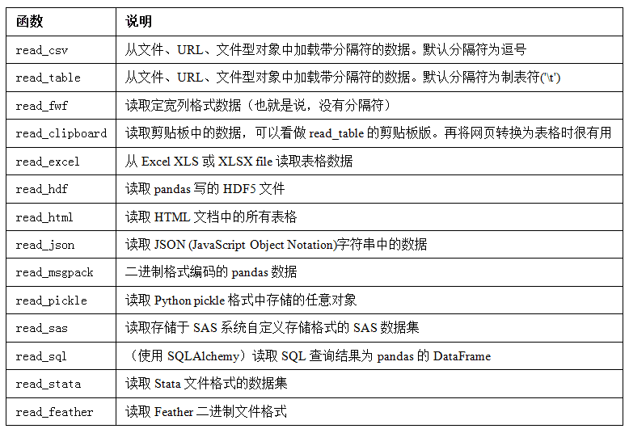
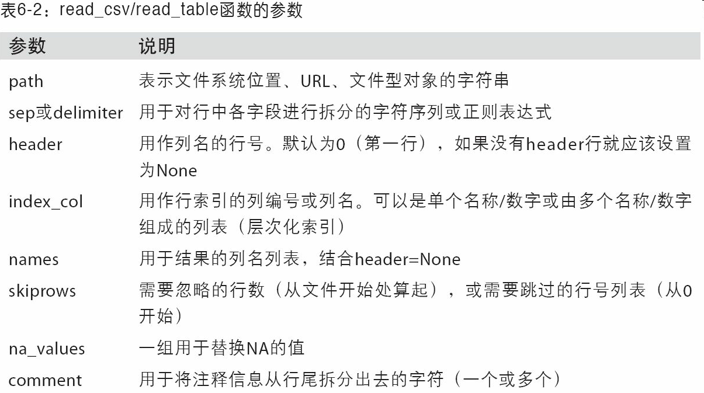

### Numpy

- 速度快
- 可以和c互通

#### ndarray

> NumPy最重要的一个特点就是其N维数组对象（即ndarray），该对象是一个快速而灵活的大数据集容器。你可以利用这种数组对整块数据执行一些数学运算，其语法跟标量元素之间的运算一样。

> ndarray是一个通用的同构数据多维容器，也就是说，其中的所有元素必须是相同类型的。每个数组都有一个shape（一个表示各维度大小的元组）和一个dtype（一个用于说明数组数据类型的对象）

##### 创建ndarray

1. 使用array数组，接受一切序列化对象

   ```python
   In [19]: data1 = [6, 7.5, 8, 0, 1]
   
   In [20]: arr1 = np.array(data1)
   ```

2. 用嵌套序列

2. 使用zeros和ones分别创建指定长度或者形状的全0或全1数组


##### Numpy数组的运算

1. 大小相等的数组之间的运算会运用到元素级
2. 标量运算会作用到每个元素
3. 比较会产生布尔值


##### 切片和索引

> 如上所示，当你将一个标量值赋值给一个切片时（如arr[5:8]=12），该值会自动传播（也就说后面将会讲到的“广播”）到整个选区。跟列表最重要的区别在于，数组切片是原始数组的视图。这意味着数据不会被复制，视图上的任何修改都会直接反映到源数组上。

如果确实需要一份副本而非视图，可以使用`arr[5:8].copy()`


布尔型数组需要用& |来表示和 或

通过布尔型选中的数组中的数据，总是会创建数据的副本，即使一模一样也是


##### 转置和轴对换

转置是重塑的一种特殊形式

返回的是视图

**高维的数组需要由轴编号组成的元组**

```python
In [132]: arr = np.arange(16).reshape((2, 2, 4))

In [133]: arr
Out[133]: 
array([[[ 0,  1,  2,  3],
        [ 4,  5,  6,  7]],
       [[ 8,  9, 10, 11],
        [12, 13, 14, 15]]])

In [134]: arr.transpose((1, 0, 2))
Out[134]: 
array([[[ 0,  1,  2,  3],
        [ 8,  9, 10, 11]],
       [[ 4,  5,  6,  7],
        [12, 13, 14, 15]]])
```

`swapaxes`方法，接受轴编号转置，返回的也是视图


#### 通用函数：快速的元素级数组函数


##### 数组中的三元表达式

##### where

通过ture和数组来做三元判断


###  Pandas

#### 数据结构

#### Series

带索引的一维数组

主要功能：数据对齐，类似数据库中的join


##### DataFrame

> DataFrame是一个表格型的数据结构，它含有一组有序的列，每列可以是不同的值类型（数值、字符串、布尔值等）。DataFrame既有行索引也有列索引，它可以被看做由Series组成的字典（共用同一个索引）。DataFrame中的数据是以一个或多个二维块存放的（而不是列表、字典或别的一维数据结构）。

建表方法：传入一个等长的列表或Numpy数组组成的字典

```python
data = {'state': ['Ohio', 'Ohio', 'Ohio', 'Nevada', 'Nevada', 'Nevada'],
        'year': [2000, 2001, 2002, 2001, 2002, 2003],
        'pop': [1.5, 1.7, 3.6, 2.4, 2.9, 3.2]}
frame = pd.DataFrame(data)
```

#### 基本功能

##### 重新索引

使用reindex将会根据新的索引重排，如果某个索引不存在，则会引入缺失值

对于某些序列，可能需要插值

```python
In [95]: obj3 = pd.Series(['blue', 'purple', 'yellow'], index=[0, 2, 4])

In [96]: obj3
Out[96]: 
0      blue
2    purple
4    yellow
dtype: object

In [97]: obj3.reindex(range(6), method='ffill')
Out[97]: 
0      blue
1      blue
2    purple
3    purple
4    yellow
5    yellow
dtype: object
```


##### 丢弃函数

drop函数

用标签序列会删除行

通过传递`axis=1`或`axis='columns'可以删除列的值`

通过传递`inplace=true`可以就地操作 注意会删除数据


##### DataFrame和Series之间的运算

计算一个二维数组减去一行时，每一行都会执行这个操作。这个就叫做“广播”

如果匹配不到则会重新索引，并用NaN填充


如果想要匹配行且在列上广播，必须使用算数方法

```python
In [179]: frame = pd.DataFrame(np.arange(12.).reshape((4, 3)),
   .....:                      columns=list('bde'),
   .....:                      index=['Utah', 'Ohio', 'Texas', 'Oregon'])
   
In [186]: series3 = frame['d']

In [187]: frame
Out[187]: 
          b     d     e
Utah    0.0   1.0   2.0
Ohio    3.0   4.0   5.0
Texas   6.0   7.0   8.0
Oregon  9.0  10.0  11.0

In [188]: series3
Out[188]: 
Utah       1.0
Ohio       4.0
Texas      7.0
Oregon    10.0
Name: d, dtype: float64

In [189]: frame.sub(series3, axis='index')
Out[189]: 
          b    d    e
Utah   -1.0  0.0  1.0
Ohio   -1.0  0.0  1.0
Texas  -1.0  0.0  1.0
Oregon -1.0  0.0  1.0
```

##### 函数应用以及映射

> NumPy的ufuncs（元素级数组方法）也可用于操作pandas对象

```python
In [192]: np.abs(frame)
Out[192]:
               b         d         e
Utah    0.204708  0.478943  0.519439
Ohio    0.555730  1.965781  1.393406
Texas   0.092908  0.281746  0.769023
Oregon  1.246435  1.007189  1.296221
```

将函数应用到由各列或行所形成的一维数组上。DataFrame的apply方法即可实现此功能

如果传递axis='columns'到apply，这个函数会在每行执行


##### 排序和排名

`obj.sort_index()`默认对行排序

`obj.sort_index(axis=1)`传入axis=1可以对列排序

`frame.sort_index(axis=1, ascending=False)`传入ascending=false降序排序

若要按值对Series进行排序，可使用其`sort_values`方法

对DataFrame排序时，可以希望对其中的一个或者多个列中的值进行排序。将一个或多个列的名字传入sort_values的by即可

```python
frame.sort_values(by='b')
frame.sort_values(by=['a', 'b'])
```

如果想要确定排名关系，可以使用rank函数

```python
obj.rank(method='first')
obj.rank(ascending=False, method='max')
```

排名时用于破坏平级关系的方法


##### 重复索引

！允许重复索引的存在


#### 主要函数


### pandas的数据输入与输出

#### 读写文本格式的数据



这些函数的选项可以划分为以下几个大类：

- 索引：将一个或多个列当做返回的DataFrame处理，以及是否从文件、用户获取列名。
- 类型推断和数据转换：包括用户定义值的转换、和自定义的缺失值标记列表等。
- 日期解析：包括组合功能，比如将分散在多个列中的日期时间信息组合成结果中的单个列。
- 迭代：支持对大文件进行逐块迭代。
- 不规整数据问题：跳过一些行、页脚、注释或其他一些不重要的东西（比如由成千上万个逗号隔开的数值数据）。

选项：

```python
header=None #默认列名
names=['a', 'b', 'c', 'd', 'message'] #自定义列名
pd.read_csv('examples/ex2.csv', names=names, index_col='message') #将message设为行名
index_col=['key1', 'key2'] #多个列组成层次化索引
skiprows=[0, 2, 3] #跳过1，3，4行
```

有些情况下，有些表格可能不是用固定的分隔符去分隔字段的（比如空白符或其它模式）

```python
In [20]: list(open('examples/ex3.txt'))
Out[20]: 
['            A         B         C\n',
 'aaa -0.264438 -1.026059 -0.619500\n',
 'bbb  0.927272  0.302904 -0.032399\n',
 'ccc -0.264273 -0.386314 -0.217601\n',
 'ddd -0.871858 -0.348382  1.100491\n']
```

这种情况下，你可以传递一个正则表达式作为read_table的分隔符。可以用正则表达式表达为\s+

##### 缺失值处理：

##### pandas会用一组经常出现的标记值进行识别，比如NA及NULL：

na_values可以用一个列表或集合的字符串表示缺失值


##### 逐块读取

```python
 pd.options.display.max_rows = 10 #只显示10行
 result = pd.read_csv('examples/ex6.csv')
 
 pd.read_csv('examples/ex6.csv', nrows=5) #只读取5行
```


#### 数据输出到文本格式

```python
data.to_csv(sys.stdout, sep='|') #sep指定分割符，默认为,
na_rep='NULL' #指定空字符串为其他标识符号
#index=False, header=False 指定行列不显示表示
#columns=['a', 'b', 'c'] 也可以重新分配标识
```


#### 二进制数据格式

> 实现数据的高效二进制格式存储最简单的办法之一是使用Python内置的pickle序列化。pandas对象都有一个用于将数据以pickle格式保存到磁盘上的to_pickle方法

> HDF5是一种存储大规模科学数组数据的非常好的文件格式。它可以被作为C标准库，带有许多语言的接口，如Java、Python和MATLAB等。HDF5中的HDF指的是层次型数据格式（hierarchical data format）。每个HDF5文件都含有一个文件系统式的节点结构，它使你能够存储多个数据集并支持元数据。与其他简单格式相比，HDF5支持多种压缩器的即时压缩，还能更高效地存储重复模式数据。对于那些非常大的无法直接放入内存的数据集，HDF5就是不错的选择，因为它可以高效地分块读写。

```python
In [92]: frame = pd.DataFrame({'a': np.random.randn(100)})

In [93]: store = pd.HDFStore('mydata.h5')

In [94]: store['obj1'] = frame

In [95]: store['obj1_col'] = frame['a']
```

HDFStore支持两种存储模式，'fixed'和'table'。后者通常会更慢，但是支持使用特殊语法进行查询操作：

```python
In [98]: store.put('obj2', frame, format='table')

In [99]: store.select('obj2', where=['index >= 10 and index <= 15'])
Out[99]: 
           a
10  1.007189
11 -1.296221
12  0.274992
13  0.228913
14  1.352917
15  0.886429

In [100]: store.close()
```


### 数据清洗和准备

> 在数据分析和建模的过程中，相当多的时间要用在数据准备上：加载、清理、转换以及重塑。这些工作会占到分析师时间的80%或更多。

#### 处理缺失数据

对于Series来说

`dropna()`可以直接删除空项目

对于DataFrame来说

`dropna()`默认清除有nan的行

传入`how='all'`将只丢弃全为nan的行

如果想通过这种方式丢弃列，传入`axis=1`即可

`thresh=n`保证有n列/行的无nan数组


##### 填充缺失数据

`fillna(n)`使用n来填充NaN

如果通过一个字典调用fillna，可以实现对于不同列的不同填充

```python
In [34]: df.fillna({1: 0.5, 2: 0})
Out[34]: 
          0         1         2
0 -0.204708  0.500000  0.000000
1 -0.555730  0.500000  0.000000
2  0.092908  0.500000  0.769023
3  1.246435  0.500000 -1.296221
4  0.274992  0.228913  1.352917
5  0.886429 -2.001637 -0.371843
6  1.669025 -0.438570 -0.539741
```


#### 数据转换

##### 移除重复数据

DataFrame的`duplicated`方法返回一个布尔型Series，表示各行是否是重复行（前面出现过的行）

还有一个与此相关的`drop_duplicates`方法，它会返回一个DataFrame，重复的数组会取消

这两个方法会判断所有列，如果只需要判断某一个列`data.drop_duplicates(['k1'])`

传入`keep='last'`则保留最后一个重复元素，默认是保留第一个


##### 利用函数或映射进行数据转换

通过`map`函数匹配

```python
data['food'].map(lambda x: meat_to_animal[x.lower()])
```

> 使用map是一种实现元素级转换以及其他数据清理工作的便捷方式。


##### 替换值

`replace([-999,-1000],[np.nan,0])`

将不同的值传入，可以针对替换

