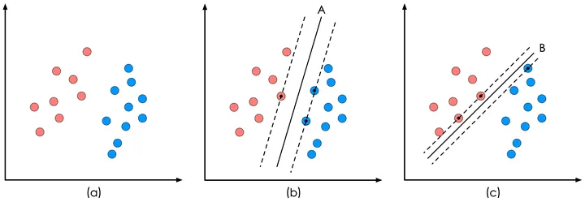
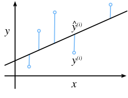
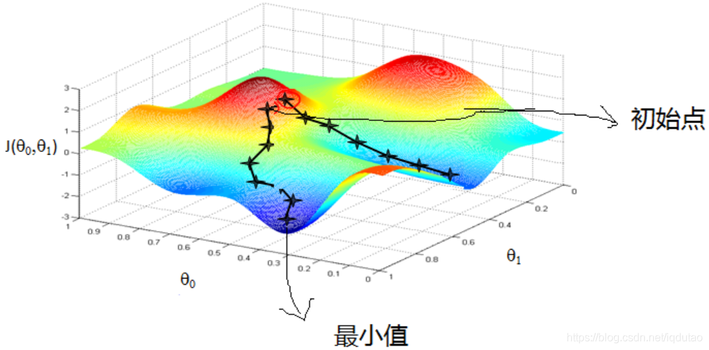
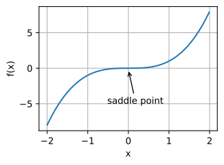
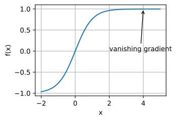

# 机器学习

*机器学习*（machine learning，ML）是一类强大的可以**从经验中学习**的技术。 通常采用观测数据或与环境交互的形式，机器学习算法会积累更多的经验，其性能也会逐步提高。 

*深度学习*（deep learning，DL）的基础知识。 深度学习是一套强大的技术，它可以推动计算机视觉、自然语言处理、医疗保健和基因组学等不同领域的创新。

一个常见的训练过程：


黑盒 and 很多原理的不可解释性


## 预备知识

### 核心组件

无论什么类型的机器学习问题，都会遇到这些核心组件：

1. 可以用来学习的*数据*（data）；
2. 如何转换数据的*模型*（model）；
3. 一个*目标函数*（objective function），用来量化模型的有效性；
4. 调整模型参数以优化目标函数的*算法*（algorithm）。


#### 数据

每个数据集由一个个**样本**组成，大多时候，它们**遵循独立同分布**。 通常每个样本由一组称为**特征**的属性组成。 机器学习模型会根据这些属性进行预测。 在**监督学习**问题中，要预测的是一个特殊的属性，它被称为**标签**

当每个样本的**特征类别数量**都是相同的时候，其特征向量是**固定长度**的，这个长度被称为数据的*维数*。 固定长度的特征向量是一个方便的属性，它可以用来量化学习大量样本。

一般来说，越多正确的数据肯定可以得到更优秀的模型，如果数据太少可能和机器学习差不多；如果数据中充满垃圾，那肯定输出也是垃圾：

- 比如用白皮肤的数据集建立的皮肤癌识别模型去识别黑皮肤。


#### 模型

深度学习与经典方法的区别主要在于：前者关注的功能强大的模型，这些模型由神经网络错综复杂的交织在一起，包含层层数据转换，因此被称为深度学习。


#### 目标函数

目标函数**定义模型的优劣程度**的度量，这个度量在大多数情况是“可优化”的，这被称之为*目标函数*。 我们通常定义一个目标函数，并希望优化它到最低点。 因为越低越好，所以这些函数有时被称为*损失函数*（loss function）。

当任务在试图预测数值时，最常见的损失函数是*平方误差*（squared error），即预测值与实际值之差的平方。

通常，损失函数是根据模型参数定义的，并取决于数据集。 在一个数据集上，我们可以通过最小化总损失来学习模型参数的最佳值。 通常我们会将收集到的数据分为两个部分：

- *训练数据集*：该数据集由一些为训练而收集的样本组成。
- *测试数据集*： 在训练数据上表现良好的模型，并不一定在“新数据集”上有同样的性能，所以需要测试数据集

ex：训练集就像平时模拟考试，测试集就像高考，高考考得好才有用


#### 优化算法

一种能够**搜索出最佳参数，以最小化损失函数**的算法。 深度学习中，大多流行的优化算法通常基于一种基本方法–***梯度下降*（gradient descent）**。 


### 监督学习

*监督学习*擅长在“给定输入特征”的情况下预测标签。

监督学习的学习过程一般可以分为三大步骤：

1. 从已知大量数据样本中随机选取一个子集，为每个样本获取真实标签。有时，这些样本已有标签（例如，患者是否在下一年内康复？）；有时，这些样本可能需要被人工标记（例如，图像分类）。这些**输入和相应的标签**一起构成了训练数据集；
2. 选择有监督的学习算法，它将训练数据集作为输入，并输出一个“已完成学习的模型”；
3. 将之前没有见过的样本特征放到这个“已完成学习的模型”中（测试集），使用模型的输出作为相应标签的预测。


#### 回归

*回归*问题：输出是数值类型

举例：通过各种影响因素预测房价、预测用户对一部电影的评分可以被归类为一个回归问题

#### 分类

分类问题：输出是类别的

分类问题的常见损失函数被称为*交叉熵*（cross-entropy）

举例：从手写数据集中区分0~9（类别问题）、以下图片是否是毒蘑菇（二分类问题）


模型通常给出的是一个概率：比如输入以上蘑菇，分类器可能输出0.8

可以这样理解：分类器90%确定图像描绘的是一只猫


### 无监督学习

监督学习要向模型提供巨大数据集：每个样本包含特征和相应标签值。

相反，如果工作没有十分具体的目标，就需要“自发”地去学习了。 比如，老板可能会给我们一大堆数据，然后要求用它做一些数据科学研究，却没有对结果有要求。 这类数据中不含有“目标”的机器学习问题通常被为*无监督学习*（unsupervised learning）

- *聚类*（clustering）问题：没有标签的情况下，我们是否能给数据分类呢？比如，给定一组照片，我们能把它们分成风景照片、狗、婴儿、猫和山峰的照片吗？同样，给定一组用户的网页浏览记录，我们能否将具有相似行为的用户聚类呢？

- *主成分分析*（principal component analysis）问题：我们能否找到少量的参数来准确地捕捉数据的线性相关属性？比如，一个球的运动轨迹可以用球的速度、直径和质量来描述。再比如，裁缝们已经开发出了一小部分参数，这些参数相当准确地描述了人体的形状，以适应衣服的需要。另一个例子：在欧几里得空间中是否存在一种（任意结构的）对象的表示，使其符号属性能够很好地匹配?这可以用来描述实体及其关系，例如“罗马” − “意大利” + “法国” = “巴黎”。
- *因果关系*（causality）和*概率图模型*（probabilistic graphical models）问题：我们能否描述观察到的许多数据的根本原因？例如，如果我们有关于房价、污染、犯罪、地理位置、教育和工资的人口统计数据，我们能否简单地根据经验数据发现它们之间的关系？
- *生成对抗性网络*（generative adversarial networks）：为我们提供一种合成数据的方法，甚至像图像和音频这样复杂的非结构化数据。潜在的统计机制是检查真实和虚假数据是否相同的测试，它是无监督学习的另一个重要而令人兴奋的领域。


### 强化学习

强化学习的目标是产生一个好的*策略*（policy）。 

模型根据对环境的观察产生一定的动作，将这个动作应用到环境当中，模型从环境中获得*奖励*

举例：AlphaGo

[我用30天写了一个完美的贪吃蛇AI](https://www.bilibili.com/video/BV1ag4y1F7x4)


## 模型评估与选择

### 评估方法

#### 交叉验证法

交叉验证法（Cross Validation，简称CV）是一种统计分析方法，主要用于评估模型的泛化能力，即在未知数据上的表现情况。这种方法通过将原始数据分割成小子集来实现，主要目的是确保模型训练和测试时的数据分布一致，从而避免过拟合问题，并且能更准确地估计模型在新数据上的表现。

交叉验证的基本步骤如下：

1. **数据分割**：将原始数据集分割成$k$个大小相等的子集。常见的分割方法有$k$-折交叉验证、留一交叉验证（LOOCV）等。
   
2. **模型训练与验证**：依次选取其中一个子集作为验证集，剩余的$k-1$个子集合并后作为训练集。在这个训练集上训练模型，然后在验证集上评估模型性能。
   
3. **结果汇总**：重复上述过程，直到每个子集都被用作过验证集一次。最后，将每一次的模型性能评估结果汇总，计算平均值，作为模型最终的评估指标。

##### 常见的交叉验证方法

- **$k$-折交叉验证**：将数据集等分为$k$个子集，每次留出一个子集作为测试集，其他$k-1$个子集作为训练集。重复$k$次，每次选择不同的子集作为测试集，然后将$k$次的测试结果平均作为模型的性能指标。
  
- **留一交叉验证（LOOCV）**：当$k$等于样本总数时，即每次留出一个样本作为测试集，其余样本作为训练集。适用于样本量较小的情况。

- **分层$k$-折交叉验证**：在分类问题中，为了保持训练集和测试集中各类别样本的比例一致，采用分层采样的方式进行$k$-折交叉验证。

交叉验证法通过在不同的训练集和测试集上评估模型性能，能够有效减少模型评估结果的偶然性，从而更加准确地估计模型在实际应用中的表现。


## 决策树

### 划分方法

决策树学习的关键在于划分算法

#### 信息熵

**信息熵**是衡量信息随机性或不确定性的度量。它由克劳德·香农在1948年引入，作为信息的平均信息量的度量。在数学上，对于一个离散随机变量 $X$，其信息熵（Entropy）定义为：
$$
H(X) = -\sum_{i=1}^{n} p(x_i) \log_b p(x_i)
$$
$p(x_i)$ ：随机变量 $X$ 取某个值 $x_i$ 的概率，和式遍历 $X$ 的所有可能值

$b$ ：对数的底，常见的选择是 2（此时单位是比特），用对数是因为对数函数能够量化事件发生概率的倒数与其所携带信息量之间的关系：不太可能发生的事件（低概率）提供了更多的信息，而常见的事件（高概率）提供的信息较少。

信息熵的直观含义是：**从信息源接收到的每条消息平均包含的信息量。高熵表示系统有较高的不确定性，低熵则表示系统较为确定。**

#### 信息增益

**信息增益**是决策树中用来选择特征的一个标准，它衡量的是在一个特征基础上对数据集分类前后不确定性的减少量。具体而言，信息增益基于熵的概念来定义。

具体来说，如果数据集 $D$ 的原始熵是$H(D) $，我们按照特征 $ A $ 的不同取值将 $ D $ 分割为几个子集 $ D_1, D_2, \ldots, D_n $，那么特征 $ A $ 对数据集 $ D $ 的信息增益 $ IG(D, A)$ 定义为：

$$
IG(D, A) = H(D) - \sum_{i=1}^{n} \left( \frac{|D_i|}{|D|} \times H(D_i) \right)
$$
这里，$ H(D)$ 是数据集 $ D $ 的熵，$ \frac{|D_i|}{|D|} $ 是第 $ i $ 个子集的大小与原始数据集大小的比例，$ H(D_i) $ 是第 $ i $ 个子集的熵。信息增益越大，意味着特征 $ A $ 越能有效地对数据集 $ D $ 进行分类。在构造决策树时，我们会选择信息增益最大的特征来进行分割。在实际应用中，我们会计算每个特征的信息增益，并选择信息增益最大的特征来进行节点的分割。这个过程会一直重复，直到满足特定的停止条件，如所有的特征都已被用完，或者每个叶子节点的数据都属于同一类别。

缺点：倾向于选择取值较多的特征。例如，如果一个特征是一个唯一标识符（如ID号），那么按照这个特征分割将会得到很多个分割后的子集，每个子集只包含一个数据实例，这样的分割能够完美地分类训练数据，但这显然没有提供任何泛化能力。

#### 增益率

C4.5算法引入了增益率（Gain Ratio）的概念来解决这个问题。

增益率的定义如下：首先，我们仍然计算特征$A $的信息增益$IG(D, A)$，和前面信息增益的定义一样。但在C4.5中，我们还要计算特征$A$的“固有值”（Intrinsic Value），这个值衡量了特征$A$的分支数目（也就是$A$可以取的不同值的数量）对数据集$D$的分割所带来的“信息量”。

特征$A $的固有值$IV(A)$定义为：

$$
IV(A) = -\sum_{i=1}^{n} \left( \frac{|D_i|}{|D|} \log_2 \frac{|D_i|}{|D|} \right)
$$
这里，$ |D_i|/|D|$ 表示特征$A$的第$i$个值在数据集中的占比。

然后，特征$A$的增益率 $GR(D, A)$ 定义为其信息增益和固有值的比值：

$$
GR(D, A) = \frac{IG(D, A)}{IV(A)}
$$
在C4.5决策树算法中，不是直接选择信息增益最高的特征，而是选择增益率最高的特征进行分割。这样做的目的是减少对于取值数目多的特征的偏好，希望能够选出更具有区分性且不会导致过度拟合的特征。

当固有值很小（即特征的分支数目很少）时，增益率可能会变得非常高，这可能会导致其自身的一种偏差。因此，在C4.5中，通常会先从候选特征中挑选出信息增益高于平均水平的特征，然后在这些特征中选择增益率最高的。

#### 基尼指数

CART（Classification And Regression Trees）模型中的基尼系数（Gini index）是衡量数据集分割纯度的一种指标，主要用于分类问题。基尼系数反映了从数据集中随机选择两个样本，其类别标签不一致的概率。基尼系数越小，数据集的纯度越高。

对于给定的数据集 $D$，其基尼系数定义如下：

$$
Gini(D) = 1 - \sum_{i=1}^{m} p_i^2
$$
这里，$m$ 表示类别的总数，$p_i$ 是数据集 $D$ 中属于第 $i$ 类的样本所占的比例。

当我们使用一个特征 $A$ 和它的某个值来分割数据集 $D$ 时，可以得到两个子集 $D_1$ 和 $D_2$。此时，特征 $A$ 在该值下的基尼系数可以表示为：

$$ Gini_{split}(D, A) = \frac{|D_1|}{|D|} Gini(D_1) + \frac{|D_2|}{|D|} Gini(D_2) $$

这里，$|D_1|$ 和 $|D_2|$ 分别是子集 $D_1$ 和 $D_2$ 的样本数量，$|D|$ 是原始数据集 $D$ 的样本数量。$Gini(D_1)$ 和 $Gini(D_2)$ 分别表示子集 $D_1$ 和 $D_2$ 的基尼系数。

在CART模型的构建过程中，会遍历所有可能的特征及其分割点来计算 $Gini_{split}(D, A)$，并选择使得基尼系数最小化的特征和分割点进行分割，这样递归地构建决策树，直到满足特定的停止条件。

### 剪枝处理

主动去掉一些分支来降低过拟合的风险

#### 预剪枝：

- **操作方式**：在决策树构建过程中，对每个节点在划分之前先进行评估。如果当前节点的划分不能带来决策树泛化能力的提升，则停止划分并将当前节点标记为叶节点。
- **评估标准**：可以基于不同的标准进行评估，如信息增益的提升不足、验证集上的误差减少不明显等。
- **优点**：可以减少决策树的复杂度，缩短训练时间。
- **缺点**：可能因为评估过于保守而导致模型欠拟合，即在训练阶段过早地停止了树的增长。

#### 后剪枝：

- **操作方式**：首先构建决策树直到每个叶节点都是纯的或达到最小样本数限制，然后自底向上地对树中的非叶节点进行考察，评估去除（或替换为叶节点）某个节点是否能提高决策树的泛化能力。
- **评估标准**：通常基于模型在验证集上的表现来进行评估，如通过交叉验证来测试剪枝后模型的性能。
- **优点**：由于是在完全生长的树上进行剪枝，通常能得到更优的模型泛化能力。
- **缺点**：相较于预剪枝，后剪枝需要更多的计算资源和时间，因为它首先需要构建一个完整的决策树。


### 连续与缺失

#### 连续值处理

1. **排序和选择切分点**：首先，将训练集中的所有连续特征值排序，然后考虑每两个相邻值的中点作为可能的切分点。
2. **计算信息增益或基尼系数**：对每一个可能的切分点，按照该点将数据集分为两部分，并计算这种切分的信息增益（对于ID3或C4.5决策树）或基尼系数（对于CART决策树）。
3. **选择最优切分点**：选择能够带来最大信息增益或最小基尼系数的切分点，用这个点将连续特征转换为两个类别（小于等于切分点和大于切分点）。
4. 如果一个变量是连续值，那么在子树中仍然可以使用该变量作为分割点

#### 缺失值处理

在每个节点处，如果一个样本在切分特征上的值缺失，该样本会被分配到所有子节点中，但是会根据子节点样本量的比例进行加权。例如，如果某个节点根据特征A分为两个子节点，其中70%的样本分到了左子节点，那么缺失特征A值的样本也会按照这个比例分配到两个子节点中，并在计算信息增益（或基尼系数）时相应地调整权重。

### 多变量决策树


## SVM

支持向量机（Support Vector Machine）主要用于解决模式识别领域中的数据分类问题，属于有监督学习算法的一种。

SVM要解决的问题可以用一个经典的二分类问题加以描述，黑色实线为分界线，术语称为“决策面”。虽然在目前的数据上看，这两个分类器的分类结果是一样的，但如果考虑潜在的其他数据，则两者的分类性能是有差别的。



SVM算法认为图1中的分类器A在性能上优于分类器B，其依据是A的分类间隔比B要大。

> 分类间隔：在保证决策面方向不变且不会出现错分样本的情况下移动决策面，会在原来的决策面两侧找到两个极限位置（越过该位置就会产生错分现象），**如虚线所示**。虚线的位置由决策面的方向和距离原决策面最近的几个样本的位置决定。而这两条平行虚线正中间的分界线就是在保持当前决策面方向不变的前提下的最优决策面。两条虚线之间的垂直距离就是这个最优决策面对应的分类间隔。
>
> 支持向量：那个具有“最大间隔”的决策面就是SVM要寻找的最优解。而这个真正的最优解对应的两侧虚线所穿过的样本点，就是SVM中的支持样本点，称为“支持向量”。


### 问题基本定义

假设有训练数据集 $\{(\mathbf{x}_1, y_1), (\mathbf{x}_2, y_2), ..., (\mathbf{x}_n, y_n)\}$，其中 $\mathbf{x}_i \in \mathbb{R}^p$ 是特征向量，$y_i \in \{-1, 1\}$ 是对应的类别标签。我们的目标是找到一个超平面 $\mathbf{w} \cdot \mathbf{x} + b = 0$，其中 $\mathbf{w}$ 是权重向量，$b$ 是偏置项，使得两个类别的间隔最大化。

#### 1. 间隔定义

首先，对于任何在该超平面上正确分类的数据点，应满足：

$$
y_i(\mathbf{w} \cdot \mathbf{x}_i + b) \geq 1, \quad \text{for all } i = 1, \ldots, n
$$

这里满足大于1而不是其他数的原因在于模型的标准化和便利性，若超平面能够将数据级划分，那么就存在放缩定理使得这个公式被满足。

此时，间隔（margin）定义为到最近数据点的距离的两倍，即 $\frac{2}{\|\mathbf{w}\|}$。

#### 2. 目标函数和约束

为了最大化间隔，等价于最小化 $\frac{1}{2}\|\mathbf{w}\|^2$。因此，问题可以表述为一个优化问题：

$$
\begin{align*}
\text{minimize:} \quad & \frac{1}{2}\|\mathbf{w}\|^2 \\
\text{subject to:} \quad & y_i(\mathbf{w} \cdot \mathbf{x}_i + b) - 1 \geq 0, \quad i = 1, \ldots, n
\end{align*}
$$

### 对偶问题

通过拉格朗日乘子法，我们引入拉格朗日乘子 $\alpha_i \geq 0$，构造拉格朗日函数：

$$
L(\mathbf{w}, b, \boldsymbol{\alpha}) = \frac{1}{2}\|\mathbf{w}\|^2 - \sum_{i=1}^{n}\alpha_i \left[y_i(\mathbf{w} \cdot \mathbf{x}_i + b) - 1\right]
$$

####  求解对偶问题

求解 $L(\mathbf{w}, b, \boldsymbol{\alpha})$ 对 $\mathbf{w}$ 和 $b$ 的偏导并令其等于零，可以得到：

$$
\mathbf{w} = \sum_{i=1}^{n}\alpha_i y_i \mathbf{x}_i
$$

$$
\sum_{i=1}^{n}\alpha_i y_i = 0
$$

将 $\mathbf{w}$ 的表达式代入拉格朗日函数 $L$，可以得到对偶问题，其目标是最大化：

$$
\sum_{i=1}^{n}\alpha_i - \frac{1}{2}\sum_{i,j=1}^{n}\alpha_i \alpha_j y_i y_j \mathbf{x}_i \cdot \mathbf{x}_j
$$

#### 求解 $\alpha_i$

通过求解对偶问题得到的 $\alpha_i$，我们可以找到最优的权重向量 $\mathbf{w}$ 和偏置 $b$。然后使用非零的 $\alpha_i$ 对应的数据点（支持向量）来计算 $b$。

#### 6. 决策函数

最终，模型的决策函数可以表达为：

$$
f(\mathbf{x}) = \text{sign}\left(\sum_{i=1}^{n}\alpha_i y_i (\mathbf{x}_i \cdot \mathbf{x}) + b\right)
$$

这样，通过优化过程，SVM找到了能够最大化两个类别间隔的最优超平面，用于分类。

### 线性SVM算法的数学建模

决策面方程，目前只考虑二维平面中的一根直线$$y=ax+b$$

转换之后可以写成一个更加通用的形式
$$
\omega x+\gamma = 0
$$

#### 约束条件

1. 并不是所有的方向都存在能够实现100%正确分类的决策面，我们如何判断一条直线是否能够将所有的样本点都正确分类？
2. 即便找到了正确的决策面方向，还要注意决策面的位置应该在间隔区域的中轴线上，所以用来确定决策面位置的截距$$\gamma$$也不能自由的优化，而是受到决策面方向和样本点分布的约束。
3. 即便取到了合适的方向和截距，x不是随随便便的一个样本点，而是支持向量对应的样本点。对于一个给定的决策面，我们该如何找到对应的支持向量？


#### 线性SVM优化问题基本描述

里面$$\omega^Tx_i+\gamma=1 or −1$$的情况什么时候会发生呢，只有当$$x_i$$是决策面$$\omega^Tx_i+\gamma=0$$所对应的支持向量样本点时，等于1或-1的情况才会出现。这一点给了我们另一个简化目标函数的启发。所以对于这些支持向量样本点有：
$$
d=\frac{|\omega^Tx_i+\gamma|}{||\omega||}=\frac{1}{||\omega||} \quad 如果x_i是一个支持向量点
$$
原来的任务：找到一组参数$$\omega和\gamma$$使得分类间隔最小

现在任务：使得$$||\omega||$$最小，也就等效于使得$$\frac 1 2 ||\omega||^2$$

我们之所以要在上加上平方和1/2的系数，是为了以后进行最优化的过程中对目标函数求导时比较方便，但这绝不影响最优化问题最后的解。


此外由上面式子还可以推出：
$$
y_i(\omega^Tx_i+\gamma) \ge1
$$
到这个地方我们已经得出了SVM最优化问题的数学描述了：
$$
\min_{\omega,\gamma}\frac 1 2 ||\omega||^2 \\ y_i(\omega^T+x_i+\gamma) \ge1, \quad i=1,2,\dots,m
$$


### 核函数

#### 通俗理解


观察这个图片，可以得出结论：**我们无论如何也不能找到一个直线将这两类分开**

那如果我们把上面的数据映射到更高的维度当中，上图是二维的图像，我们把它映射到三维当中，就可以使用一个平面将样本区分开了。也就是说**通过一个映射函数，将样本从n维映射到n+1或者更高的维度**，使得原本线性不可分的数据变成线性可分，这样我们就解决了一些原本不能解决的问题。

> 核函数是一系列函数的统称，这些函数的输入是样本x，输出是一个映射到更高维度的样本$$x_t$$。

这里有一个小问题，我们前面说了函数$$\Phi(x)$$会把x映射到更高的维度。比如x本身是10维的，我们用了函数之后给映射到1000维了，当然它的线性不可分的问题可能解决了，但是这会带来另外一个问题，就是**计算的复杂度增加了**。计算次数也增加了100倍。所以我们对核函数做了一些限制，**只有可以白嫖的映射函数才被称为核函数**。即应该满足：
$$
\Phi(x_i^Tx_j)=\Phi(x_i)^T\Phi(x_j)
$$


常见核函数如下

1. 线性核函数，其实就是没有核函数。$$K(x_i,x_j)=x_i^Tx_j$$
2. 多项式核函数，它等价于一个多项式变换：$$K(x_i,x_j)=(\gamma x_i^Tx_j+b)^d$$，这里的�，b和d都是我们设置的参数
3. 高斯核，这种核函数使用频率很高，$$K(x_i,x_j)=exp(-\gamma ||x_i-x_j||^2)$$
4. sigmoid核，它的公式是：$$K(x_i,x_j)=\tanh(\gamma x_i^Tx_j+b)$$


# 深度学习

## 深度学习的历史和发展

*神经网络*（neural networks）的得名源于生物灵感。 一个多世纪以来，研究人员一直试图组装类似于相互作用的神经元网络的计算电路。 随着时间的推移，对生物学的解释变得不再肤浅，但这个名字仍然存在。 其核心是当今大多数网络中都可以找到的几个关键原则：

- 线性和非线性处理单元的交替，通常称为*层*（layers）；
- 使用链式规则（也称为*反向传播*（backpropagation））一次性调整网络中的全部参数。


深度学习的提出其实非常早，比如现在深度学习中一些中流砥柱的模型：如多层感知机 ([McCulloch and Pitts, 1943](https://zh-v2.d2l.ai/chapter_references/zreferences.html#id106)) 、卷积神经网络 ([LeCun *et al.*, 1998](https://zh-v2.d2l.ai/chapter_references/zreferences.html#id90)) 、长短期记忆网络 ([Graves and Schmidhuber, 2005](https://zh-v2.d2l.ai/chapter_references/zreferences.html#id51)) 和Q学习 ([Watkins and Dayan, 1992](https://zh-v2.d2l.ai/chapter_references/zreferences.html#id179)) ，在相对休眠了相当长一段时间之后，在过去十年中被“重新发现”。


为什么最近十几年深度学习才重新“热门”：

- 网络和图像传感器的发展使得数据的获取变得廉价：大量图片、视频和用户数据信息使得大规模数据集变得触手可及；
- 运算设备的算力发展，GPU的普及，使大规模算力唾手可得。
- 深度学习框架在传播思想方面发挥了至关重要的作用。目前最常用的框架是PyTorch和tensorflow； 例如，在2014年，对卡内基梅隆大学机器学习博士生来说，训练线性回归模型曾经是一个不容易的作业问题。 而现在，这项任务只需不到10行代码就能完成。


## 线性神经网络

### 基本模型

#### 线性回归

假设自变量$x$和因变量$y$之间的关系是线性的， 即$y$可以表示为$x$中元素的加权和，这里通常允许包含观测值的一些噪声； 其次，我们假设任何噪声都比较正常，如噪声遵循正态分布。

举一个实际的例子： 我们希望根据**房屋的面积（平方英尺）和房龄（年）**来估算**房屋价格（美元）**。 为了开发一个能预测房价的模型，我们需要收集一个真实的数据集。 这个数据集包括了房屋的销售价格、面积和房龄。 在每行数据（比如一次房屋交易相对应的数据）称为*样本*（sample）。 我们把试图预测的目标（比如预测房屋价格）称为*标签*（label）。

线性回归假设目标可以表示为特征的线性组合：
$$
\mathrm{price} = w_{\mathrm{area}} \cdot \mathrm{area} + w_{\mathrm{age}} \cdot \mathrm{age} + b.
$$
我们的目标是寻找模型的权重$w$和偏置$b$， 使得根据模型做出的预测大体符合数据里的真实价格

而在机器学习领域，我们通常使用的是高维数据集，建模时采用线性代数表示法会比较方便。 当我们的输入包含d个特征时，我们将预测结果$$\hat{y}$$表示为：

$$
\hat{y} = w_1  x_1 + ... + w_d  x_d + b.
$$
在开始寻找最好的*模型参数*$w$和$b$之前， 我们还需要两个东西： （1）一种模型质量的**度量方式（损失函数）**； （2）一种能够更新模型以**提高模型预测质量**的方法。


#### 损失函数

*损失函数*（loss function）能够量化目标的 ***实际值* 与 *预测值*** 之间的差距。 通常我们会选择非负数作为损失，且数值越小表示损失越小，完美预测时的损失为0。 **回归问题**中最常用的损失函数是平方误差函数。
$$
l^{(i)}(\mathbf{w}, b) = \frac{1}{2} \left(\hat{y}^{(i)} - y^{(i)}\right)^2.
$$
$$\frac{1}{2}$$并不会带来本质上的区别，只是为了求导简单

**均方误差不能用于分类**



我们需要计算在训练集n个样本上的损失均值：
$$
L(\mathbf{w}, b) =\frac{1}{n}\sum_{i=1}^n l^{(i)}(\mathbf{w}, b) =\frac{1}{n} \sum_{i=1}^n \frac{1}{2}\left(\mathbf{w}^\top \mathbf{x}^{(i)} + b - y^{(i)}\right)^2.
$$


#### 从线性回归到深度网络

到目前为止，我们只谈论了线性模型。 尽管神经网络涵盖了更多更为丰富的模型，我们依然可以用描述神经网络的方式来描述线性模型， 从而把线性模型看作一个神经网络。 首先，我们用“层”符号来重写这个模型。


- 该图只显示连接模式，即只显示每个输入如何连接到输出，隐去了权重和偏置的值
- 输入为$x_1, \ldots, x_d$，因此输入层中的*输入数*（或称为*特征维度*）为d
- 输出维度为1
- 由于神经网络主要考虑的是计算，所以一般输入层不算入层数
- 我们可以将线性回归模型视为仅由单个人工神经元组成的神经网络，或称为单层神经网络
- 对于这种输入和输出的每个节点都相连的层，我们一般称为全连接层或稠密层，后面会详细讨论如何由这些层组成的网络


### softmax回归

当我们做分类问题的时候，我们需要将输出的概率（连续）得到我们认为的类别（离散）

#### 分类问题的标签设置

- 如果类别间有一些自然顺序， 比如说我们试图预测${婴儿,儿童,青少年,青年人,中年人,老年人}$， 那么将这个问题转变为**回归问题**，并且保留标签分别为1，2，3，...是有意义的

- 但是大多数分类都没有自然顺序，假设对于图像分类，我们有**猫、狗和鸡三类**

- 统计学家很早以前就发明了一种表示分类数据的简单方法：*独热编码*（one-hot encoding）
  -  在我们的例子中，标签$y$将是一个三维向量， 其中(1,0,0)对应于“猫”、(0,1,0)对应于“鸡”、(0,0,1)对应于“狗”：


#### 网络架构

依然假设是分类**猫、狗和鸡**问题，我们需要分别计算这张图片可能是猫狗鸡的概率，所以我们要算三个概率

我们需要一个有多个输出的模型，每个类别对应一个输出

假设我们的图片只有四个像素$x_1到x_4$


与线性回归一样，softmax回归也是一个单层神经网络，softmax回归的输出层也是全连接层。
$$
\begin{split}\begin{aligned}
o_1 &= x_1 w_{11} + x_2 w_{12} + x_3 w_{13} + x_4 w_{14} + b_1,\\
o_2 &= x_1 w_{21} + x_2 w_{22} + x_3 w_{23} + x_4 w_{24} + b_2,\\
o_3 &= x_1 w_{31} + x_2 w_{32} + x_3 w_{33} + x_4 w_{34} + b_3.
\end{aligned}\end{split}
$$


#### softmax运算

现在经过上面三个公式（等于是三个单独的线性回归）的计算，我们已经得到了三个数；为了得到最后预测结果是啥，我们选择最大概率的标签为预测结果。

假设输出为0.1，0.8，0.1，那么我们预测的类别就是2（鸡）

我们能否直接使用单个线性回归的结果作为这个输出呢，显然是否定的！输入可能为负，也可能大于1


那我们需要规范化输出，让模型给出的对应标签的数值，就是这个标签的概率，所以需要找到一个函数满足以下要求：

1. 非负
2. 所有标签结果的和为1

现在常用的就是softmax函数：

把输入映射为0-1之间的实数，并且归一化保证和为1，因此多分类的概率也为1

$$
\hat{\mathbf{y}} = \mathrm{softmax}(\mathbf{o})\quad \text{其中}\quad \hat{y}_j = \frac{\exp(o_j)}{\sum_k \exp(o_k)}
$$
虽然softmax是一个非线性函数，但由于输出依然由输入特征的放射变换组成，因此softmax回归仍然是一个线性模型，运算不会改变预测o之间的大小顺序，只会确定分配给每个类别的概率


#### 损失函数

如何定义分类问题的损失函数？均方误差肯定不行

我们需要找到一个函数去分析这个模型预测正确的比例

softmax函数给出了一个向量$\hat{\mathbf{y}}$， 我们可以将其视为“对给定任意输入x的每个类的条件概率”

$P(y=\text{猫} \mid \mathbf{x})$指的是输入为$x$的时候，输出为猫的概率；

我们可以表示出对于每个数据$x$预测正确的概率：$P(\mathbf{y}^{(i)} \mid \mathbf{x}^{(i)})$

那对于整个数据集的预测正确的概率就是将每个样本预测正确的概率相乘：
$$
P(\mathbf{Y} \mid \mathbf{X}) = \prod_{i=1}^n P(\mathbf{y}^{(i)} \mid \mathbf{x}^{(i)}).
$$
我们最大化$P(\mathbf{Y} \mid \mathbf{X})$，相当于最小化负对数似然：
$$
-\log P(\mathbf{Y} \mid \mathbf{X}) = \sum_{i=1}^n -\log P(\mathbf{y}^{(i)} \mid \mathbf{x}^{(i)})
= \sum_{i=1}^n l(\mathbf{y}^{(i)}, \hat{\mathbf{y}}^{(i)}),
$$
损失函数定义为：
$$
l(\mathbf{y}, \hat{\mathbf{y}}) = - \sum_{j=1}^q y_j \log \hat{y}_j.
$$
所有预测正确项的积，然后对其求负对数，相乘一定是小于1的数，求负对数一定大于0

这种方法被称为交叉熵损失


## 常见数据集

有一些标准数据集可以用于评估一个模型的好坏，一个标准数据集是需要经过严格的测试才可以成为的

比如pytorch框架提供的数据集有：

用于image classification：

手写字符识别：EMNIST、**MNIST**、QMNIST、USPS、SVHN、KMNIST、Omniglot

实物分类：**Fashion MNIST**、CIFAR、LSUN、SLT-10、ImageNet

人脸识别：CelebA

场景分类：LSUN、Places365

用于object detection：SVHN、VOCDetection、**COCODetection**

用于semantic/instance segmentation：

语义分割：Cityscapes、VOCSegmentation

语义边界：SBD

用于image captioning：Flickr、COCOCaption

用于video classification：HMDB51、Kinetics

用于3D reconstruction：PhotoTour

用于shadow detectors：SBU


## 梯度下降

不是所有的模型的损失函数都能够求解析解，而**梯度下降方法几乎可以优化所有的深度学习模型**，梯度下降是深度学习的本质

### 梯度下降的基本思想



每走一段路，测出最抖得方向，然后接着走。

它通过不断地在损失函数递减的方向上更新参数来降低误差。

确定优化目标


机器学习的目标是找到使得损失函数最小化的参数，找到这个点的过程就是梯度下降

直觉告诉我们，沿着陡峭最大的方向走，就能更快找到最低点


### 走多快？

- 固定一个数值
- 按照梯度大小
- 按照梯度大小乘上一个很小系数

这个系数被称为学习率

$新w=旧w-斜率\times学习率$


重复计算梯度和按照学习率方向前进，这就是所谓的梯度下降法

### 实际情况

上面描述的损失函数仅仅只是最简单的一个理想情况，实际情况是目标函数通常有许多局部最优解，我们的目标是找到全局最优点而不是局部最优点，但是这往往很难做到，现在的算法也大多是在优化计算梯度方法和动态控制学习率大小


### 深度学习中的优化挑战

- 训练集的最低损失可能和所有数据的最低损失不同


- 局部最小点

- 鞍点

  *鞍点*（saddle point）是指函数的所有梯度都消失但既不是全局最小值也不是局部最小值的任何位置。考虑这个函数$$f(x) = x^3$$。它的一阶和二阶导数$$x=0$$在时消失。这时优化可能会停止，尽管它不是最小值。

  对于高维度问题，*部分*特征值为负的可能性相当高。这使得鞍点比局部最小值更有可能出现。



- 梯度消失

  开始训练时梯度就接近0，因此训练会停滞很长一段时间，重参数化通常会有所帮助。对参数进行良好的初始化也可能是有益的。



如果找不到全局最优解其实也没关系，局部最优解或者近似解也能用。


### 不同的优化算法

批量随机梯度下降

随机梯度下降

小批量随机梯度下降

AdaGrad-动态学习率

RMSProp-优化动态学习率

AdaDelta-无需设置学习率

Adam-融合RMSProp和AdaDelta


为了增加速度，我们每次选取固定数量的样本（batch），然后，我们计算小批量的平均损失关于模型参数的导数

> 算法的步骤如下： 
>
> （1）初始化模型参数的值，如随机初始化； 
>
> （2）从数据集中随机抽取小批量样本且在负梯度的方向上更新参数，并不断迭代这一步骤。

$$
\begin{split}\begin{aligned} \mathbf{w} &\leftarrow \mathbf{w} -   \frac{\eta}{|\mathcal{B}|} \sum_{i \in \mathcal{B}} \partial_{\mathbf{w}} l^{(i)}(\mathbf{w}, b) = \mathbf{w} - \frac{\eta}{|\mathcal{B}|} \sum_{i \in \mathcal{B}} \mathbf{x}^{(i)} \left(\mathbf{w}^\top \mathbf{x}^{(i)} + b - y^{(i)}\right),\\ b &\leftarrow b -  \frac{\eta}{|\mathcal{B}|} \sum_{i \in \mathcal{B}} \partial_b l^{(i)}(\mathbf{w}, b)  = b - \frac{\eta}{|\mathcal{B}|} \sum_{i \in \mathcal{B}} \left(\mathbf{w}^\top \mathbf{x}^{(i)} + b - y^{(i)}\right). \end{aligned}\end{split}
$$

 |B|表示每个小批量中的样本数，这也称为*批量大小*（batch size）。 $$\eta$$表示*学习率*（learning rate）。 批量大小和学习率的值通常是手动预先指定，而不是通过模型训练得到的。 这些可以调整但不在训练过程中更新的参数称为*超参数*（hyperparameter）。 *调参*（hyperparameter tuning）是**选择超参数**的过程。 超参数通常是我们根据训练迭代结果来调整的， 而训练迭代结果是在独立的*验证数据集*（validation dataset）上评估得到的。


## 激活函数

*激活函数* 判断一个神经元是否应该被激活（类似于神经细胞接收到足够的刺激，释放化学物质），从而将信号传递给下一层。

作用：

1. **非线性引入**：激活函数引入非线性因素，使得神经网络可以学习并执行更为复杂的任务。没有非线性，多层神经网络就仅相当于一个线性回归模型，无法处理复杂的数据模式。
2. **控制信号传递**：通过激活函数，神经网络能够控制在何种条件下信号应该继续传递给网络的下一层。这种控制是通过激活函数的阈值来实现的。
3. **帮助梯度下降**：在训练过程中，激活函数的导数（或梯度）对于网络的参数更新至关重要。它影响了梯度下降优化算法如何调整权重和偏置。

目前最**受欢迎**的激活函数系列：ReLU(*修正线性单元*（Rectified linear unit，*ReLU* )）
$$
\operatorname{ReLU}(x) = \max(x, 0).
$$


why：简单好用，效果好

当输入为负时，ReLU函数的导数为0，而当输入为正时，ReLU函数的导数为1。注意，当输入值精确等于0时，ReLU函数不可导。在此时，我们默认使用左侧的导数，即当输入为0时导数为0。但我们可以忽略这个问题，在工程实际中，几乎是永远不可能为0的

导数图：


减轻了梯度消失的问题


**sigmoid**

*sigmoid函数*将输入变换为区间(0, 1)上的输出。 因此，sigmoid通常称为*挤压函数*（squashing function）： 它将范围（-inf, inf）中的任意输入压缩到区间（0, 1）中的某个值：
$$
\operatorname{sigmoid}(x) = \frac{1}{1 + \exp(-x)}.
$$


`RuLU`提出以前最常用的激活函数，现在已经逐渐被取代


## 损失函数

损失函数在机器学习和深度学习中用来衡量模型的预测结果与真实值之间的不一致程度，它是一个至关重要的组成部分，因为优化模型的训练过程就是通过最小化损失函数来实现的。损失函数的选择直接影响到算法的性能和输出结果的质量。

**常见的损失函数包括：**

1. **均方误差损失（Mean Squared Error, MSE）**：
   - 用于回归任务。
   - 计算方式为预测值与实际值差的平方的平均值。
2. **交叉熵损失（Cross-Entropy Loss）**：
   - 用于分类任务。
   - 对于二分类问题，称为二元交叉熵（Binary Cross-Entropy）。
   - 对于多分类问题，称为多类交叉熵（Categorical Cross-Entropy）。
   - 计算方式涉及实际分类的对数概率。
3. **绝对误差损失（Mean Absolute Error, MAE）**：
   - 用于回归任务。
   - 计算方式为预测值与实际值差的绝对值的平均。
4. **Hinge Loss**：
   - 常用于支持向量机（SVM）中。
   - 适合于“最大间隔”分类。


损失函数作用：

1. **提高优化指标**：损失函数提供了一个衡量标准，可以量化模型的表现好坏。
2. **反向传播**：在神经网络中，损失函数的梯度用于通过反向传播算法更新网络的权重，以最小化损失。
3. **模型调整**：通过调整模型的参数以最小化损失函数的值，从而使模型预测更加准确。


## 多层感知机

在上面的线性神经网络中我们了解很多深度学习的概念，那现在我们要深入对于深度神经网络的探索


### 隐藏层

在线性网络中我们描述了**仿射变换**，这是一种线性变换，然后使用softmax函数规范输出，如果我们的输入输出满足线性关系，那么这样就足够了，但是**线性**是一个很强的假设；线性模型是很容易出错的，因为我们无法保证线性相关的关系

举例：

1. 我们尝试预测一个人是否会还贷，我们可以认为，在其他条件不变的情况下， 收入较高的申请人比收入较低的申请人更有可能偿还贷款。 但是，虽然收入与还款概率存在单调性，但它们不是线性相关的。 收入从0增加到5万，可能比从100万增加到105万带来更大的还款可能性。
2. 我们想要根据体温预测死亡率。 对体温高于37摄氏度的人来说，温度越高风险越大。 然而，对体温低于37摄氏度的人来说，温度越高风险就越低。


我们可以通过在网络中加入一个或多个隐藏层来克服线性模型的限制，使其能处理更普遍的函数关系类型。最简单的方法就是将多个**全连接层**连接到一起，这种架构通常称为*多层感知机*（multilayer perceptron），通常缩写为*MLP*。


- 这是一个两层的网络
- 全连接层的开销非常大，需要权衡性能和参数规模


仿射变换=权重*参数+偏置

和图像的仿射变换有点像，那么我们当时讲过：**仿射变换的组合还是仿射变换**

那么这个模型还是线性的，依然没有解决上述线性模型表达能力弱的问题，我们需要有一个函数使他变成非线性的：激活函数

如果没有激活函数，那么每个隐藏层仅仅只是一个仿射函数，与Softmax并无区别，为了避免多层感知机模型退化成线性模型，我们需要引入激活函数


### 模型的选择、欠拟合和过拟合

我们希望模型在**测试集**上也取得很好的效果，而不是只在训练集上有很好的效果。

#### 过拟合

将模型在训练数据上拟合的比在潜在分布中更接近的现象称为*过拟合*（overfitting），模型过度学习了训练数据中的细节和噪声，而没有足够泛化到新的数据上。这通常发生在模型过于复杂或训练数据较少时，导致模型在训练集上表现很好，但在测试集或实际应用中表现不佳。

**对于过拟合**：

- **增加数据量**：更多的训练数据可以帮助模型学习更泛化的特征。
- **使用正则化技术**（如L1、L2正则化）：这些技术可以约束模型的复杂度，防止过拟合。
- **采用早停法**（Early Stopping）：在训练过程中，当测试误差开始增加时停止训练，以避免过拟合。
- **使用Dropout**：在训练过程中随机丢弃网络中的部分节点，可以有效减少过拟合风险。

#### 欠拟合

模型在训练数据上就没有表现出足够的学习能力，通常是因为模型过于简单或者训练未能收敛，无法捕捉到数据的复杂性和关键模式。这导致模型在训练集和测试集上都表现不佳。

- **对于欠拟合**：
  - **增加模型复杂度**：使用更复杂的模型可能帮助捕捉更多的数据特征。
  - **特征工程**：改进输入特征，如增加更多相关特征或使用不同的数据预处理方法。
  - **减少正则化**：如果使用了过多的正则化，可能会限制模型的学习能力。


用于对抗过拟合的技术称为*正则化*（regularization）


*训练误差*（training error）是指，模型在训练数据集上计算得到的误差。 *泛化误差*（generalization error）是指，模型应用在同样从原始样本的分布中抽取的无限多数据样本时，模型误差的期望。


### 权重衰减

可以通过正则化的方式来修正过拟合的问题

**范式：**常用来描述向量的大小

常用的范式有两种$$L_1,L_2$$范数

$$L_1$$范数常常表示为向量元素的绝对值之和
$$
||X||_1=\sum^n_{i=1}|x_i|
$$
$$L_2$$范数是向量元素平方和的平方根，深度学习中更经常地使用$$L_2$$范数的平方
$$
||X||_2=\sqrt{\sum^x_{n-1}x^2_i}
$$


$$L_2$$范数更常用的原因是它对权重向量的大分量施加了巨大的惩罚。 这使得我们的学习算法偏向于在大量特征上均匀分布权重的模型。 在实践中，这可能使它们对单个变量中的观测误差更为稳定。

$$L_1$$惩罚会导致模型将权重集中在一小部分特征上， 而将其他权重清除为零。这叫*特征选择*


### 暂退法(Dropout)

在计算后续层之前向网络的每一层注入噪声, 因为当训练一个有多层的深层网络时，注入噪声只会在输入-输出映射上增强平滑性。

标准暂退法包括在计算下一层之前将当前层中的一些节点置零

如何注入噪声：*无偏性*
在标准暂退法正则化中，通过按保留（未丢弃）的节点的分数$$h$$进行规范化来消除每一层的偏差。 换言之，每个中间活性值以暂退概率$$p$$由随机变量$$h^`$$替换，如下所示：
$$
\begin{split}\begin{aligned}
h' =
\begin{cases}
    0 & \text{ 概率为 } p \\
    \frac{h}{1-p} & \text{ 其他情况}
\end{cases}
\end{aligned}\end{split}
$$
通过这种方式我们可以保证模型的期望值不变，即$$E[h^{'}]=h$$

通常在**测试的过程中**，我们不用暂退法，我们不会丢弃任何节点


### 前向传播、反向传播

反向传播：计算梯度

梯度下降：使用梯度学习参数


前馈神经网络：都和前面的节点相连，和同层没有相连

只要有足够多的神经元，可以以任何精度逼近任何函数


找假设空间

mlp-mixer


### 环境与分布偏移

讨论训练数据的问题而导致的模型问题

ex： 通过将基于模型的决策引入环境，我们可能会破坏模型


#### 分布偏移的类型

协变量偏移：训练的特征和测试的特征不一样

标签偏移：类别条件分布不变，但边缘概率改变

概念偏移：事物一样但是标签不一样


#### 经验风险和实际风险

最小化训练损失：
$$
经验损失=\mathop{\mathrm{minimize}}_f \frac{1}{n} \sum_{i=1}^n l(f(\mathbf{x}_i), y_i),
$$


## 卷积神经网络

比如现在常见的视频分辨率1980*1080，图片达到百万级像素时候，如果使用全连接层，则意味着我们需要使用百万级的输入单元，那么开销会大到难以接受，所以多层感知机、全连接层变得不可用

为图像中本就拥有丰富的结构，而这些结构可以被人类和机器学习模型使用


### 不变性

假设我们需要从图片找到一个物体，合理的假设是：

- 无论哪种方法找到这个物体，都应该和物体在图像中的位置无关；

- 可行的一个方案是：将图像分割成多个区域，然后对每个区域有可能的概率打分


如果将上述思维转换为计算机视觉的神经网络框架：

- 平移不变性（translation invariance）：不管检测对象出现在图像中的哪个位置，神经网络的前面几层应该对相同的图像区域具有相似的反应，即为“平移不变性”。
- 局部性（locality）：神经网络的前面几层应该只探索输入图像中的局部区域，而不过度在意图像中相隔较远区域的关系，这就是“局部性”原则。最终，可以聚合这些局部特征，以在整个图像级别进行预测。


### 卷积

**在数学中**两个函数之间的“卷积”被定义为：
$$
(f * g)(\mathbf{x}) = \int f(\mathbf{z}) g(\mathbf{x}-\mathbf{z}) d\mathbf{z}.
$$
**图像处理中的卷积：**

在图像处理中，卷积主要用于图像增强和特征提取。通过将卷积核（或滤波器）应用于图像的每个像素及其周围的像素，可以执行各种操作，如锐化、模糊、边缘检测等。

**信号处理中的卷积：**

在信号处理中，卷积用于结合两个信号，产生一个新的输出信号，表示为一个信号在另一个信号上的加权和。这在系统分析中尤为重要，用于描述一个系统对输入信号的响应。卷积可以用来分析系统如何改变一个输入信号，如系统响应和滤波


#### 互相关和卷积

卷积=矩阵乘法

卷积层可能执行严格的卷积运算或者互相关运算，如果执行的是严格的卷积运算，我们需要的就是垂直和水平翻转卷积核，然后对输入张量执行互相关运算


二维互相关运算：$0\times0+1\times1+3\times2+4\times3=19$

所以，输出大小等于输入大小$n_h \times n_w$减去卷积核大小$k_h \times k_w$，即：

$$
(n_h-k_h+1) \times (n_w-k_w+1).
$$
这是因为我们需要足够的空间在图像上“移动”卷积核。所以为了避免丢失边缘像素，我们常常使用小卷积核

卷积层所表达的运算其实是*互相关运算*，而不是卷积运算，在卷积层中，输入**张量和核张量**通过互相关运算产生输出张量。结果是将对应位相乘并求和

卷积层当中也有偏置项，偏置项和卷积核内的参数都是需要训练的


### 填充和步幅

对于任何单个卷积，我们可能只会丢失几个像素。 但随着我们应用许多连续卷积层，累积丢失的像素数就多了。 解决这个问题的简单方法即为*填充*（padding）

填充：在输入图像的边界填充元素（通常填充元素是0）


通常，如果我们添加$p_h$行填充（大约一半在顶部，一半在底部）和$p_w$列填充（左侧大约一半，右侧一半），则输出形状将为
$$
(n_h-k_h+p_h+1)\times(n_w-k_w+p_w+1)。
$$
通常设置：$p_h=k_h-1$，为了保证$p_h$是一个整数，我们通常让$k_h$为奇数


步幅：每次滑动元素的数量$$n:输入 \qquad k:卷积核  \qquad p:填充  \qquad s:步长$$
$$
\lfloor(n_h-k_h+p_h+s_h)/s_h\rfloor \times \lfloor(n_w-k_w+p_w+s_w)/s_w\rfloor.
$$

```python
nn.Conv2D(1, kernel_size=3, padding=1) #二维卷积
```


### 多输入多输出通道

当引入RGB图像的通道时，每个RGB输入图像具有$$3×ℎ×w$$的形状。将这个大小为3的轴称为*通道*（channel）维度


#### 多输入通道

> 当输入包含多个通道时，需要构造一个**与输入数据具有相同输入通道数**的**卷积核**，以便与输入数据进行互相关运算

**输入的通道数=卷积核的通道数**

运算方法：每个通道输入的二维张量和卷积核的二维张量进行互相关运算，再对通道求和（将结果相加）得到二维张量


#### 多输出通道

随着神经网络层数的加深，我们常会**增加输出通道的维数**，通过减少空间分辨率以获得更大的通道深度。直观地说，我们可以将每个通道看作对**不同特征**的响应。


用$c_i$和$$c_o$$分别表示输入和输出通道的数目，并让$$k_h$$和$$k_w$$为卷积核的高度和宽度。为了获得多个通道的输出，我们可以为每个输出通道创建一个形状为$$c_i\times k_h \times k_w$$的卷积核张量，这样卷积核的形状是$$c_i\times c_o \times k_h  \times k_h$$。在互相关运算中，每个输出通道先获取所有输入通道，再以对应该输出通道的卷积核计算出结果。


#### $$1\times 1$$卷积层

$1\times 1$卷积核丧失了影响高度和宽度的能力，但是它可以影响通道数

我们可以将1×1卷积层看作在每个像素位置应用的全连接层，以$$c_i$$个输入值转换为$$c_o$$个输出值。 因为这仍然是一个卷积层，所以跨像素的权重是一致的。

- 当以每像素为基础应用时，1×1卷积层相当于全连接层。
- 1×1卷积层通常用于调整网络层的通道数量和控制模型复杂性。


总结作用：

1. 改变模型的通道数
2. 在卷积层后会使用激活函数，增加了模型的非线性


### 池化层（汇聚层）

汇聚(pooling)：它具有双重目的：**降低卷积层对位置的敏感性**，同时**降低对空间降采样表示的敏感性**。

常用：maximum pooling and average pooling


默认情况下，深度学习框架中的步幅与汇聚窗口大小相等

同样的，汇聚层也有填充和步幅


#### 多个通道

与卷积层不同的是，汇聚层在每一个通道上单独运算，不像卷积层一样对输入进行汇总。所以汇聚层的输入通道数和输出通道数相等


### LeNet

LeNet（LeNet-5）由两个部分组成：

- 卷积编码器：由两个卷积层组成;
- 全连接层密集块：由三个全连接层组成。


### AlexNet

主要思想和LeNet相似，改进地方：

数据量的提升，硬件算力的提升

AlexNet将sigmoid激活函数改为更简单的ReLU激活函数

AlexNet通过暂退法控制全连接层的模型复杂度，而LeNet只使用了权重衰减。


### 使用块的网络(VGG)

经典卷积神经网络的基本组成部分是下面的这个序列：

1. 带填充以保持分辨率的卷积层；
2. 非线性激活函数，如ReLU；
3. 汇聚层，如最大汇聚层。

在VGG论文中，Simonyan和Ziserman尝试了各种架构。特别是他们发现深层且窄的卷积（即$$3\times 3$$）比较浅层且宽的卷积更有效。


### NIN块

NiN和AlexNet之间的一个显著区别是NiN完全取消了全连接层。 相反，NiN使用一个NiN块，其输出通道数等于标签类别的数量。最后放一个*全局平均汇聚层*（global average pooling layer），生成一个对数几率 （logits）。NiN设计的一个优点是，它显著减少了模型所需参数的数量。然而，在实践中，这种设计有时会增加训练模型的时间。


- NiN使用由一个卷积层和多个$$1\times1$$卷积层组成的块。该块可以在卷积神经网络中使用，以允许更多的每像素非线性。
- NiN去除了容易造成过拟合的全连接层，将它们替换为全局平均汇聚层（即在所有位置上进行求和）。该汇聚层通道数量为所需的输出数量（例如，Fashion-MNIST的输出为10）。
- 移除全连接层可减少过拟合，同时显著减少NiN的参数。
- NiN的设计影响了许多后续卷积神经网络的设计。


### 含并行连结的网络（GoogLeNet）

基本的卷积块被称为*Inception块*（Inception block）


在Inception块中，通常调整的超参数是每层输出通道数。

- Inception块相当于一个有4条路径的子网络。它通过不同窗口形状的卷积层和最大汇聚层来并行抽取信息，并使用卷积层减少每像素级别上的通道维数从而降低模型复杂度。
- GoogLeNet将多个设计精细的Inception块与其他层（卷积层、全连接层）串联起来。其中Inception块的通道数分配之比是在ImageNet数据集上通过大量的实验得来的。
- GoogLeNet和它的后继者们一度是ImageNet上最有效的模型之一：它以较低的计算复杂度提供了类似的测试精度。


### 批量规范化（batch normalization）

训练深层次的网络，可能遇到层次变深之后，无法预知会发生什么，一层输出是另一层的几百倍。

**批量规范化**应用于单个可选层（也可以应用到所有层），其原理如下：在每次训练迭代中，我们首先规范化输入，即通过减去其均值并除以其标准差，其中两者均基于当前小批量处理。 接下来，我们应用比例系数和比例偏移。

批量的大小很重要！如果批量大小为1，则所有数据减去均值后为0

批量规范化的公式可以展示为：
$$
\mathrm{BN}(\mathbf{x}) = \boldsymbol{\gamma} \odot \frac{\mathbf{x} - \hat{\boldsymbol{\mu}}_\mathcal{B}}{\hat{\boldsymbol{\sigma}}_\mathcal{B}} + \boldsymbol{\beta}.
$$
 *拉伸参数*（scale）$\boldsymbol{\gamma}$ 和*偏移参数*（shift）$\boldsymbol{\beta}$，它们的形状与x相同，需要与其他模型参数一起学习的参数。

在卷积中每个通道的拉伸参数和偏移参数不同，但是均值和方差使用的是一样的


### ResNet(残差网络)

别的网络在层数增加之后不会有太多提升

加一个恒等项


## 循环神经网络RNN

### 序列模型

#### 自回归模型

任务：围绕如何实现$$P(x_t \mid x_{t-1}, \ldots, x_1)$$

第一种(*自回归模型*)：基于过去的一段序列预测当前序列

第二种(*隐变量自回归模型*)：是保留一些对过去观测的总结$$h_t$$， 并且同时更新预测$$\hat{x_t}$$和总结$$h_t$$。

假设：数据的动力学是不变的


#### 马尔可夫模型

*马尔可夫条件*（Markov condition）：使用接近的数据而不是所有数据来预测，只要这种方式是准确的，我们就认为它符合马尔可夫模型


### 文本预处理

步骤：

1. 将文本加入到内存中
2. 将字符串拆分为词元
3. 建立一个词表，进行映射
4. 将文本转换为数字索引序列，方便操作


### 语言模型和数据集

基本概率规则：
$$
P(x_1, x_2, \ldots, x_T) = \prod_{t=1}^T P(x_t  \mid  x_1, \ldots, x_{t-1}).
$$
自然语言统计：

通过此图我们可以发现：词频以一种明确的方式迅速衰减。


### 循环神经网络

我们希望之前所有的数据都能对当前产生影响，而不是仅前列几个数据，因此我们引入隐状态，注意区分隐状态和隐藏层的区别


## 注意力机制

“是否包含自主性提示”将注意力机制与全连接层或汇聚层区别开来。 在注意力机制的背景下，自主性提示被称为*查询*（query）。 给定任何查询，注意力机制通过*注意力汇聚*（attention pooling） 将选择引导至*感官输入*（sensory inputs，例如中间特征表示）。 在注意力机制中，这些感官输入被称为*值*（value）。 更通俗的解释，每个值都与一个*键*（key）配对， 这可以想象为感官输入的非自主提示。 


### 注意力汇聚

#### 不带参数

根据输入位置对输出$$y_i$$进行加权：
$$
f(x) = \sum_{i=1}^n \frac{K(x - x_i)}{\sum_{j=1}^n K(x - x_j)} y_i,
$$
$$K$$是核， 估计器*Nadaraya-Watson核回归*（Nadaraya-Watson kernel regression）

更加通用的*注意力汇聚*公式：
$$
f(x) = \sum_{i=1}^n \alpha(x, x_i) y_i,
$$
**如果一个键$$x_i$$越是接近给定的查询$$x$$**， 那么分配给这个键对应值的注意力权重就会越大， 也就“获得了更多的注意力”。

非参数的Nadaraya-Watson核回归具有*一致性*（consistency）的优点： 如果有足够的数据，此模型会收敛到最优结果。

#### 带参数

 在下面的查询$$x$$和键$$x_i$$之间的距离乘以可学习参数$$w$$：
$$
\begin{split}\begin{aligned}f(x) &= \sum_{i=1}^n \alpha(x, x_i) y_i \\&= \sum_{i=1}^n \frac{\exp\left(-\frac{1}{2}((x - x_i)w)^2\right)}{\sum_{j=1}^n \exp\left(-\frac{1}{2}((x - x_j)w)^2\right)} y_i \\&= \sum_{i=1}^n \mathrm{softmax}\left(-\frac{1}{2}((x - x_i)w)^2\right) y_i.\end{aligned}\end{split}
$$


### 注意力评分函数

高斯核指数部分可以视为*注意力评分函数*（attention scoring function），然后把这个函数的输出结果输入到softmax函数中进行运算。 通过上述步骤，将得到与键对应的值的概率分布（即注意力权重）。 最后，注意力汇聚的输出就是基于这些注意力权重的值的加权和。


#### 掩码softmax操作

在某些情况，并非所有值都应被纳入注意力汇聚中，比如某些序列被填充了无意义的特殊词元，可以指定一个有效序列长度（即词元的个数）， 以便在计算softmax时过滤掉超出指定范围的位置。 


#### 加性注意力

当查询和键是不同长度的矢量时，可以使用加性注意力作为评分函数。 给定查询$$\mathbf{q} \in \mathbb{R}^q$$和键$$\mathbf{k} \in \mathbb{R}^k$$， *加性注意力*（additive attention）的评分函数为
$$
a(\mathbf q, \mathbf k) = \mathbf w_v^\top \text{tanh}(\mathbf W_q\mathbf q + \mathbf W_k \mathbf k) \in \mathbb{R},
$$
将查询和键连结起来后输入到一个多层感知机（MLP）中， 感知机包含一个隐藏层，其隐藏单元数是一个超参数ℎ。 通过使用tanh作为激活函数，并且禁用偏置项。


#### 缩放点积注意力

使用点积可以得到计算效率更高的评分函数， 但是点积操作要求查询和键具有相同的长度d。


## 优化算法

损失函数是优化问题的目标函数，一般来说我们的目的是让损失函数最小化，如果为了求最大化我们可以添加负号

### 优化和深度学习

#### 优化的目标

深度学习（或更广义地说，统计推断）的目标是减少泛化误差

#### 优化挑战

##### 局部最小值

在优化过程中，模型的目标函数通常有很多局部最优解，可能会被误认为是全局最优，只有一定程度的噪声可能会使参数跳出局部最小值。事实上，这是小批量随机梯度下降的有利特性之一。在这种情况下，小批量上梯度的自然变化能够将参数从局部极小值中跳出。


##### 鞍点

*鞍点*（saddle point）是指函数的所有梯度都消失但既不是全局最小值也不是局部最小值的任何位置。考虑这个函数$$f(x) = x^3$$。它的一阶和二阶导数$$x=0$$在时消失。这时优化可能会停止，尽管它不是最小值。

对于高维度问题，*部分*特征值为负的可能性相当高。这使得鞍点比局部最小值更有可能出现。


##### 梯度消失

开始训练时梯度就接近0，因此训练会停滞很长一段时间，重参数化通常会有所帮助。对参数进行良好的初始化也可能是有益的。


### 凸性

> *凸性*（convexity）在优化算法的设计中起到至关重要的作用， 这主要是由于在这种情况下对算法进行分析和测试要容易。 换言之，如果算法在凸性条件设定下的效果很差， 那通常我们很难在其他条件下看到好的结果。

#### 定义

##### 凸集

> *凸集*（convex set）是凸性的基础。 简单地说，如果对于任何$$a, b \in \mathcal{X}$$，连接a和b的线段也位于$$\mathcal{X}$$中，则向量空间中的一个集合$$\mathcal{X}$$是*凸*（convex）的。 在数学术语上，这意味着对于所有$$\lambda \in [0, 1]$$，我们得到
> $$
> \lambda  a + (1-\lambda)  b \in \mathcal{X} \text{ 当 } a, b \in \mathcal{X}.
> $$

##### 凸函数

凸函数满足
$$
\lambda f(x) + (1-\lambda) f(x') \geq f(\lambda x + (1-\lambda) x').
$$


#### 詹森不等式


### 梯度下降

在梯度下降中，我们首先选择初始值$$x$$和常数$$\eta > 0$$， 然后使用它们连续迭代$$x$$，直到停止条件达成。 例如，当梯度的幅度足够小或迭代次数达到某个值时。


### 随机梯度下降

在深度学习中，目标函数通常是训练数据集中每个样本的损失函数的平均值。给定$$i$$个样本的训练数据集，我们假设$$f_i(x)$$是关于索引$$i$$的训练样本的损失函数，其中$$x$$是参数向量。然后我们得到目标函数
$$
f(\mathbf{x}) = \frac{1}{n} \sum_{i = 1}^n f_i(\mathbf{x}).
$$
目标函数的梯度：
$$
\nabla f(\mathbf{x}) = \frac{1}{n} \sum_{i = 1}^n \nabla f_i(\mathbf{x}).
$$
如果使用梯度下降，时间复杂度会大到不可以接受

**随机梯度下降（SGD）**可降低每次迭代时的计算代价。在随机梯度下降的每次迭代中，我们对数据样本随机均匀采样一个索引$i$，其中$i\in\{1,\ldots, n\}$，并计算梯度$\nabla f_i(\mathbf{x})$以更新$\mathbf{x}$：

$$
\mathbf{x} \leftarrow \mathbf{x} - \eta \nabla f_i(\mathbf{x})
$$

其中$\eta$是学习率。我们可以看到，每次迭代的计算代价从梯度下降的$\mathcal{O}(n)$降至常数$\mathcal{O}(1)$。此外，我们要强调，随机梯度$\nabla f_i(\mathbf{x})$是对完整梯度$\nabla f(\mathbf{x})$的无偏估计，因为

$$
\mathbb{E}_i \nabla f_i(\mathbf{x}) = \frac{1}{n} \sum_{i = 1}^n \nabla f_i(\mathbf{x}) = \nabla f(\mathbf{x}).
$$

这意味着，平均而言，随机梯度是对梯度的良好估计。


## RCNN

### 问题一：速度

经典的目标检测算法使用滑动窗法依次判断所有可能的区域。本文则预先提取一系列较可能是物体的**候选区域**，之后仅在这些候选区域上提取特征，进行判断。

### 问题二：训练集

经典的目标检测算法在区域中提取人工设定的特征（Haar，HOG）。本文则需要训练深度网络进行特征提取。可供使用的有两个数据库：

一个较大的识别库（ImageNet ILSVC 2012）：标定每张图片中物体的类别。一千万图像，1000类。

一个较小的检测库（PASCAL VOC 2007）：标定每张图片中，物体的类别和位置。一万图像，20类。

本文使用识别库进行预训练，而后用检测库调优参数。最后在检测库上评测。

### 流程

RCNN算法分为4个步骤

- 一张图像生成1K~2K个**候选区域**
- 对每个候选区域，使用深度网络**提取特征**
- 特征送入每一类的SVM **分类器**，判别是否属于该类
- 使用回归器**精细修正**候选框位置

### 候选区域生成

使用了Selective Search1方法从一张图像生成约2000-3000个候选区域。基本思路如下：

使用一种过分割手段，将图像分割成小区域

查看现有小区域，合并可能性最高的两个区域。重复直到整张图像合并成一个区域位置

输出所有曾经存在过的区域，所谓候选区域

候选区域生成和后续步骤相对独立，实际可以使用任意算法进行。


### 缺点

1. 慢速：R-CNN算法是一种两阶段的方法，需要对每个候选区域进行独立的特征提取和分类，这导致它的处理速度相对较慢。这限制了它在实时应用和大规模数据集上的应用。
2. 内存消耗大：R-CNN算法需要为每个候选区域提取CNN特征，这导致需要大量的存储空间来存储这些特征向量。这限制了R-CNN算法在处理大规模数据集时的可扩展性。
3. 不可训练端到端：R-CNN算法的不同组件（候选区域提取、特征提取、分类和边界框回归）是独立进行训练的，而没有一个端到端的训练过程。这可能导致子任务之间的不一致性，并且不利于整体优化。


###  Fast RCNN

Fast R-CNN是R-CNN目标检测算法的改进版本，它在速度和效率方面进行了优化。相比于R-CNN算法，Fast R-CNN具有以下主要特点：

1. 端到端训练：Fast R-CNN引入了ROI池化层（Region of Interest Pooling），它可以将不同尺寸的候选区域映射到固定大小的特征图上。这样，在特征提取过程中，可以将整个图像输入到CNN中，然后在ROI池化层中根据候选区域的位置和大小提取固定长度的特征向量。这使得Fast R-CNN可以通过端到端的方式进行训练，优化整个目标检测过程。

2. 共享特征提取：Fast R-CNN在特征提取阶段共享了整个图像的特征提取过程，而不是对每个候选区域单独提取特征。这样可以避免对每个候选区域进行重复的计算，提高了特征提取的效率。

3. 多任务损失：Fast R-CNN在分类任务和边界框回归任务上使用了多任务损失函数。除了物体分类的损失函数，还引入了边界框回归的损失函数，用于准确地预测物体的位置。这样可以同时优化分类和定位的准确性。

4. 特征金字塔网络（FPN）的整合：Fast R-CNN可以与特征金字塔网络（FPN）结合使用，以处理不同尺度的目标。FPN可以在不同层级的特征图中检测目标，并将它们进行融合，以提高对尺度变化较大的目标的检测能力。

Fast R-CNN在目标检测中取得了较好的性能和速度平衡。它在R-CNN的基础上进行了改进，通过共享特征提取、ROI池化和多任务损失等技术，使得整个目标检测过程更加高效、准确，并且能够进行端到端的训练。


Fast R-CNN算法的步骤如下：

1. 输入图像和真实标签：将输入图像和对应的物体类别标签（例如，汽车、猫、人等）作为算法的输入。

2. 提取共享特征：通过卷积神经网络（CNN）提取整个图像的共享特征。这可以使用在大规模图像数据集上预训练的CNN模型（如VGGNet、ResNet等）来完成。

3. 候选区域提取：使用选择性搜索（Selective Search）等方法在图像中提取候选区域。候选区域是可能包含物体的矩形区域。

4. ROI池化层：对于每个候选区域，使用ROI池化层将其映射到固定大小的特征图上。ROI池化将不同大小的候选区域转换为固定大小的特征向量，以便后续处理。

5. 特征分类：将ROI池化层输出的特征向量输入到全连接层（或者称为分类器）进行物体分类。通常，可以使用支持向量机（SVM）或softmax分类器来对不同类别进行分类。

6. 边界框回归：对于被分类为物体的候选区域，进行边界框回归来精确预测物体的位置。通过优化边界框的坐标，使其更好地拟合目标的位置。

7. 输出结果：根据分类和边界框回归的结果，得到最终的目标检测结果。通常，会根据分类概率和阈值进行筛选和筛除，以得到最终的检测结果。

整个Fast R-CNN算法的关键是使用ROI池化层将候选区域映射到固定大小的特征图上，从而可以在整个图像上共享特征提取过程，并通过端到端的训练优化整个目标检测过程。这样可以提高目标检测的效率和准确性。


### 比较

R-CNN（Region-CNN）和Fast R-CNN是目标检测领域中的两种经典算法，它们在目标检测的方法和性能上有一些区别，主要体现在以下几个方面：

1. 算法框架：R-CNN是一种两阶段的目标检测算法，它将目标检测过程分为候选区域提取、特征提取、分类和边界框回归四个阶段。Fast R-CNN是R-CNN的改进版，它引入了ROI池化层，将整个图像输入到卷积神经网络（CNN）中进行特征提取，并在ROI池化层对候选区域进行特征映射，从而实现了端到端的训练和更高的检测速度。

2. 特征提取方式：R-CNN算法对每个候选区域都进行独立的特征提取，这导致了大量的重复计算和高昂的计算成本。而Fast R-CNN通过共享整个图像的特征提取过程，避免了重复计算，提高了特征提取的效率。

3. 训练方式：R-CNN的训练过程相对复杂，需要分别训练候选区域提取、特征提取、分类和边界框回归等模块，并进行多次迭代训练。Fast R-CNN通过ROI池化层的引入，使得整个目标检测过程可以进行端到端的训练，简化了训练流程。

4. 速度和效率：Fast R-CNN相对于R-CNN在目标检测速度和效率方面有较大的提升。R-CNN需要对每个候选区域独立进行特征提取和分类，导致速度较慢。而Fast R-CNN通过共享特征提取和ROI池化层的引入，实现了更高的检测速度和更高的处理效率。

综上所述，Fast R-CNN在算法框架、特征提取方式、训练方式以及速度和效率等方面对R-CNN进行了改进和优化，使得目标检测算法更加高效、准确，并且能够进行端到端的训练。


### Region Proposal Network (RPN)

Region Proposal Network (RPN) 是一种神经网络模块，用于生成候选区域（region proposals）的算法。它是 Faster R-CNN 目标检测算法中的关键组成部分。

RPN 的主要任务是在输入图像中生成一组可能包含物体的候选区域，这些候选区域将作为后续目标检测过程的输入。RPN 基于滑动窗口（sliding window）的思想，通过在图像上滑动不同大小和比例的窗口，并对每个窗口提取特征，来预测该窗口是否包含物体以及相应的边界框。

RPN 的输入是特征图，通常是由共享特征提取网络（如 VGGNet 或 ResNet）生成的。RPN 在特征图上应用一系列的卷积和全连接层来提取窗口的特征表示。然后，对于每个窗口，RPN 通过两个并行的输出分支进行预测：

1. 窗口分类（objectness classification）：RPN 使用一个二分类器来预测窗口是否包含物体。对于每个窗口，分类器输出一个概率，表示该窗口包含物体的置信度。

2. 边界框回归（bounding box regression）：RPN 使用一个回归器来预测窗口的边界框坐标调整。对于每个窗口，回归器输出一个边界框的坐标调整值，用于修正窗口的位置和大小。

通过窗口分类和边界框回归的输出，RPN 对每个窗口进行评分和调整，从而生成一组候选区域。这些候选区域将进一步用于目标检测算法的后续处理，如区域兴趣池化（ROI pooling）和分类器训练等。

RPN 的引入使 Faster R-CNN 可以在端到端的训练过程中同时生成候选区域和进行目标分类和边界框回归，从而提高了目标检测算法的速度和准确性。


### Faster R-CNN

Faster R-CNN（Faster Region-CNN）是一种非常流行的目标检测算法，它是 R-CNN 和 Fast R-CNN 的改进版本，通过引入 Region Proposal Network (RPN) 实现了端到端的目标检测。

Faster R-CNN 的主要思想是将目标检测任务分为两个子任务：候选区域生成和目标分类与边界框回归。具体来说，Faster R-CNN 包含以下关键组件：

1. 共享特征提取网络：Faster R-CNN 使用一个卷积神经网络（如 VGGNet、ResNet 等）来提取图像的共享特征。该网络可以将整个图像映射为特征图。

2. Region Proposal Network (RPN)：RPN 是 Faster R-CNN 的核心组件，它在共享特征提取网络之后引入了一个小型的卷积神经网络。RPN 通过在特征图上滑动不同大小和比例的窗口，通过分类和回归来生成候选区域。RPN 生成的候选区域被认为可能包含目标。

3. ROI池化层：Faster R-CNN 使用 ROI池化层来对 RPN 生成的候选区域进行特征提取。ROI池化层将不同尺寸的候选区域映射到固定大小的特征图上，以便后续的目标分类和边界框回归。

4. 目标分类和边界框回归：在 ROI池化层输出的特征上，Faster R-CNN 使用分类器（如 softmax 或支持向量机）进行目标分类，并使用回归器来调整候选区域的边界框，以更准确地框定目标的位置。

整个 Faster R-CNN 系统可以通过端到端的方式进行训练，优化整个目标检测过程。通过引入 RPN，Faster R-CNN 实现了候选区域的高效生成，并且在候选区域上进行目标分类和边界框回归。这种设计使得 Faster R-CNN 在目标检测任务中取得了较好的性能，并成为目标检测领域的重要里程碑之一。


### Mask R-CNN

Mask R-CNN 是一种用于目标检测和实例分割的深度学习算法。它是在 Faster R-CNN 的基础上进行改进，引入了一个额外的分支，用于生成每个检测到的目标实例的精确像素级掩码。

相比于传统的目标检测算法，Mask R-CNN 不仅可以准确地定位和分类目标，还能够提供每个目标实例的精确像素级分割结果。

Mask R-CNN 的主要特点和组成部分如下：

1. 候选区域生成：与 Faster R-CNN 类似，Mask R-CNN 使用 RPN 生成候选目标区域。

2. 特征提取：使用共享的卷积神经网络（如 ResNet、VGGNet）从整个图像中提取特征。

3. 目标分类和边界框回归：对于每个候选区域，使用分类器进行目标分类，并使用回归器进行边界框调整。

4. 掩码分支：Mask R-CNN 引入了一个额外的分支，即掩码分支，用于生成目标实例的精确像素级掩码。这个分支是在特征图上的每个候选区域上应用全卷积网络，并输出一个与原始输入图像大小相匹配的二进制掩码。

通过在每个目标实例上生成掩码，Mask R-CNN 可以提供每个实例的精确分割结果，而不仅仅是边界框。

Mask R-CNN 的训练过程是端到端的，可以同时优化目标分类、边界框回归和像素级掩码生成的任务。该算法在许多实例分割任务中取得了显著的性能提升，例如人体姿态估计、物体分割等。

总而言之，Mask R-CNN 是在 Faster R-CNN 的基础上扩展而来的算法，不仅可以进行目标检测和分类，还能够提供每个目标实例的像素级精确分割结果。这使得 Mask R-CNN 成为目标检测和实例分割领域中的重要算法之一。


# 深度学习环境

**独立显卡驱动**：ubuntu下请使用 update manager 安装驱动，中文论坛上一堆使用命令行去安装驱动都是害人！！

https://www.cyberciti.biz/faq/ubuntu-linux-install-nvidia-driver-latest-proprietary-driver/

安装成功后在终端使用 nvidia-smi 可以看到GPU信息，看到就算安装成功


[nvidia-smi命令详解](https://www.jianshu.com/p/ceb3c020e06b)

GPU 乱安装的话会导致桌面无法显示，谨慎操作


**CUDA**：英伟达NVIDIA推出的运算平台

不要装最新的，最新的后面 pytorch 可能不兼容之类的，建议装个11.8就行了

[显卡驱动版本与CUDA兼容情况](https://blog.csdn.net/mouse1598189/article/details/86695400)

11.8网站：https://developer.nvidia.com/cuda-11-8-0-download-archive

**不要下载deb格式的，下载runfile！！！！**

Cuda的一个安装教程：https://yinguobing.com/install-cuda11-with-runfile/

安装成功后在终端使用 nvcc --version 可以看到GPU信息，看到就算安装成功


**CUDNN**：CUDA深度学习框架

下载网址：https://developer.nvidia.com/rdp/cudnn-download

以头文件格式保存的，只需要复制到我们cuda的路径里去就行了

```
将下载的 cuDNN Library for Linux (x86_64) 解压，复制解压出来的文件复制到安装好的CUDA环境中
 
将cuda/include/cudnn.h文件复制到usr/local/cuda/include文件夹
>>> sudo cp cuda/include/cudnn.h /usr/local/cuda/include
 
将cuda/lib64/下所有文件复制到/usr/local/cuda/lib64文件夹中
>>> sudo cp cuda/lib64/libcudnn* /usr/local/cuda/lib64
 
添加读取权限
>>> sudo chmod a+r /usr/local/cuda/include/cudnn.h /usr/local/cuda/lib64/libcudnn*
```


**Anaconda**：python包管理虚拟环境（可装可不装）

官网：https://zhuanlan.zhihu.com/p/459607806

可以参考的国内教程：https://zhuanlan.zhihu.com/p/459607806

官网安装教程：https://docs.anaconda.com/free/anaconda/install/linux/


**pytorch**：深度学习框架

在国内直接下载大概率下载的不是和你的cuda 显卡驱动匹配的版本

torch版本大全：https://download.pytorch.org/whl/torch_stable.html

`pip install *.whl`
