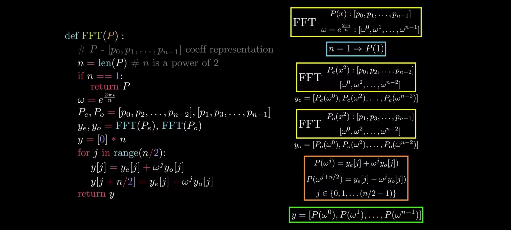

# 算法分析与设计

## 序言

时间复杂度：用算法的**基本操作（算法中最重要的操作）**的执行次数来度量算法的时间效率
$$
T(n) ≈ copC(n)
$$
**一个需要指数级操作次数的算法只能用来解决规模非常小的问题**

### 渐进符号

**f(n)<=Cg(n)**，记作t(n)=O(g(n))

f(n)≥Cg(n)，记作f(n)= **Ω**(g(n))

### 求时间复杂度的方法

#### 递归树

#### 主定理

$$
T(n)=aT(n/b)+n^d && a>=1,b=1 \\
T(n)=  \left\{ \begin{matrix} O(n^{log_b^a})&ifa>b^d \\ O(n^dlog_bn) & ifa=b^d \\
O(n^d) & ifa<b^d
\end{matrix} \right.
$$

## 递归

思想和栈比较相同，我们需要找到循环终止的条件

步骤：

1. 明白函数想干嘛
2. 寻找函数终止条件
3. 找出函数的等价关系时

时间复杂度分析：

- 决定用哪个参数作为输入规模的度量
- 找出算法的基本操作
- 检查对相同规模的输入，基本操作的执行次数是否相同，如果不同，必须对最差、平均及最优效率单独研究
- 建立一个递推关系式及相应的初始条件
- 求解这个递归关系式，或者至少确定解的增长次数

**递归的简洁性可能会掩饰其算法的效率复杂性**

## 分治

**分治法的几个步骤：**

1、将原始问题划分为k个相同类型的子问题。（问题：为什么？）

2、子问题不可解还可继续划分。（问题：分到什么时候结束？）

3、求解每个子问题。

4、将每个最小子问题的解合并成原问题的解。

**分治法适用条件：**

1、原始可分解，且分解出来的子问题和原始问题就有相同的类型。

2、分解出来的子问题到很小时可以很容易（在很短的时间和空间内能求解）求解。

3、**子问题的解能合并。**（这是能否使用分治算法的关键）

### 归并排序

归并排序的时间复杂度任何情况下都是 O(nlogn)

空间复杂度是是指在某个时刻最大的空间数量，为n个

### 分治矩阵乘法

c++步骤：

1. 声明类
2. 主要递归函数：如果矩阵的长度大于2，则继续分割
3. 辅助函数：矩阵分割，矩阵合并，矩阵相加，2阶矩阵相乘

### 棋盘覆盖问题

函数变量：tr tc左上角点，dr dc当前分治中特殊点，size长度

如果宽度等于2，就覆盖除了特殊点的其他点

如果宽度不等于2，就对区域四分
$$
T(n)=O(4^k)
$$

### 寻找第k小数

N prime test

输入规模和基本操作执行的次数

求第n个数是什么

求二维图中最近的两个点

计算二项式系数

拓扑图中最长距离

加空格最多匹配字符串

背包问题

最短路径问题

中国快递员问题2

np难？

### 快速傅里叶变化（FFT）

$$
P(x):[p_0,p_1,...,p_{n-1}] \\
w=e^{\frac{2\pi i}{n}}:[w^0,w^1,...,w^{n-1}]
$$

将w带入p(x)求解

可以对整个FFT公式左右分治

左侧：
$$ {FFT}
P_e(x):[p_0,p_2,...,p_{n-2}] \\
w=e^{\frac{2\pi i}{n}}:[w^0,w^1,...,w^{n-1}]
$$

右侧：
$$
P_o(x):[p_1,p_3,...,p_{n-1}] \\
w=e^{\frac{2\pi i}{n}}:[w^0,w^1,...,w^{n-1}]
$$

## 动态规划

### 求二项式系数

利用二维数组存储n从1开始的对角线数组，$$dp[i][k]=dp[i-1][k]+dp[j-1][k-1]$$

## DFS BFS

## 贪心

Prim算法

时间复杂度：vloge
