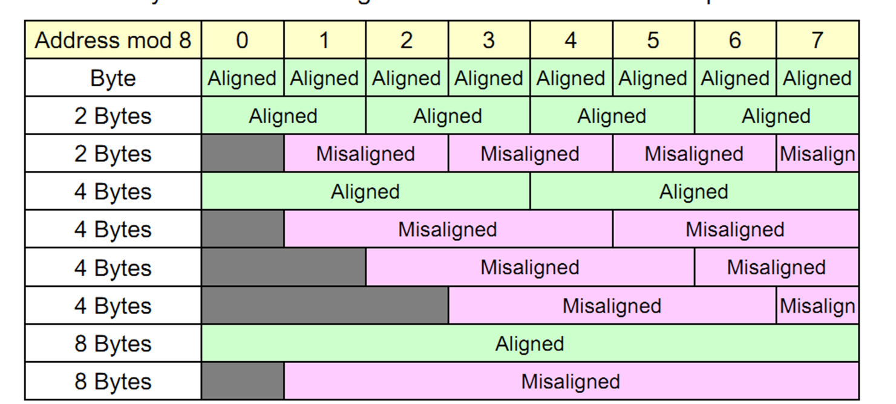
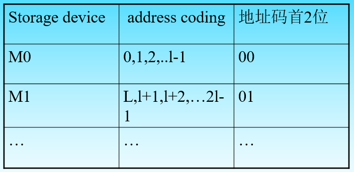
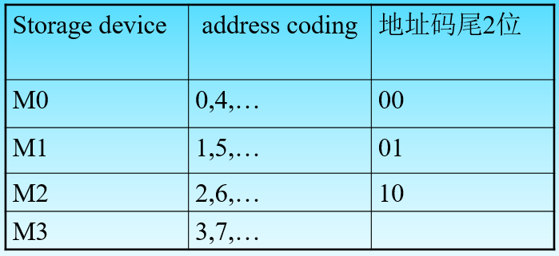

# 计算机体系结构

推荐书籍：

计算机体系结构（第二版） 清华大学出版社

John L. Hennessy, David A. Patternson; Computer Architecture: A Quantitative Approach; sixth Edition. 

David A. Patternson, John L. Hennessy ; Computer Organization and Design- The Hardware/Software Interface; RISC-V Edition.

参考书：

CSAPP

## 系统结构

**计算机性能提高的原因：**

- 科技
  - 更多晶体管
- 机器组织和实现
  - 更深的流水线
  - 更多并行执行
- 指令集架构
  - 精简指令集
  - 拓展
  - 显式并行

- IO原理
- 存储层次
- 流水线

机器使用多种不同形式的抽象，利用简单模型来隐藏实现的细节：

1. 指令集体系结构和指令集架构
2. 使用虚拟地址

### 计算机系统结构概念

#### 计算机系统结构

系统效率=min(器件速度)*min(系统结构效率)

计算机体系结构是软件设计者与硬件设备设计者（VLSI）之间的中间层，是软件与硬件的接口（Interface）

> **基本定义：程序员所看到的计算机的属性，即概念性结构和功能特性。**

系统结构外特性--计算机系统的外观

#### 计算机分类方式

**并行度与并行体系分类**

1. 数据级并行
2. 任务级并行

计算机通过以下方式开发这两类应用并行：

1. **指令集并行**在编译器帮助下，利用流水线思想适度开发数据级并行
2. **向量体系结构和圄形处理器 (GPU)** 将单条指令并行应用于一个数据集
3. **线程级并行**在一种紧搞合硬件模型中开发数据级并行或任务级并行
4. 请求级并行在程序员或操作系统指定的大量去搞合任务之间开发并行

- 按处理机性能分类

  - 按大小分类：**巨型、大型、中型、小型、微型机**
  - 按用途分：科学计算、事务处理、实时控制、工作站、服务器、家用计算机等。
  - 按数据类型分：定点计算机、浮点计算机、向量计算机、堆栈计算机等
  - 按处理机个数和种类划分：单处理机，并行处理机、多处理机、分布处理机，关联处理机
    超标量处理机, 超流水线处理机, VLIW处理机，SMP(对称多处理机)、MPP(大规模并行处理机)、机群(Cluster)系统等
  - 按所使用的器件划分：

- **基于流（Flynn分类法）**

  1. 模型中的重要概念

        指令流（Instruction Stream）：机器执行的指令序列；

        数据流（Data stream）：由指令处理的数据序列；

        多倍性（Multiplicity）：在系统最窄的部件上，处于同一执行阶段的指令和数据的最大可能个数。

  2. 模型中的基本模块

      MM（Memory Module）：内存模块。

      PU（Process Unit）：处理单元

      CU（Control Unit）：控制单元

  3. 按照指令流和数据流的多寡，Flynn将CA分成4种：

      1. 单指令流、单数据流(SISD)：单处理器
      2. 单指令流、多数据流(MISD)：同一指令由多个使用不同数据流的处理器执行。开发数据级并行
      3. 多指令流、单数据流 (MISD):  目前为止，还没有这种类型的商用多处理器，但包含这种类型之后，这种简单的分类方式变得更完整。
      4. 多指令流、多数据流 (MIMD): 每个处理器都提取自己的指令，对自己的数据进行操作，它针对的是任务级并行。

    缺点：
    
    (1)分类太粗
        在SIMD中包括有多种处理机
        对流水线处理机的划分不明确，
        标量流水线为SISD，向量流水线为SIMD
    
    (2)根本问题是把两个不同等级的功能并列对待
         数据流受指令流控制，造成MISD不存在
    
    (3)非冯计算机的分类？其他新型计算机的分类

- **库克分类法：**按控制流和执行流分类

    (1)单指令流单执行流
     SISE(Single Instruction Single Executionstream)，  典型的单处理机

    (2)单指令流多执行流
     SIME(Single Instruction Multiple Executionstream)
      多功能部件处理机、相联处理机、向量处理机、流水线处理机、超流水线处理机、超标量处理机、SIMD并行处理机

    (3)多指令流单执行流MISE
     (Multiple Instruction Single Execution stream)，  多道程序系统 

    (4)多指令流多执行流MIME
     (Multiple Instruction Multiple Execution stream)， 典型的多处理机

- 冯氏分类法

    以最大并行度作为系统结构分类的标准。

    所谓最大并行度Pm是指一个系统在单位时间内能够处理的最多的二进制位数，显然这是一个完全由计算机硬件结构决定的参数。

    最大并行度的数值越大越好。 

### 系统结构设计

#### 计算机系统设计思路

1. **由上向下方法**

   **适合于专用机的设计，从应用到实现级，周期几年。**

    **缺点：当应用对象或范围变化时，效率急剧下降。**

    **原因：软、硬件脱节，不能利用最新的软件技术。**

2. 由下向上方法

  前提：硬件不能改变。
  缺点：易形成软、硬脱节，软件不能获得最新硬件的支持，结果软件繁杂、效率低。

3. 从中间开始方法

抽象简化设计

善用并行性

可靠性法则：没有单点故障的设计。

数据和指令的重复性使用

## 指令系统 (Instruction Set)

- IS是计算机体系结构的主要组成部分
- IS标识硬件和软件之间的接口
- IS是通信硬件和软件之间的桥梁
- 信息系统和软件之间的语义差异越来越大

### ISA (Instruction Set Architecture) 

指令集架构 (ISA) 是计算机抽象模型的一部分，它定义了软件如何控制 CPU。 

ISA 充当硬件和软件之间的接口，指定处理器能够做什么以及如何完成。

ISA 提供了用户与硬件交互的唯一方式。它是机器中对汇编语言程序员、编译器编写者和应用程序程序员可见的部分。

ISA 应当具备**特性**：

- 成本低
- 简洁性
- 架构和具体实现分离：可持续多代，以保持向后（backward) 兼容
- 易于编程/链接/编译

**优秀的 ISA **所具有的**特征**：

- 可持续用于很多代机器上(portability)
- 可以适用于多个领域 (generality)
- 对上层提供方便的功能（convenient functionality)
- 可以由下层有效地实现（efficient implementation )

IBM 360 是第一个将 ISA 与其实现分离的机器，一个 ISA 可能由不同的实现方式

ISA 需要描述的内容：

- 内存地址
- 取址方式
- 操作数的类型和大小
- 操作符

ISA 定义了支持的数据类型、寄存器、硬件如何管理主内存、关键功能（例如虚拟内存）、微处理器可以执行哪些指令以及多个 ISA 实现的输入/输出模型。可以通过添加指令或其他功能，或者添加对更大地址和数据值的支持来扩展 ISA。

- ISA：用户级ISA+特权级ISA
  - 用户级ISA 适用于操作系统和应用程序
  - 特权级ISA 适用于硬件资源的管理（操作系统）

#### ISA 的实现

### 数据表示

#### 数据表示与数据类型

定义：具有一组**值的集合**，且定义了作用于该集合的操作集

目的：防止不同类型数据间的误操作

基本数据类型：二进制位、二进制位串、整数、十进制数

结构数据类型：数组、字符串、向量、堆栈、队列、记录等

数据类型的确定原则：

- 减少程序运行实践
- 减少CPU和内存间通信
- 数据类型的普遍和实用效率

数据表示增加的原则：

1. 是否提高了系统的有效性

   是否减少实现时间，是否减少专用空间。例如:向量被操纵A=A+B，当采用向量数据表示时，矢量算法组件管道计算可以节省时间，辅助开销时间减少;

2. 数据表示是否具有通用性和利用率就足够了

   通用性:是否适用于多种数据结构。

例子：树结构数据类型和指针数据类型

#### 自定义数据表示

数据存储单元(寄存器、主内存储器、外存储器等)仅存储纯数据。

- 由指令中的运算符解释的:数据类型(定点，浮点，字符，字符串，逻辑，矢量等)进位系统(2、10、16等)
- 数据字长(字、半字、双字、字节等)
- 寻址方式(直接寻址，间接寻址，相对寻址，寄存器寻址)
- 数据功能(地址，数值，控制字，符号等)
- 相同类型的操作(在加法的情况下)

有很多指令在高级语言和应用软件中，数据的属性是由数据本身定义的，高质量语言和机器语言之间的语义差异由编译器来解决

- 60年开始，Burroughs公司引进了自定义的数据表示方式，数据表示方式包括符号

##### 数据标识符

例子：

> 功能位：操作数、指令、地址、控制字
> 陷井位：由软件定义四种捕捉方式
> 封写位：指定数据是只读的还是可读可写
> 类型位：二进制,十进制,定点数,浮点数,复数,字符串,单精度,双精度；绝对地址、相对地址、变址地址、未连接地址等。

**标志符的处理机所占用的存储空间通常要小**

通过合理的设计可以让橙色框比紫色框小

标识符数据表示方法的[优点]：

- 简化了指令系统。

- 由硬件实现一致性检查和数据类型转换。
- 简化程序设计，缩小了人与计算机之间的语义差距。
- 简化编译器，使高级语言与机器语言之间的语义差距大大缩短。
- 支持数据库系统，一个软件不加修改就可适用于多种数据类型。
- 方便软件调试，在每个数据中都有陷井位。

[缺点]：

- 数据和指令长度可能不一致：可以通过精心设计指令系统来解决
- 指令[执行速度]降低，但是采用标志符设计，程序的设计编译调试实践都会降低
- 硬件复杂度增加

##### 数据描述符

数据描述符与标志符的**区别**：标志符只作用于一个数据，而**数据描述符要作用于一组数据**

举个栗子：
$$
A=\left[\begin{array}{llll}
a_{11} & a_{12} & a_{13} & a_{14} \\
a_{21} & a_{22} & a_{23} & a_{24} \\
a_{31} & a_{32} & a_{33} & a_{34}
\end{array}\right]
$$

第一行的3表示有三个这样的数据（组）并且存了他们的起始地址（**这一行是用来描述之后数据类型的（比如说三个单行数组）**）；后三个101表示每一组数据有4个数据并且存了他们（数据）的起始地址（**这几行是用来描述具体数据的（描述单行数组中的数据）**）；后面就是顺序存放的数据

### 指令

组成：操作 + 源地址 + 目标地址 + 下一个指令地址

类型：数据的处理、存储、移动、程序的流程控制

#### 操作数

- 操作数类型和操作数表示是软硬件的主要界面之一。
- 操作数类型：是面向应用、面向软件系统所处理的各种数据类型。
  - 整型、浮点型、字符、字符串、向量类型等
  - 类型由操作码确定或数据附加硬件解释的标记，一般采用由操作码确定
  - 数据附加硬件解释的标记，现在已经不采用
- 操作数的表示：操作数在机器中的表示，硬件结构能够识别，指令系统可以直接使用的表示格式
  - 整型：原码、反码、补码
  - 浮点：IEEE 754标准
  - 十进制：BCD码/二进制十进制表示

常用操作数类型：

- ASCII character = 1 byte (64-bit register can store  8 characters
- Unicode character or Short integer = 2 bytes = 16 bits （half word) 
- Integer = 4 bytes = 32 bits (word size on many RISC Processors)
- Single-precision float = 4 bytes = 32 bits (word size)
- Long integer = 8 bytes = 64 bits (double word)
- Double-precision float = 8 bytes = 64 bits (double word)
- Extended-precision float = 10 bytes = 80 bits (Intel architecture)
- Quad-precision float = 16 bytes = 128 bits

#### 指令结构分类

分类准则：

1. CPU中操作数的存储方法分类
2. 指令中显式操作数个数分类
3. 根据操作数能否放在存储器中分类

指令集划分成堆栈、累加器、寄存器型三类

#### 常见指令集

- MIPS
- SPARC
- Alpha
- ARMv7
- ARMv8
- OpenRISC
- 80x86

### 寻址方式

定位操作数和其他信息的位置称为寻址

**采用多种寻址方式可以显著地减少程序的指令条数，但可能增加计算机的实现复杂度以及指令的CPI。**

重要的寻址方式:

- 偏移寻址方式, 立即数寻址方式, 寄存器间址方式
- SPEC测试表明，使用频度达到 75%--99%

偏移字段的大小应该在 12 - 16 bits

- 可满足75%-99%的需求

立即数字段的大小应该在 8 -16 bits

- 可满足50%-80%的需求

**尾端问题：**

如地址 xxx00 指定了一个字（int）, 存储器中从 xxx00 处连续存放 ffff0000, 则有两种方式：

–Little endian 方式下 xxx00 位置是字的最低字节，整数值为0000ffff, Intel 80x86, DEC Vax, DEC Alpha (Windows NT)

–Big endian 方式下xxx00位置是字的最高字节，整数值为ffff0000, IBM 360/370, Motorola 68k, MIPS, Sparc, HP PA

**对齐问题：**

对s字节的对象访问地址为A，如果 $A \, {\rm mod} \, s =0$，则称为边界对其，

如果边界没有对其，就可能访问一个对象需要读取两次寄存器，也可能会引发异常

**编址方式：**

编址单位：

- word、byte、bit、block等

- 一般：字节编址，字访问

  - 部分机器：位编址，字访问
  - 辅助存储器：块编址

- **Number of zero address space**

  - **三个零地址空间**：通用寄存器、主存储器和输入输出设备均独立编址
  - **两个零地址空间**：主存储器与输入输出设备统一编址
  - **一个零地址空间**：所有存储设备统一编址，最低端是通用寄存器，最高端是输入输出设备，中间为主存储器
  - **隐含编址方式**，实际上没有零地址空间：堆栈、**Cache等**
  
- 对于I/O设备

  - 一个地址一个设备：必须通过指令中的操作码来识别该输入输出设备上的有关寄存器
  - 两个地址一个设备：一个地址是数据寄存器，一个地址是状态/控制寄存器
  - 单设备多地址：对编程增加困难

- 对于并行内存

  - 高位交叉编址  主要目的是用来扩大存储器容量。

    

  - 低位交叉编址  主要目的是提高存储器速度。

    

**寻址方式**

1. 寄存器寻址（Register）
2. 立即数寻址（Immediate or literals）
3. 偏移寻址（Displacement）
4. 寄存器间接寻址（Register deferred or indirect）
5. 索引寻址（Indexed）
6. 直接寻址或绝对寻址（Direct or absolute）
7. 存储器间接寻址（Memory indirect or memory deferred）
8. 自增寻址（Auto increment）
9. 自减寻址（Auto decrement）
10. 缩放寻址（Scaled）

寻址方式的设计思想

- 立即数寻址方式，用于数据比较短、源操作数
- 面向寄存器的寻址方式
- 面向主存储器的寻址方式
- 面向堆栈的寻址方式

虚地址或有效地址被偏移到段中

- 起始地址加上偏移量得到线性地址
- 如果启用了分页，则会进行页面转换

**指令格式**

- 许多电脑支持超过一种指令格式
- 电脑能支持可变长的指示

指令格式长度与数据总线宽度相关联

- 指令小于数据总线大小：32位总线上的16位指令，单次可以读取多个指令
- 指令比数据总线宽：需要对整个指令进行多次读取

指令集在支持的**指令格式**方面有所不同

指令格式的主要区别在于它们所使用的**操作数的数量和类型**。

**指令长度**

被下列所影响：

- 内存大小
- 内存组织形式
- 总线结构
- CPU 复杂性
- CPU 速度

在高效指令和空间大小中均衡

**指令格式设计**

只包含以下两种指令格式的设计方式：

格式A：Reg, Reg: R1 <- R1 OP R2

格式B：Reg, Mem: R1 <- R1 OP Mem

**使用频带分析法，根据指令系统风格和各种寻址方式的使用频率，选择高频率的寻址方式。**

**位移寻址模式**

基准测试显示 12bit 位移可以代替 75% 的32bit位移，16bit 可以代替 99%

#### 程序的装入

将程序(模块)装入内存时，可以有三种方式：

- 绝对装入方式
  - 编译时知道程序在内存中位置，产生绝对地址
  - 地址不需要修改
- 可重定位装入方式(静态重定位方式)
  - 在装入时对程序中逻辑地址的偏移值加入起始地址中

  - 在装入时一次完成

  - 只能连续装入
- 动态运行时装入方式
  - 优点：主存利用率高，多个用户可以共享同一个程序段，支持虚拟存储器实现。   
  - 缺点：需要硬件支持，实现的算法比较复杂

### 优化指令格式

目标：

- 节省程序存储空间
- 指令格式尽量规整，便于译码

方法：

- 操作码的优化表示；地址码的优化表示

#### 优化操作码

三种方法：固定长度，哈夫曼编码，扩展编码

主要使用 Huffman 编码：

每个字符最少所需要的位数：
$$
H=-\sum_{i-1}^nP_i \cdot \log_2P_i
$$
$P_i$表示第$i$个数出现的概率的排序

固定长度编码冗余：
$$
\mathrm{R}=1-\frac{-\sum_{\mathrm{i}=1}^{\mathrm{n}} \mathrm{P}_{\mathrm{i}} \cdot \log _2 \mathrm{P}_{\mathrm{i}}}{\left\lceil\log _2 \mathrm{n}\right\rceil}
$$
使用变长编码的时候我们要极其注意冲突问题

对树的边进行标记，使通向左子结点的边被赋值为0，通向右子结点的边被赋值为1。

在一个树上，没有一个字符的编码可以是另一个字符的祖先，因此一个字符的编码不可能是另一个字符的前缀

计算 Huffman 方法：

- 对于n个字母的字母表，Huffman 算法从第n个节点开始，标记字母和其频率
- 我们确定两个具有最低频率的顶点，并将它们替换为树，其根标记为这两个频率的和，其两个子节点是我们替换的两个顶点。
