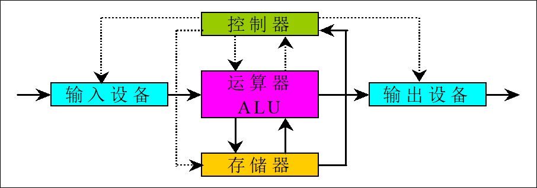
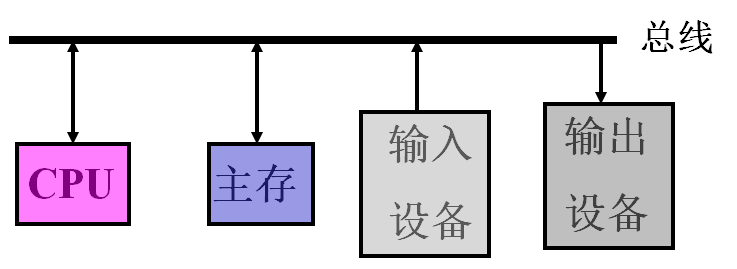
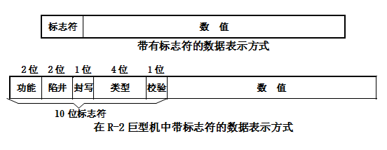
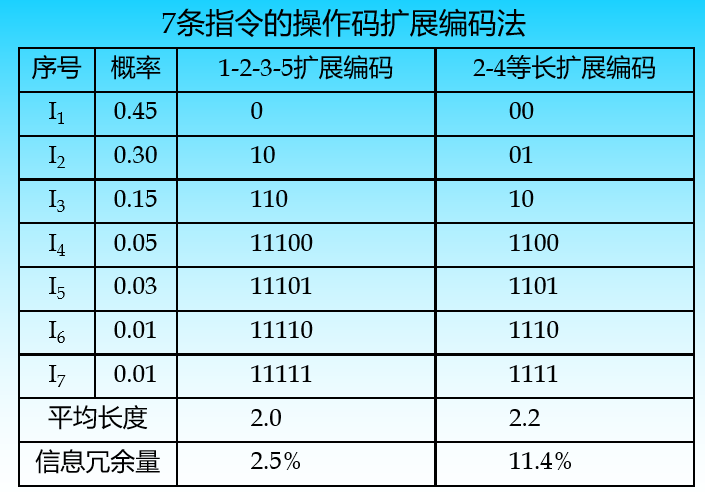
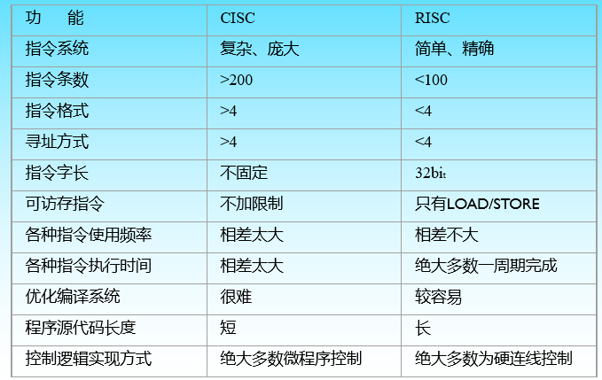
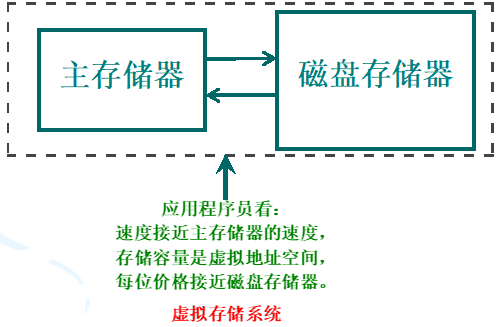
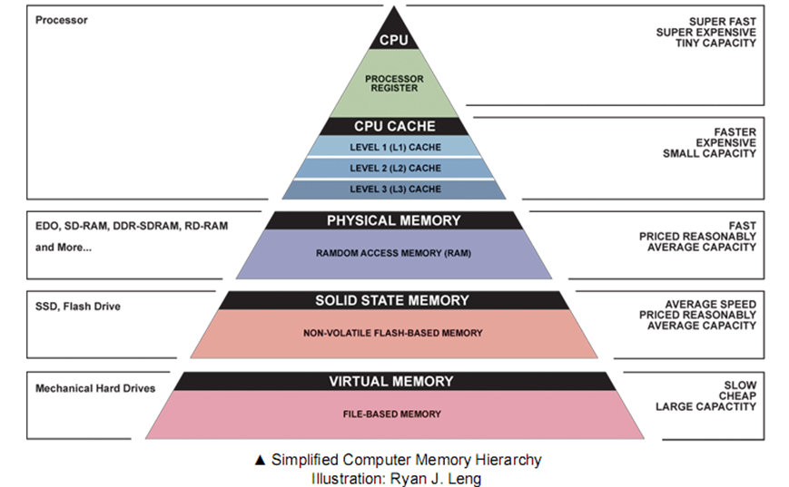

# 计算机体系结构

推荐书籍：

计算机体系结构（第二版） 清华大学出版社

John L. Hennessy, David A. Patternson; Computer Architecture: A Quantitative Approach; sixth Edition. 

David A. Patternson, John L. Hennessy ; Computer Organization and Design- The Hardware/Software Interface; RISC-V Edition.

参考书：

CSAPP

## 系统结构

- 体系结构要做的事情

  - 从设计者角度，分析和评价系统性能/价格

  - 在分析和评价的基础上，进行系统结构的设计

  - 系统结构的分析、设计和优化是本课程的重点

- 计算机体系结构的定义
  - 程序员可见的计算系统的属性

  - 计算机体系结构研究如何设计、组织，以及使用可用的生产技术实现信息处理系统，该系统可有效地执行软件应用，满足价格、功耗和性能约束，最大化机器性能
  - 狭义观点：软件设计者与硬件设计者之间的中间层，以及微体系
  - 扩展观点：算法层、语言层、系统软件层、ISA层、微体系结构、逻辑电路层

**计算机性能提高的原因：**

- 科技
  - 更多晶体管
- 机器组织和实现
  - 更深的流水线
  - 更多并行执行
- 指令集架构
  - 精简指令集
  - 拓展
  - 显式并行

- IO原理
- 存储层次
- 流水线

机器使用多种不同形式的抽象，利用简单模型来隐藏实现的细节：

1. 指令集体系结构和指令集架构
2. 使用虚拟地址

### 计算机系统结构概念

#### 计算机系统结构

系统效率=min(器件速度)*min(系统结构效率)

计算机体系结构是软件设计者与硬件设备设计者（VLSI）之间的中间层，是软件与硬件的接口（Interface）

> **基本定义：程序员所看到的计算机的属性，即概念性结构和功能特性。**

系统结构外特性--计算机系统的外观

#### 计算机分类方式

**并行度与并行体系分类**

1. 数据级并行
2. 任务级并行

计算机通过以下方式开发这两类应用并行：

1. **指令集并行**在编译器帮助下，利用流水线思想适度开发数据级并行
2. **向量体系结构和图形处理器 (GPU)** 将单条指令并行应用于一个数据集
3. **线程级并行**在一种紧搞合硬件模型中开发数据级并行或任务级并行
4. 请求级并行在程序员或操作系统指定的大量去搞合任务之间开发并行

- 按处理机性能分类

  - 按大小分类：**巨型、大型、中型、小型、微型机**
    - 按照性能和价格分
  - 按用途分：科学计算、事务处理、实时控制、工作站、服务器、家用计算机等。
    - 个人移动设备
    - 桌面计算
      - 强调性价比
    - 服务器
      - 强调可用性、可缩放性
    - 集群/仓储级计算机（Clusters / Warehouse Scale Computers）
      - 每个数据中心包含10+万个处理器核
      - X86-ISA兼容的服务器芯片在市场上占统治地位
      - 专门的应用程序，加上虚拟机的云托管
      - 现在越来越多地使用gpu、fpga和定制硬件来加速工作负载
      - 其分支:  Supercomputers：强调浮点运算性能和高速内部互联
      - 强调可用性和性价比(availability、price-performance、energy)
    - 嵌入式计算机/物联网（Embedded Computers / Internet of Things）
        - 有线/无线网络基础设施，打印机
        - 消费类产品( TV/Music/Games/Automotive/Camera/MP3)
        - 物联网（Internet of Things!)
        - 强调价格、能耗及面向特定应用的性能(Emphasis:  price、energy、application-specific performance)
  - 按数据类型分：定点计算机、浮点计算机、向量计算机、堆栈计算机等
  - 按处理机个数和种类划分：单处理机，并行处理机、多处理机、分布处理机，关联处理机，超标量处理机, 超流水线处理机, VLIW处理机，SMP(对称多处理机)、MPP(大规模并行处理机)、机群(Cluster)系统等
  - 按所使用的器件划分
    - 按使用器件的时代划分：电子管、晶体管、集成电路、大规模集成电路

- **基于流（Flynn分类法）**

  1. 模型中的重要概念

        指令流（Instruction Stream）：机器执行的指令序列；

        数据流（Data stream）：由指令处理的数据序列；

        多倍性（Multiplicity）：在系统最窄的部件上，处于同一执行阶段的指令和数据的最大可能个数。

  2. 模型中的基本模块

      MM（Memory Module）：内存模块。

      PU（Process Unit）：处理单元

      CU（Control Unit）：控制单元

  3. 按照指令流和数据流的多寡，Flynn将CA分成4种：

      1. 单指令流、单数据流(SISD)：单处理器
      
         - 一个CU从MM读取一个指令，并操控PU对MM操作
      
      2. 单指令流、多数据流(SIMD)：同一指令由多个使用不同数据流的处理器执行。开发数据级并行
      
      3. 多指令流、单数据流 (MISD):  目前为止，还没有这种类型的商用多处理器，但包含这种类型之后，这种简单的分类方式变得更完整。
      
      4. 多指令流、多数据流 (MIMD): 每个处理器都提取自己的指令，对自己的数据进行操作，它针对的是任务级并行。
      
      5. single program multiple data(SPMD)与single instruction multiple data(SIMD)都是可以处理多数据的，不同点是SIMD是从指令级上看的，这意味着SIMD处理的多数据是执行相同的操作，比如都执行加法。而SPMD是从程序级上看的，这意味着处理的多数据不一定是执行相同的操作，因为程序里面可以有分支等，即执行路径可以是多条。一句话，SIMD是多个数据执行相同的操作，SPMD是多个数据可以执行不同的操作也可以执行相同的操作。
      
      6. XIMD (variable instruction stream, multiple data stream) ： As an extension to the VLIW (Very Long Instruction Word) architecture, the XIMD can exploit all VLIW scheduling techniques but these do not take full advantage of the unique features of the XIMD
      
         混合指令多数据(XIMD):所述XIMD计算系统可包括多个数据处理器，每个数据处理器代表单指令多数据(SIMD)计算系统的一条通道;其中，多个数据处理器被配置为使用第一主导通道执行指令，并在XIMD计算系统在执行程序期间遇到与第一主导通道不共享已取/未取状态的数据依赖指令时，分叉第二主导通道。

> 缺点：
>
> (1)分类太粗
>
> - 在SIMD中包括有多种处理机
> - 对流水线处理机的划分不明确，
> - 标量流水线为SISD，向量流水线为SIMD
>
> (2)根本问题是把两个不同等级的功能并列对待     
>
> - 数据流受指令流控制，造成MISD不存在
>
> (3)非冯计算机的分类？其他新型计算机的分类

- **库克分类法：**按控制流和执行流分类

    (1)单指令流单执行流

    - SISE(Single Instruction Single Executionstream)，  典型的单处理机

    (2)单指令流多执行流

    - SIME(Single Instruction Multiple Executionstream)
    - 多功能部件处理机、相联处理机、向量处理机、流水线处理机、超流水线处理机、超标量处理机、SIMD并行处理机

    (3)多指令流单执行流MISE

    - (Multiple Instruction Single Execution stream)，  多道程序系统 

    (4)多指令流多执行流MIME

    - (Multiple Instruction Multiple Execution stream)， 典型的多处理机

- 冯氏分类法

    以最大并行度作为系统结构分类的标准。

    所谓最大并行度Pm是指一个系统在单位时间内能够处理的最多的二进制位数，显然这是一个完全由计算机硬件结构决定的参数。

    最大并行度的数值越大越好。 
    
    - 字串位串（WSBS）：*n* = 1，*m* = 1。这是最早期全串行运算的计算机。
    
    - 字并位串（WPBS）：*n* > 1，*m* = 1。这是传统的并行单处理机。
    
    - 字串位并（WSBP）：*n* = 1，*m* > 1。每处理机只一位，但有许多个处理机字并行运用，如STARAN，MPP，DAP等。
    
    - 字并位并（WPBP）：*n* > 1，*m* > 1。PEPE，ILLIAC Ⅳ，Cmmp等计算机属此类。
    
        ​         W – Word；B – Bit；S – Serial；P – Parallel
        
    - 平均并行度
    
        - 如果在一个时钟周期$\Delta t_i$内实际处理的二进制位数为Pi，那么在T个时钟周期内的平均并行度Pa 就为：
            $$
            P_a=\left(\sum_{i=1}^T P_i\right) / T
            $$
            
        - 把平均并行度与最大并行度之比称为平均利用率，用μ表示为：
          $$
          \mu=P_a/P_m=\frac{\sum^T_{i=1}P_i}{T \bullet P_m} 
          $$
    
- 按“并行级”和“流水线”分类：Händler表示法

    - 根据可并行和流水处理的程度，将硬件分成三个层次：

        - 程序控制部件（PCU）的个数k；
        - 算术逻辑部件（ALU）或处理部件（PE）的个数d；
        - 每个算逻部件包含基本逻辑线路（ECL）的套数w。

    - 每一个计算机系统都可以用上述三个参数表示其结构特征，即：

        ​             t（系统型号）=（k，d，w）。

    - 为了更细致的反映结构特殊性，表示式可写成：

      ​              t（系统型号）=（k×k’，d×d’，w×w’），

    -   其中：k’表示宏流水线中程序控制部件的个数；
                   d’表示指令流水线中算术逻辑部件的个数；
                   w’表示操作流水线中基本逻辑线路的套数。
    
    -   各层次的数值越大越好。
    
- 按控制方式分类

    - 控制流方式：顺序执行 （冯·诺依曼型）
    - 数据流方式：操作数到位即可运算，无序执行
    - 规约方式：驱动方式与数据流相反，无序执行
    - 匹配方式：非数值型应用，主要对象为符号。
    - 对不同类型结构，并行程度越大越好。

- 按系统结构风格分类

    - 面向堆栈型、面向寄存器型、面向对象型等

### 系统结构设计

#### 计算机系统设计思路

1. **由上向下方法**

   **适合于专用机的设计，从应用到实现级，周期几年。**

   **缺点：当应用对象或范围变化时，效率急剧下降。**

   **原因：软、硬件脱节，不能利用最新的软件技术。**

2. 由下向上方法

   - 前提：硬件不能改变

   - 缺点：易形成软、硬脱节，软件不能获得最新硬件的支持，结果软件繁杂、效率低。

3. 从中间开始方法
   - 从软、硬件交界面开始设计。
   - 要求首先进行软、硬件功能分配，同时考虑硬件能为软件提供什么支持。

#### 系统结构的设计步骤

1. 需求分析

2. 需求说明

   主要包括设计准则、功能说明、器件性能说明等。

3. 概念性设计

   进行软、硬件功能分析，确定机器级界面。

4. 具体设计

   机器级界面各方面的确切定义，可考虑几种方案。

5. 反复优化设计及评价

设计需求的转变：

1. Power Wall：以前能源便宜，晶体管贵；现在晶体管便宜，能源贵
2. ILP Wall：以前依靠编译器、架构创新来提高ILP (Out- of-order, speculation, VLIW)；现代利用ILP的好处变得越来越小
3. Memory Wall：以前乘法器慢，存储器速度快；现代相反
4. Power Wall + ILP Wall + Memory Wall = Brick Wall

### 计算机设计的定量原则

- 使用抽象简化设计（表示层）
- 通过冗余实现可靠性；有了冗余，当中断发生时，系统仍能平稳运行
- 使用并行性
  - –e.g. multiple processors, disks, memory banks, pipelining, multiple functional units
- 专注于常见情况
  - –**Amdahl’s Law (or Gustafson's Law)**
  - –**E.g. common case supported by special hardware; uncommon cases in software**
- 局部性原则:数据和指令的重用
- 性能方程

#### 如何使用并行性提高性能

- (超级)流水线
- 强大的指令
  - MD-technique
    - 每次操作有多个数据操作数
  - MO-technique
    - 每条指令执行多个操作
- 多指令问题
  - 单指令程序流
  - 多个流(或程序，或任务)

#### 局部性原则

- 一些重要的基本观察结果来自于程序的性质。
  - 程序在任何时刻都只能访问相对较小的地址空间。
- 局部性原则:程序倾向于重用它们最近使用过的数据和指令。
- 有两种不同类型的局部性
  - 时间局部性(局部性):如果一个道具被引用，它很快就会被再次引用(循环、重用等)。
  - 空间局部性(空间/位置中的局部性):如果一个项被引用，其地址彼此接近的项往往很快被引用(直线代码、数组访问等)。
- 根据一个程序过去的访问记录，我们可以相当准确地预测它在不久的将来会使用什么指令和数据。
- 一个程序将90%的执行时间花在10%的代码上

#### 专注于常见情况

- 更倾向于优化常见情况
  - 例如：指令提取和解码单元比乘法器使用频率更高，因此首先对其进行优化
  - 例如：如果数据库服务器有50个磁盘/处理器，存储可靠性高于系统可靠性，因此首先优化它明显有助于提高表现
  - 改善频繁事件，而不是罕见事件
- 频繁的情况通常比不频繁的情况更简单、更快地改善
  - 例如，当添加2个数字时溢出是罕见的，所以通过优化更常见的无溢出情况来提高性能
  - 可能会减慢溢出速度，但通过对正常情况的优化，整体性能有所提高
- 我们必须决定频繁的情况是什么，以及通过使情况更快可以提高多少性能=> Amdahl's Law

#### Amdahl's Law

- Amdahl定律指出，使用快速执行模式所获得的性能受到使用更快模式的时间的限制
- Amdahl 定律定义了通过使用特定特性可以获得的性能提高
- 通过改进计算机的某些移植而获得的性能增益可以使用Amdahl定律来计算

$$
Speedup(E)=\frac{Execution\_Time\_Without\_Enhancement}{Execution\_Time\_With\_Enhancement}
$$

例题1：

例1-1：设改进后的某部件运行速度是原速度的10倍，而该部件原运行时间占全系统运行时间的比例为40%，那么此项改进会使全系统的性能得到多少提升？

解：按照Amdahl定律，系统性能的提升可以用加速比表示。据题意：Fe = 0.4；Re = 10，直接使用式（1-3），可得：

抽象简化设计

善用并行性

可靠性法则：没有单点故障的设计。

数据和指令的重复性使用

### 计算机性能标准

#### 衡量计算机性能的主要标准

计算机性能：**正确性、可靠性和工作能力**

工作能力指标：

- 处理能力—单位时间内能处理的信息量(吞吐率)。
- 响应能力—响应时间、周转时间、排队时间。
- 利用率—T时间内，某部分被使用时间t与T的比值。

CPU的能力：

- 硬件连接能力（主要是指速度指标）
  - CPU通过在引脚上设置数据、地址和控制总线实现与外部电路的连接，这种能力的强弱常用数据总线带宽，即单位时间内传输的数据量来表示。这是一个速度指标
  - 地址总线的宽度可以衡量CPU支持的容量指标。
  - 控制总线的数量、性质可以衡量CPU的功能、可靠性、可扩展性等指标，但表达可能比较复杂。
- 数据带宽
  - CPU 引脚中数据总线的宽度乘以总线传输速率得到数据带宽
  - 例如，数据总线的传输速率为266 MHz，总线的宽度为32位（4字节），那么该数据总线的带宽就达到2.1GB/s（266MHz×4B）。
  - 体系结构改善：提高总线传输速率、增加总线宽度，相应的增加成本。

CPU与Cache连接方式

- CPU在片内连接Cache比在片外连接Cache具有更高的速度指标
- CPU与Cache之间的数据通道越多，则速度越快
- 一级CACHE集成在CPU同一芯片内
- 二级一般也在CPU同一芯片内，有的在芯片外；有的CPU还提供专门通道连结第三级CACHE。
- 体系结构改善：为CACHE设计足够宽的通道、尽量把Cache设计在CPU芯片内，但是这会相应增加制造难度和成本。

管理能力（可靠性、速度、容量、可扩展性、性能价格比）

- 其中对存储器的管理、对多道作业的管理、中断管理及对多处理机工作的管理能力尤其值得关注。

- 可靠性：多道作业管理

- 速度：Cache寻址，中断管理
- 容量：虚拟存储器寻址
- 可扩展性：中断管理
- 性能价格比：操作系统中某些软件功能放在硬件中实现，提高系统整体的性能价格比。

#### 多机系统性能评价

1. 性能加速比
   $$
   S(p,n)=\frac{T(p,1)}{T(p,n)+h(p,n)}
   $$
   P问题大小，n处理机数，h为通信开销

2. 性能可伸缩性

   定义：对一个给定的应用问题，系统性能随PE数增加而线性增长的性能

   影响因素：PE数，时钟频率，问题大小，求解时间等。

   评价方法：选择某参考机作为比较参照机，测量后得出性能可伸缩性值。

### 计算机系统结构的发展

- 体系结构发展历史
  - Minicomputers,
  - Microprocessors
  - RISC vs CISC，VLIW 
- 体系结构现状及挑战
  - Denard Scaling 及 Moore’s Law 的终结
  - Security
- 体系结构发展机遇
  - Open Architectures 
  - Domain Specific Languages and Architecture
  - Agile Hardware Development
- 产品应用：– PC/Server => IoT, Mobile/Cloud
- 集成电路技术方面
  - 登纳德缩放比例定律的终结
    - 功耗成为关键制约条件
    - Stopped by threshold voltage
  - Moore定律的终结：晶体管的集成度提高延缓
    - 11 nm, 3 nm might be the limit

#### 冯·诺依曼机组系统结构的演变

**单处理器结构：**

1. 组成：由运算器、控制器、存储器、I/O设备组成

2. 特点 also called stored program computer

   - 采用存储程序原理

   - 指令串行执行，由控制器控制

   - 存储器按地址访问，是顺序的一维线性空间

   - 使用机器语言，数据以二进制表示

   - 单处理机结构，以运算器为中心

   - 输入输出设备与存储器之间的数据传送都途经运算器

3. 缺点
   - 两个瓶颈：CPU—存储器，指令串行执行
   - 机器语言与高级语言间语义差别较大
   - 复杂数据结构必须经过地址映象存放
4. 改良
   - 程序运行中不允许被修改
   - 采用先行控制、流水线等方法，开发并行性
   - 采用多体交叉存储器，增加存储带宽
   - 增加新的数据表示，进一步支持高级语言
   - 以存储器为核心，使I/O设备和CPU可并行工作

**总线结构：**

- 总线： 连接计算机各功能部件的连线和管理信息传输规则的逻辑电路称为总线。
- 特点：在任何时刻，只能有一个部件向总线上发送信息，可以有多个部件同时接收信息。
- 组成： 数据总线、地址总线、控制总线。

#### 非冯计算机的发展

#### 现代体系结构发展趋势

**并行！！！**

- 工艺发展的趋势

  - 芯片的集成度不断提高，但提升的速度在放缓
  - 时钟频率的提高在放缓，并有降低的趋势
- 体系结构的发展及机遇
  - 指令集并行受到制约
  - 线程级并行和数据级并行是发展的方向
  - 提高单处理器性能花费的代价呈现上升趋势
  - 面向特定领域的体系结构正蓬勃发展

### 系统结构中并行性的发展

> 并行性概念：在同一时刻或同一时间间隔内完成两种或两种以上工作，只要在时间上相互重叠，均存在并行性。
> 分类：
>
> - 同时性－－指两个或多个事情在同一时刻发生的并行性
> - 并发性－－指两个或多个事情在同一时间间隔内发生的并行性

发展过程：

- 1985年以前位级(4-8-16位)并行（Bit level parallelism）
  - 32-bit 处理器后性能提升变慢
  - 90年代采用64-bit 、128-bit 及更高位通过向量处理提高性能
  - 重大的拐点：32位处理器和缓存集成在一个芯片
- 80年代中到90年代后期主要发展指令级并行（Instruction Level Parallelism）
- 现状：线程级并行和片上多处理器（thread level parallelism and chip multiprocessors）
  - 线程级并行超越了指令集并行
  - 在单个芯片中部署多个处理器及互联结构
  - 在处理器芯片内多个线程并行执行

**并行性等级：**

- 指令内部并行，即指令内部的微操作之间的并行；（硬件和组织的设计）
- 指令间并行，即并行执行两条或多条指令（处理好指令间的关联  ILP）
- 任务级或过程级并行，即并行执行两个或多个过程或任务（程序段 TLP）（任务分解）
- 作业或程序级并行，即在多个作业或程序间的并行（并行算法）

**提高并行性的技术途径：**

- 时间重叠
  - 多个处理过程在时间上相互错开，轮流重叠使用同一套硬件的各个部件，以加快部件的周转而提高速度
  - 举例：流水线——分离、细化功能部件→流水线→功能不同的多机系统→异构型多处理机系统
- 资源重复
  - 以数量取胜原则，重复设置硬件资源以大幅度提高计算机系统的性能
- 资源共享（resource-sharing）
  - 利用软件方法，使多个用户分时使用同一个计算机系统。例如多道程序、分时系统就是资源共享的产物。它是提高计算机系统资源利用率的有效措施。 
  - 多道程序、分时OS →真正的处理机代替虚拟机→分布处理系统

**并行处理的发展：**

一、单机系统中并行处理的发展

- 单处理机并行性开发的主要途径是**时间重叠**。
- 实现时间重叠的基础是**部件功能专用化**。
- 将一件工作按功能分割成若干联系的部分，每一部分有指定的专门部件来完成，然后按时间重叠的原则把各部分执行过程在时间上重叠起来，使所有部件依次分工完成一组同样工作。   

> 
> 将若干台具有独立功能的处理机（或计算机）相互连接起来，在操作系统（或分布式操作系统）的控制下，统一协调的运行，这就是**分布式处理系统（distributed processing system）** 。
>
> 分时系统是以“集中”为特征，分布系统是以“分布”为特征。 

二、多机系统中并行处理的发展 

- 多计算机系统（multi-computer system）多台独立的计算机构成的系统。
- 多处理机系统（multiprocessor system）多台处理机构成的系统

耦合：

- 耦合度是反映多机系统中各机器之间物理连接的紧密程度和交互作用能力的强弱 
- 最低耦合：仅通过中间存储介质互相通信，除此之外，各机器间并无物理连接，也无共享的联机硬件资源 。例如：磁带
- 松散耦合（间接耦合）：机器之间是通过通道或通信线路实现互联，共享某些外围设备。特点：通信频带较低
- 紧密耦合（直接耦合）：通过总线或高速开关实现互连，共享主存储器，机器间通信频率高，信息传输率和吞吐量大。

两种典型的松散耦合形式：

- 多台计算机通过通道和共享的外围设备连接，各个机器实现功能专用化，机器处理结果以文件和数据集合形式送到共享外设，供其他机器调用，从而获得较高的系统使用效率；
- 各节点计算机通过计算机网络连接，在网络操作系统管理下，合理调度软、硬件资源，以求得更大范围内资源共享。 

- 同构型多处理机是把一道程序（作业）分解为若干相互独立的程序段或任务，分别有各个处理机并行执行。
- 异构型多处理机是将作业分解成串行执行的若干个任务，分别有不同功能的处理机分工完成，依靠流水作业的原理，对多个作业重叠地进行处理。
- 分布处理系统各处理机尽量完成本地作业，当其资源和能力不够时才与其他处理机协同。 

## 指令系统 (Instruction Set)

- IS是计算机体系结构的主要组成部分
- IS标识硬件和软件之间的接口
- IS是通信硬件和软件之间的桥梁
- 信息系统和软件之间的语义差异越来越大

### ISA (Instruction Set Architecture) 

指令集架构 (ISA) 是计算机抽象模型的一部分，它定义了软件如何控制 CPU。 

ISA 充当硬件和软件之间的接口，指定处理器能够做什么以及如何完成。

ISA 提供了用户与硬件交互的唯一方式。它是机器中对汇编语言程序员、编译器编写者和应用程序程序员可见的部分。

ISA 应当具备**特性**：

- 成本低
- 简洁性
- 架构和具体实现分离：可持续多代，以保持向后（backward) 兼容
- 易于编程/链接/编译

**优秀的 ISA **所具有的**特征**：

- 可持续用于很多代机器上(portability)
- 可以适用于多个领域 (generality)
- 对上层提供方便的功能（convenient functionality)
- 可以由下层有效地实现（efficient implementation )

IBM 360 是第一个将 ISA 与其实现分离的机器，一个 ISA 可能由不同的实现方式

ISA 需要描述的内容：

- 内存地址
- 取址方式
- 操作数的类型和大小
- 操作符

ISA 定义了支持的数据类型、寄存器、硬件如何管理主内存、关键功能（例如虚拟内存）、微处理器可以执行哪些指令以及多个 ISA 实现的输入/输出模型。可以通过添加指令或其他功能，或者添加对更大地址和数据值的支持来扩展 ISA。

- ISA：用户级ISA+特权级ISA
  - 用户级ISA 适用于操作系统和应用程序
  - 特权级ISA 适用于硬件资源的管理（操作系统）

#### ISA 的实现

### 数据表示

#### 数据表示与数据类型

定义：具有一组**值的集合**，且定义了作用于该集合的操作集

目的：防止不同类型数据间的误操作

基本数据类型：二进制位、二进制位串、整数、十进制数

结构数据类型：数组、字符串、向量、堆栈、队列、记录等

数据类型的确定原则：

- 减少程序运行实践
- 减少CPU和内存间通信
- 数据类型的普遍和实用效率

数据表示增加的原则：

1. 是否提高了系统的有效性

   是否减少实现时间，是否减少专用空间。例如:向量被操纵A=A+B，当采用向量数据表示时，矢量算法组件管道计算可以节省时间，辅助开销时间减少;

2. 数据表示是否具有通用性和利用率就足够了

   通用性:是否适用于多种数据结构。

例子：树结构数据类型和指针数据类型

#### 自定义数据表示

数据存储单元(寄存器、主内存储器、外存储器等)仅存储纯数据。

- 由指令中的运算符解释的:数据类型(定点，浮点，字符，字符串，逻辑，矢量等)进位系统(2、10、16等)
- 数据字长(字、半字、双字、字节等)
- 寻址方式(直接寻址，间接寻址，相对寻址，寄存器寻址)
- 数据功能(地址，数值，控制字，符号等)
- 相同类型的操作(在加法的情况下)

有很多指令在高级语言和应用软件中，数据的属性是由数据本身定义的，高质量语言和机器语言之间的语义差异由编译器来解决

- 60年开始，Burroughs公司引进了自定义的数据表示方式，数据表示方式包括符号

##### 数据标识符

例子：

> 功能位：操作数、指令、地址、控制字
> 陷井位：由软件定义四种捕捉方式
> 封写位：指定数据是只读的还是可读可写
> 类型位：二进制,十进制,定点数,浮点数,复数,字符串,单精度,双精度；绝对地址、相对地址、变址地址、未连接地址等。

**标志符的处理机所占用的存储空间通常要小**

通过合理的设计可以让橙色框比紫色框小

标识符数据表示方法的[优点]：

- 简化了指令系统。

- 由硬件实现一致性检查和数据类型转换。
- 简化程序设计，缩小了人与计算机之间的语义差距。
- 简化编译器，使高级语言与机器语言之间的语义差距大大缩短。
- 支持数据库系统，一个软件不加修改就可适用于多种数据类型。
- 方便软件调试，在每个数据中都有陷井位。

[缺点]：

- 数据和指令长度可能不一致：可以通过精心设计指令系统来解决
- 指令[执行速度]降低，但是采用标志符设计，程序的设计编译调试实践都会降低
- 硬件复杂度增加

##### 数据描述符

数据描述符与标志符的**区别**：标志符只作用于一个数据，而**数据描述符要作用于一组数据**

举个栗子：
$$
A=\left[\begin{array}{llll}
a_{11} & a_{12} & a_{13} & a_{14} \\
a_{21} & a_{22} & a_{23} & a_{24} \\
a_{31} & a_{32} & a_{33} & a_{34}
\end{array}\right]
$$

第一行的3表示有三个这样的数据（组）并且存了他们的起始地址（**这一行是用来描述之后数据类型的（比如说三个单行数组）**）；后三个101表示每一组数据有4个数据并且存了他们（数据）的起始地址（**这几行是用来描述具体数据的（描述单行数组中的数据）**）；后面就是顺序存放的数据

### 指令

组成：操作 + 源地址 + 目标地址 + 下一个指令地址

类型：数据的处理、存储、移动、程序的流程控制

#### 操作数

- 操作数类型和操作数表示是软硬件的主要界面之一。
- 操作数类型：是面向应用、面向软件系统所处理的各种数据类型。
  - 整型、浮点型、字符、字符串、向量类型等
  - 类型由操作码确定或数据附加硬件解释的标记，一般采用由操作码确定
  - 数据附加硬件解释的标记，现在已经不采用
- 操作数的表示：操作数在机器中的表示，硬件结构能够识别，指令系统可以直接使用的表示格式
  - 整型：原码、反码、补码
  - 浮点：IEEE 754标准
  - 十进制：BCD码/二进制十进制表示

常用操作数类型：

- ASCII character = 1 byte (64-bit register can store  8 characters
- Unicode character or Short integer = 2 bytes = 16 bits （half word) 
- Integer = 4 bytes = 32 bits (word size on many RISC Processors)
- Single-precision float = 4 bytes = 32 bits (word size)
- Long integer = 8 bytes = 64 bits (double word)
- Double-precision float = 8 bytes = 64 bits (double word)
- Extended-precision float = 10 bytes = 80 bits (Intel architecture)
- Quad-precision float = 16 bytes = 128 bits

#### 指令结构分类

分类准则：

1. CPU中操作数的存储方法分类
2. 指令中显式操作数个数分类
3. 根据操作数能否放在存储器中分类

指令集划分成堆栈、累加器、寄存器型三类

#### 常见指令集

- MIPS
- SPARC
- Alpha
- ARMv7
- ARMv8
- OpenRISC
- 80x86

### 寻址方式

定位操作数和其他信息的位置称为寻址

**采用多种寻址方式可以显著地减少程序的指令条数，但可能增加计算机的实现复杂度以及指令的CPI。**

重要的寻址方式:

- 偏移寻址方式, 立即数寻址方式, 寄存器间址方式
- SPEC测试表明，使用频度达到 75%--99%

偏移字段的大小应该在 12 - 16 bits

- 可满足75%-99%的需求

立即数字段的大小应该在 8 -16 bits

- 可满足50%-80%的需求

**尾端问题：**

如地址 xxx00 指定了一个字（int）, 存储器中从 xxx00 处连续存放 ffff0000, 则有两种方式：

–Little endian 方式下 xxx00 位置是字的最低字节，整数值为0000ffff, Intel 80x86, DEC Vax, DEC Alpha (Windows NT)

–Big endian 方式下xxx00位置是字的最高字节，整数值为ffff0000, IBM 360/370, Motorola 68k, MIPS, Sparc, HP PA

**对齐问题：**

对s字节的对象访问地址为A，如果 $A \, {\rm mod} \, s =0$，则称为边界对其，

如果边界没有对其，就可能访问一个对象需要读取两次寄存器，也可能会引发异常

**编址方式：**

编址单位：

- word、byte、bit、block等

- 一般：字节编址，字访问

  - 部分机器：位编址，字访问
  - 辅助存储器：块编址

- **Number of zero address space**

  - **三个零地址空间**：通用寄存器、主存储器和输入输出设备均独立编址
  - **两个零地址空间**：主存储器与输入输出设备统一编址
  - **一个零地址空间**：所有存储设备统一编址，最低端是通用寄存器，最高端是输入输出设备，中间为主存储器
  - **隐含编址方式**，实际上没有零地址空间：堆栈、**Cache等**
  
- 对于I/O设备

  - 一个地址一个设备：必须通过指令中的操作码来识别该输入输出设备上的有关寄存器
  - 两个地址一个设备：一个地址是数据寄存器，一个地址是状态/控制寄存器
  - 单设备多地址：对编程增加困难

- 对于并行内存

  - 高位交叉编址  主要目的是用来扩大存储器容量。

    

  - 低位交叉编址  主要目的是提高存储器速度。

    

**寻址方式**

1. 寄存器寻址（Register）
2. 立即数寻址（Immediate or literals）
3. 偏移寻址（Displacement）
4. 寄存器间接寻址（Register deferred or indirect）
5. 索引寻址（Indexed）
6. 直接寻址或绝对寻址（Direct or absolute）
7. 存储器间接寻址（Memory indirect or memory deferred）
8. 自增寻址（Auto increment）
9. 自减寻址（Auto decrement）
10. 缩放寻址（Scaled）

寻址方式的设计思想

- 立即数寻址方式，用于数据比较短、源操作数
- 面向寄存器的寻址方式
- 面向主存储器的寻址方式
- 面向堆栈的寻址方式

虚地址或有效地址被偏移到段中

- 起始地址加上偏移量得到线性地址
- 如果启用了分页，则会进行页面转换

**指令格式**

- 许多电脑支持超过一种指令格式
- 电脑能支持可变长的指示

指令格式长度与数据总线宽度相关联

- 指令小于数据总线大小：32位总线上的16位指令，单次可以读取多个指令
- 指令比数据总线宽：需要对整个指令进行多次读取

指令集在支持的**指令格式**方面有所不同

指令格式的主要区别在于它们所使用的**操作数的数量和类型**。

**指令长度**

被下列所影响：

- 内存大小
- 内存组织形式
- 总线结构
- CPU 复杂性
- CPU 速度

在高效指令和空间大小中均衡

**指令格式设计**

只包含以下两种指令格式的设计方式：

格式A：Reg, Reg: R1 <- R1 OP R2

格式B：Reg, Mem: R1 <- R1 OP Mem

**使用频带分析法，根据指令系统风格和各种寻址方式的使用频率，选择高频率的寻址方式。**

**位移寻址模式**

基准测试显示 12bit 位移可以代替 75% 的32bit位移，16bit 可以代替 99%

#### 程序的装入

将程序(模块)装入内存时，可以有三种方式：

- 绝对装入方式
  - 编译时知道程序在内存中位置，产生绝对地址
  - 地址不需要修改
- 可重定位装入方式(静态重定位方式)
  - 在装入时对程序中逻辑地址的偏移值加入起始地址中

  - 在装入时一次完成

  - 只能连续装入
- 动态运行时装入方式
  - 优点：主存利用率高，多个用户可以共享同一个程序段，支持虚拟存储器实现。   
  - 缺点：需要硬件支持，实现的算法比较复杂

### 优化指令格式

目标：

- 节省程序存储空间
- 指令格式尽量规整，便于译码

方法：

- 操作码的优化表示；地址码的优化表示

#### 优化操作码

三种方法：固定长度，哈夫曼编码，扩展编码

主要使用 Huffman 编码：

每个字符最少所需要的位数：
$$
H=-\sum_{i-1}^nP_i \cdot \log_2P_i
$$
$P_i$表示第$i$个数出现的概率的排序

固定长度编码冗余：
$$
\mathrm{R}=1-\frac{-\sum_{\mathrm{i}=1}^{\mathrm{n}} \mathrm{P}_{\mathrm{i}} \cdot \log _2 \mathrm{P}_{\mathrm{i}}}{\left\lceil\log _2 \mathrm{n}\right\rceil}
$$
使用变长编码的时候我们要极其注意冲突问题

对树的边进行标记，使通向左子结点的边被赋值为0，通向右子结点的边被赋值为1。

在一个树上，没有一个字符的编码可以是另一个字符的祖先，因此一个字符的编码不可能是另一个字符的前缀

计算 Huffman 方法：

- 对于n个字母的字母表，Huffman 算法从第n个节点开始，标记字母和其频率
- 我们确定两个具有最低频率的顶点，并将它们替换为树，其根标记为这两个频率的和，其两个子节点是我们替换的两个顶点。

<<<<<<< HEAD
缺点：

- 操作码长度不规整，硬件译码苦难
- 与地址码共同组成固定长的指令比较困难

扩展编码法：由固定长操作码与Huffman编码法相结合形成

扩展方法：等长扩展和不等长扩展两种。

扩展编码中选择某些特征位用于扩展。

注意扩展目标(各频率段)间关系。

不等长扩展：

例3：指令系统共有78种指令，前10种使用频率平均为0.049，中间18种使用频率平均为0.02，最后50种使用频率平均为0.003。如何编码？

同上例方法，码长可有三种；

因每段指令数比例为1：2：5，故不可采用等长扩展，采用不等长编码( 4-6-10位)较能减少平均码长。

### 编译器优化

编译器目标：

- 所有程序都被正确编译
- 大多数编译程序执行更快
- 快速编译
- 支持调试

优化类型

高级——在源代码级别或接近源代码级别完成

- 如果过程只被调用一次，则将其内联并保存CALL
- (更一般的情况):如果 call-count < 某个阈值，则将它们内联

本地——完成的直线代码

- 公共子表达式产生相同的值——要么分配一个寄存器，要么用一个副本替换
- 常量传播——用常量替换常量值变量
- 堆栈高度缩减——重新安排表达式树以最小化临时存储需求

全局—跨分支

- 复制传播——将赋值为X(即a =X)的变量a的所有实例替换为X。
- 代码移动-从循环中删除每次循环计算相同值的代码，并将其放在循环之前
- 简化或消除循环中的数组寻址计算

依靠机器优化

- 长度减少——通过移位和加法减少乘法
- 管道调度
- 分支偏移优化-重新排序代码以最小化分支偏移

编译器技术综述

- 尽量避免依赖停滞
- 循环展开-减少循环开销
- 软件流水线-减少单体依赖失速
- 跟踪调度-减少其他分支的影响
- 编译器混合使用三种
- 所有的技术都依赖于预测的准确性

### 指令系统的功能设计

要求：完整性、规整性、高效率和兼容性

- 完整性：是指应该具备的基本指令种类，通用计算机必须有５类基本指令
- 规整性：包括对称性和均匀性对称性：所有寄存器同等对待，操作码的设置等都要对称，如：A－B与B－A
- 均匀性：不同的数据类型、字长、存储设备、操作种类要设置相同的指令
- 高效率：指令的执行速度要快；指令的使用频度要高；各类指令之间要有一定的比例
- 兼容性：在同一系列机内指令系统不变（可以适当增加）

当前对这一问题的处理有两种截然不同的方向：CISC和RISC

1. 复杂指令系统计算机CISC(Complex Instruction Set Computer)增强指令功能，设置功能复杂的指令面向目标代码、高级语言和操作系统用一条指令代替一串指令

   2. 精简指令系统计算机RISC(Reduced Instruction Set Computer)只保留功能简单的指令功能较复杂的指令用子程序来实现

CISC指令系统存在的问题：

1. 20％与80％规律
   CISC中，大约20％的指令占据了80％的处理机时间。其余80％指令：使用频度只占20％的处理机运行时间

2. VLSI技术的发展引起的问题
   VLSI工艺要求规整性RISC正好适应了VLSI工艺的要求主存与控存的速度相当简单指令没有必要用微程序实现，复杂指令用微程序实现与用简单指令组成的子程序实现没有多大区别；由于VLSI的集成度迅速提高，使得生产单芯片处理机成为可能。

3. 软硬件的功能分配问题

   复杂的指令使指令的执行周期大大加长一般CISC处理机的指令平均执行周期都在4以上，有些在10以上

> 减少CPI是RISC思想的精华

程序执行时间的计算公式：
$$
P = I· CPI · T
$$
其中：P是执行这个程序所使用的总的时间；I是这个程序所需执行的总的指令条数；CPI (Cycles Per Instruction)是每条指令执行的平均周期数T是一个周期的时间长度。

RISC的速度要比CISC快3倍左右，关键是RISC的CPI减小了

## 存储系统

1. 存储系统的构成机制与性能优化
2. 2.虚拟存储器（cache）的工作原理与主要设计思考
3. 地址的映象和变换方法及优化
4. 页面（cache块）替换算法及其实现
5. 虚拟存储器（Cache）性能的优化方法
6. 一致性问题研究
7. 存储系统实例研究

### 存储系统原理

种类：主存储器、Cache、通用寄存器、缓冲存储器、磁盘存储器、磁带存储器、光盘存储器等。

- RAM：代表随机访问内存因为你可以通过地址访问内存，读写内存；被称为 DRAM (dynamic RAM) ；电容器失去电荷，因此必须经常充电(每隔几毫秒)，并且具有破坏性读取，因此必须在读取后充电
- Cache：SRAM（static RAM），比寄存器慢，因为增加了寻找正确缓存位置的电路，但比RAM快得多；DRAM比SRAM慢10-100倍
- ROM：只读存储器，有几个变种

材料工艺：ECL、TTL、MOS、磁表面、激光，SRAM，DRAM。

访问方式：随机访问、直接译码、先进先出、 相联访问、 块传送、文件组。

RAID 对比：

存储器的主要性能：速度、容量、价格。

- 速度用存储器的访问周期、读出时间、频带宽度等表示。

- 容量用字节B、千字节KB、兆字节MB和千兆字节GB等单位表示。

- 价格用单位容量的价格表示，例如：$C/bit。

- 组成存储系统的关键：把速度、容量和价格不同的多个物理存储器组织成一个存储器，这个存储器的**速度最快，存储容量最大，单位容量的价格最便宜。**

存储系统的定义

- 两个或两个以上速度、容量和价格各不相同的存储器用硬件、软件、或软件与硬件相结合的方法连接起来成为一个存储系统。
- 这个存储系统对应用程序员是透明的，并且，从应用程序员看，它是一个存储器，这个存储器的速度接近速度最快的那个存储器，存储容量与容量最大的那个存储器相等，单位容量的价格接近最便宜的那个存储器。

虚拟存储器系统：对应用程序员透明

- 由主存储器和硬盘构成

- 目的：扩大存储器容量

  

Cache存储系统：对系统程序员以上均透明

### 存储系统的层次结构

- 存储系统设计是计算机体系结构设计的关键问题之一
  - 价格，容量，速度的权衡
- 用户对存储器的“容量，价格和速度”要求是相互矛盾的
  - 速度越快，每位价格就高
  - 容量越大，每位价格就低
  - 容量越大，速度就越慢
- 目前主存一般由DRAM构成

理想情况：

- 0延迟
- 无限体积
- 零花费
- 无限带宽（支持多路并行访问）

以上理想是互相矛盾的，ex: 体积越大 速度越低

缓存利用了局部性原则

一些技术:记忆翻译;保护和虚拟化内存管理单元(MMU)

- 转换:虚拟地址到物理地址的映射
- 保护:访问内存地址的权限
- 虚拟化:使用磁盘透明地扩展内存空间

存储层次工作原理：**局部性**

应用程序局部性原理: 给用户

- 一个采用低成本技术达到的存储容量. （容量大，价格低）
- 一个采用高速存储技术达到的访问速度.（速度快）

Temporal Locality (时间局部性):

- =>保持最近访问的数据项最接近微处理器

Spatial Locality (空间局部性):

- 以由地址连续的若干个字构成的块为单位，从低层复制到上一层

存储系统容量：

要求：

1. 尽可能大的地址空间
2. 能够随机访问

方法有两种：

- 只对系统中存储容量最大的那个存储器进行编址，其他存储器只在内部编址或不编址。
  - Cache存储系统。
- 另外设计一个容量很大的逻辑地址空间，把相关存储器都映射这个地址空间中。
  - 虚拟存储系统。

3.1.3 存储系统的频带平衡
3.1.4 并行访问存储器
3.1.5 交叉访问存储器
3.1.6 无冲突访问存储器

  3.2 虚拟存储器
  3.3 高速缓冲存储器(Cache)
  3.4 三级存储系统

