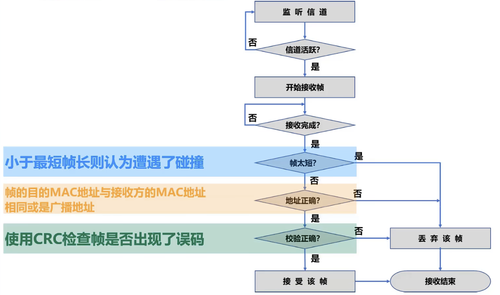
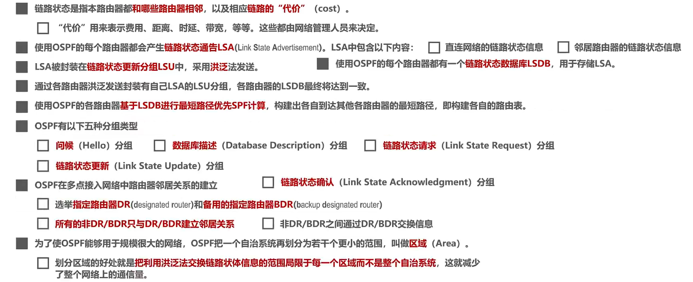
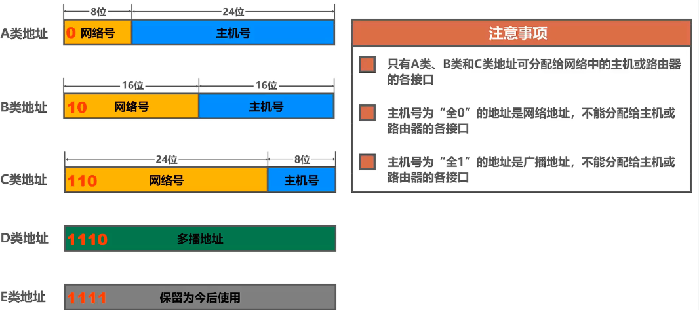
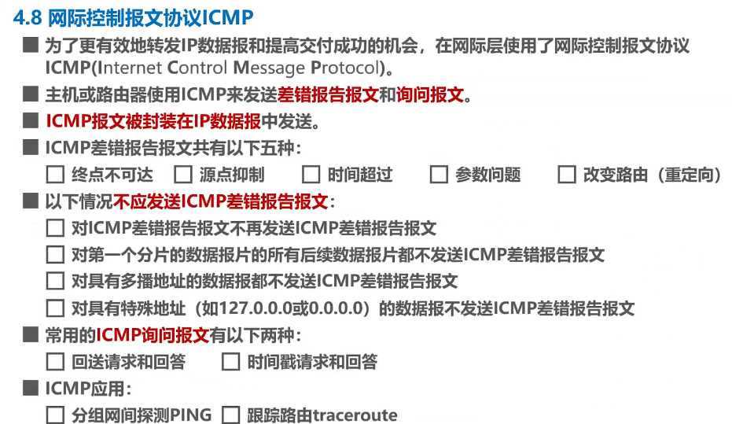

# 计算机网络

**计算机网络**是指将多台计算机通过通信设备和通信链路连接在一起，以实现数据和信息的传输和共享的系统。计算机网络可以覆盖局域网（LAN）、广域网（WAN）、城域网（MAN）等不同范围的网络。

- 重点
  - 软硬件组成
  - 参考模型
- 难点
  - 网络体系结构
  - 网络协议概念
  - 网络分层思想

### 网络的软硬件组成

**硬件：**计算设备

通信链路

路由器

**软件：**协议，应用程序

## 网络体系结构

### *协议

**协议**：**指通信双方关于如何进行通信的一种约定**

每一层的目的都是向上一层提供特定的服务，而把如何实现服务的方式屏蔽

网络协议的三个要素：

- 语法（Syntax）：语法指定了数据在网络中的传输格式和结构，即数据的组织方式和编码规则。它定义了数据包、报文或帧的格式、字段的含义和数据的顺序等。语法规定了协议中使用的数据类型、数据长度、位顺序等规则，以确保数据在网络中正确地传输和解析。
- 语义（Semantics）：语义指定了数据包含的信息的含义和解释方式。它描述了数据的意义、操作和行为，定义了协议中各个字段和数据的具体含义，以及对这些数据进行操作的规则。语义规定了协议的行为和操作，使通信的各个参与方能够理解和解释数据的含义，并按照规定的方式进行处理。
- 时序（Timing）：时序指定了数据在网络中的传输顺序和时机，即数据的发送和接收时间以及顺序。它定义了数据的发送和接收的顺序要求、时间间隔、响应时间等。时序规定了数据包的传输顺序和同步机制，以确保数据在网络中按照正确的顺序和时机进行传输和处理

**网络协议**：同等实体间通信制定的有关通信规则的约定

**对等实体（peer）**,不同机器包含的对应层的实体，如进程，硬件

对等体可能是进程、硬件设备、或人

- 协议实现的细节和接口的规范是由具体的实现者决定的，不影响网络体系结构的定义。
- 一个网络中所有机器上的接口不必都一样，只要每台机器能够正确地使用所有的协议即可
- 不同的网络，其层的数目、各层的名字、内容和功能都不尽相同，但是**每一层的目的都是向它的上一层提供服务**，而把如何实现这一服务的细节对上一层加以屏蔽。
- 网络协议是控制两个或多个网络设备之间通信的规则的集合。网络协议可以分为不同的层次，每一层负责实现不同的功能，并向上一层提供服务。在同一层次上，不同设备之间的通信需要遵循相同的协议，以保证信息的正确传输和解释。例如，应用层协议包括了 HTTP、FTP、SMTP 等，它们规定了应用程序之间如何交换数据；传输层协议包括了 TCP、UDP 等，它们规定了如何建立和维护端到端的连接；网络层协议包括了 IP、ICMP、ARP 等，它们规定了如何寻址和路由数据包；数据链路层协议包括了 Ethernet、PPP、HDLC 等，它们规定了如何在物理介质上传输比特流等等

### 服务

> 服务是各层向它上层提供的一组原语。**服务定义了两层之间的接口**，上层是服务用户，下层是服务提供者。
>
> 只要不改变提供给用户的服务，实体可以任意地改变它们的协议。 n层实体利用n－1层实体提供的服务并执行n层协议来完成对n＋1层提供服务。
>

### 面向连接服务和无连接服务

（1）面向连接服务

​	面向连接服务是在**数据传输之前必须先建立连接，在数据传输结束后再释放这个连接。**

​	具有连接建立、数据传输和连接释放三个阶段。在传输数据时是按序传输的，这与电路交换的许多特性很相似，因此，面向连接服务在网络层中又称为虚电路服务。这里的“虚电路“表示：虽然在两个服务用户的通信过程中并没有始终占用一条端到端的完整物理电路，但用户在感觉上却好像一直在使用这样的一条电路。面向连接服务比较适合在一定期间内要向同一目的地发送多个数据的情形。对于偶尔发送很少量的数据，面向连接服务则由于开销过大而不太适应。

​	若两个用户需要进行频繁的通信，则可建立永久连接。这样可以免除在每次通信时进行连接建立和连接释放这两个过程，永久连接与电话网中的专用话音电路十分相似。

（2）无连接服务

​	在无连接服务的情况下，两个实体之间的通信无须预先建立一个连接，因此，有关资源数据传输时动态分配。日常通信中的短信业务提供的就是无连接服务。

​	无连接服务的另一个特征就是它不需要通信的两个实体同时处于活跃状态。当发送端的实体正在进行数据传输时，它必须是活跃的，但此时接收端的实体并不一定必须是活跃的。只有当接收端的实体正在进行数据接收时，它才必须是活跃的。

​	无连接服务的优点在于灵活方便和迅速及时，但它不能防止数据的丢失、重复或乱序。无连接服务特别适合传输少量数据的情形。

​	无论是面向连接服务还是无连接服务，都不能保障数据传输的可靠性。在此，我们使用服务质量来评价服务的特性。为了实现可靠的服务，通常是由接收端确认接收到每一个数据，使发送端确信它所发送的数据已经正确到达接收端这一方法来实现的。这种确认机制要增加额外的传输开销和延迟，对于不同的网络应用，有时是值得的，但有时则不尽然。
​	

> 有两种面向连接的可靠性服务应用比较广泛，即消息流和字节流。消息流保持应用消息的边界，如发送端发送两个1KB的消息，接收端肯定也是接收到两个1KB的消息，绝不会变成一个2KB的消息。而字节流则没有消息边界，如2KB字节到达接收端后，接收端根本无法分辨所接收的数据究竟是一个2KB的消息还是两个1KB的消息，或者是2048个单字节消息。如果在网络上传送一本书，当把每页作为分离的消息进行传输时，保留消息的边界就变得比较重要。然而，作为一个终端在远程分时系统上登录时，从终端到计算机的字节流传输就能够满足需求。
>
> 对于某些网络应用而言，面向连接的数据传输因确认引起的延迟可能难以满足用户的需求。比如数字化的音频传输，网络用户宁可听到线路上偶尔出现的杂音，或不时混淆的声音，也不愿意因等待确认而造成延迟。同样，在传输视频数据时，错了几个像素并无大碍，但视频突然停顿以等待纠正传输错误却会令人十分不满意。

### 分层

必要性：

1. 可拓展性和模块化
2. 简化和标准化
3. 易于维护和管理
4. 故障隔离和故障排除
5. 性能优化和灵活性

### *五层协议体系

### OSI模型

七层模型

物理层：

- 作用是在物理媒体之上为数据链路层提供的原始比特流的物理连接，尽可能屏蔽传输媒体的差异，透明传送和接收比特流。 

数据链路层：

- 目的是为了在给定的通信链路上提供发送端和接收端之间的无差错信息传输。

网络层：

- 进行路由选择和交换方式，对上层用户屏蔽子网通信的细节（面向对象，无连接，路由选择，拥塞控制）

传输层：

- **传输层是真正的端到端的层**

会话层：

- 负责维护通信中两个结点之间会话连接的建立、维护和断开

表示层：

- 两个通信系统中交换信息的表示方式，包括数据格式的变换，数据的加密和解密，数据压缩与恢复等

### TCP/IP参考模型

TCP/IP模型是计算机网络中常用的协议栈，由四个层次构成，每个层次都有特定的功能。以下是TCP/IP模型每一层的名称、功能和对应的缩写：

1. 应用层（Application Layer）：
   - 功能：为应用程序提供服务，实现应用之间的通信和数据交换。负责处理特定的应用协议，如HTTP、FTP、SMTP等。
   - 缩写：HTTP、FTP、SMTP等。

2. 传输层（Transport Layer）：
   - 功能：负责提供可靠的端到端数据传输服务。处理数据分段、流量控制、错误检测和纠正等。主要有两个协议：
     - 传输控制协议（Transmission Control Protocol，TCP）：提供可靠的、面向连接的数据传输服务。
     - 用户数据报协议（User Datagram Protocol，UDP）：提供不可靠的、无连接的数据传输服务。
   - 缩写：TCP、UDP。

3. 网际层（Internet Layer）：
   - 功能：负责将数据包从源主机路由到目标主机，实现跨网络的数据传输。主要处理IP地址分配、路由选择和数据包的封装和解封装。
   - 缩写：IP。

4. 网络接口层（Network Interface Layer）：
   - 功能：负责处理物理网络接口和链路层协议，将数据帧从一个节点传输到相邻节点。处理硬件地址（如MAC地址）、物理介质访问和错误检测等。
   - 缩写：Ethernet、Wi-Fi等。

### 性能指标

速率 带宽 往返时间RTT 利用率

​	

**速率：**注意区分bit和B

数据的单位bit/s或kbit/s，bit的数量级差距是$$10^3$$

数据量的单位是B(byte，字节) 1B=8bit 

B的数量级差距是$$2^{10}$$

**吞吐量：**单位时间通过网络的数据量，受到网络带宽或者速率限制

**时延：**数据从一段到另一端所需要的时间

1. 发送时延（传输时延）：

$$
发送时延=\frac{数据帧长度(bit)}{发送速率(bit/s)}
$$

2. 传播时延：可以按照光速的2/3算，短距离可以忽略不记

$$
传播时延=\frac{信道长度}{信号在信道上的传播速率(米/秒)}
$$

3. 处理时延
   - 主机或路由器收到分组后，为处理分组的时间
4. 排队时延
   - 排队等待的时长
   - 排队时延的长短往往取决于网络中当时的通信量

对于高速网络链路，我们提高的是数据的发送速率而不是减少bit在链路上的传播速率

**时延带宽积：**以byte为单位的链路长度

$$
时延带宽积=传播时延 *带宽
$$

## 物理层

### 概念

#### 三种通讯方式

|    名称    |                   定义                   | 需要的信道数 |
| :--------: | :--------------------------------------: | :----------: |
|  单工通信  |             只能一个发一个收             |     一条     |
| 半双工通信 | 都可以发或者收，但是同一时间只能进行一个 |     两条     |
| 全双工通信 |            都可以同时收发数据            |     两条     |

#### 码元（[Symbol]）

定义：码元是指用一个固定时长的信号波形，代表离散数值的基本波形。当有多个离散状态时，称为M进制码元

一个码元可以携带多个比特的信息

个人理解：码元就是在网线上传输的一个个信号段。码元的不同进制就是用来表示不同的数值的

#### 波特（Baud）

用来指一秒可以传输多少个码元

#### 数字信号与模拟信号

模拟通信：传输模拟信号

数字通信：传输数字信号

数字通信的优势：远距离传输，无噪声积累

模拟传输：中途去噪放大（滤波器+放大器），无法彻底去除的噪声会同时放大，并在后继传输途中产生噪声累积

数字传输：中途去噪再生（再生器），恢复0或者1原形，无噪声累积。除非变形严重，再生出错。

#### 数字通信原型

#### 信道带宽

带宽或通频带：传输过程中振幅不会明显减弱的这一段频率范围（HZ）. 

信道容量：一个信道的最大数据速率，每秒多少比特（bps） 

### *两个定理

#### 奈奎斯特定理（采样定理）：

规定的是码元极限传输速率

当采样频率大于信号中最高频率的2倍时(fs>2f)，采样之后的数字信号完整地保留了原始信号中的信息。

$$
理想低通信道下的极限数据传输率=2Wlog_2V(b/s)
$$

1. 码元传输速率是有上限的
2. 信道的频带越宽，就可以以更高的速率进行码元传输
3. V表示信号的离散级数，即系统可调制出的信号状态
4. 注意看题中给出的带宽是什么，如果是采样频率，那此时已经是带宽的两倍

#### 香农定理：

规定比特极限传输速率

在带宽受限且有噪声的信道中，为了不产生误差，对于信息传输速率的极限值

$$
信道极限传输速率=Wlog_2(1+S/N)(b/s)
$$

注意这里的**信噪比(dB)**单位是dB，但S/N本身不是以dB为单位
$$
xdb=10log_{10}(S/N)
$$

### 数字调制与多路复用

数字调制：将模拟信号转换为数字信号

#### 编码

- 把数字信号转换为另一种数字信号，在数字信道中传输，称为 `编码`。例如，以太网使用 曼切斯特编码，4B/5B，8B/10B 等编码
- 将模拟信号转换为数字信号，在数字信道中传输，也称为 `编码`。例如，对音频信号进行编码的脉码调制 PCM

##### 编码方式

不归零编码：就是指在整个码元时间内，电平不会出现零电平

`需要一根额外的传输线来传输时钟信号`，因为存在同步问题，计算机网络传输中不采用这个

曼彻斯特编码：

在每个码元时间的中间时刻，信号都会发生跳变。例如，负跳变表示比特 1，正跳变表示比特 0。

- 码元中间时刻的跳变既表示时钟，又表示数据
- 传统以太网就使用的曼切斯特编码

**差分曼彻斯特编码：比曼彻斯特编码变化少，更适合较高的传输速率**

- 跳变仅表示时钟
- 码元开始处电平是否发生变化表示数据

**4B/5B编码：**使用5bit的二进制表示4bit的二进制，效率为80%，避免缺少足够的跳变而时钟错乱

百兆网络中使用此方法

#### 调制

**基本调制：**只能调出两个波形

**混合调制：**

> 混合调制，属于多元制，也就是可以调制出多种基本波形

举例：正交振幅调制 QAM-16

- 可以调制出 12 种相位
- 每种相位有 1 或 2 种振幅可选
- 因此共可以调制出 16 种码元（波形），每种码元可以对应表示 4 个比特
- 码元与 4 个比特的对应关系不能随便定义，应采用格雷码。任意两个相邻码元之间只有 1 个比特不同

### 数据交换方式

#### ①分组交换

**分组交换采用把一个个小的数据包转发传输来实现数据交换。**

主要的**缺点**：

1、不具有实时性。

2、存在延时。

3、会造成通信阻塞。

4、存在无用的重复数据。

5、会出现丢包的情况。

**优点**：

1、设计简单。

2、资源利用率很高。

#### ②电路交换

电路连接的**三个阶段**：

1、建立电路连接。

2、数据传输。

3、释放连接（电路拆除）。

**优点**：
1、传输速度快、高效

2、实时，不会有冲突

**缺点**：

1、资源利用率低。

2、新建连接需要占据一定的时间，甚至比通话的时间还长。

#### ③报文交换（包交换）

不建立物理电路，将发送数据作为**整体**交给中间交换设备，中间交换设备选择一条合适的空闲输出线将数据发给下一个中间交换设备，直到达到目的地

### 信道复用

> 复用 (multiplexing) 是通信技术中的基本概念。
> 它允许用户使用一个共享信道进行通信，降低成本，提高利用率。

#### ①频分复用（Frequency Division Multiplexing）

- 将整个带宽分为多份，用户在分配到一定的频带后，在通信过程中自始至终都占用这个频带。
- 频分复用的所有用户在同样的时间占用不同的带宽资源（请注意，这里的“带宽”是频率带宽而不是数据的发送速率）。

#### ②时分复用TDM

时分复用则是将时间划分为一段段等长的时分复用帧（TDM 帧）。每一个时分复用的用户在每一个 TDM 帧中占用固定序号的时隙。

同步时分复用技术：每个终端分配的时间片固定，不能被抢夺

统计：动态分配，充分利用信道，控制比较复杂

> 以上两种方式较为成熟，但不够灵活

**统计时分多路复用**：在同步时分复用方法上改进，按照数据到达的先后顺序分配时隙，当一个帧满了之后，则会发送

#### ③波分复用

波分复用就是光的频分复用。使用一根光纤来同时传输多个光载波信号。

#### ④码分多址接入（Code Division Multiple Access，CDMA）

> 各用户使用经过特殊挑选的不同码型，因此彼此不会造成干扰。运行所有站点同时使用整个信道发送
>

每个用户分到唯一的M比特码序列，信号可以线性叠加

在CDMA中，每个比特时间再分成m个码片，每个站分配一个唯一的M比特码序列。

发送规则如下：

- 当某个站发送“1” 时，在信道中发送它的码序列；

- 当发送“0”时，就发送它的码序列的反码(非值)。

- 这种编码方式使得发送信息量为原来的m倍。

**实现线性叠加的原理是：对于比特码序列需要选取相互正交的，这样当相加之后，也只会和有自己信号的信号叠加出1或-1**

### 传输介质

#### 双绞线

由两根采用**一定规则并排绞合**的、互相绝缘的**铜导线**组成

- 便宜
- 通信距离一般为几公里到几十公里
- 距离太远，需要中继器和放大器处理

#### 同轴电缆

同轴电缆比双绞线有更好的屏蔽性，因此能以更高的速率传输更长的距离，其可能达到的带宽取决于电缆的质量、长度、数据信号的信噪比等，并广泛应用于有线电视网和城域网中；

#### 光纤

光纤由纤芯（实心）和包层组成，带宽很大

把电脉冲转换为光源

单模光纤的直径大概为8-10um

特点：

1. 损耗小
2. 抗磁性强
3. 不易被窃听
4. 体积小，重量轻

光纤融合：

（1）可以将它们接入连接头并插入光纤插座，连接头要损失10%到20%的光，但重新配置系统容易；

（2）可以用机械方法将其结合，但要损失大约10%的光；

（3）两根光纤可以被融合在一起形成坚实的连接，但有点衰减；

### 无线传输介质

#### 无线电传输

VLE LF MF 贴地面传播，低频 1000公里以内

HF VHF 经电离层反射 业余无线电爱好者 军队

#### 微波传播

特点

- l00 MHZ以上的频段，沿直线传播，
- 通过抛物状天线把所有的能量集中于一小束，极高的信噪比，
- 发射天线和接收天线必须精确地对准，方向性要求高。
- 易被雨水吸收。
- 使用的频段扩展到了10GHZ，一般为4GHZ。带宽大
- 频率越高，可同时传送的信息量越大。

微波接力通信：由于微波是沿直线传播的，故在地面的传播距离有限，因此隔一段距离就需要一个中继站。中继站接收前一个中继站送来的信号，经放大后再发送到下一个站。

应用：光纤出现以前，微波是远距离电话传输系统的核心。

### 问题

#### 计算题

1. 比较在一个电路交换网和在一个（负荷轻的）分组交换网上将x比特报文沿k段传输路径传输的延时。假定线路建立时间是s秒，每段上的传输延迟为d秒，分组大小为p位，数据传输速率是b bps。在什么情况下，分组交换网的延迟更短。

电路交换：
$$
发送时延：x/b \\ 传播时延：kd \\总时延：s+x/b+kd
$$
分组交换：
$$
发送时延：x/p*p/b \\ 传播时延：kd \\ 转发时延：(k-1)p/b
$$
2. 假定将x比特用户数据装配成一系列的分组，沿一条k段的路径在分组交换网中传输，每个分组含p个数据位和h个报文位，x≥p+h，，线路速率为b bps，传输延迟忽略不计。什么样的p值使总的延迟最小？

​	按照分组交换计算时间，之后对t求导

## 数据链路层

数据链路(data link)除了物理线路外，还必须有通信协议来控制这些数据的传输。若把实现这些协议的硬件和软件加到链路上，就构成了数据链路。

现在最常用的方法是使用适配器（即网卡）来实现这些协议的硬件和软件。

**目的：实现两个节点的无差错传输**

### 功能

1. 封装成帧
2. 透明传输
3. 差错控制 

### 提供的服务

**基本服务**:将源机器的网络层数据传输到目的地机器网络层。

1. 无确认 无连接服务
   - 接收方不对收到的帧进行确认
   - 由于线路上的噪声而造成的帧丢失，数据链路层不作努力去恢复，而将该工作留给上层
   - 局域网 以太网
2. 有确认 无连接服务
   - 每一帧都单独确认
   - 若某个确定的时间间隔内未能收到确认帧（超时），则发送方自动重发
   - WIFI
3. 有确认面向连接服务
   - 网络层进程提供了可靠的位流，适用于长距离且不可靠的链路
   - 卫星通路

### 成帧

成帧(Framing)：在发送方，数据链路层从网络层获得分组后，要加上必要的帧头与帧尾后传送给物理层，并通过物理层传送到接收方的数据链路层。

拆帧：在接收方，数据链路层则必须去掉发送端数据链路层所加的帧头和帧尾部分，从中分离出网络层所需的分组。

#### 帧的界定方法

常用方法：

1. 字节计数法：在数据第一个数字表示有几位，缺点：害怕标记位错误

2. 带字节填充的标志字节法：Flag+Header Trailer+Flag组成，害怕数据位中有flag

   解决方法：

   在数据中遇到的flag前加一个ESC，遇到的ESC前再加一个ESC，接收端忽略连续的两个ESC中前面的一个

3. 带位填充的标志比特法：每一帧使用一个特殊的位模式“01111110”作为开始和结束标记，**发送端逢5插0**，接收端逢5个1删0

4. 物理层编码违例法

5. 用控制字符进行帧定界的方法

   当数据是由可打印的 ASCII 码组成的文本文件时，帧定界可以使用特殊的帧定界符。

   控制字符 SOH (Start Of Header) 放在一帧的最前面，表示帧的首部开始。另一个控制字符 EOT (End Of Transmission) 表示帧的结束。

6. 在帧之间添加时间间隙，但也有可能错误

> **透明传输的定义：**
>
> “在数据链路层透明传送数据”表示无论发送什么样的比特组合的数据，这些数据都能够按照原样没有差错地通过这个数据链路层。
>

### 差错控制

误码率：
$$
P_e=错误接收的码元数/接收的码元总数
$$
**不管信道质量多高，无论通过哪种类型传输介质或信道进行数据传输，误码率都不可能是零**

根据噪声产生原因的不同，差错分为随机错和突发错。

1. 热噪声（布朗运动）→随机错
2. 冲击噪声（如EMI/RFI电磁干扰/射频干扰）→突发错

#### 检错码

1. 奇偶校验码
   1. 水平奇偶校验
   2. 垂直奇偶校验
   3. 垂直水平奇偶校验

   
   
   奇校验（Odd Parity）：校验位被设置为使得数据中的1的数量（包括校验位）为奇数。如果数据中的1的数量已经是奇数，校验位被设置为0，以使得总的1的数量为偶数；如果数据中的1的数量为偶数，校验位被设置为1，以使得总的1的数量为奇数。
   
   `只能检测一位错`
2. 校验和（Check Sum）

   检验强度弱

   
3. 块校验码（Block Check Code）

   > 把所有的字符（连同奇偶位）进行异或运算，运算结果即为其块校验码，通常发送端在发送完数据区的结束标志后发送BCC，接收端一边接收数据一边计算BCC，最后与接收到的BCC比较，以确认所接收到的数据正确与否 
   >
   > 对于偶数个错误无法检验
4. 循环冗余校验码（CRC）

##### CRC

原理：

1. 多项式除法：被除多项式=除式*商+剩余多项式
2. 通信双方约定除式，也就是生成多项式，发送方将**剩余多项式**作为冗余信息发送给接收方
3. 接收方验证所收到的多项式能否为除式所整除，以判断传输过程是否出错
4. 进行除法之前，需要将原有信息码左移，左移位数为除式的最高次
5. CRC码为 信息码+冗余码

n位的数据序列对应n-1次多项式的系数。$$f(x)=a_{n-1}x_n-1 +a_n-2x^{n-2} + a_1x + a_0 $$

#### 纠错码

信道编码的结果称为码字

##### 汉明码

> 纠一位错的编码
>
> 码字中2的幂次方位为校验位
>
> **每个校验位迫使某一组位的奇偶值为偶数或奇数.**

n个数据位，m个校验位，共m+n位，只需要满足$$m^2-1>m+n$$

在信息编码中，两个合法代码对应位上编码不同的位数称为码距，又称海明距离。

例子：10101和00110从第一位开始依次有第一位、第四、第五位不同，则海明距离为3。

检错能力：

- 全部单个错 
- 全部离散的二位错 
- 全部奇数个错
- 全部长度小于或等于K的突发错（ K为生成多项式的最高幂次）
- 以1-（1/2）k-1的概率检出长度为k+1位的突发错 

> 要做到“可靠传输”（即发送什么就收到什么）就必须再加上**确认和重传**机制。  
>

### 流量控制

流量控制的作用是使发送方所发出的数据流量，使其**发送速率不要超过接收方所能接收的速率**

**捎带应答（piggybacking）**

- 将确认序号携带在数据帧中传输，提高线路的效率；

推迟确认

- 当需要发送确认但没有要发送的数据进行捎带时，可以让确认信息推迟一小段时间再发送；

**滑动窗口协议**

- 允许发送端在没有收到前一个帧的确认时，就可以发送后续的帧；接收端可以对正确收到的若干个帧同时进行确认。

**滑动窗口**协议的要点

- 任何时刻发送进程维持一组帧序号，对应于一组已经发送但尚未被确认的帧，用一个发送窗口维持这些帧；

- 接收进程也维持一组帧序号，对应于一组允许接收的帧，用一个接收窗口维持这些帧序号。

### 协议

无限制的单工信道（非常理想的条件）（协议一）：一个发送，一个接收，无限制传输

单工停-等协议（只是进行流量控制）（协议二）：假定信道不会出错，但需要进行流量控制，一次发送一帧，保证能接收，只有接收到该帧的响应后才发送下一帧

有噪信道上的单工协议（协议三）：

- 采用协议2中的停-等方式；
- 发送方每次只发送一个帧，当这个帧被正确接收后才能发送下一帧，若该帧未在规定的时间内得到确认（超时），则重发该帧；
- 接收端对每个收到的帧进行校验，对正确收到的帧发回确认，错误的帧丢弃；
- 由于需要区分新、旧两个帧，因此要使用1比特的帧序号。

#### 滑动窗口协议

滑动窗口条件：

> - **捎带确认(piggybacking)**—将确认暂时延迟以便可以附加到下一个外发数据帧中
> - 帧序号 $$0-2^{n-1}$$  正好填入n位的域 
> - 发送窗口中的序列号代表已经发送，而未被确认的帧，这些帧可能被重新发送
> - 接收方窗口对应于期望接收的帧

##### 一位滑动窗口协议

自动重复请求（ARQ）是应用最广泛的一种差错控制技术，包括:无错接收的PDU（协议数据单元）的肯定确认、对未确认PDU（协议数据单元）的自动重传和丢弃。

##### 管道化技术

连续发送w个数据帧,其中有一帧出错,但其后续帧被成功发送

接收方的接收策略选择

1. 丢弃错帧及后续帧，其后续帧因不是期望接收帧也被丢弃 
2. 丢弃错帧，缓存后续正确接收帧

对应的发送方的重传策略选择 ：

1. 缓存在发送窗口中的出错帧以及其后续帧全部重发--协议5
2. 只重发出错帧--协议6

##### 信道利用率

$$
信道利用率 =W*T_f/ (T_f+R)
               =W*k/(k+bR)
$$

W：滑动窗口最大长度

Tf：发送一个数据帧的时延

R：双程传播时延

D：单程传播时延

b：发送速率

w<=2*BD+1

#### 协议四：

滑动窗口大小都是1，双向停等

因为只有窗口大小只有1，所有序列号和确认值在01之间交替

- 连续出现相同发送序号的数据帧，表明发送端进行了超时重传。
- 连续出现相同序号的确认帧，表明接收端收到了重复帧。 
- 发送端在发送完数据帧时，必须在其发送缓存中暂时保留这个数据帧的副本。
- 这样才能在出差错时进行重传。只有确认对方已经收到这个数据帧时，才可以清除这个副本。 

#### 协议五（回退n帧）

滑动窗口>1，接收窗口=1

出错帧不确认(引发超时)

发送方超时重传，从未被确认帧开始

采用了累计确认（n帧被确认时，小于n帧都被确认，可以丢弃）

发送方一直保存着未被确认的帧。

如果使用3bit编码的时候，发送窗口的最大值为$$2^n-1$$，为了避免把第二帧的帧误认为第一帧的错误帧

#### 协议六（重发错误帧）

对于选择重传 ARQ 协议，接收窗口的尺寸$$W_R$$不应再等于1，以便于接收方先收下失序到达但是无误码，并且序号落在接收窗口得那些数据分组

对于每一帧需要逐一确认

若用 n 比特进行编号，则接收窗口的的约束
$$
1<W_R <= 2^{n-1}
$$
发送窗口大于等于接收窗口

发送窗口的尺寸限制是为了避免将第二帧的帧误认为第一帧的错误帧，需要保证新老窗口不重叠

## 介质访问控制子层

数据链路层分为两个子层：

**媒体接入控制 MAC子层**：介质访问

**逻辑链路控制 LLC子层**：承上启下（弱层）

### 媒体接入控制MAC

共享信道着重考虑得是如何协调多个发送和接收站点对一个贡献传输媒体的占用

1. 静态划分信道
2. 动态接入控制

​		在有线领域，点对点链路和链路层交换机的交换式局域网已经取代了共享式局域网

#### 五个关键假设

- 站模型：由N个独立的站组成，每个站有一个可以产生待发送帧的程序。一旦生成一帧，该站就被阻塞，直到帧被成功传出
- 单通道假设：所有通信都通过单个信道进行。所有的站都在该信道上发送和接收信息。尽管软件可赋予各站优先级，但就硬件来说，各站是平等的
- 冲突假设：若两帧同时发送，它们会相互重叠，使信号难以辨认。所有的站都能检测到冲突。冲突的帧必须事后重发。除了冲突产生的差错外，不再有其他任何差错
- 发送时间假设：
  - 连续任意时刻可发送：帧能在任何时候开始发送。没有主时钟将时间分隔为离散的发送区间
  - 分槽时间：时间被分为离散的区间（时隙）。帧总是在时隙开始的一瞬间开始发送。一个时隙内可发送0，1或多个帧，它们分别对应空闲时隙、成功时隙、发生冲突
- 载波检测：
  - 有载波检测：所有站在使用信道以前都可以检测到信道是否正在使用。若忙，其他站不会去使用它，直到它变得空闲
  - 无载波检测：各站在使用信道前不检测信道，只是盲目地发送，事后才能确定本次传送是否成功

#### ALOHA协议

基本思想适用于任何无协调关系的多用户竞争单信道使用权的系统

- 纯ALOHA

- 分隙ALOHA

区别：是否将时间分成离散的时隙。纯ALOHA无需全局时间同步，而分隙ALOHA则必须时间同步。

##### 纯ALOHA：

- 用户只要有数据待发，就让他们发

- 当产生冲突，使帧受损时，发送方只要侦听信道就会知道

- 若帧遭破坏，则发送方随机等待一段时间后重发

一些定义：

帧时：传输标准固定帧所需时间，帧的长度除以位速率

假设无穷多用户按照泊松分布产生新帧N，也就是平均每个帧时间产生N帧，要求0<N<1

G是单位帧时**产生的新帧**和**重发帧**的和，G>=N, 也服从泊松分布。

吞吐量：$$S=GP_0$$，$$P_0$$是没有冲突的概率

一个帧时中生成k帧的概服从泊松分布
$$
Pr[k]=\frac{G^ke^{-G}}{k!}
$$
一个单位帧时间内生成零帧的概率
$$
Pr[0]={e^{-G}}
$$
在冲突窗口内，即两个单位帧时不存在其他流量的概率是，即产生0帧的概率，也就是两个单位帧时内成功传输的概率
$$
P_0=Pr[0]^2=>S=Ge^{-2G}
$$
**G=0.5时，S达到最大，为1/2e （0.184）**

##### 分槽ALOHA协议：

- 把使用信道的时间分成离散的时间槽，槽长为一个帧所需的发送时间，每个站点**只能在时间槽开始时才允许发送**，其他过程与纯ALOHA协议相同。

- 冲突主要发生在时间槽的起点，一旦发送成功就不会出现冲突，分槽ALOHA大幅度降低了冲突的可能性，信道利用率比纯ALOHA提高了约一倍。

G=1时，吞吐量S达到最大，为1/e （0.368）

#### 载波侦听多路访问协议CSMA/CD

网络站点侦听载波是否存在（即有无传输）并相应动作的协议。

多点接入MA：多个主机连接在一条总线上，竞争使用总线

载波监听CS：发送帧先检测，如果总线有96bit时间空闲，则认为总线空闲

- 持续CSMA
  - 1-持续CSMA
  - p-持续CSMA
- 非持续CSMA
- 有冲突检测的CSMA

CSMA/CD曾用于各种总线结构以太网和双绞线以太网的早期版本，现在以太网基于交换机和全双工连接，已经没必要使用了

##### 持续CSMA

有信息发送时，一直侦听信道是否有人发送，没有的话则以p概率在当前发送，以1-p概率推延到下一个时隙

 

##### 非持续CSMA

有信息发送时，如果有人占用信道，则随机等待一个时间后再侦听

##### CSMA/CD

两帧同时检测到信道空闲并开始传播，则会基本在同时发现冲突，然后应当立刻停止发送

##### 碰撞检测

- 计算机边发送数据边检测信道上的信号电压大小。

- 当几个站同时在总线上发送数据时，总线上的信号电压摆动值将会增大（互相叠加）。

- 当一个站检测到的信号电压摆动值超过一定的门限值时，就认为总线上至少有两个站同时在发送数据，表明产生了碰撞。

##### 最小帧长

$$
最小帧长=争用期 \ \times \ 数据传输速率
$$

最小帧长：**以太网规定最小帧长位64字节**，即512bit

最小帧长保证了在发送时一定可以检测到是否碰撞，同时如果接收到的帧小于64字节，可以直接丢弃

##### 截断二进制指数退避算法

$$
退避时间=基本退避时间（争用期2\tau）* 随机数r[r\in (0,1,2,...,2^{k-1})]（k=min[重传次数，10]）
$$

重传16次仍然不能成功时，则放弃发送，向上级报告

##### 信道利用率

##### 帧发送

##### 帧接收

#### CSMA/CA

Carrier Sense Multiple Access with Collision Avoidance

载波监听多址接入/碰撞避免

##### 为什么无线局域网中不能使用CSMA/CD

- 仍然可以使用CSMA进行载波监听
- 不能使用CD的原因是：
  - 无线信号强度波动很大，无线网卡接收到的信号和发送信号会有很大数量级的差距，如果要在无线网卡上实现碰撞检测CD，对硬件要求很高
  - 存在隐蔽站问题，进行碰撞检测的意义不大

802.11规定，所有站点必须在持续监测到信道空闲一段时间后才可以发送帧，这段时间被称为帧间间隔*IFS*

IFS的长短取决于发送的优先级

- 短帧间间隔SIFS (RTS/CTS帧，确认帧，段)  
- DCF帧间间隔DIFS（常规帧间隔，任何站可以在介质空闲DIFS后尝试抓住信道发送新帧) ； 

##### 退避算法

##### 信道预约

- 为了尽可能减少碰撞的概率和降低碰撞的影响，802.11允许要发送数据的站点对信道进行预约
  - 发送数据帧前先发送一个短的控制帧，称为`请求发送RTS`，它包括源地址、目的地址和此次通讯所需要的时间
  - 若目的站正确接收到RTS帧，就发送一个响应控制帧，称为`允许发生CTS`，也包括持续时间
- 其他各站收到CTS后推迟接入无线局域网
- RTS发送碰撞就收不到CTS帧，需要执行退避算法重传RTS帧
- CTS和RTS很短，这种用小代价对信道预约往往是值得的，有三种情况可选
  - 使用RTS和CTS
  - 不使用RTS和CTS
  - 只在数据帧长度大于某一值时才使用RTS和CTS

##### 虚拟载波监听

除了RTS，CTS会携带通信需要时间，普通数据帧也能携带通信需要持续的时间，这称为802.11的虚拟载波监听机制

### 以太网

> 定义：一种常见的局域网（LAN）技术，用于在计算机和其他网络设备之间进行数据通信

**IEEE802.3标准：**

IEEE802.3（以太网）、IEEE802.11（无线LAN）、IEEE802.15（蓝牙）、IEEE802.16（无线MAN）

#### 以太网MAC子层协议

在局域网中，硬件地址又称为`物理地址`（很重要，不要理解错误，物理地址指的是MAC地址），或 MAC 地址。 MAC地址是对接口的唯一标识，而不是对设备的唯一标识

802 标准所说的“地址”严格地讲应当是每一个站的“名字”或标识符。 

IP地址指的是TCP/IP体系结构网络层使用的地址

ARP是通过IP地址获取设备的MAC地址的协议

在主机发送的帧中必须携带标识发送主机和接收主机的地址，由于这类地址是用于**媒体接入控制MAC**，因此这类地址被称为`MAC地址`，也叫硬件地址，注意这并不属于物理层

网卡检测：

“发往本站的帧”包括以下三种帧： 

- 单播(unicast)帧（一对一）

- 广播(broadcast)帧（一对全体）

- 多播(multicast)帧（一对多）

发送顺序：

1. 第一字节到第六字节
2. b0->b7

#### 两个重要措施

- 采用较为灵活的无连接的工作方式，即不必先建立连接就可以直接发送数据。 

- 以太网对发送的数据帧不进行编号，也不要求对方发回确认。

### 无线局域网

#### 曼彻斯特编码

每个比特位分成相等的间隔，发送1时前面间隔为高电平，后面间隔为低电平，发送0相反，便于接收方和发送方同步

### 集线器与交换机

集线器的以太网在逻辑上仍是一个总线网，各站共享总线资源，使用的还是CSMA/CD协议

集线器只工作在物理层

使用集线器在物理层扩展以太网 

以太网交换机：

- 多个接口，全双工方式
- 同时连通多个接口，无碰撞
- 工作在数据链路层，收到帧后在自己的帧交换表中查找目的MAC地址对应的接口号，然后转发
- 帧交换表是自学习算法自动建立起来的
- 交换机隔离碰撞域但是不隔离广播域

#### 交换机自学习和转发帧

自主学习

转发学习

### 以太网交换机的生成树协议

冗余链路

可能会带来网络风暴

#### 生成树协议STP

> 交换机可以自动计算并构建一个逻辑上没用环路的网路

路由器隔离广播域，但全部使用路由器过于昂贵了

所以可以通过虚拟来实现

### 虚拟局域网及VLAN

使用路由器可以隔离广播域，但路由器以前使用成本高

因此产生了虚拟局域网

再同一个VLAN域中广播

#### 虚拟局域网VLAN的实现机制

## 网络层

网络层位置：

- 位于OSI的参考模型第三层
- 建立在数据在物理上的成功传输
- 是处理端到端的数据的最底层

网络层目的：

- 屏蔽各种不同类型网络之间的差异，为端系统之间的数据透明传送提供连通支撑

功能：

1. 路由选择
2. 分组转发
3. 异构网络互联
4. 拥塞控制（与流量控制不太相同）

> 转发：达到路由器输入链路之一的数据报如何转发到该路由器的输出链路之一
>
> 路由选择：控制数据从源主机到目的主机的端到端路由中路由器之间的路由方式
>
> 数据平面：数据平面对于数据处理过程中各种具体处理转发的过程
>
> 控制平面：用于控制和管理网络协议的运行，比如OSPF协议，RIP协议，BGP协议

SDN方法控制平面

软件控制的方法，路由器仅实现转发功能，**远程控制器**计算和分发转发表以供每台路由器所使用

### 网络路由

负责确认收到分组传输出去的线路

**分类：**自适应 非自适应

- 非自适应路由算法（或称静态路由算法）：不根据实测或估计的网络的当前通信量和拓扑结构来作路由选择；路由表是事先计算好的，在网络启动后下载到路由器中

- 自适应路由算法（或称动态路由算法）：根据实测或估计的网络的当前通信量和拓扑结构来作路由选择

设计基础：

- 最优化算法：每两个路由间路径都是最优的
- 最短路径：djikstra算法
- 扩散法：向除了包来的方向全部发包
  - 改进：选择扩散，长时间丢包
  - 优点：健壮性
  - 缺点：浪费带宽

#### 分级路由：

- 每个路由器只需要知道自己分区内的情况，不需要知道区外的情况

- 减少CPU开销
- 代价可能是路径增加

#### 广播算法：

方法：

1. 没有任何特殊性，发就完事了
2. 扩散法：有点消耗带宽
3. 多目标路由
4. 使用以发起节点为根的汇聚树：必须要求所有节点都知道这颗树
5. 逆向路径：如果广播分组是沿着最佳路径传播过来的，则广播转发，否则丢弃

#### 路由算法：

距离路由矢量算法：

原理：

- 每个路由器维护一张表
- 表中给出了到每个目的路由器已知的最短“距离”和相应输出线路
- 通过与相邻路由器交换距离信息来更新表

#### RIP

路由信息协议RIP

> 要求每一个路由器需要维护一个从自己到系统内其他每一个网络的距离的记录，称为“距离向量D-V”

使用跳数作为度量，到直连网络为1

一条路径最多为15个，`距离为16时不可达`

> 只适用于小型互联网

工作原理：

- RIP认为好路由为跳数小的路由
- 如果距离相等，则等价负载均衡
- RIP包：
  - 和谁交换信息   相邻路由器
  - 交换什么信息   自己的路由表
  - 何时交换信息   周期性

#### 开放最短路径优先OSPF

性质：

- 为了克服RIP的缺点而研发的
- 使用了Dijkstra提出的最短路径算法SPF
- 基于`链路状态`
- 不限制网络规模，收敛快
- `链路状态`值得是和哪些路由器相连，以及相应`链路的代价`

工作原理：

- 相邻路由器之间交换`问候（Hello）分组`，建立维护关系
- 封装在IP数据报中
  - 目的IP：224.0.0.5
  - 协议号：89
- 周期为10s
- 40s未收到则默认邻居路由器不可达7

#### 边界网关协议BGP

### 分类编址IPv4

对于A类地址

- 最小网络号0保留
- 最大网络号127，作为本地环回测试地址，不指派
  - 最小127.0.0.1
  - 最大127.255.254
- 最后一个可指派的网络号为126

对于B类地址

最小网络号128.0

最大网络号191.255

对于C类地址

### IP数据报格式

首部+数据部分

版本：IPv4/IPv6

首部长度：**最小单位是4b**

区分服务：指示期望获得哪种类型的服务

总长度：首部+数据，单位为1b，最长为$$2^{16}-1=65525$$

生存时间(TTL)：IP分组的保质期，经过一个路由器-1，到0时抛弃

协议：数据部分使用的协议 TCP=6，UDP=17

### IP数据报分片

**最大传输单元MTU**

链路层数据帧可封装的数据的上限

标识：同一个数据报的分片使用同一标识

标志：后两位才有意义

​	中间位DF：DF=1，禁止分片   DF=2，允许分片

​	最低位MF：MF=1，表示还有分片 MF=0，没有分片

片偏移：在原始字段中的偏移位置，单位为8b

### IPV4

IP地址::={<网络号><主机号>}

特点地址：

​                                                                                                                                                                                                                                                                                                                                                                                                                                                                    

### 子网划分和子网掩码

原因：A类和B类主机号太多，用不上，单位子网划分后吗，对外展示依然为一个网络                                                                                                                                                  

子网掩码和IP地址进行与运算，求出来的内容就是网络地址，子网掩码的某个段如果全是0，则代表是主机号而不是网络地址

只要不是1则后面都是主机号，而不是掩码地址，注意子网号的长度是由用户自定义的                                                                                                                                                                                                                      

### 无分类编址CIDR

1. 消除了类地址以及划分子网概念
2. 融合子网地址与子网掩码

CIDR记法：IP地址后加/然后写上网络前缀位数

#### 应用：

构成超网（路由聚合）

取网络地址的交集，注意网络前缀位数的变化

### ARP协议

Address Resolution Protocol（地址解析协议）

IP地址与MAC地址的映射

### 动态主机配置协议DHCP

Dynamic Host Configuration Protocol（动态主机配置协议）

可以自动分配IP地址. DHCP中继代理,由DHCP服务器分配空闲的IP地址。

当一个主机想得到一个IP地址，它在其物理网络中广播一个DHCP的发现报文，对应的IP分组源地址全0，目的地址全1。该网络中的所有主机都收到该广播报文。但只有DHCP服务器才对广播报文进行应答（DHCP offer）。

- 分配的IP地址是临时的。
- 分配的IP地址可以使用多久？有效周期为一段固定的时间--租用技术
- 用户要继续使用，必须向DHCP服务器申请续租

### 网际控制报文协议ICMP

### 组播管理协议IGMP

IGMP（Internet Group Management Protocol）是一种用于在IP网络中进行组播（multicast）管理的协议。它允许主机（或路由器）加入、离开和查询组播组，并与组播路由器进行交互。

IGMP协议的主要功能是在主机和组播路由器之间进行通信，以实现组播组的管理。以下是IGMP协议的一些关键特点：

1. 组播组的加入和离开：主机可以使用IGMP协议向组播路由器发送加入或离开特定组播组的消息。当主机希望接收某个组播组的数据时，它发送加入消息；当主机不再需要接收某个组播组的数据时，它发送离开消息。

2. 组播组的查询：组播路由器使用IGMP协议发送查询消息以了解网络中哪些主机仍然对特定组播组感兴趣。主机需要定期回应查询消息以表明它们仍然对组播组感兴趣。

3. 版本：目前常用的IGMP版本是IGMPv2和IGMPv3。IGMPv2是最常见的版本，支持基本的组播管理功能。IGMPv3引入了更多高级功能，如源特定组播（Source-Specific Multicast）和多个组播组的查询等。

4. 多播路由：IGMP协议与多播路由协议（如PIM-DM、PIM-SM等）结合使用，以支持组播流量的传输和转发。多播路由器根据接收到的IGMP消息来构建组播树状结构，并将组播数据转发到对应的接收主机。

IGMP协议在局域网（LAN）环境中特别有用，因为组播流量在局域网内进行广播，而不是向每个主机单独发送。通过使用IGMP协议，主机可以有效地管理和参与组播通信，实现高效的组播数据传输。

### 虚拟专用网络VPN

路由器检测到有效的私有地址后，将元数据吧

### 网络地址转换NAT

路由器对于目的地址是私有IP的一律不转发

NAT：在**专用网**连接到**因特网**的路由器上安装NAT软件，NAT路由器至少有一个**外部全球IP地址**

- 使大量内部专用地址的网络用户共享少量外部全球地址

NAPT：路由器将私有端口映射到公有IP的端口

- 加上端口号进行映射，更多的可以使用的地址

### 网络控制算法

#### 令牌桶

令牌桶（Token Bucket）是一种流量控制算法，常用于限制数据包在网络中的发送速率。它通过维护一个令牌桶来控制发送速率，只有在令牌桶中有足够的令牌时，才能发送数据包。

令牌桶算法的基本原理如下：

1. 令牌生成：在固定的时间间隔内，令牌桶以恒定的速率生成令牌，并将其放入桶中。生成的令牌数量取决于桶的容量和生成速率。

2. 令牌消耗：每当有数据包需要发送时，它必须从令牌桶中获取足够的令牌。每个数据包消耗的令牌数量取决于数据包的大小。

3. 令牌检查：在发送数据包之前，系统会检查令牌桶中是否有足够的令牌可用。如果有足够的令牌，则允许发送数据包并从令牌桶中扣除相应数量的令牌；如果没有足够的令牌，则需要等待令牌桶中生成足够的令牌后再发送数据包。

令牌桶算法的优点是能够平滑地限制发送速率，提供较为稳定的流量控制。它适用于控制网络中的突发流量和峰值流量，可以有效地防止网络拥塞和资源浪费。另外，令牌桶算法也可用于实现服务质量（QoS）机制，按照不同的令牌生成速率和令牌消耗规则，为不同的数据流分配不同的带宽。

需要注意的是，令牌桶算法只能控制发送速率，而不能控制接收速率。在实际应用中，令牌桶算法常常与其他流量控制机制（如拥塞控制算法）结合使用，以实现全面的流量管理和控制。

#### 漏桶

漏桶（Leaky Bucket）是一种流量控制算法，用于限制数据包在网络中的发送速率。漏桶算法以恒定的速率从桶中漏出（丢弃）数据包，超过桶容量的数据包会被丢弃或延迟发送，从而控制发送速率。

漏桶算法的基本原理如下：

1. 桶容量：漏桶算法维护一个固定容量的桶，用于存放待发送的数据包。桶的容量决定了能够处理的突发流量的大小。

2. 数据包进入：当数据包到达时，它会被放入桶中。

3. 漏出速率：桶以恒定的速率漏出数据包，即按照预设的速率发送数据包。如果桶中有数据包，就会按照固定的速率从桶中取出并发送。

4. 溢出处理：如果桶中的数据包超过了桶的容量，即桶溢出，则溢出的数据包可以选择丢弃或延迟发送。

漏桶算法的特点是能够平滑地限制发送速率，即使在突发流量时也能保持较为稳定的速率。它可以防止网络拥塞和资源浪费，保证网络的稳定性和公平性。漏桶算法适用于限制数据发送速率，对于需要固定发送速率的应用场景有较好的效果。

需要注意的是，漏桶算法只能控制发送速率，而不能控制接收速率。在实际应用中，漏桶算法常常与其他流量控制机制（如拥塞控制算法）结合使用，以实现全面的流量管理和控制。

## 传输层

之前的体系实现了`主机到主机的通信`

但实际上计网中进行`通信的真正实体是位于通信两端主机中的进程`

**运输层直接为应用进程间的逻辑通信提供服务**

可以实现向高层用户屏蔽下面网络核心的细节，使得进程好像是在两个运输层实体之间的端到端的逻辑通信信道

面向连接的TCP和无连接的UDP

### 运输层端口号、复用与分用

进程是使用PID标识的

不同操作系统的标识方法不同

TCP/IP体系使用端口号来区分不同进程

#### 端口号：

16bit表示，取值0~65535

- 熟知端口号：0~1023
- 登记端口号：1024~49151
- 短暂端口号：49152~65535，暂时使用

**端口号只具有本地意义**，只是为了标识本地计算机中进程

#### 复用与分用

不论什么协议的报文在网络层都包装为IP报文

IP数据报中协议字段为17指的是UDP协议，为6指的是TCP协议 

常用协议及其对应端口：

- UDP
  - DNS: 53
  - RIP: 520
  - TFTP: 69
    - 简单的文件传输协议
    - 提供一种简单、轻量级的文件传输解决方案
  - SNMP: 161
    - 一种用于网络设备管理的协议
  - DHCP: 67/68
- TCP
  - HTTP: 80
  - HTTPS: 443
  - SMTP: 25
  - FTP：20/21
  - BGP：179

### TCP和UDP的区别

用户数据报协议UDP(User Datagram Protocol)

传输控制协议TCP(Transmission Control Protocol)

UDP可以一直传输

TCP使用前需要三报文握手建立连接，数据传输结束后，四报文挥手释放连接

UDP支持单播，多播和广播

TCP仅支持单播

UDP: UDP对应用层报文添加UDP首部，UDP是面向应用报文的

TCP: TCP把应用程序发送下来的数据段仅看做一串字节流，仅将他们编号并缓存。发送方依次选择一定数量的字节流发送，接收方传输层将数据载荷保存，并向上传递给接收方，接收方和发送方的数据快可能不一样，但是接收方会保证数据流相同

TCP是面向字节流的，这也是TCP实现可靠传输，流量控制以及拥塞控制的基础

UDP运输层向上层提供无连接不可靠传输的服务，对于丢失和误码，发送方或接收方不予理会，适用于实时服务

TCP运输层向上层提供面向连接可靠传输的服务，适用于要求可靠传输的应用

首部：

UDP：

### TCP流量控制

避免发送太快，接收方无法接收

ACK为1，说明为TCP确认报文

rwnd=接收窗口大小

丢失超时重传

为了避免确认报文丢失而导致双方产生死锁：

> TCP为每一个连接设有一个持续计时器，一方收到另一方0窗口时，开始计时，超过时限后会发送一个1字节的零窗口探测报文，接收方确认这个探测报文后，返回当前接收窗口，如果是0则重新开始计时，如果不是0则开始传输，打破死锁
>

### TCP拥塞控制

发送方维护一个**拥塞窗口cwnd**的状态变量，其值决定于网络的拥塞程度，并且动态变化

- cwnd的维护原则：没有拥塞就增大，有就减少
- 判断出现拥塞的依据：没有按时收到应当到达的确认报文 

拥塞控制的算法：

慢开始(slow-start)：开始的时候是按照指数级增加的，设立慢开始门限(ssthresh)，一旦达到慢开始门限，则会转换为拥塞避免

拥塞避免：拥塞窗口一次增加1。当重传计时器出现超时时，将慢开始门限设为当前拥塞窗口的一半，拥塞窗口值设为1，并重新开始慢开始算法

快重传：**让发送方尽快重传**，即使收到的报文段失序，也要立即发出对已接收的报文段的重复确认，发送方一旦收到三个连续的重复确认，立即重传。没有超时重传，就不会将拥塞窗口设置为1

举例：收到了序号2之前的报文，但是没有收到3 ，后面每次都返回对于2的确认，发送方收到3个确认后重传

快恢复：收到三个重复确认后，并不启动慢开始算法，而是只缩小拥塞窗口1/2，并把慢开始门限也设为这个值，开始执行拥塞避免，有的时候也把拥塞窗口值设成ssthresh+3

### TCP超时重传时间的选择

- 不能直接使用某次测量得到的RRT计算超时重传时间RTO
- 每次样本计算加权平均往返时间RTTs

- RFC6298建议使用下式计算超时重传时间RTO：

$$
RTO=RTT_S+4 \times RTT_D
$$

因为无法准确确认重传报文段的RTT，所以对于重传的报文段，就不计算其加权往返平均

- 该方法问题：报文延时突然增大很多，而且一直保持这种时延，一直重传，一直无法更新

解决方法：报文每重传一次，就把RTO增大一些，典型做法是将新的RTO设置为旧的RTO的两倍

### 可靠传输

### TCP的连接建立

TCP运输三个阶段：

1. 建立TCP连接
2. 数据传送
3. 释放TCP连接

TCP连接要解决的问题：

- 感知对方存在
- 协商一些参数
- 对运输实体资源进行分配

#### 三报文握手

普通确认报文段如果不携带数据，则不消耗序号

使用三报文而不是两报文：为了防止已失效的连接请求报文突然又传送到TCP服务器，从而导致错误

### TCP的连接释放

**四报文挥手**

### TCP报文段首部格式

## 应用层

解决通过应用进程的交互来实现特定网络应用的问题

**设计和建立计算机网络的最终目的**，也是发展最快的东西

### 客户/服务器方式

客户和服务器指的是两个进程

服务集中型，一台服务器需要为多个客户提供服务，经常出现服务器提供不上服务的情况

### 对等方式P2P

**没有固定的服务请求者和服务提供者**，每个应用进程是对等的，被称为对等方。对等方互相之间直接通信，每个对等体既是服务请求者，又是服务提供者

服务分散型

> 可拓展性，系统性能不会因规模的增大而降低，有成本优势

### DHCP作用

为了连上互联网，需要配置网络信息

每次启动时自动请求DHCP服务器，就可以获得自己的配置信息

UDP协议  DHCP客户端口使用68  DHCP服务器使用67

具体步骤：

1. DHCP DISCOVER：发现DHCP服务器，以源IP：0.0.0.0，广播发送，包含自己的的MAC地址和事务ID

2. DHCP OFFER：DHCP服务器收到消息，查找自己的数据库，如果有以前的数据，则将该数据包装发送，如果没有，则会使用默认值，注意这个地方会使用ARP判断IP是否空闲。

   以自己的IP为源IP，广播发送。DHCP客户会校对其中的事务ID，如果与之前自己的事务ID匹配，则会向上传递，否则抛弃

3. DHCP REQUEST：DHCP客户以源IP0.0.0.0广播发送请求，请求选择的服务器，并告知其他服务器拒绝

4. DHCP ACK：DHCP服务器广播发送同意，客户接收到分配的IP地址后会使用ARP查看是否被占用，如果被占用就发送DHCP DISCOVER，并重新发送请求报文

5. 当过了一般租期时，需要续租，如果DHCP服务器拒绝，则需要立刻放弃IP

6. 如果未响应，在0.875租用期时，再次请求

7. 租用期过了后立即停止使用IP，并重新DHCP DISCOVER

8. 随时可以使用DHCP RELEASE暂停使用IP

路由器会隔离广播域，需要使用路由器进行中继代理

### 域名系统DNS

- 因特网采用层次树状结构和域名结构
- 域名结构由若干分量组成，用`.`分开
  - 每一级都由英文字母和数字组成，不超过63个字符，不区分大小写
  - 最低级域名写在最左边
  - 完整域名不超过255个字符
- 最高级域名由因特网名称与数字地址分配机构ICANN管理
- DNS报文使用运输层UDP协议进行封装，运输层端口号为53

#### 顶级域名

#### 域名服务器

#### 域名解析过程

- 为了提高效率，域名服务器中广泛使用了`高速缓存`，用来存储最近存放过的域名
- 未每项内容设置计时器并按时删除

### 文件传送协议FTP

- 提高交互式的访问，允许用户指明文件类型和格式，并允许文件具有存取权限
- FTP屏蔽了计算机系统的细节，适合在异构网络中任意计算机之间传送文件

FTP服务器监听端口21

### 电子邮件

- 采用`客户/服务器方式`
- 三个主要构成组件：用户代理，邮件服务器，以及电子邮件所需协议
  - 用户代理：用户与邮件系统的接口
  - 邮件服务器：电子邮件的基础设施，发送和接收邮件
  - 协议`发送邮件`(SMTP)和`读取协议`(POP3，IMAP)

#### 简单邮件传送协议SMTP

SMTP协议只能传送ASCII码文本数据，不能传送可执行文件或其他二进制文件

SMTP不能传输多媒体文件，甚至很多语言无法传送

因此提出了多用途因特网邮件扩展MIMIE

- 增加了`5个新的邮件首部字段`
- 定义了`许多邮件内容的格式`
- 定义了`传送编码`

#### 电子邮件格式

电子邮件的信息不是由SMTP定义的，而是在RFC 822中单独定义的，以及更新为RFC 5322

一个电子邮件有信封和内容两部分，内容有首部和主体

#### 邮局协议POP

Post Office Protocol

POP3是其第三个版本，因特网正式标准

用户只能`下载并删除`或`下载并保留`从邮件服务器下载邮件，不允许用户在邮件服务器上管理自己邮件

#### 因特网邮件访问协议IMAP

Internet Message Access Protocol（互联网邮件访问协议）

**用户在自己的计算机上可以操控邮件服务器中的邮件**

POP3和IMAP4都采用基于TCP连接的方式，POP3使用110，IMAP4使用143

### 万维网www

运行在因特网上的一个分布式应用

利用网站之间的超链接

使用`统一资源定位符URL`

> $$
> <协议>://<主机>:<端口>/<路径>
> $$

#### 万维网文档

- HTML：超文本标记语言
  - 使用多种标签来描述网页结构和内容
- 层叠样式表CSS
  - 审美的角度来描述网页的样式
- 一种脚本语言
  - 控制网页行为

#### 超文本传输协议HTTP

端口号80

- HTTP/1.0采用非持续连接方式，每个浏览器请求一个文件的都要建立一个TCP连接，收到响应后立即关闭连接
  - 每请求一个文档就要2*RRT+发送时延
- HTTP/1.1采用持续连接方式，流水作业

##### HTTP报文格式

 

#### Cookie

使得万维网服务器能够记住用户

> Cookie是一种对无状态HTTP进行状态化的技术

#### 万维网缓存与代理服务器

万维网缓存可以位于客户机，可以位于中间系统（代理服务器）

缓存有时限，如果过期会判断是否被修改，没修改的话就不用更新so
