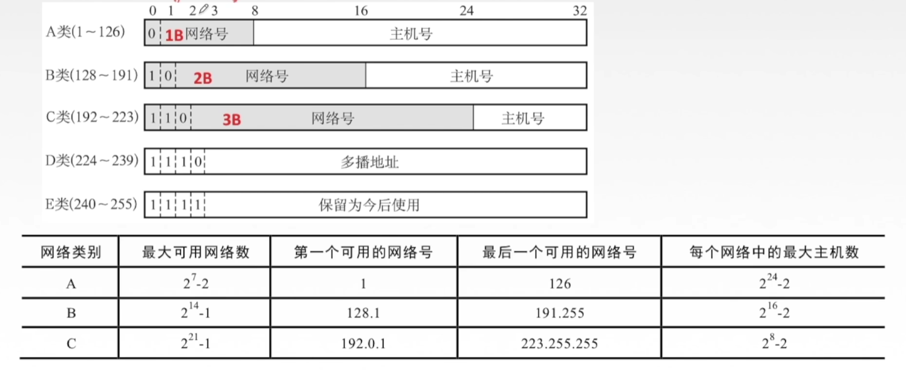

# 计算机网络

- 重点
  - 软硬件组成
  - 参考模型
- 难点
  - 网络体系结构
  - 网络协议概念
  - 网络分层思想

### 网络的软硬件组成

**硬件：**计算设备

通信链路

路由器

**软件：**协议，应用程序

## 网络体系结构

### *协议

**协议**：**指通信双方关于如何进行通信的一种约定**

每一层的目的都是向上一层提尕特定的服务，而把如何实现服务的方式屏蔽

**网络协议**：同等实体间通信制定的有关通信规则的约定

**对等实体（peer）**,不同机器包含的对应层的实体，如进程，硬件

对等体可能是进程、硬件设备、或人

- 协议实现的细节和接口的规范是由具体的实现者决定的，不影响网络体系结构的定义。
- 一个网络中所有机器上的接口不必都一样，只要每台机器能够正确地使用所有的协议即可
- 不同的网络，其层的数目、各层的名字、内容和功能都不尽相同，但是**每一层的目的都是向它的上一层提供服务**，而把如何实现这一服务的细节对上一层加以屏蔽。
- 网络协议是控制两个或多个网络设备之间通信的规则的集合。网络协议可以分为不同的层次，每一层负责实现不同的功能，并向上一层提供服务。在同一层次上，不同设备之间的通信需要遵循相同的协议，以保证信息的正确传输和解释。例如，应用层协议包括了 HTTP、FTP、SMTP 等，它们规定了应用程序之间如何交换数据；传输层协议包括了 TCP、UDP 等，它们规定了如何建立和维护端到端的连接；网络层协议包括了 IP、ICMP、ARP 等，它们规定了如何寻址和路由数据包；数据链路层协议包括了 Ethernet、PPP、HDLC 等，它们规定了如何在物理介质上传输比特流等等

### 服务

> 服务是各层向它上层提供的一组原语。**服务定义了两层之间的接口**，上层是服务用户，下层是服务提供者。
>
> 只要不改变提供给用户的服务，实体可以任意地改变它们的协议。 n层实体利用n－1层实体提供的服务并执行n层协议来完成对n＋1层提供服务。
>
> 数据报服务是一种不可靠的无连接服务

### 面向连接服务和无连接服务

（1）面向连接服务
	面向连接服务是在**数据传输之前必须先建立连接，在数据传输结束后再释放这个连接。**

​	具有连接建立、数据传输和连接释放三个阶段。在传输数据时是按序传输的，这与电路交换的许多特性很相似，因此，面向连接服务在网络层中又称为虚电路服务。这里的“虚电路“表示：虽然在两个服务用户的通信过程中并没有始终占用一条端到端的完整物理电路，但用户在感觉上却好像一直在使用这样的一条电路，实质上它是通过分时共享物理电路的技术来实现的。面向连接服务比较适合在一定期间内要向同一目的地发送多个数据的情形。对于偶尔发送很少量的数据，面向连接服务则由于开销过大而不太适应。

​	若两个用户需要进行频繁的通信，则可建立永久连接。这样可以免除在每次通信时进行连接建立和连接释放这两个过程，永久连接与电话网中的专用话音电路十分相似。
（2）无连接服务
​	在无连接服务的情况下，两个实体之间的通信无须预先建立一个连接，因此，有关资源不需要事先进行预定保留，这些资源在数据传输时动态分配。日常通信中的短信业务提供的就是无连接服务。

​	无连接服务的另一个特征就是它不需要通信的两个实体同时处于活跃状态。当发送端的实体正在进行数据传输时，它必须是活跃的，但此时接收端的实体并不一定必须是活跃的。只有当接收端的实体正在进行数据接收时，它才必须是活跃的。

​	无连接服务的优点在于灵活方便和迅速及时，但它不能防止数据的丢失、重复或乱序。无连接服务特别适合传输少量数据的情形。

​	无论是面向连接服务还是无连接服务，都不能保障数据传输的可靠性。在此，我们使用服务质量（Quality of Service，QoS）来评价服务的特性，有些服务十分可靠，从来不丢失数据。为了实现可靠的服务，通常是由接收端确认接收到每一个数据，使发送端确信它所发送的数据已经正确到达接收端这一方法来实现的。这种确认机制要增加额外的传输开销和延迟，对于不同的网络应用，有时是值得的，但有时则不尽然。
​	

> 有两种面向连接的可靠性服务应用比较广泛，即消息流和字节流。消息流保持应用消息的边界，如发送端发送两个1KB的消息，接收端肯定也是接收到两个1KB的消息，绝不会变成一个2KB的消息。而字节流则没有消息边界，如2KB字节到达接收端后，接收端根本无法分辨所接收的数据究竟是一个2KB的消息还是两个1KB的消息，或者是2048个单字节消息。如果在网络上传送一本书，当把每页作为分离的消息进行传输时，保留消息的边界就变得比较重要。然而，作为一个终端在远程分时系统上登录时，从终端到计算机的字节流传输就能够满足需求。
>
> 对于某些网络应用而言，面向连接的数据传输因确认引起的延迟可能难以满足用户的需求。比如数字化的音频传输，网络用户宁可听到线路上偶尔出现的杂音，或不时混淆的声音，也不愿意因等待确认而造成延迟。同样，在传输视频数据时，错了几个像素并无大碍，但视频突然停顿以等待纠正传输错误却会令人十分不满意。

### *五层协议体系

### OSI模型

七层模型

物理层：

​	作用是在物理媒体之上为数据链路层提供的原始比特流的物理连接，尽可能屏蔽传输媒体的差异，透明传送和接收比特流。 

数据链路层：

​	目的是为了在给定的通信链路上提供发送端和接收端之间的无差错信息传输。

网络层：

​	进行路由选择和交换方式，对上次用户屏蔽子网通信的细节（面向对象，无连接，路由选择，拥塞控制）

传输层：

​	**传输层是真正的端到端的层**

会话层：

​	负责维护通信中两个结点之间会话连接的建立、维护和断开

表示层：

​	两个通信系统中交换信息的表示方式，包括数据格式的变换，数据的加密和解密，数据压缩与恢复等

### TCP/IP参考模型

### 性能指标

速率 带宽 往返时间RTT 利用率

​	

**速率：**注意区分bit和B

数据的单位bit/s或kbit/s，bit的数量级差距是$$10^3$$

数据量的单位是B(byte，字节) 1B=8bit 

**吞吐量：**单位时间通过网络的数据量，受到网络带宽或者速率限制

**时延：**数据从一段到另一端所需要的时间

1. 发送时延（传输时延）：

$$
发送时延=\frac{数据帧长度(bit)}{发送速率(bit/s)}
$$

2. 传播时延：可以按照光速的2/3算，短距离可以忽略不记

$$
传播时延=\frac{信道长度}{信号在信道上的传播速率(米/秒)}
$$

3. 处理时延
   - 主机或路由器收到分组后，为处理分组的时间
4. 排队时延
   - 排队等待的时长
   - 排队时延的长短往往取决于网络中当时的通信量

对于高速网络链路，我们提高的是数据的发送速率而不是减少bit在链路上的传播速率

**时延带宽积：**以byte为单位的链路长度

$$
时延带宽积=传播时延 *带宽
$$

## 物理层

### 概念

#### 三个通讯方式

|    名称    |                   定义                   | 需要的信道数 |
| :--------: | :--------------------------------------: | :----------: |
|  单工通信  |             只能一个发一个收             |     一条     |
| 半双工通信 | 都可以发或者收，但是同一时间只能进行一个 |     两条     |
| 全双工通信 |            都可以同时收发数据            |     两条     |

#### 码元（[Symbol]）

定义：码元是指用一个固定时长的信号波形（数字脉冲），代表离散数值的基本波形。当有多个离散状态时，成为M进制码元

一个码元可以携带多个比特的信息

个人理解：码元就是在网线上传输的一个个信号段。码元的不同进制就是用来表示不同的数值的

#### 波特（Baud）

用来指一秒可以传输多少个码元

### *两个定理

#### 奈奎斯特定理（采样定理）：

当采样频率大于信号中最高频率的2倍时(fs>2f)，采样之后的数字信号完整地保留了原始信号中的信息。

$$
理想低通信道下的极限数据传输率=2Wlog_2V(b/s)
$$

1. 码元传输速率是有上限的
2. 信道的频带越宽，就可以以更高的速率进行码元传输
3. V表示信号的离散级数，即系统可调制出的信号状态

#### 香农定理：

在带宽受限且有噪声的信道中，为了不产生误差，对于信息传输速率的极限值

**信噪比(dB)=**
$$
信道极限传输速率=Wlog_2(1+S/N)(b/s)
$$

注意这里的单位是dB，但S/N本身不是以dB为单位
$$
xdb=10log_{10}(1+S/N)
$$

### 数字调制与多路复用

数字调制：将模拟信号转换为数字信号

#### 编码

- 把数字信号转换为另一种数字信号，在数字信道中传输，称为 `编码`。例如，以太网使用 曼切斯特编码，4B/5B，8B/10B 等编码
- 将模拟信号转换为数字信号，在数字信道中传输，也称为 `编码`。例如，对音频信号进行编码的脉码调制 PCM

##### 编码方式

不归零编码：就是指在整个码元时间内，电平不会出现零电平

`需要一根额外的传输线来传输时钟信号`，因为存在同步问题，计算机网络传输中不采用这个

曼彻斯特编码：

在每个码元时间的中间时刻，信号都会发生跳变。例如，负跳变表示比特 1，正跳变表示比特 0。

- 码元中间时刻的跳变既表示时钟，又表示数据
- 传统以太网就使用的曼切斯特编码

**差分曼彻斯特编码：比曼彻斯特编码变化少，更适合较高的传输速率**

- 跳变仅表示时钟
- 码元开始处电平是否发生变化表示数据

**4B/5B编码：**使用5bit的二进制表示4bit的二进制，效率为80%，避免缺少足够的跳变而时钟错乱

百兆网络中使用此方法

**同步时分多路复用**：分配给每个终端的时间片固定

**统计时分多路复用**：

**码分多路复用：**

### 数据交换方式

#### ①分组交换

**分组交换采用把一个个小的数据包存储转发传输来实现数据交换。**

主要的一些**缺点**：
1、不具有实时性。
2、存在延时。
3、会造成通信阻塞。
4、存在无用的重复数据。
5、会出现丢包的情况。

**优点**：

1、设计简单。

2、资源利用率很高。

#### ②电路交换

电路连接的**三个阶段**：

1、建立电路连接。
2、数据传输。
3、释放连接（电路拆除）。

**优点**：
1、传输速度快、高效。
2、实时，不会有冲突

**缺点**：
1、资源利用率低。
2、新建连接需要占据一定的时间，甚至比通话的时间还长。

#### ③报文交换（包交换）

不建立物理电路，将发生数据作为整体交给中间交换设备，中间交换设备选择一条合适的空闲输出线将数据发给下一个中间交换设备，直到达到目的地

**电路交换的多路复用**
频分多路复用FDM
时分多路复用TDM

### 信道复用

> 复用 (multiplexing) 是通信技术中的基本概念。
> 它允许用户使用一个共享信道进行通信，降低成本，提高利用率。

#### ①频分复用

- 将整个带宽分为多份，用户在分配到一定的频带后，在通信过程中自始至终都占用这个频带。
- 频分复用的所有用户在同样的时间占用不同的带宽资源（请注意，这里的“带宽”是频率带宽而不是数据的发送速率）。

在这里插入图片描述

#### ②时分复用

时分复用则是将时间划分为一段段等长的时分复用帧（TDM 帧）。每一个时分复用的用户在每一个 TDM 帧中占用固定序号的时隙。

同步时分复用技术：每个终端分配的时间片固定，不能被抢夺

统计：动态分配，充分利用信道，控制比较复杂

#### ③波分复用

波分复用就是光的频分复用。使用一根光纤来同时传输多个光载波信号。

#### ④码分复用

各用户使用经过特殊挑选的不同码型，因此彼此不会造成干扰。运行所有站点同时使用整个信道发送

每个用户分到唯一的M比特码序列

### 传输介质

#### 双绞线

由两根采用**一定规则并排绞合**的、互相绝缘的**铜导线**组成

- 便宜
- 通信距离一般为几公里到几十公里
- 距离太远，需要中继器和放大器处理

#### 同轴电缆

同轴电缆比双绞线有更好的屏蔽性，因此能以更高的速率传输更长的距离，其可能达到的带宽取决于电缆的质量、长度、数据信号的信噪比等，并广泛应用于有线电视网和城域网中；

#### 光纤

光纤由纤芯（实心）和包层组成，带宽很大

把电脉冲转换为光源

单模光纤的直径大概为8-10um

特点：

1. 损耗小
2. 抗磁性强
3. 不易被窃听
4. 体积小，重量轻

光纤融合：

（1）可以将它们接入连接头并插入光纤插座，连接头要损失10%到20%的光，但重新配置系统容易；

（2）可以用机械方法将其结合，但要损失大约10%的光；

（3）两根光纤可以被融合在一起形成坚实的连接，但有点衰减；

### 物理设备

#### 中继器

对信号进行**再生**和**还原**，再生数字信号

## 数据链路层

数据链路(data link) 除了物理线路外，还必须有通信协议来控制这些数据的传输。若把实现这些协议的硬件和软件加到链路上，就构成了数据链路。
现在最常用的方法是使用适配器（即网卡）来实现这些协议的硬件和软件。

目的：实现两个节点的无差错传输

### 功能：

1. 封装成帧
2. 透明传输
3. 差错控制 

### 提供的服务

**基本服务**:将源机器的网络层数据传输到目的地机器网络层。

1. 无确认 无连接服务
   - 接收方不对收到的帧进行确认
   - 由于线路上的噪声而造成的帧丢失，数据链路层不作努力去恢复，而将该工作留给上层
   - 局域网 以太网
2. 有确认 无连接服务
   - 每一帧都单独确认
   - WIFI
3. 有确认有连接服务
   - 网络层进程提供了可靠的位流.适用于长距离且不可靠的链路
   - 卫星通路

### 成帧

成帧(Framing)：在发送方，数据链路层从网络层获得分组（Packet)后，要加上必要的帧头与帧尾后传送给物理层，并通过物理层传送到接收方的数据链路层。
拆帧：在接收方，数据链路层则必须去掉发送端数据链路层所加的帧头和帧尾部分，从中分离出网络层所需的分组。

#### 方法

常用方法：

1. 字节计数法：在数据前一个数字表示有几位，害怕标记位错误
2. 带字节填充的标志字节法：Flag+Header组成，害怕数据位中有flag
3. 带位填充的标志比特法：每一帧使用一个特殊的位模式“01111110”作为开始和结束标记，**逢5差0**
4. 物理层编码违例法
4. 在帧之间添加时间间隙，但也有可能错误

透明：

“在数据链路层透明传送数据”表示无论发送什么样的比特组合的数据，这些数据都能够按照原样没有差错地通过这个数据链路层。

### 差错控制

误码率：
   	
$$
P_e=错误接收的码元数/接收的码元总数
$$
**不管信道质量多高，无论通过哪种类型传输介质或信道进行数据传输，误码率都不可能是零**

根据噪声产生原因的不同，差错分为随机错和突发错。

1. 热噪声（布朗运动）→随机错
2. 冲击噪声（如EMI/RFI电磁干扰/射频干扰）→突发错

#### 检错码

1. 奇偶校验码
   1. 水平奇偶校验
   2. 垂直奇偶校验
   3. 垂直水平奇偶校验
2. 校验和（Check Sum）
3. 块校验码（Block Check Code）
4. 循环冗余校验码（CRC）

##### CRC

原理：

1. 多项式除法：被除多项式=除式*商+剩余多项式
2. 通信双方约定除式,也就是生成多项式，发送方将余式作为冗余信息发送给接收方
3. 接收方验证所收到的多项式能否为除式所整除，以判断传输过程是否出错

#### 纠错码

码字：信道编码的结果称为

##### 汉明码

在信息编码中，两个合法代码对应位上编码不同的位数称为码距，又称海明距离。

例子：10101和00110从第一位开始依次有第一位、第四、第五位不同，则海明距离为3。

纠一位错的编码

要做到“可靠传输”（即发送什么就收到什么）就必须再加上**确认和重传**机制。  

### 流量控制

流量控制的作用是使发送方所发出的数据流量，使其**发送速率不要超过接收方所能接收的速率**

滑动窗口：

实际的通信往往是全双工通信
**捎带应答（piggybacking）**：将确认序号携带在数据帧中传输，提高线路的效率；
推迟确认：当需要发送确认但没有要发送的数据进行捎带时，可以让确认信息推迟一小段时间再发送；
滑动窗口协议：允许发送端在没有收到前一个帧的确认时，就可以发送后续的帧；接收端可以对正确收到的若干个帧同时进行确认。
**滑动窗口协议的要点：**
任何时刻发送进程维持一组帧序号，对应于一组已经发送但尚未被确认的帧，用一个发送窗口维持这些帧；
接收进程也维持一组帧序号，对应于一组允许接收的帧，用一个接收窗口维持这些帧序号。

### 协议

无限制的单工信道（非常理想的条件）（协议一）：一个发送，一个接收

单工停-等协议（只是进行流量控制）（协议二）：一次发送一帧，保证能接收

有噪信道上的单工协议（协议三2）：

- 采用协议2中的停-等方式；
- 发送方每次只发送一个帧，当这个帧被正确接收后才能发送下一帧，若该帧未在规定的时间内得到确认（超时），则重发该帧；
- 接收端对每个收到的帧进行校验，对正确收到的帧发回确认，错误的帧丢弃；

#### 滑动窗口协议

滑动窗口条件：

接收方接收到帧的时候，判断是否符合预期值，如果不符合预期值则不一定，要求重传，如果符合预期值则滑动到下一个窗口

协议四：滑动窗口大小都是一，双向停等

协议五：回退n帧

协议六：选择性重传

**捎带确认(piggybacking)**—将确认暂时延迟以便可以钩到下一个外发数据帧‘

##### 一位滑动窗口协议

自动重复请求（ARQ）是应用最广泛的一种差错控制技术，包括:无错接收的PDU（协议数据单元）的肯定确认、对未确认PDU（协议数据单元）的自动重传和丢弃。

##### 管道化技术

连续发送w个数据帧,其中有一帧出错,但其后续帧被成功发送

接收方的接收策略选择

1. 丢弃错帧及后续帧,其后续帧因不是期望接收帧也被丢弃 
2. 丢弃错帧,缓存后续正确接收帧

对应的发送方的重传策略选择 ：

1. 缓存在发送窗口中的出错帧以及其后续帧全部重发--协议5
2. 只重发出错帧--协议6

#### 协议五（回退n帧）

滑动窗口>1，接收窗口=1

出错帧不确认(引发超时)

发送方超时重传,从未被确认帧开始

采用了累计确认（n帧被确认时，小于n帧都被确认，可以丢弃）

发送方一直保存着未被确认的帧。

如果使用3bit编码的时候，发送窗口的最大值为$$n^2-1$$，为了避免把第二帧的帧误认为第一帧的错误帧

#### 协议六（重发1帧）

为了避免将第二帧的帧误认为第一帧的错误帧，需要保证新老窗口不重叠

MAX_SEQ=7

发送窗口: W=(MAX_SEQ + 1) /2

## 介质访问控制子层

### 媒体接入控制MAC

数据链路层分为两个子层：

**MAC子层**：介质访问

**LLC子层**：承上启下（弱层）

### 信道分配问题

1. 静态分配
2. 动态分配

#### 五个关键假设

- 站模型：由N个独立的站组成，每个站有一个可以产生待发送帧的程序。一旦生成一帧，该站就被阻塞，直到帧被成功传出
- 单通道假设：所有通信都通过单个信道进行。所有的站都在该信道上发送和接收信息。尽管软件可赋予各站优先级，但就硬件来说，各站是平等的
- 冲突假设：若两帧同时发送，它们会相互重叠，使信号难以辨认。所有的站都能检测到冲突。冲突的帧必须事后重发。除了冲突产生的差错外，不再有其他任何差错
- 发送时间假设：
  - 连续任意时刻可发送：帧能在任何时候开始发送。没有主时钟将时间分隔为离散的发送区间
  - 分槽时间：时间被分为离散的区间（时隙）。帧总是在时隙开始的一瞬间开始发送。一个时隙内可发送0，1或多个帧，它们分别对应空闲时隙、成功时隙、发生冲突
- 载波检测：
  - 有载波检测：所有站在使用信道以前都可以检测到信道是否正在使用。若忙，其他站不会去使用它，直到它变得空闲
  - 无载波检测：各站在使用信道前不检测信道，只是盲目地发送，事后才能确定本次传送是否成功

#### ALOHA协议

基本思想适用于任何无协调关系的多用户竞争单信道使用权的系统

- 纯ALOHA

- 分隙ALOHA

区别：是否将时间分成离散的时隙。纯ALOHA无需全局时间同步，而分隙ALOHA则必须时间同步。

###### 纯ALOHA：

- 用户只要有数据待发，就让他们发

- 当产生冲突，使帧受损时，发送方只要侦听信道就会知道

- 若帧遭破坏，则发送方随机等待一段时间后重发

一些定义：

帧时：传输标准固定帧所需时间，帧的长度除以位速率

假设无穷多用户按照泊松分布产生新帧N，也就是平均每个帧时间产生N帧，要求0<N<1

G是单位帧时**产生的新帧**和**重发帧**的和，G>=N, 也服从泊松分布。

吞吐量：$$S=GP_0$$，$$P_0$$是没有冲突的概率

一个帧时中生成k帧的概服从泊松分布
$$
Pr[k]=\frac{G^ke^{-G}}{k!}
$$
一个单位帧时间内生成零帧的概率
$$
Pr[0]={e^{-G}}
$$
在冲突窗口内，即两个单位帧时不存在其他流量的概率是，即产生0帧的概率，也就是两个单位帧时内成功传输的概率
$$
P_0=2Pr[0]=>S=Ge^{-2G}
$$
**G=0.5时，S达到最大，为1/2e （0.184）**

###### 分槽ALOHA协议：

- 把使用信道的时间分成离散的时间槽，槽长为一个帧所需的发送时间，每个站点**只能在时间槽开始时才允许发送**，其他过程与纯ALOHA协议相同。

- 冲突主要发生在时间槽的起点，一旦发送成功就不会出现冲突，分槽ALOHA大幅度降低了冲突的可能性，信道利用率比纯ALOHA提高了约一倍。

G=1时，吞吐量S达到最大，为1/e （0.368）

##### 载波侦听多路访问协议CSMA/CD

网络站点侦听载波是否存在（即有无传输）并相应动作的协议。

- 持续CSMA
  - 1-持续CSMA
  - p-持续CSMA
- 非持续CSMA
- 有冲突检测的CSMA

###### 持续CSMA

有信息发送时，一直侦听信道是否有人发送，没有的话则以p概率在当前发送，以1-p概率推延到下一个时隙

 

###### 非持续CSMA

有信息发送时，如果有人占用信道，则随机等待一个时间后再侦听

###### 有冲突检测的CSMA

两帧同时检测到信道空闲并开始传播，则会基本在同时发现冲突，然后应当立刻停止发送

### 以太网

**IEEE802.3标准：**

IEEE802.3（以太网）、IEEE802.11（无线LAN）、IEEE802.15（蓝牙）、IEEE802.16（无线MAN）

#### 以太网MAC子层协议

在局域网中，硬件地址又称为物理地址，或 MAC 地址。 

802 标准所说的“地址”严格地讲应当是每一个站的“名字”或标识符。 

网卡检测：

“发往本站的帧”包括以下三种帧： 

- 单播(unicast)帧（一对一）

- 广播(broadcast)帧（一对全体）

- 多播(multicast)帧（一对多）

#### 两个重要措施

- 采用较为灵活的无连接的工作方式，即不必先建立连接就可以直接发送数据。 

- 以太网对发送的数据帧不进行编号，也不要求对方发回确认。

#### 碰撞检测

- 计算机边发送数据边检测信道上的信号电压大小。

- 当几个站同时在总线上发送数据时，总线上的信号电压摆动值将会增大（互相叠加）。

- 当一个站检测到的信号电压摆动值超过一定的门限值时，就认为总线上至少有两个站同时在发送数据，表明产生了碰撞。

#### 二进制指数类型退避算法

### 无线局域网

#### RTS/CTS

先发送一个RTS的请求帧，RTS帧的内容包括**源地址**，**目的地址**和**要发送的数据地址**。目的终端收到RTS等待一个SIFI周期后发送一个CTS帧作为响应。源终端收到CTS帧后再等待一个SIFI周期就开始发送数据。其他终端发现这个数据与他们无关后，则会设置NAV值并继续侦听通道，分组发送结束后，发送一个结束确认帧，其他终端再开始竞争信道

#### 曼彻斯特编码

每个比特位分成相等的间隔，发送1时前面间隔为高电平，后面间隔为低电平，发送0相反，便于接收方和发送方同步

## 网络层

网络层位置：

- 位于OSI的参考模型第三层
- 建立在数据在物理上的成功传输
- 是处理端到端的数据的最底层

网络层目的：

屏蔽各种不同类型网络之间的差异，为端系统之间的数据透明传送提供连通支撑

功能：

1. 路由选择
2. 分组转发
3. 异构网络互联
4. 拥塞控制（与流量控制不太相同）

> 转发：达到路由器输入链路之一的数据报如何转发到该路由器的输出链路之一
>
> 路由选择：控制数据从源主机到目的主机的端到端路由中路由器之间的路由方式
>
> 数据平面：数据平面对于数据处理过程中各种具体处理转发的过程
>
> 控制平面：用于控制和管理网络协议的运行，比如OSPF协议，RIP协议，BGP协议

SDN方法控制平面

软件控制的方法，路由器仅实现转发功能，**远程控制器**计算和分发转发表以供每台路由器所使用

### 网络路由

负责确认收到分组传输出去的线路

**分类：**自适应 非自适应

- 非自适应路由算法（或称静态路由算法）：不根据实测或估计的网络的当前通信量和拓扑结构来作路由选择；路由表是事先计算好的，在网络启动后下载到路由器中

- 自适应路由算法（或称动态路由算法）：根据实测或估计的网络的当前通信量和拓扑结构来作路由选择

设计基础：

- 最优化算法：每两个路由间路径都是最优的
- 最短路径：djikstra算法
- 扩散法：向除了包来的方向全部发包
  - 改进：选择扩散，长时间丢包
  - 优点：健壮性
  - 缺点：浪费带宽

#### 分级路由：

- 每个路由器只需要知道自己分区内的情况，不需要知道区外的情况

- 减少CPU开销
- 代价可能是路径增加

#### 广播算法：

方法：

1. 没有任何特殊性，发就完事了
2. 扩散法：有点消耗带宽
3. 多目标路由
4. 使用以发起节点为根的汇聚树：必须要求所有节点都知道这颗树
5. 逆向路径：如果广播分组是沿着最佳路径传播过来的，则广播转发，否则丢弃

#### 路由算法：

距离路由矢量算法：

原理：

- 每个路由器维护一张表
- 表中给出了到每个目的路由器已知的最短“距离”和相应输出线路
- 通过与相邻路由器交换距离信息来更新表

### IP数据报格式

首部+数据部分

版本：IPv4/IPv6

首部长度：**单位是4b**

区分服务：指示期望获得哪种类型的服务

总长度：首部+数据，单位为1b，最长为$$2^{16}-1=65525$$

生存时间(TTL)：IP分组的保质期，经过一个路由器-1，到0时抛弃

协议：数据部分使用的协议 TCP=6，UDP=17

### IP数据报分片

**最大传输单元MTU**

链路层数据帧可封装的数据的上限

标识：同一个数据报的分片使用同一标识

标志：后两位才有意义

​	中间位DF：DF=1，禁止分片   DF=2，允许分片

​	最低位MF：MF=1，表示还有分片 MF=0，没有分片

片偏移：在原始字段中的偏移位置，单位为8b

### IPV4

IP地址::={<网络号><主机号>}

特点地址：

​                                                                                                                                                                                                                                                                                                                                                                                                                                                                    

### 网络地址转换NAT

路由器对于目的地址是私有IP的一律不转发

NAT：在**专用网**连接到**因特网**的路由器上安装NAT软件，NAT路由器至少有一个**外部全球IP地址**

路由器将私有端口映射到公有IP的端口

### 子网划分和子网掩码

原因：A类和B类主机号太多，用不上，单位子网划分后吗，对外展示依然为一个网络                                                                                                                                                  

子网掩码和IP地址进行与运算，求出来的内容就是网络地址，子网掩码的某个段如果全是0，则代表是主机号而不是网络地址

只要不是1则后面都是主机号，而不是掩码地址，注意子网号的长度是由用户自定义的                                                                                                                                                                                                                      

### 无分类编址CIDR

1. 消除了类地址以及划分子网概念
2. 融合子网地址与子网掩码

CIDR记法：IP地址后加/然后写上网络前缀位数

#### 应用：

构成超网（路由聚合）

取网络地址的交集，注意网络前缀位数的变化

### ARP协议

IP地址与MAC地址的映射

### 动态主机配置协议DHCP

可以自动分配IP地址. DHCP中继代理,由DHCP服务器分配空闲的IP地址。

当一个主机想得到一个IP地址，它在其物理网络中广播一个DHCP的发现报文，对应的IP分组源地址全0，目的地址全1。该网络中的所有主机都收到该广播报文。但只有DHCP服务器才对广播报文进行应答（DHCP offer）。

- 分配的IP地址是临时的。
- 分配的IP地址可以使用多久？有效周期为一段固定的时间--租用技术
- 用户要继续使用，必须向DHCP服务器申请续租

## 传输层

之前的体系实现了**主机到主机的通信**

但实际上计网中进行**通信的真正实体是位于通信两端主机中的进程**

**运输层直接为应用进程间的逻辑通信提供服务**

可以实现向高层用户屏蔽下面网络核心的细节

面向连接的TCP和无连接的UDP

### 运输层端口号、复用与分用

进程是使用PID标识的

不同操作系统的标识方法不同

TCP/IP体系使用端口号来区分不同进程

#### 端口号：

16bit表示，取值0~65535

- 熟知端口号：0~1023
- 登记端口号：1024~49151
- 短暂端口号：49152~65535，暂时使用

**端口号只具有本地意义**

#### 复用与分用

不论什么协议的报文在网络层都包装为IP报文

IP数据报中协议字段为17指的是UDP协议，为6指的是TCP协议 

常用协议及其对应端口：

- UDP
  - DNS: 53
  - RIP: 520
  - TFTP: 69
  - SNMP: 161
  - DHCP: 67/68
- TCP
  - HTTP: 80
  - HTTPS: 443
  - SMTP: 25

### TCP和UDP的区别

用户数据报协议UDP(User Datagram Protocol)

传输控制协议TCP(Transmission Control Protocol)

TCP使用前需要三报文连接

UDP: UDP对应用层报文添加UDP首部，UDP是面向应用报文的

TCP: TCP把应用程序发送下来的数据段仅看做一串字节流，仅将他们编号并缓存。发送方依次选择一定数量的字节流发送，接收方传输层将数据载荷保存，并向上传递给接收方，接收方和发送方的数据快可能不一样，但是接收方会保证数据流相同

TCP是面向字节流的，这也是TCP实现可靠传输，流量控制以及拥塞控制的基础

UDP运输层向上层提供无连接不可靠传输的服务，适用于实时服务

TCP运输层向上层提供面向连接可靠传输的服务，适用于要求可靠传输的应用

首部：

### TCP流量控制

ACK为1，说明为TCP确认报文

rwnd=接收窗口大小

为了避免确认报文丢失而导致双方产生死锁：

TCP为每一个连接设有一个持续计时器，一方收到另一方0窗口时，开始计时，超过时限后会发送一个1字节的零窗口探测报文，接收方确认这个探测报文后，返回当前接收窗口，如果是0则重新开始计时，如果不是0则开始传输，打破死锁

### TCP拥塞控制

发送方维护一个**拥塞窗口cwnd**的状态变量，其值决定于网络的拥塞程度，并且动态变化

- cwnd的维护原则：没有拥塞就增大，有就减少
- 判断出现拥塞的依据：没有按时收到应当到达的确认报文 

拥塞控制的算法：

慢开始(slow-start)：开始的时候是按照指数级增加的，设立慢开始门限(ssthresh)，一旦达到慢开始门限，则会转换为拥塞避免

拥塞避免：拥塞窗口一次增加1，当重传计时器出现超时时，将慢开始门限设为当前拥塞窗口的一半，拥塞窗口值设为1，并重新开始慢开始算法

快重传：**让发送方尽快重传**，即使收到的报文段失序，也要立即发出对已接收的报文段的重复确认，发送方一旦收到三个连续的重复确认，立即重传

举例：收到了序号2之前的报文，但是没有收到三，后面每次都返回对于2的确认，发送方收到3个确认后重传

快恢复：并不启动慢开始算法，而是只缩小拥塞窗口和慢开始门限为1/2
